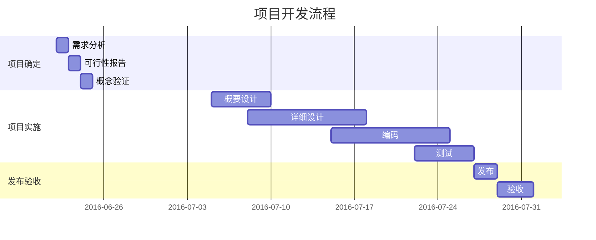
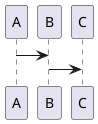
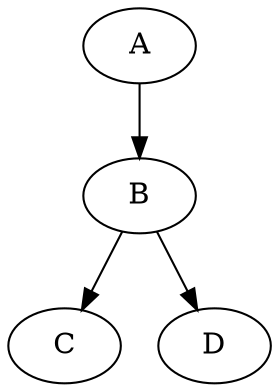

# markdown语法参考

标签: markdown


---
[TOC]

## 1. 文本部分

### 1.1 斜体和粗体，删除线

- 使用 * 和 ** 表示斜体和粗体。

	示例：这是 *斜体*，这是 **粗体**。

- 使用 ~~ 表示删除线。
	~~这是一段错误的文本。~~


### 1.2 分级标题

使用 === 表示一级标题，使用 --- 表示二级标题。

示例：


这是一个一级标题
============================

这是一个二级标题
--------------------------------------------------

### 这是一个三级标题


<br/>

你也可以选择在行首加井号表示不同级别的标题 (H1-H6)，例如：# H1, ## H2, ### H3，#### H4。


# 一号标题
## 二号标题
### 三号标题


###　1.3 常用 Emoji & Font-Awesome


> alt+shift 选择多行

|   | a |  b  | c | d | e | f |
|--- | --:|--:|--:|--:|--:| --:|
| 1 |:book:	 	|:date:		|:e-mail:	|:chart_with_upwards_trend: |:star:|:rocket:
| 2 |:boom:     |:telephone_receiver:	|:cupid:	|:heart:	|:alarm_clock:  |:feet:
| 3 |:tada:		|:balloon:	|:sunny:|:wind_chime:|:hourglass:|:bulb:
| 4 |:zap:	    |:hammer:	|:mag_right:|:bug:	|:hibiscus:
| 5 |:cloud: 	|:ghost:|:partly_sunny:	|:mortar_board:|:house:	|


|    |    |   |   |   |   |    |
|:-:| :-:|:-:|:-:|:-:|:-:| :-:|
|:smile: |:smiley:|:heart_eyes:|:smirk:|:kissing_heart:|:flushed:|:stuck_out_tongue_winking_eye:
|:wink: |:unamused:|:sweat_smile:|:sweat:|:disappointed_relieved:|:cold_sweat:|:persevere:
|:sob:  |:joy:|:astonished:|:scream:|:rage:|:triumph:|:sleepy:
|:yum:|:mask:|:sunglasses:|:dizzy_face:|:+1:|:-1:|:punch:|
|:thumbsup:|:pray:|:triangular_flag_on_post:|:checkered_flag:|:anchor:|


[更多emoji查看](https://www.webpagefx.com/tools/emoji-cheat-sheet/)

### 1.4 引用和注脚

使用 [^keyword] 表示注脚。

#### 标注
- 上标：30^th^
- 下标：H~2~O
- 脚注：Content [^1]

[^1]:Hi 这里是一个注脚，会自动拉到最后面排版


#### 缩略：


*[HTML]: 超文本标记语言
*[W3C]:  World Wide Web Consortium
The HTML specification
is maintained by the W3C.

<br>
这里要有空格隔开中文

*[月]: yue4
*[辍]: chuo4
明 明 如 月，何 时 可 辍 

#### 标记
==marked==

### 1.5 外链接


这是去往 [百度](http://baidu.com) 的链接。
我的邮箱：<siriusing.cc@qq.com>


### 1.6 文字引用

使用 > 表示文字引用。

示例：

> 野火烧不尽，春风吹又生。


### 1.7 内容目录

在段落中填写 `[TOC]` 以显示全文内容的目录结构。

> [TOC]

### 2. 标签分类

在编辑区任意行的列首位置输入以下代码给文稿标签：

标签： 数学 英语 Markdown
Tags： 数学 英语 Markdown


## 2.0 常用布局
### 2.1 无序列表
使用 *，+，- 表示无序列表。

示例：
- 无序列表项 一
- 无序列表项 二
- 无序列表项 三

### 2.2 有序列表

使用数字和点表示有序列表。
示例：

1. 有序列表项 一
2. 有序列表项 二
3. 有序列表项 三


### 2.3 行内代码块

使用 \`代码` 表示行内代码块。

示例：

让我们聊聊 `html`。


    这是一个代码块，此行左侧有四个不可见的空格。

### 2.4 插入图像

使用 \!\[描述](图片链接地址) 插入图像。


### 2.5 表格支持

| 项目        | 价格   |  数量  |
| --------   | -----:  | :----:  |
| 计算机     | \$1600 |   5     |
| 手机        |   \$12   |   12   |
| 管线        |    \$1    |  234  |
| > | ce	|	ce|


colspan `>` or `empty cell`:

| a | b |
|---|---|
| >		| 1 |
| 2		||


### 2.6 定义型列表

名词 1
:   定义 1（左侧有一个可见的冒号和四个不可见的空格）

代码块 2
:   这是代码块的定义（左侧有一个可见的冒号和四个不可见的空格）

    代码块（左侧有八个不可见的空格）

### 2.7 Html 标签

本站支持在 Markdown 语法中嵌套 Html 标签，譬如，你可以用 Html 写一个纵跨两行的表格：
设置colspan，rowspan
<table>
    <tr>
        <th rowspan="2">值班人员</th>
        <th>星期一</th>
        <th>星期二</th>
       <th>星期三</th>
    </tr>
    <tr>
        <td>李强</td>
        <td>张明</td>
        <td>王平</td>
    </tr>
</table>


### 2.8 待办事宜 Todo 列表

使用带有 [ ] 或 [x] （未完成或已完成）项的列表语法撰写一个待办事宜列表，并且支持子列表嵌套以及混用Markdown语法，例如：

对应显示如下待办事宜 Todo 列表：
        

- [ ] **七月旅行准备**
    - [ ] 准备邮轮上需要携带的物品
    - [ ] 浏览日本免税店的物品
    - [x] 蓝宝石公主号的[船票](https://www.baidu.com)
        - [ ] 2000人民币
        - [ ] 两个人
        


## 4. 数学和LaTeX 
$ 表示行内公式： 

质能守恒方程可以用一个很简洁的方程式 $E=mc^2$ 来表达。

$$ 表示整行公式：

$$\sum_{i=1}^n a_i=0$$


### 4.1 常用计算速查


|功能		  	| 语法   | 
|--------		| -----:  | 
| 括号|	直接()[] $ \{ x  \} $|
| 括号匹配大小	|	$\left(\frac{\sqrt x}{y^3}\right)$
| 绝对值,∥x∥ ⟨x⟩|	$\vert x \vert $ $\Vert x \Vert$ $\langle x \rangle$
| 向上取整⌈x⌉向下取整|	$\lceil x\rceil$ $\lfloor x\rfloor$
| 额外的括号	|	$ \left.\frac12\right\rbrace $
| 累加 			|	$\sum_1^n$ , $\sum_{i=0}^\infty i^2$
| 累乘 			|	$\prod_1^n$ , $\prod_{i=1}^n i^2 $
| 积分 			|	$\int_1^n,\int_{i=1}^n i^2,\iint,\iiint$
| 并,交			|	$\bigcup_1^n x_i $$ $$\bigcap $
| 分数			|$ \frac ab$ $ \frac{a+1}{b+1}+{a+1\over b+1} $|
| 开方			|$\sqrt{x^3}$, $\sqrt[3]{\frac xy}$

<br>
<br>
<br>
<br>
<br>
<br>

|功能		  	| 语法   | 
|--------		| -----:  | 
| 取极限		|$\lim_{x\to 0}$
| 三角函数		|$\sin x$
| 逻辑运算		|$\lt \gt \le \ge \neq $
| 加减乘除点 	|$\times \div \pm \mp  x\cdot y $
| 集合运算		|$\cup \cap \setminus \subset \subseteq \subsetneq \supset \in \notin \emptyset \varnothing$
||$${n+1 \choose 2k} or \binom{n+1}{2k}$
| 各种箭头		|$\to \rightarrow \leftarrow \Rightarrow \Leftarrow \mapsto$$
| 逻辑运算		|$\land \lor \lnot \forall \exists \top \bot \vdash \vDash$$
| 异或，点，星	|$\star \ast \oplus \circ \bullet$
| 约等于...		|$\approx \sim \simeq \cong \equiv \prec \lhd$
|无限大			|$\infty \aleph_0 \nabla \partial \Im \Re $


<br>
<br>
<br>
<br>
<br>
<br>


|功能		  	| 语法   | 
|--------		| -----:  | 
||$a\equiv b\pmod n$
||$\epsilon , \varepsilon ,\phi , \varphi , \ell$
||$\hat x , \widehat{xy} , \bar{x}, \overline{xyz}, \vec{x} ,\overrightarrow{xyz},\overleftrightarrow{xy}$
||$\dot{x} ,\ddot{x}$
||$\backslash$
|希腊字母|$\alpha, \beta, …, \omega$
||$\Gamma, \Delta, …, \Omega$


#### 省略号
$ a_1,a_2,\ldots,a_n$
$ a_1+a_2+\ldots+a_n$
$ a_1+a_2+\cdots+a_n$


#### 字体
$ \mathsf{ABCDEFGHIJKLMNOPQRSTUVWXYZ}   $
$ \mathcal{ABCDEFGHIJKLMNOPQRSTUVWXYZ} $
$ \mathscr{ABCDEFGHIJKLMNOPQRSTUVWXYZ} $
$ \mathfrak{ABCDEFGHIJKLMNOPQRSTUVWXYZ} $


#### 常用公式
$x_i^2$，$x_i^2+x_{i^2}$，$10^{10}$
$\log_2 x$
${x^y}^z+x^{y^z}$
$\sum^{j-1}_{k=0}{\widehat{\gamma}_{kj} z_k}$
$\sum_{i=0}^n i^2 = \frac{(n^2+n)(2n+1)}{6}$
$f(x_1,x_x,\ldots,x_n) = x_1^2 + x_2^2 + \cdots + x_n^2 $
$\displaystyle \lim_{t \to 0} \int_t^1 f(t)\, dt$
$\lim_{t \to 0} \int_t^1 f(t)\, dt$.


如果需要大小调整，大小写切换写
$$\Biggl(\biggl(\Bigl(\bigl((x)\bigr)\Bigr)\biggr)\Biggr) gives (((((x)))))$$

##### 括号自适应大小

$$(\frac{\sqrt x}{y^3})$$
$$ \left(\frac{\sqrt x}{y^3}\right)$$


##### 等式

$$
	\begin{aligned}
		a &= b + c \\
		&= d + e + f + g \\
		&= h + i
	\end{aligned}
$$


### 4.2 矩阵

$
    \begin{matrix}
    1 & x & x^2 \\
    1 & y & y^2 \\
    1 & z & z^2 \\
    \end{matrix}
$ , $
	\begin{pmatrix} 
	1 & 2 \\
    1 & 2 \\
	\end{pmatrix}
$ , $	
	\begin{bmatrix} 
	1 & 2 \\
    1 & 2 \\
	\end{bmatrix}
$ , $
	\begin{Bmatrix} 
	1 & 2 \\
    1 & 2 \\
	\end{Bmatrix} 
$ , $
	\begin{vmatrix} 
	1 & 2 \\
    1 & 2 \\
	\end{vmatrix} 
$ , $
	\begin{Vmatrix} 
	1 & 2 \\
    1 & 2 \\
	\end{Vmatrix} 
$


#### 省略元素 \cdots ⋯ \ddots ⋱ vdots ⋮


$$
    \begin{matrix}
    a_{11} & a_{12} & a_{13} & \cdots & a_{1n} \\
    a_{21} & a_{22} & a_{23} & \cdots & a_{2n} \\
    \vdots & \vdots & \vdots & \ddots & \vdots \\
    a_{n1} & a_{n2} & a_{n3} & \cdots & a_{2n} \\
    \end{matrix}
$$

$$ \left[
\begin{array}{cc|c}
  1&2&3\\
  4&5&6
\end{array}
\right] 
$$


$$
  f(n) =
\begin{cases}
n/2,  & \text{if $n$ is even} \\
3n+1, & \text{if $n$ is odd}
\end{cases}
$$


$$
\left.
\begin{array}{l}
\text{if $n$ is even:}&n/2\\
\text{if $n$ is odd:}&3n+1
\end{array}
\right\}
=f(n)
$$


##### 上下行的间距调整 ex
$$
f(n) =
\begin{cases}
\frac{n}{2},  & \text{if $n$ is even} \\[5ex]
3n+1, & \text{if $n$ is odd}
\end{cases}
$$


$$
\left\{ 
\begin{array}{c}
a_1x+b_1y+c_1z=d_1 \\ 
a_2x+b_2y+c_2z=d_2 \\ 
a_3x+b_3y+c_3z=d_3
\end{array}
\right. 
$$

#### aligned 对齐
$$ 
\left\{
\begin{aligned} 
a_1x+b_1y+c_1z &=d_1+e_1 \\ 
a_2x+b_2y&=d_2 \\ 
a_3x+b_3y+c_3z &=d_3 
\end{aligned} 
\right. 
$$


#### 继续用em调整行距
$$\begin{cases}
a_1x+b_1y+c_1z=d_1 \\[2ex] 
a_2x+b_2y+c_2z=d_2 \\[2ex] 
a_3x+b_3y+c_3z=d_3
\end{cases}
$$

### 4.3 颜色

$\color{black}{blackText}$，$\color{gray}{grayText}$
$\color{silver}{silverText}$，$\color{white}{whiteText}$

$\color{maroon}{maroonText}$，$\color{red}{redText}$
$\color{yellow}{yellowText}$，$\color{green}{greenText}$
$\color{teal}{tealText}$，$\color{aqua}{aquaText}$
$\color{blue}{blueText}$，$\color{navy}{navyText}$
$\color{purple}{purpleText}$，$\color{fuchsia}{fuchsiaText}$


## 5. 流程图

### 5.1 简单流程图

```flow
st=>start: Start:>https://www.zybuluo.com
io=>inputoutput: verification
op=>operation: Your Operation
cond=>condition: Yes or No?
sub=>subroutine: Your Subroutine
e=>end

st->io->op->cond
cond(yes)->e
cond(no)->sub->io
```

更多语法参考：
[流程图语法参考](http://adrai.github.io/flowchart.js/)

###  5.2 序列图

```sequence(theme="hand")
Title: Here is a title
A->B: Normal line
B-->C: Dashed line
C->>D: Open arrow
D-->>A: Dashed open arrow
```

#### 更多语法参考：[序列图语法参考](http://bramp.github.io/js-sequence-diagrams/)

### 5.3 mermaid 甘特图


甘特图内在思想简单。基本是一条线条图，横轴表示时间，纵轴表示活动（项目），线条表示在整个期间上计划和实际的活动完成情况。它直观地表明任务计划在什么时候进行，及实际进展与计划要求的对比。


#### 更多语法参考：[mermaid参考](https://mermaidjs.github.io/)


### 5.4 puml 序列图

```puml

A -> B
```



### 5.5 dot





viz 或者 dot 代码块中的内容将会被 Viz.js 渲染。
你可以通过 {engine="..."} 来选择不同的渲染引擎。 引擎 circo，dot，neato，osage，或者 twopi 是被支持的。默认下，使用 dot 引擎。


#### Ditaa
Markdown Preview Enhanced 支持 ditaa。

(Java 是需要先被安装好的)

ditaa 整合于 code chunk, for example:


```ditaa {cmd=true args=["-E"]}
  +--------+   +-------+    +-------+
  |        | --+ ditaa +--> |       |
  |  Text  |   +-------+    |diagram|
  |Document|   |!magic!|    |       |
  |     {d}|   |       |    |       |
  +---+----+   +-------+    +-------+
      :                         ^
      |       Lots of work      |
      +-------------------------+
```

```ditaa {cmd=true args=["-S"]}

+---------+
| cBLU    |
|         |
|    +----+
|    |cPNK|
|    |    |
+----+----+
```

```ditaa {cmd=true args=["-S"]}

/--+
|  |
+--/
```


```ditaa {cmd=true args=["-S"]}
+-----+
|{d}  |
|     |
|     |
+-----+

+-----+
|{s}  |
|     |
|     |
+-----+


----+  /----\  +----+
    :  |    |  :    |
    |  |    |  |{s} |
    v  \-=--+  +----+
```


#### Sequence Diagrams

这一特性基于 js-sequence-diagrams。

sequence 代码快中的内容将会被 js-sequence-diagrams 渲染。
支持两个主题 simple（默认主题）和 hand。
```sequence{theme="hand"}

Andrew->China:Say Hello
Note right of China: China thinks\nabout it
Chind-->Andrew:How are you?
Andrew ->>China:I am good thanks!
```


```vega-lite
{
  "data": {
    "values": [
      {"a": "C", "b": 2}, {"a": "C", "b": 7}, {"a": "C", "b": 4},
      {"a": "D", "b": 1}, {"a": "D", "b": 2}, {"a": "D", "b": 6},
      {"a": "E", "b": 8}, {"a": "E", "b": 4}, {"a": "E", "b": 7}
    ]
  },
  "mark": "bar",
  "encoding": {
    "x": {"field": "a", "type": "nominal"},
    "y": {"aggregate": "average", "field": "b", "type": "quantitative"}
  }
}
```


### 编程


#### 支持直接运行代码


```python {cmd=true id="izdlk700"}
x = 1;
print x;
```


### 自定义css


ctrl+shift+p

Markdown Preview Enhanced:Customize CSS

```js


/* Please visit the URL below for more information: */
/*   https://shd101wyy.github.io/markdown-preview-enhanced/#/customize-css */ 

.markdown-preview.markdown-preview {
  // modify your style here
  // eg: background-color: blue;  


  p>code,li>code{
    background: #ffebeb;
    color: #c7254e;
    border-radius: 3px;
    border: 1px;
  }

  img{
    margin: 0 auto;
    display: block;
  }

  img::after{
    content:attr(alt);
  }

  span.s-img-alt{
    display: inline-block;
    margin: 0 auto;
    line-height: 1.7;
    font-size: 14px;
    color: #969696;
    border-bottom: 1px solid #d9d9d9;
    padding: 10px;
  }

}

```
