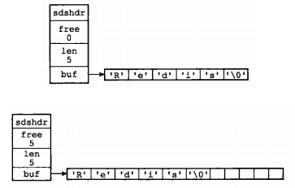
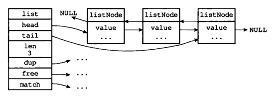
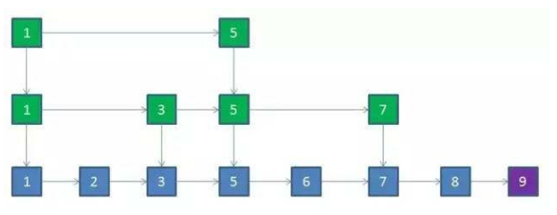
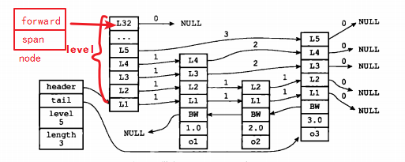

[TOC]

## 1. redis 基本使用

redis 登录密码：

```bash
> /usr/local/redis/bin# ./redis-cli -h 127.0.0.1 -p 6379  -a sirius
```


或者无密码进入再：
```bash
auth myPassword
```


```

127.0.0.1:6379>
127.0.0.1:6379> info memory
# Memory
used_memory:1065552
used_memory_human:1.02M
used_memory_rss:2572288
used_memory_peak:1102328
used_memory_peak_human:1.05M
used_memory_lua:36864
mem_fragmentation_ratio:2.41
mem_allocator:jemalloc-3.6.0
```


+ used_memory：Redis分配器分配的内存总量（单位是字节），包括使用的虚拟内存（即swap）；Redis分配器后面会介绍。used_memory_human只是显示更友好。


## 2. redis 存储结构

### 2.1 redisObject

```c {.line-numbers}
typedef struct redisObject {
    // 类型
    unsigned type:4;
    // 编码
    unsigned encoding:4;
    // 对象最后一次被访问的时间
    unsigned lru:REDIS_LRU_BITS; /* lru time (relative to server.lruclock) */
    // 引用计数
    int refcount;
    // 指向实际值的指针
    void *ptr;
} robj;
```


#### 1. type
type字段表示对象的类型，占4个比特；目前支持：
```c {.line-numbers}
/* Object types */
// 对象类型
#define REDIS_STRING 0			// string
#define REDIS_LIST 1			// list
#define REDIS_SET 2				// set
#define REDIS_ZSET 3			// zset
#define REDIS_HASH 4			// hash
```

#### 2. encoding
encoding表示对象的内部编码，占4个比特。

对于Redis支持的每种类型，都有至少两种内部编码
```c {.line-numbers}

// 对象编码
#define REDIS_ENCODING_RAW 0     /* Raw r */
#define REDIS_ENCODING_INT 1     /* Encoded as integer */
#define REDIS_ENCODING_HT 2      /* Encoded as hash table */
#define REDIS_ENCODING_ZIPMAP 3  /* Encoded as zipmap */
#define REDIS_ENCODING_LINKEDLIST 4 /* Encoded as regular linked list */
#define REDIS_ENCODING_ZIPLIST 5 /* Encoded as ziplist */
#define REDIS_ENCODING_INTSET 6  /* Encoded as intset */
#define REDIS_ENCODING_SKIPLIST 7  /* Encoded as skiplist */
#define REDIS_ENCODING_EMBSTR 8  /* Embedded sds string encoding */
```


+ string:
	+ int
	+ raw
	+ embstr
+ list
	+ ziplist
	+ skiplist


例如对于字符串，有int、embstr、raw三种编码。


通过encoding属性，Redis可以根据不同的使用场景来为对象设置不同的编码，大大提高了Redis的灵活性和效率。以列表对象为例，有压缩列表和双端链表两种编码方式；如果列表中的元素较少，Redis倾向于使用压缩列表进行存储，因为压缩列表占用内存更少，而且比双端链表可以更快载入；当列表对象元素较多时，压缩列表就会转化为更适合存储大量元素的双端链表。

通过object encoding命令，可以查看对象采用的编码方式：

```bash{.line-numbers}
127.0.0.1:6379> get mystring
"hello"
127.0.0.1:6379> object encoding mystring
"embstr"
```


#### 3. lru

lru记录的是对象最后一次被命令程序访问的时间，占据的比特数不同的版本有所不同（如4.0版本占24比特，2.6版本占22比特）。

通过对比lru时间与当前时间，可以计算某个对象的空转时间；object idletime命令可以显示该空转时间（单位是秒）。object idletime命令的一个特殊之处在于它不改变对象的lru值。


```bash{.line-numbers}

127.0.0.1:6379> set mystring hello
OK
127.0.0.1:6379> object idletime mystring
(integer) 2
```


lru值除了通过object idletime命令打印之外，还与Redis的内存回收有关系：如果Redis打开了maxmemory选项，且内存回收算法选择的是volatile-lru或allkeys—lru，那么当Redis内存占用超过maxmemory指定的值时，Redis会优先选择空转时间最长的对象进行释放。

#### 4. refcount

##### refcount与共享对象


refcount记录的是该对象被引用的次数，类型为整型。refcount的作用，主要在于对象的引用计数和内存回收。当创建新对象时，refcount初始化为1；当有新程序使用该对象时，refcount加1；当对象不再被一个新程序使用时，refcount减1；当refcount变为0时，对象占用的内存会被释放。

Redis中被多次使用的对象(refcount>1)，称为共享对象。Redis为了节省内存，当有一些对象重复出现时，新的程序不会创建新的对象，而是仍然使用原来的对象。这个被重复使用的对象，就是共享对象。目前共享对象仅支持整数值的字符串对象。


##### 共享对象的具体实现

Redis的共享对象目前只支持整数值的字符串对象。之所以如此，实际上是对内存和CPU（时间）的平衡：共享对象虽然会降低内存消耗，但是判断两个对象是否相等却需要消耗额外的时间。
3
+ 对于整数值，判断操作复杂度为O(1)；
+ 对于普通字符串，判断复杂度为O(n)；
+ 而对于哈希、列表、集合和有序集合，判断的复杂度为O(n^2)。

虽然共享对象只能是整数值的字符串对象，但是5种类型都可能使用共享对象（如哈希、列表等的元素可以使用）。

就目前的实现来说，Redis服务器在初始化时，会创建10000个字符串对象，值分别是0\~9999的整数值；当Redis需要使用值为0\~9999的字符串对象时，可以直接使用这些共享对象。10000这个数字可以通过调整参数REDIS_SHARED_INTEGERS（4.0中是OBJ_SHARED_INTEGERS）的值进行改变。

```bash
127.0.0.1:6379> set k1 9999
OK
127.0.0.1:6379> set k2 9999
OK
127.0.0.1:6379> object refcount k1
(integer) 3
127.0.0.1:6379> set k3 9999
OK
127.0.0.1:6379> object refcount k1
(integer) 4
127.0.0.1:6379> set k4 10000
OK
127.0.0.1:6379> object refcount k4
(integer) 1
127.0.0.1:6379> set k5 hello
OK
127.0.0.1:6379> object refcount k5
(integer) 1
```

#### 5. ptr

ptr指针指向具体的数据，如前面的例子中，set hello world，ptr指向包含字符串world的SDS。


#### 6. 总结
综上所述，redisObject的结构与对象类型、编码、内存回收、共享对象都有关系；一个redisObject对象的大小为16字节：

type+encoding+lru+refcount
4+4+24+4+8=16Byte


### 2.2 SDS

SDS,简单动态字符串(Simple Dynamic String)。

```c {.line-numbers}
struct sdshdr {
    int len;		// 已使用的长度
    int free;		// 未使用的长度
    char buf[];		// 存储字符串
};

```


存储实例：



通过SDS的结构可以看出，buf数组的长度=free+len+1（其中1表示字符串结尾的空字符）；所以，一个SDS结构占据的空间为：
free所占长度+len所占长度+ buf数组的长度=4+4+free+len+1=free+len+9。


#### SDS与C字符串的比较

SDS在C字符串的基础上加入了free和len字段，带来了很多好处：

+ 获取字符串长度：SDS是O(1)，C字符串是O(n)
+ 缓冲区溢出：使用C字符串的API时，如果字符串长度增加（如strcat操作）而忘记重新分配内存，很容易造成缓冲区的溢出；而SDS由于记录了长度，相应的API在可能造成缓冲区溢出时会自动重新分配内存，杜绝了缓冲区溢出。
+ 修改字符串时内存的重分配：对于C字符串，如果要修改字符串，必须要重新分配内存（先释放再申请），因为如果没有重新分配，字符串长度增大时会造成内存缓冲区溢出，字符串长度减小时会造成内存泄露。而对于SDS，由于可以记录len和free，因此解除了字符串长度和空间数组长度之间的关联，可以在此基础上进行优化：
	+ 空间预分配策略（即分配内存时比实际需要的多）使得字符串长度增大时重新分配内存的概率大大减小；
	+ 惰性空间释放策略使得字符串长度减小时重新分配内存的概率大大减小。
+ 存取二进制数据：SDS可以，C字符串不可以。因为C字符串以空字符作为字符串结束的标识，而对于一些二进制文件（如图片等），内容可能包括空字符串，因此C字符串无法正确存取；而SDS以字符串长度len来作为字符串结束标识，因此没有这个问题。


SDS中的buf仍然使用了C字符串（即以’\0’结尾），估计是为了方便打印字符串等操作，因此SDS可以使用C字符串库中的部分函数；但是需要注意的是，只有当SDS用来存储文本数据时才可以这样使用，在存储二进制数据时则不行（’\0’不一定是结尾）。


#### SDS与C字符串的应用

Redis在存储对象时，一律使用SDS代替C字符串。例如set hello world命令，hello和world都是以SDS的形式存储的。而sadd myset member1 member2 member3命令，不论是键（”myset”），还是集合中的元素（”member1”、 ”member2”和”member3”），都是以SDS的形式存储。除了存储对象，SDS还用于存储各种缓冲区。

只有在字符串不会改变的情况下，如打印日志时，才会使用C字符串。


## 3. Redis的对象类型与内部编码

前面已经说过，Redis支持5种对象类型，而每种结构都有至少两种编码；这样做的好处在于：一方面接口与实现分离，当需要增加或改变内部编码时，用户使用不受影响，另一方面可以根据不同的应用场景切换内部编码，提高效率。

Redis各种对象类型支持的内部编码如下图所示(图中版本是Redis3.0，Redis后面版本中又增加了内部编码，略过不提；本章所介绍的内部编码都是基于3.0的)：


```
127.0.0.1:6379> set key1 33
OK
127.0.0.1:6379> object encoding key1
"int"
127.0.0.1:6379> set key2 helloworld
OK
127.0.0.1:6379> object encoding key2
"embstr"
127.0.0.1:6379> set key3 hellolllllllllllllllllllllllllllllllllllllllllllllllllllllll
OK
127.0.0.1:6379> object encoding key3
"raw"
127.0.0.1:6379> strlen key3
(integer) 60
```

embstr和raw进行区分的长度，是39；

redisObject的长度是16字节，sds的长度是9+字符串长度；因此当字符串长度是39时，embstr的长度正好是16+9+39=64，jemalloc正好可以分配64字节的内存单元。


### 3.1 字符串

1. 字符串长度不能超过512MB。
2. 字符串类型的内部编码有3种，它们的应用场景如下：

+ int：8个字节的长整型。字符串值是整型时，这个值使用long整型表示。
+ embstr：<=39字节的字符串。embstr与raw都使用redisObject和sds保存数据，区别在于， embstr的使用只分配一次内存空间（因此redisObject和sds是连续的），而raw需要分配两次内存空间（分别为redisObject和sds分配空间）。因此与raw相比，embstr的好处在于创建时少分配一次空间，删除时少释放一次空间，以及对象的所有数据连在一起，寻找方便。而embstr的坏处也很明显，如果字符串的长度增加需要重新分配内存时，整个redisObject和sds都需要重新分配空间，因此redis中的embstr实现为只读。
+ raw：大于39个字节的字符串

3. 编码转换

当int数据不再是整数，或大小超过了long的范围时，自动转化为raw

而对于embstr，由于其实现是只读的，因此在对embstr对象进行修改时，都会先转化为raw再进行修改，因此，只要是修改embstr对象，修改后的对象一定是raw的，无论是否达到了39个字节。

```bash
127.0.0.1:6379> get key2
"helloworld"
127.0.0.1:6379> object encoding key2
"embstr"
127.0.0.1:6379> append key2 china
(integer) 15
127.0.0.1:6379> object encoding key2
"raw"
```


### 3.2 列表

#### 双端列表
```c
/*
 * 双端链表节点
 */
typedef struct listNode {
    struct listNode *prev; // 前置节点
    struct listNode *next;	// 后置节点
    void *value; 			// 节点的值
} listNode;

/*
 * 双端链表迭代器
 */
typedef struct listIter {
    listNode *next;	// 当前迭代到的节点
    int direction;	// 迭代的方向

} listIter;

/*
 * 双端链表结构
 */
typedef struct list {
    listNode *head;		   // 表头节点
    listNode *tail;			// 表尾节点
    void *(*dup)(void *ptr);// 节点值复制函数
    void (*free)(void *ptr);// 节点值释放函数
    int (*match)(void *ptr, void *key);// 节点值对比函数
    unsigned long len;	// 链表所包含的节点数量
} list;


```


双端链表同时保存了表头指针和表尾指针，并且每个节点都有指向前和指向后的指针；链表中保存了列表的长度；dup、free和match为节点值设置类型特定函数，所以链表可以用于保存各种不同类型的值。而链表中每个节点指向的是type为字符串的redisObject。


#### 压缩列表


压缩列表：压缩列表是Redis为了节约内存而开发的，是由一系列特殊编码的连续内存块(而不是像双端链表一样每个节点是指针)组成的顺序型数据结构；具体结构相对比较复杂，略。与双端链表相比，压缩列表可以节省内存空间，但是进行修改或增删操作时，复杂度较高；因此当节点数量较少时，可以使用压缩列表；但是节点数量多时，还是使用双端链表划算。

压缩列表不仅用于实现列表，也用于实现哈希、有序列表；使用非常广泛。


#### 编码转换

只有同时满足下面两个条件时，才会使用压缩列表：列表中元素数量小于512个；列表中所有字符串对象都不足64字节。如果有一个条件不满足，则使用双端列表；且编码只可能由压缩列表转化为双端链表，反方向则不可能。


```
127.0.0.1:6379> rpush mylist v1 v2 v3
(integer) 3
127.0.0.1:6379> object encoding mylist
"ziplist"
127.0.0.1:6379> rpush mylist v444
(integer) 4
127.0.0.1:6379> object encoding mylist
"ziplist"
127.0.0.1:6379> rpush mylist v555555555555555555555555555555555555555555555555555555555555
(integer) 5
127.0.0.1:6379> object encoding mylist
"ziplist"
127.0.0.1:6379> rpush mylist v6666666666666666666666666666666666666666666666666666666666666666666666666666666666666666666
(integer) 6
127.0.0.1:6379> object encoding mylist
"linkedlist"
127.0.0.1:6379>
```


### 3.3 哈希

#### 概况
哈希（作为一种数据结构），不仅是redis对外提供的5种对象类型的一种（与字符串、列表、集合、有序结合并列），也是Redis作为Key-Value数据库所使用的数据结构。为了说明的方便，在本文后面当使用“内层的哈希”时，代表的是redis对外提供的5种对象类型的一种；使用“外层的哈希”代指Redis作为Key-Value数据库所使用的数据结构。


#### 内部编码
内层的哈希使用的内部编码可以是压缩列表（ziplist）和哈希表（hashtable）两种；Redis的外层的哈希则只使用了hashtable。

压缩列表前面已介绍。与哈希表相比，压缩列表用于元素个数少、元素长度小的场景；其优势在于集中存储，节省空间；同时，虽然对于元素的操作复杂度也由O(n)变为了O(1)，但由于哈希中元素数量较少，因此操作的时间并没有明显劣势。


hashtable：一个hashtable由1个dict结构、2个dictht结构、1个dictEntry指针数组（称为bucket）和多个dictEntry结构组成。


### 3.4 skiplist


[漫画算法：什么是跳跃表？](http://blog.jobbole.com/111731/)




跳跃表实现简单，性能又和平衡树差不多，实在是很棒的选择；

如果是严格按照每一层减少一半的索引,同一层跨度都是一致的，查询需要O(logN)，事实上，同一层每个节点的跨度是不一致的，那么查询的时间复杂度就是O(logN)~O(N)


redis 的实现是这样的：


```c {.line-numbers}

/*
 * 跳跃表节点
 */
typedef struct zskiplistNode
{
    robj *obj;                      // 成员对象 redisObject
    double score;                   // 分值
    struct zskiplistNode *backward; // 后退指针
    struct zskiplistLevel
    { // 层
        struct zskiplistNode *forward; // 前进指针
        unsigned int span;              // 跨度
    } level[];
} zskiplistNode;

/*
 * 跳跃表,记录了表的信息
 */
typedef struct zskiplist
{
    // 表头节点和表尾节点
    struct zskiplistNode *header, *tail;
    unsigned long length;// 表中节点的数量
    int level;// 表中层数最大的节点的层数
} zskiplist;

```




对于zskiplist，记录了表的基本信息。
+ *header, *tail：header指向头节点，头节点不存数据，tail指向尾节点；
+ level：最大的层数，也就是所有zskiplistNode 中 level[] 数组的最大长度.假如level只有一层，那么整个跳跃表退化为双向链表；
+ length:跳跃表目前包含的节点数目


对于 zskiplistNode：

+ *backward: 指向前一个节点
+ score：分数，double
+ robj:redisObject,实际的对象
+ level[]: 实现跳跃的关键所在，第0 层只跳一个单位，和backward合起来 就是一个双向链表。每次创建一个新跳跃表节点，随机生成一个长度1~32的level[]


### 3.5 intset

```c {.line-numbers}

typedef struct intset {
    uint32_t encoding;      // 编码方式
    uint32_t length;        // 集合包含的元素数量
    int8_t contents[];      // 保存元素的数组
} intset;

```


[Linux IO模式及 select、poll、epoll详解](https://segmentfault.com/a/1190000003063859)


