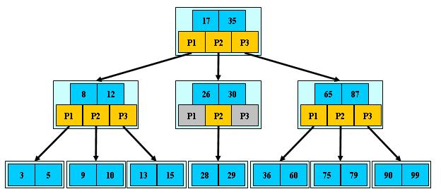
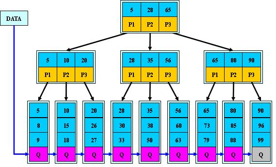

> 不可浅尝辄止

B-数和B+ 树是用作外部查找的数据结构，其数据存放在外存。

节点or 结点？

## B 树：
> B树（B-tree）是一种树状数据结构，它能够存储数据、对其进行排序并允许以`O(log n)`的时间复杂度运行进行查找、顺序读取、插入和删除的数据结构。B树，概括来说是一个节点可以拥有多于`2个子节点的二叉查找树`。与自平衡二叉查找树不同，B-树为系统最优化大块数据的读和写操作。B-tree算法减少定位记录时所经历的中间过程，从而加快存取速度。普遍运用在数据库和文件系统。

1. 所有的叶子节点在同一层，并且不带信息
2. 树中每个节点至多有m棵子树(即至多含有m-1个关键字)
3. 若根节点不是终端节点，则根节点至少有两棵子树
4. 除根结点外，其他非叶子节点至少有$⌈m/2⌉$棵子树（即至少含有$⌈m/2⌉-1$个key）
5. 每个非叶子节点的结构为：$(n,p_0,k_1,p_1,k_2...,k_n,p_n)$

参考《数据结构第四版-李春葆》

## B+ 

## B 树和B+ 树的差别

B+树是对B树的一种变形树，它与B树的差异在于：

B+:

+ B+树`非叶结点仅具有索引作用`，在叶结点中存放数据,因此在内存页能存放更多的非叶子节点。
+ 数据更加紧密，具有很好的空间局部性，访问叶子节点关联的数据也具有很好的缓存命中率
+ B+ 树的叶子节点构成单向循环链表，可以很方便地有序遍历
+ 由于数据有序且相连，便于区间查找

B 树：
+ B树在任何节点都存放数据
+ B树搜索，需要进行每一层的递归遍历。相邻的元素可能在内存中不相邻，所以缓存命中性没有B+树好。

### 为什么在内存中用B树？

如果内存足够大呢？为什么不用

+ B树平均查找距离比B+ 树 要小
+ B树使用到的空间实际上比B+ 树少，B+ 树的索引+磁盘数据 更大
+ 内存中的树遍历是很快的

### 为什么在MySQL中用B+树？

+ 考虑磁盘IO的代价较大，B+树 逻辑相邻的数据物理上也是相邻的，能有效利用磁盘缓存
+ 内存一般较小，只需要加载所有非叶子节点进内存，就能完成搜索，对空间消耗可控
+ 树的阶M 和页大小相关，B树
+ B树消耗：O(n)，B+ 树消耗$O(log_m^n+n)$的空间
+ B+ 树的叶子节点是顺序排列的，对于排序操作可以很快解决

### 数据局部性

磁盘每次读取都需要 寻道，转动盘面，传送数据。因此为了提高效率，要尽量减少磁盘I/O，减少读写操作。为了达到这个目的，磁盘往往不是严格按需读取，而是每次都会预读，即使只需要一个字节，磁盘也会从这个位置开始，顺序向后读取一定长度的数据放入内存。这样做的理论依据是计算机科学中著名的局部性原理：**当一个数据被用到时，其附近的数据也通常会马上被使用**。

预读的长度一般为页（page）的整倍数。页是计算机管理存储器的`逻辑`块，硬件及操作系统往往将主存和磁盘存储区分割为连续的大小相等的块，每个存储块称为一页（在许多操作系统中，页得大小通常为4k），主存和磁盘以页为单位交换数据。当程序要读取的数据不在主存中时，会触发一个缺页异常，此时系统会向磁盘发出读盘信号，磁盘会找到数据的起始位置并向后连续读取一页或几页载入内存中，然后异常返回，程序继续运行。

文件系统及数据库系统的设计者利用了磁盘预读原理，将一个节点的大小设为等于一个页，这样每个节点只需要一次I/O就可以完全载入。为了达到这个目的，在实际实现B-Tree还需要使用如下技巧：

每次新建一个节点的同时，直接申请一个页的空间( 512或者1024)，这样就保证一个节点物理上也存储在一个页里，加之计算机存储分配都是按页对齐的，就实现了一个node只需一次I/O。如，将B树的度M设置为1024，这样在前面的例子中，600亿个元素中只需要小于4次查找即可定位到某一存储位置。

同时在B+树中，内节点只存储导航用到的key，并不存储具体值，这样内节点个数较少，能够全部读取到主存中，外接点存储key及值，并且顺序排列，具有良好的空间局部性。所以B及B+树比较适合与文件系统的数据结构。下面是一颗B树，用来进行内容存储。

[【经典数据结构】B树与B+树](https://www.cnblogs.com/vincently/p/4526560.html)

[MySQL索引背后的数据结构及算法原理](http://blog.codinglabs.org/articles/theory-of-mysql-index.html)