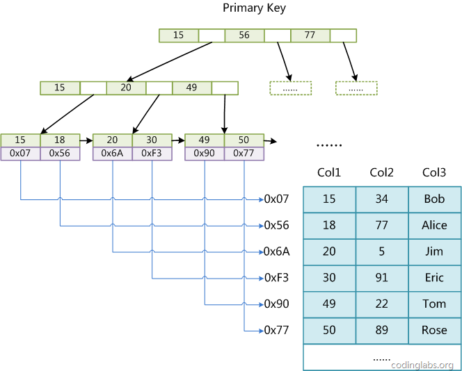
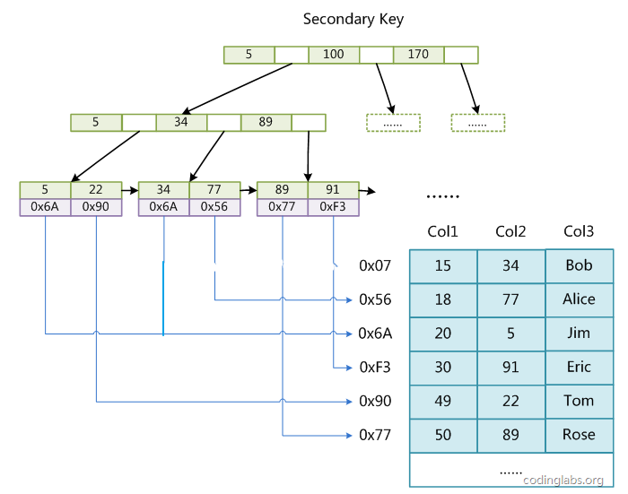
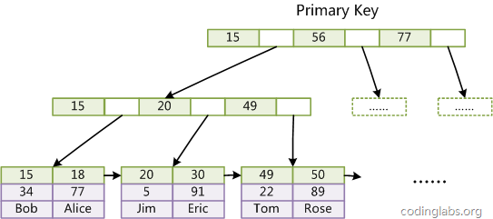
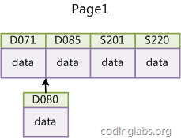

> 不可浅尝辄止

[TOC]

B-数和B+ 树是用作外部查找的数据结构，其数据存放在外存。


节点or 结点？

## B-Tree

> B树（B-tree）是一种树状数据结构，它能够存储数据、对其进行排序并允许以`O(log n)`的时间复杂度运行进行查找、顺序读取、插入和删除的数据结构。B树，概括来说是一个节点可以拥有多于`2个子节点的二叉查找树`。与自平衡二叉查找树不同，B-树为系统最优化大块数据的读和写操作。B-tree算法减少定位记录时所经历的中间过程，从而加快存取速度。普遍运用在数据库和文件系统。


时间复杂度：$O(log_d^N)$


1. 所有的叶子节点在同一层，并且不带信息
2. 树中每个节点至多有m棵子树(即至多含有m-1个关键字)
3. 若根节点不是终端节点，则根节点至少有两棵子树
4. 除根结点外，其他非叶子节点至少有$⌈m/2⌉$棵子树（即至少含有$⌈m/2⌉-1$个key）
5. 每个非叶子节点的结构为：$(n,p_0,k_1,p_1,k_2...,k_n,p_n)$


参考《数据结构第四版-李春葆》


## B+Tree


## B 树和B+ 树的差别

B+树是对B树的一种变形树，它与B树的差异在于：

[B+树](./B+树.md)：

+ B+树`非叶结点仅具有索引作用`，在叶结点中存放数据，因此在内存页能存放更多的非叶子节点。
+ 数据更加紧密，具有很好的`空间局部性`，访问叶子节点关联的数据也具有很好的`缓存命中率`
+ B+ 树的叶子节点构成`单向循环链表`，由于数据`有序且相连`，便于区间查找

B 树：

+ B树在任何节点都存放数据
+ B树搜索，需要进行每一层的递归遍历。相邻的元素可能在内存中不相邻，所以缓存命中性没有B+树好。


根据B-Tree的定义，可知检索一次最多需要访问h个节点。数据库系统的设计者巧妙利用了磁盘预读原理，将一个节点的大小设为等于一个页，这样每个节点只需要一次I/O就可以完全载入。为了达到这个目的，在实际实现B-Tree还需要使用如下技巧：

每次新建节点时，直接申请一个页的空间，这样就保证一个节点物理上也存储在一个页里，加之计算机存储分配都是按页对齐的，就实现了一个node只需一次I/O。

B-Tree中一次检索最多需要h-1次I/O（根节点常驻内存），渐进复杂度为$O(h)=O(log_d^N)$。一般实际应用中，出度d是非常大的数字，通常超过100，因此h非常小（通常不超过3）。

综上所述，用B-Tree作为索引结构效率是非常高的。

而红黑树这种结构，h明显要深的多。由于逻辑上很近的节点（父子）物理上可能很远，无法利用局部性，所以红黑树的I/O渐进复杂度也为O(h)，效率明显比B-Tree差很多。

上文还说过，B+Tree更适合外存索引，原因和内节点出度d有关。从上面分析可以看到，d越大索引的性能越好，而出度的上限取决于节点内key和data的大小：

$d_{max}=floor(pagesize/(keysize+datasize+pointsize))$
floor表示向下取整。由于B+Tree内节点去掉了data域，因此可以拥有更大的出度，拥有更好的性能。


### 为什么在内存中用B树？

如果内存足够大呢？为什么不用B+树 在内存查找？


+ B树`平均查找次数` 比B+ 树 要小
+ B树的`空间占用更小`，B+ 树的索引+磁盘数据 更大
+ 内存中的树遍历是很快的

### 为什么在MySQL中用B+树？

+ 考虑磁盘IO的代价较大，B+树 逻辑相邻的数据物理上也是相邻的，能有效利用磁盘缓存
+ 内存一般较小，只需要加载所有非叶子节点进内存，就能完成搜索，对空间消耗可控
+ 树的阶M 和页大小相关，B树
+ B树消耗：O(n)，B+ 树消耗$O(log_m^n+n)$的空间
+ B+ 树的叶子节点是顺序排列的，对于排序操作可以很快解决


## MySQL索引实现


在MySQL中，索引属于`存储引擎`级别的概念，不同存储引擎对索引的实现方式是不同的，本文主要讨论`MyISAM`和`InnoDB`两个存储引擎的索引实现方式。


### MyISAM索引实现
MyISAM引擎使用`B+Tree`作为索引结构，叶节点的data域存放的是`数据记录的地址`。



这里设表一共有三列，假设我们以Col1为主键，则上图是一个MyISAM表的主索引（Primary key）示意。可以看出MyISAM的索引文件仅仅保存数据记录的地址。在MyISAM中，主索引和辅助索引（Secondary key）在结构上没有任何区别，只是主索引要求key是唯一的，而辅助索引的key可以重复。如果我们在Col2上建立一个辅助索引，则此索引的结构如下图所示：





同样也是一棵B+Tree，data域保存数据记录的地址。因此，MyISAM中索引检索的算法为首先按照B+Tree搜索算法搜索索引，如果指定的Key存在，则取出其data域的值，然后以data域的值为地址，读取相应数据记录。

MyISAM的索引方式也叫做“`非聚集`”的，之所以这么称呼是为了与InnoDB的聚集索引区分。


### InnoDB索引实现


虽然InnoDB也使用B+Tree作为索引结构，但具体实现方式却与MyISAM截然不同。

第一个重大区别是InnoDB的数据文件本身就是索引文件。从上文知道，MyISAM索引文件和数据文件是分离的，索引文件仅保存数据记录的地址。而在InnoDB中，表数据文件本身就是按B+Tree组织的一个索引结构，这棵树的`叶节点data域保存了完整的数据记录`。这个索引的key是数据表的`主键`，因此InnoDB表数据文件本身就是主索引。




可以看到叶节点包含了完整的数据记录。这种索引叫做聚集索引。因为InnoDB的数据文件本身要`按主键聚集`，所以`InnoDB要求表必须有主键`（MyISAM可以没有），如果没有显式指定，则MySQL系统会自动选择一个可以唯一标识数据记录的列作为主键，如果不存在这种列，则MySQL自动为InnoDB表生成一个隐含字段作为主键，这个字段长度为6个字节，类型为长整形。


第二个与MyISAM索引的不同是InnoDB的辅助索引data域存储相应记录`主键`的值而不是地址。换句话说，InnoDB的所有辅助索引都引用主键作为data域。例如，图11为定义在Col3上的一个辅助索引：


了解不同存储引擎的索引实现方式对于正确使用和优化索引都非常有帮助，例如知道了InnoDB的索引实现后，就很容易明白为什么不建议使用过长的字段作为主键，因为`所有辅助索引都引用主索引，过长的主索引会令辅助索引变得过大`。再例如，用**非单调的字段作为主键在InnoDB中不是个好主意，因为InnoDB数据文件本身是一棵B+Tree，非单调的主键会造成在插入新记录时数据文件为了维持B+Tree的特性而频繁的分裂调整，十分低效，而使用自增字段作为主键则是一个很好的选择**。


## 索引使用策略及优化


MySQL的优化主要分为结构优化（Scheme optimization）和查询优化（Query optimization）。本章讨论的高性能索引策略主要属于结构优化范畴。本章的内容完全基于上文的理论基础，实际上一旦理解了索引背后的机制，那么选择高性能的策略就变成了纯粹的推理，并且可以理解这些策略背后的逻辑。


### 示例数据库


为了讨论索引策略，需要一个数据量不算小的数据库作为示例。本文选用MySQL官方文档中提供的示例数据库之一：employees。这个数据库关系复杂度适中，且数据量较大。下图是这个数据库的E-R关系图（引用自MySQL官方手册）：


MySQL官方文档中关于此数据库的页面为http://dev.mysql.com/doc/employee/en/employee.html。里面详细介绍了此数据库，并提供了下载地址和导入方法，如果有兴趣导入此数据库到自己的MySQL可以参考文中内容。

### 最左前缀原理与相关优化

高效使用索引的首要条件是知道什么样的查询会使用到索引，这个问题和B+Tree中的“最左前缀原理”有关，下面通过例子说明最左前缀原理。

这里先说一下联合索引的概念。在上文中，我们都是假设索引只引用了单个的列，实际上，MySQL中的索引可以以一定顺序引用多个列，这种索引叫做联合索引，一般的，一个联合索引是一个有序元组\<a1, a2, …, an>，其中各个元素均为数据表的一列，实际上要严格定义索引需要用到关系代数，但是这里我不想讨论太多关系代数的话题，因为那样会显得很枯燥，所以这里就不再做严格定义。另外，单列索引可以看成联合索引元素数为1的特例。

以employees.titles表为例，下面先查看其上都有哪些索引：
```sql
SHOW INDEX FROM employees.titles;
+--------+------------+----------+--------------+-------------+-----------+-------------+------+------------+
| Table  | Non_unique | Key_name | Seq_in_index | Column_name | Collation | Cardinality | Null | Index_type |
+--------+------------+----------+--------------+-------------+-----------+-------------+------+------------+
| titles |          0 | PRIMARY  |            1 | emp_no      | A         |        NULL |      | BTREE      |
| titles |          0 | PRIMARY  |            2 | title       | A         |        NULL |      | BTREE      |
| titles |          0 | PRIMARY  |            3 | from_date   | A         |      443308 |      | BTREE      |
| titles |          1 | emp_no   |            1 | emp_no      | A         |      443308 |      | BTREE      |
+--------+------------+----------+--------------+-------------+-----------+-------------+------+------------+
```
从结果中可以到titles表的主索引为\<emp_no, title, from_date>，还有一个辅助索引<emp_no>。为了避免多个索引使事情变复杂（MySQL的SQL优化器在多索引时行为比较复杂），这里我们将辅助索引drop掉：
```sql
ALTER TABLE employees.titles DROP INDEX emp_no;
```

这样就可以专心分析索引PRIMARY的行为了。

#### 情况一：全列匹配。
```sql
EXPLAIN SELECT * FROM employees.titles WHERE emp_no='10001' AND title='Senior Engineer' AND from_date='1986-06-26';
+----+-------------+--------+-------+---------------+---------+---------+-------------------+------+-------+
| id | select_type | table  | type  | possible_keys | key     | key_len | ref               | rows | Extra |
+----+-------------+--------+-------+---------------+---------+---------+-------------------+------+-------+
|  1 | SIMPLE      | titles | const | PRIMARY       | PRIMARY | 59      | const,const,const |    1 |       |
+----+-------------+--------+-------+---------------+---------+---------+-------------------+------+-------+
```
很明显，当按照索引中所有列进行精确匹配（这里精确匹配指“=”或“IN”匹配）时，索引可以被用到。这里有一点需要注意，理论上索引对顺序是敏感的，但是由于MySQL的查询优化器会自动调整where子句的条件顺序以使用适合的索引，例如我们将where中的条件顺序颠倒：
```sql
EXPLAIN SELECT * FROM employees.titles WHERE from_date='1986-06-26' AND emp_no='10001' AND title='Senior Engineer';
+----+-------------+--------+-------+---------------+---------+---------+-------------------+------+-------+
| id | select_type | table  | type  | possible_keys | key     | key_len | ref               | rows | Extra |
+----+-------------+--------+-------+---------------+---------+---------+-------------------+------+-------+
|  1 | SIMPLE      | titles | const | PRIMARY       | PRIMARY | 59      | const,const,const |    1 |       |
+----+-------------+--------+-------+---------------+---------+---------+-------------------+------+-------+
```
效果是一样的。

#### 情况二：最左前缀匹配。
```sql
EXPLAIN SELECT * FROM employees.titles WHERE emp_no='10001';
+----+-------------+--------+------+---------------+---------+---------+-------+------+-------+
| id | select_type | table  | type | possible_keys | key     | key_len | ref   | rows | Extra |
+----+-------------+--------+------+---------------+---------+---------+-------+------+-------+
|  1 | SIMPLE      | titles | ref  | PRIMARY       | PRIMARY | 4       | const |    1 |       |
+----+-------------+--------+------+---------------+---------+---------+-------+------+-------+
```

当查询条件精确匹配索引的左边连续一个或几个列时，如<emp_no>或<emp_no, title>，所以可以被用到，但是只能用到一部分，即条件所组成的最左前缀。上面的查询从分析结果看用到了PRIMARY索引，但是key_len为4，说明只用到了索引的第一列前缀。

#### 情况三：查询条件用到了索引中列的精确匹配，但是中间某个条件未提供。

```sql
EXPLAIN SELECT * FROM employees.titles WHERE emp_no='10001' AND from_date='1986-06-26';
+----+-------------+--------+------+---------------+---------+---------+-------+------+-------------+
| id | select_type | table  | type | possible_keys | key     | key_len | ref   | rows | Extra       |
+----+-------------+--------+------+---------------+---------+---------+-------+------+-------------+
|  1 | SIMPLE      | titles | ref  | PRIMARY       | PRIMARY | 4       | const |    1 | Using where |
+----+-------------+--------+------+---------------+---------+---------+-------+------+-------------+
```


此时索引使用情况和情况二相同，因为title未提供，所以查询只用到了索引的第一列，而后面的from_date虽然也在索引中，但是由于title不存在而无法和左前缀连接，因此需要对结果进行扫描过滤from_date（这里由于emp_no唯一，所以不存在扫描）。如果想让from_date也使用索引而不是where过滤，可以增加一个辅助索引<emp_no, from_date>，此时上面的查询会使用这个索引。除此之外，还可以使用一种称之为“隔离列”的优化方法，将emp_no与from_date之间的“坑”填上。

首先我们看下title一共有几种不同的值：
```sql
SELECT DISTINCT(title) FROM employees.titles;
+--------------------+
| title              |
+--------------------+
| Senior Engineer    |
| Staff              |
| Engineer           |
| Senior Staff       |
| Assistant Engineer |
| Technique Leader   |
| Manager            |
+--------------------+
```
只有7种。在这种成为“坑”的列值比较少的情况下，可以考虑用“IN”来填补这个“坑”从而形成最左前缀：
```sql
EXPLAIN SELECT * FROM employees.titles
WHERE emp_no='10001'
AND title IN ('Senior Engineer', 'Staff', 'Engineer', 'Senior Staff', 'Assistant Engineer', 'Technique Leader', 'Manager')
AND from_date='1986-06-26';
+----+-------------+--------+-------+---------------+---------+---------+------+------+-------------+
| id | select_type | table  | type  | possible_keys | key     | key_len | ref  | rows | Extra       |
+----+-------------+--------+-------+---------------+---------+---------+------+------+-------------+
|  1 | SIMPLE      | titles | range | PRIMARY       | PRIMARY | 59      | NULL |    7 | Using where |
+----+-------------+--------+-------+---------------+---------+---------+------+------+-------------+
```

这次key_len为59，说明索引被用全了，但是从type和rows看出IN实际上执行了一个range查询，这里检查了7个key。看下两种查询的性能比较：
```sql
SHOW PROFILES;
+----------+------------+-------------------------------------------------------------------------------+
| Query_ID | Duration   | Query                                                                         |
+----------+------------+-------------------------------------------------------------------------------+
|       10 | 0.00058000 | SELECT * FROM employees.titles WHERE emp_no='10001' AND from_date='1986-06-26'|
|       11 | 0.00052500 | SELECT * FROM employees.titles WHERE emp_no='10001' AND title IN ...          |
+----------+------------+-------------------------------------------------------------------------------+
```

“填坑”后性能提升了一点。如果经过emp_no筛选后余下很多数据，则后者性能优势会更加明显。当然，如果title的值很多，用填坑就不合适了，必须建立辅助索引。

#### 情况四：查询条件没有指定索引第一列。
```sql
EXPLAIN SELECT * FROM employees.titles WHERE from_date='1986-06-26';
+----+-------------+--------+------+---------------+------+---------+------+--------+-------------+
| id | select_type | table  | type | possible_keys | key  | key_len | ref  | rows   | Extra       |
+----+-------------+--------+------+---------------+------+---------+------+--------+-------------+
|  1 | SIMPLE      | titles | ALL  | NULL          | NULL | NULL    | NULL | 443308 | Using where |
+----+-------------+--------+------+---------------+------+---------+------+--------+-------------+
```

由于不是最左前缀，索引这样的查询显然用不到索引。

#### 情况五：匹配某列的前缀字符串。
```sql
EXPLAIN SELECT * FROM employees.titles WHERE emp_no='10001' AND title LIKE 'Senior%';
+----+-------------+--------+-------+---------------+---------+---------+------+------+-------------+
| id | select_type | table  | type  | possible_keys | key     | key_len | ref  | rows | Extra       |
+----+-------------+--------+-------+---------------+---------+---------+------+------+-------------+
|  1 | SIMPLE      | titles | range | PRIMARY       | PRIMARY | 56      | NULL |    1 | Using where |
+----+-------------+--------+-------+---------------+---------+---------+------+------+-------------+
```

此时可以用到索引，但是如果通配符不是只出现在末尾，则无法使用索引。（原文表述有误，如果通配符%不出现在开头，则可以用到索引，但根据具体情况不同可能只会用其中一个前缀）

#### 情况六：范围查询。

```sql
EXPLAIN SELECT * FROM employees.titles WHERE emp_no < '10010' and title='Senior Engineer';
+----+-------------+--------+-------+---------------+---------+---------+------+------+-------------+
| id | select_type | table  | type  | possible_keys | key     | key_len | ref  | rows | Extra       |
+----+-------------+--------+-------+---------------+---------+---------+------+------+-------------+
|  1 | SIMPLE      | titles | range | PRIMARY       | PRIMARY | 4       | NULL |   16 | Using where |
+----+-------------+--------+-------+---------------+---------+---------+------+------+-------------+
```

范围列可以用到索引（必须是最左前缀），但是范围列后面的列无法用到索引。同时，索引最多用于一个范围列，因此如果查询条件中有两个范围列则无法全用到索引。
```sql
EXPLAIN SELECT * FROM employees.titles
WHERE emp_no < '10010'
AND title='Senior Engineer'
AND from_date BETWEEN '1986-01-01' AND '1986-12-31';
+----+-------------+--------+-------+---------------+---------+---------+------+------+-------------+
| id | select_type | table  | type  | possible_keys | key     | key_len | ref  | rows | Extra       |
+----+-------------+--------+-------+---------------+---------+---------+------+------+-------------+
|  1 | SIMPLE      | titles | range | PRIMARY       | PRIMARY | 4       | NULL |   16 | Using where |
+----+-------------+--------+-------+---------------+---------+---------+------+------+-------------+
```

可以看到索引对第二个范围索引无能为力。这里特别要说明MySQL一个有意思的地方，那就是仅用explain可能无法区分范围索引和多值匹配，因为在type中这两者都显示为range。同时，用了“between”并不意味着就是范围查询，例如下面的查询：
```sql
EXPLAIN SELECT * FROM employees.titles
WHERE emp_no BETWEEN '10001' AND '10010'
AND title='Senior Engineer'
AND from_date BETWEEN '1986-01-01' AND '1986-12-31';
+----+-------------+--------+-------+---------------+---------+---------+------+------+-------------+
| id | select_type | table  | type  | possible_keys | key     | key_len | ref  | rows | Extra       |
+----+-------------+--------+-------+---------------+---------+---------+------+------+-------------+
|  1 | SIMPLE      | titles | range | PRIMARY       | PRIMARY | 59      | NULL |   16 | Using where |
+----+-------------+--------+-------+---------------+---------+---------+------+------+-------------+
```
看起来是用了两个范围查询，但作用于emp_no上的“BETWEEN”实际上相当于“IN”，也就是说emp_no实际是多值精确匹配。可以看到这个查询用到了索引全部三个列。因此在MySQL中要谨慎地区分多值匹配和范围匹配，否则会对MySQL的行为产生困惑。

#### 情况七：查询条件中含有函数或表达式。
很不幸，如果查询条件中含有函数或表达式，则MySQL不会为这列使用索引（虽然某些在数学意义上可以使用）。例如：

```sql
EXPLAIN SELECT * FROM employees.titles WHERE emp_no='10001' AND left(title, 6)='Senior';
+----+-------------+--------+------+---------------+---------+---------+-------+------+-------------+
| id | select_type | table  | type | possible_keys | key     | key_len | ref   | rows | Extra       |
+----+-------------+--------+------+---------------+---------+---------+-------+------+-------------+
|  1 | SIMPLE      | titles | ref  | PRIMARY       | PRIMARY | 4       | const |    1 | Using where |
+----+-------------+--------+------+---------------+---------+---------+-------+------+-------------+
```

虽然这个查询和情况五中功能相同，但是由于使用了函数left，则无法为title列应用索引，而情况五中用LIKE则可以。再如：
```sql
EXPLAIN SELECT * FROM employees.titles WHERE emp_no - 1='10000';
+----+-------------+--------+------+---------------+------+---------+------+--------+-------------+
| id | select_type | table  | type | possible_keys | key  | key_len | ref  | rows   | Extra       |
+----+-------------+--------+------+---------------+------+---------+------+--------+-------------+
|  1 | SIMPLE      | titles | ALL  | NULL          | NULL | NULL    | NULL | 443308 | Using where |
+----+-------------+--------+------+---------------+------+---------+------+--------+-------------+
```
显然这个查询等价于查询emp_no为10001的函数，但是由于查询条件是一个表达式，MySQL无法为其使用索引。看来MySQL还没有智能到自动优化常量表达式的程度，因此在写查询语句时尽量避免表达式出现在查询中，而是先手工私下代数运算，转换为无表达式的查询语句。


### 索引选择性与前缀索引

既然索引可以加快查询速度，那么是不是只要是查询语句需要，就建上索引？答案是否定的。因为索引虽然加快了查询速度，但索引也是有代价的：索引文件本身要消耗存储空间，同时索引会加重插入、删除和修改记录时的负担，另外，MySQL在运行时也要消耗资源维护索引，因此索引并不是越多越好。一般两种情况下不建议建索引。

第一种情况是表记录比较少，例如一两千条甚至只有几百条记录的表，没必要建索引，让查询做全表扫描就好了。至于多少条记录才算多，这个个人有个人的看法，我个人的经验是以2000作为分界线，记录数不超过 2000可以考虑不建索引，超过2000条可以酌情考虑索引。

另一种不建议建索引的情况是索引的选择性较低。所谓索引的选择性（Selectivity），是指不重复的索引值（也叫基数，Cardinality）与表记录数（#T）的比值：

Index Selectivity = Cardinality / #T

显然选择性的取值范围为(0, 1]，选择性越高的索引价值越大，这是由B+Tree的性质决定的。例如，上文用到的employees.titles表，如果title字段经常被单独查询，是否需要建索引，我们看一下它的选择性：
```sql
SELECT count(DISTINCT(title))/count(*) AS Selectivity FROM employees.titles;
+-------------+
| Selectivity |
+-------------+
|      0.0000 |
+-------------+
```

title的选择性不足0.0001（精确值为0.00001579），所以实在没有什么必要为其单独建索引。

有一种与索引选择性有关的索引优化策略叫做前缀索引，就是用列的前缀代替整个列作为索引key，当前缀长度合适时，可以做到既使得前缀索引的选择性接近全列索引，同时因为索引key变短而减少了索引文件的大小和维护开销。下面以employees.employees表为例介绍前缀索引的选择和使用。

从图12可以看到employees表只有一个索引<emp_no>，那么如果我们想按名字搜索一个人，就只能全表扫描了：
```sql
EXPLAIN SELECT * FROM employees.employees WHERE first_name='Eric' AND last_name='Anido';
+----+-------------+-----------+------+---------------+------+---------+------+--------+-------------+
| id | select_type | table     | type | possible_keys | key  | key_len | ref  | rows   | Extra       |
+----+-------------+-----------+------+---------------+------+---------+------+--------+-------------+
|  1 | SIMPLE      | employees | ALL  | NULL          | NULL | NULL    | NULL | 300024 | Using where |
+----+-------------+-----------+------+---------------+------+---------+------+--------+-------------+
```

如果频繁按名字搜索员工，这样显然效率很低，因此我们可以考虑建索引。有两种选择，建<first_name>或<first_name, last_name>，看下两个索引的选择性：
```sql
SELECT count(DISTINCT(first_name))/count(*) AS Selectivity FROM employees.employees;
+-------------+
| Selectivity |
+-------------+
|      0.0042 |
+-------------+
SELECT count(DISTINCT(concat(first_name, last_name)))/count(*) AS Selectivity FROM employees.employees;
+-------------+
| Selectivity |
+-------------+
|      0.9313 |
+-------------+
```
<first_name>显然选择性太低，<first_name, last_name>选择性很好，但是first_name和last_name加起来长度为30，有没有兼顾长度和选择性的办法？可以考虑用first_name和last_name的前几个字符建立索引，例如<first_name, left(last_name, 3)>，看看其选择性：
```sql
SELECT count(DISTINCT(concat(first_name, left(last_name, 3))))/count(*) AS Selectivity FROM employees.employees;
+-------------+
| Selectivity |
+-------------+
|      0.7879 |
+-------------+
```
选择性还不错，但离0.9313还是有点距离，那么把last_name前缀加到4：
```sql
SELECT count(DISTINCT(concat(first_name, left(last_name, 4))))/count(*) AS Selectivity FROM employees.employees;
+-------------+
| Selectivity |
+-------------+
|      0.9007 |
+-------------+
```
这时选择性已经很理想了，而这个索引的长度只有18，比<first_name, last_name>短了接近一半，我们把这个前缀索引 建上：
```sql
ALTER TABLE employees.employees
ADD INDEX `first_name_last_name4` (first_name, last_name(4));
```
此时再执行一遍按名字查询，比较分析一下与建索引前的结果：
```sql
SHOW PROFILES;
+----------+------------+---------------------------------------------------------------------------------+
| Query_ID | Duration   | Query                                                                           |
+----------+------------+---------------------------------------------------------------------------------+
|       87 | 0.11941700 | SELECT * FROM employees.employees WHERE first_name='Eric' AND last_name='Anido' |
|       90 | 0.00092400 | SELECT * FROM employees.employees WHERE first_name='Eric' AND last_name='Anido' |
+----------+------------+---------------------------------------------------------------------------------+
```

性能的提升是显著的，查询速度提高了120多倍。

前缀索引兼顾索引大小和查询速度，但是其缺点是不能用于ORDER BY和GROUP BY操作，也不能用于Covering index（即当索引本身包含查询所需全部数据时，不再访问数据文件本身）。

### InnoDB的主键选择与插入优化

在使用InnoDB存储引擎时，如果没有特别的需要，请永远使用一个与业务无关的自增字段作为主键。

经常看到有帖子或博客讨论主键选择问题，有人建议使用业务无关的自增主键，有人觉得没有必要，完全可以使用如学号或身份证号这种唯一字段作为主键。不论支持哪种论点，大多数论据都是业务层面的。如果从数据库索引优化角度看，使用InnoDB引擎而不使用自增主键绝对是一个糟糕的主意。

上文讨论过InnoDB的索引实现，InnoDB使用聚集索引，数据记录本身被存于主索引（一颗B+Tree）的叶子节点上。这就要求同一个叶子节点内（大小为一个内存页或磁盘页）的各条数据记录按主键顺序存放，因此每当有一条新的记录插入时，MySQL会根据其主键将其插入适当的节点和位置，如果页面达到装载因子（InnoDB默认为15/16），则开辟一个新的页（节点）。

如果表使用自增主键，那么每次插入新的记录，记录就会顺序添加到当前索引节点的后续位置，当一页写满，就会自动开辟一个新的页。如下图所示：


这样就会形成一个紧凑的索引结构，近似顺序填满。由于每次插入时也不需要移动已有数据，因此效率很高，也不会增加很多开销在维护索引上。

如果使用非自增主键（如果身份证号或学号等），由于每次插入主键的值近似于随机，因此每次新纪录都要被插到现有索引页得中间某个位置：



此时MySQL不得不为了将新记录插到合适位置而移动数据，甚至目标页面可能已经被回写到磁盘上而从缓存中清掉，此时又要从磁盘上读回来，这增加了很多开销，同时频繁的移动、分页操作造成了大量的碎片，得到了不够紧凑的索引结构，后续不得不通过OPTIMIZE TABLE来重建表并优化填充页面。

因此，只要可以，请尽量在InnoDB上采用自增字段做主键。


参考：
+ [【经典数据结构】B树与B+树](https://www.cnblogs.com/vincently/p/4526560.html)

+ [MySQL索引背后的数据结构及算法原理](http://blog.codinglabs.org/articles/theory-of-mysql-index.html)


