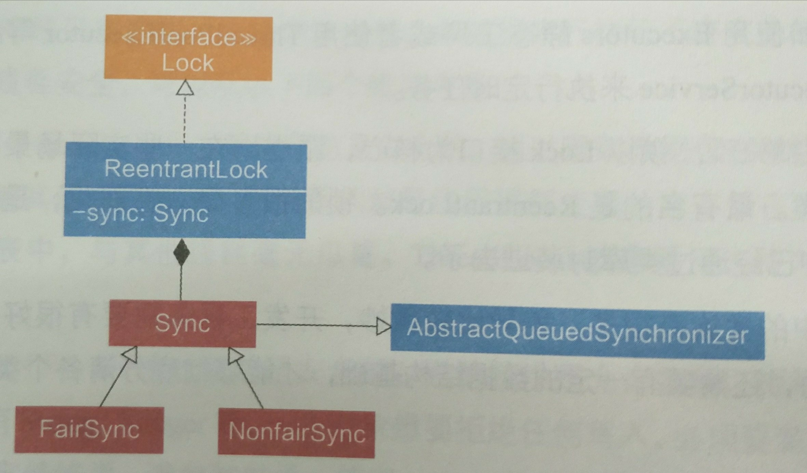

浅谈Java里的锁
-----
:star::star::star::star::star:

[TOC]


## 锁的本质

+ `互斥性`：  只有一个持有者
+ `不可见性`： 只有持有者才知道对变量做了那些修改

锁的本质其实就是加一个标记，每次去申请锁，先做read，可以得到就占有，保证资源被线性占用。


### 锁的优化原则：

+ `粒度尽量小`：能锁对象就不要锁类，能锁代码块就不要锁方法。
+ `时间要短`：尽量不要占用锁做耗时的操作。

## CAS操作

+ 具有volatile 的读写语义：一致性

```c {}
/** 伪代码
 * CAS 由JVM保证是原子的，不可切分，不存在中间状态
 * 
 * - memoryVar 内存中的值
 * - predictVar 预计内存中应该是什么值
 * - newVar 要设置到内存的值
 */
void CAS(void *memoryVar,int predictVar,int newVar){
    // 如果内存中的值 和上次看到的一致，说明这期间没被修改，写入
    if(*memoryVar==predictVar){
        *memoryVar=newVar;
    }
}
```
## volatile 
* 可见性
	- 当一个线程修改变量后，新值对其他变量是可立即得知的
		- 每次使用都必须重新从主内存装载
		- 每次修改都必须立即写入主内存
* 禁止指令重排序


### volatile实战：线程安全的单例


```java
public class Singleton {

    private volatile static Singleton instance;

    private Singleton() { }

    public static Singleton getInstance(){
        if(instance==null){
            synchronized (Singleton.class){
                if(instance==null){
                    instance=new Singleton();
                }
            }
        }
        return  instance;
    }

    public static void main(String[] args) {
        Singleton.getInstance();
    }
}
```


## 乐观锁和悲观锁

### 悲观锁

总是`假设最坏`的情况，每次去拿数据的时候都认为别人会修改，所以每次在拿数据的时候都会上锁，这样别人想拿这个数据就会阻塞直到它拿到锁（共享资源每次只给一个线程使用，其它线程阻塞，用完后再把资源转让给其它线程）。传统的关系型数据库里边就用到了很多这种锁机制，比如`行锁`，`表锁`等，`读锁`，`写锁`等，都是在做操作之前先上锁。Java中`synchronized`和`ReentrantLock`等独占锁就是悲观锁思想的实现。


### 乐观锁
总是假设最好的情况，每次去拿数据的时候都认为别人不会修改，所以不会上锁，但是在更新的时候会判断一下在此期间别人有没有去更新这个数据，可以使用`版本号机制`和`CAS算法`实现。乐观锁适用于`多读`的应用类型，这样可以提高吞吐量，像数据库提供的类似于write_condition机制，其实都是提供的乐观锁。在Java中`java.util.concurrent.atomic`包下面的原子变量类就是使用了乐观锁的一种实现方式CAS实现的。


+ `乐观锁`适用于`写比较少`的情况下（多读场景）
+ 一般`多写`的场景下用`悲观锁`就比较合适。


乐观锁常见的两种实现方式：

+ 版本号机制
+ CAS


#### 版本号机制
一般是在数据表中加上一个数据版本号version字段，表示数据被修改的次数，当数据被修改时，version值会加一。当线程A要更新数据值时，在读取数据的同时也会读取version值，在提交更新时，若刚才读取到的version值为当前数据库中的version值相等时才更新，否则重试更新操作，直到更新成功。


#### 乐观锁的缺点:
+ ABA问题
+ 循环时间长开销大,自旋CAS（也就是不成功就一直循环执行直到成功）如果长时间不成功，会给CPU带来非常大的执行开销。
+ 只能保证一个共享变量的原子操作


> 如果一个变量V初次读取的时候是A值，并且在准备赋值的时候检查到它仍然是A值，那我们就能说明它的值没有被其他线程修改过了吗？很明显是不能的，因为在这段时间它的值可能被改为其他值，然后又改回A，那CAS操作就会误认为它从来没有被修改过。这个问题被称为CAS操作的 “ABA”问题

> 从 JDK 1.5开始，提供了AtomicReference类来保证引用对象之间的原子性，可以把多个变量放在一个对象里来进行 CAS 操作.所以我们可以使用锁或者利用AtomicReference类把多个共享变量合并成一个共享变量来操作。


> 简单的来说CAS适用于写比较少的情况下（多读场景，冲突一般较少），synchronized适用于写比较多的情况下（多写场景，冲突一般较多）

#### CAS与synchronized的使用情景

对于资源竞争较少（线程冲突较轻）的情况，使用synchronized同步锁进行线程阻塞和唤醒切换以及用户态内核态间的切换操作额外浪费消耗cpu资源；而CAS基于硬件实现，不需要进入内核，不需要切换线程，操作自旋几率较少，因此可以获得更高的性能。

对于资源竞争严重（线程冲突严重）的情况，CAS自旋的概率会比较大，从而浪费更多的CPU资源，效率低于synchronized。

补充： Java并发编程这个领域中synchronized关键字一直都是元老级的角色，很久之前很多人都会称它为 “重量级锁” 。但是，在JavaSE 1.6之后进行了主要包括为了减少获得锁和释放锁带来的性能消耗而引入的 偏向锁 和 轻量级锁 以及其它各种优化之后变得在某些情况下并不是那么重了。synchronized的底层实现主要依靠 Lock-Free 的队列，基本思路是 自旋后阻塞，竞争切换后继续竞争锁，稍微牺牲了公平性，但获得了高吞吐量。在线程冲突较少的情况下，可以获得和CAS类似的性能；而线程冲突严重的情况下，性能远高于CAS。

[面试必备之乐观锁与悲观锁](https://blog.csdn.net/qq_34337272/article/details/81072874)

## AQS:AbstractQueuedSynchronizer


+ 一个Java提高的底层同步工具类，用一个int类型的变量state表示同步状态，并提供了一系列的`CAS`操作来管理这个同步状态。


AQS的主要作用是为Java中的并发同步组件提供统一的底层支持，例如`ReentrantLock`，`CountdowLatch`就是基于`AQS`实现的，用法是通过继承AQS实现其模版方法，然后将子类作为同步组件的内部类。


> Provides a framework for implementing blocking locks and related synchronizers (semaphores, events, etc) that rely on first-in-first-out (FIFO) wait queues.  This class is designed to be a useful basis for most kinds of synchronizers that rely on a single atomic {@code int} value to represent state. Subclasses must define the protected methods that change this state, and which define what that state means in terms of this object being acquired or released.  Given these, the other methods in this class carry out all queuing and blocking mechanics. Subclasses can maintain other state fields, but only the atomically updated {@code int} value manipulated using methods {@link #getState}, {@link #setState} and {@link #compareAndSetState} is tracked with respect to synchronization.

+ 基于`FIFO`等待队列，提供一个框架来实现阻塞锁和相关的同步器(信号量semaphores，events）。
+ 此类基于一个 `volatile` 的`state`，被设计成多数同步类的一个`基础组件`
+ 子类必须重写 改变state 的protected 方法，并且定义 获取和释放这个对象的`意义`。（AQS 并没有强制规定含义）

基于这些，该类的其他方法主要执行阻塞和排队的逻辑。


子类可以维护其他的状态属性，但是只有 使用`getState` 和 `compareAndSetState` 原子地更新，才被视为同步。


>  Subclasses should be defined as non-public internal helper classes that are used to implement the synchronization properties of their enclosing class.  Class {@code AbstractQueuedSynchronizer} does not implement any synchronization interface.  Instead it defines methods such as {@link #acquireInterruptibly} that can be invoked as appropriate by concrete locks and related synchronizers to implement their public methods.

子类应该定义 不对外的内部子类，用它实现 封闭类的同步属性。AQS 没有实现任何同步接口。


```java

public abstract class AbstractQueuedSynchronizer
    extends AbstractOwnableSynchronizer
    implements java.io.Serializable {
    /**
     * The synchronization state.
     */
    private volatile int state;

    /**
     * 如果内存中的值和期待的一致，更新。
     * CAS 的内存语义：read and write
     */
    protected final boolean compareAndSetState(int expect, int update) {
        // See below for intrinsics setup to support this
        return unsafe.compareAndSwapInt(this, stateOffset, expect, update);
    }

    /**
     *  这里是volatile 的，可见性哦
     */
    protected final int getState() {
        return state;
    }
}
```


## synchronized


+ `互斥同步`，对同一线程`可重入`
+ 涉及到阻塞和唤醒线程的系统调用，`系统变态`需要耗费CPU,属于`重量级操作`
+ 由`JVM负责实现`，JVM 底层通过监视锁来实现synchronized,对应的字节码指令：monitorenter，monitorexit


监视锁： 对象的隐藏字段，线程进入同步方法或同步代码块时，线程会获取该方法或代码块所属对象的monitor,进行加锁判断。成功，则本线程称为 此monitor的唯一持有者，monitor在释放前不能被其他线程获取。


$monitor==0$：线程可以持有monitor
$monitor>0$ ：并且持有者是本线程，monitor++
$monitor>0$ ：并且持有者不是本线程，等待锁。

```java
monitorenter(threadId){
    while(monitor!=0&&object.threadId!=threadId){
        //锁不是自己的
        waitForMonitor();
    }
    if(monitor==0){
        monitor=1;
        object.threadId=threadId;
    }else if(monitor!=0&&object.threadId==threadId){
        //锁是自己的
        monitor++;
    }
}

```


JDK1.6 以后，synchronized 提供三种锁的实现：偏向锁，轻量级锁，重量级锁


### 偏向锁


偏向锁：JVM 利用CAS 在对象头上设置ThreadID,表示这个对象偏向于当前线程。偏向锁可以降低无竞争开销，它不是互斥锁，不存在线程竞争，省去再次判断的步骤，提高了性能。


```java

// 偏向锁伪代码
if(obejct.threadID==null){
    // 第一次访问，偏向这个线程,object.threadID=currentThreadID
    CAS(object.threadID,currentThreadID);
}else if(object.threadID==currentThreadID){
    // 本线程已经拥有轻量级锁，不需要重新获取锁
}else{
    // 锁竞争，升级为轻量级锁
}
```


### 轻量级锁


依据：**绝大多的锁，在整个同步周期内都是不存在竞争的。**

轻量级锁使用`CAS`避免了使用互斥量的开销。


object header的组成: 
+ Mark Word: 对象运行时数据
+ 指向方法区对应类的指针
+ 数组长度（只有是数组类型才有）


Mark Word 有2bit 存储锁的状态：
+ 01 未锁定,可偏向
+ 00 轻量级锁
+ 10 膨胀，重量级锁
+ 11 GC标记

过程：

1. JVM在当前线程的栈帧建立一个锁记录（Lock Record）用于存储Mark Word 的拷贝，记为 `Display Mark Word`


2. `CAS 操作`尝试 把对象头的`Mark Word` 指向到`DisPlay Word`, 如果成功，锁标记改为00,加锁成功
    + 如果失败，但Mark Word 指向了`Display Mark Word`, 表示已拥有锁，继续
    + 失败，`Mark Word` 不指向`DMW`,意味着锁被其他线程抢占，膨胀为重量级锁


###重量级锁

+ 传统的锁，使用互斥量


### 锁膨胀流程图
锁膨胀示意图，建议下载原图去看：


参考：
+ 《深入理解Java虚拟机 第二版》

## ReentrantLock: 可重入锁




ReentrantLock 实现Lock接口，组合了Sync，Sync继承自AQS, AQS中定义了volatile 类型的state。AQS.state在不同子类中具体用法不同。在ReetrantLock中，规则如下：
```java
// 算法伪代码
lock(){
    if(state==0){
        getLock();
        state=1;
    }else if(isMyLock()){
        //本来就获取了锁，可重入，所以增加,释放的时候也是一层层减少
        state++;
    }else{
        // 自己没有获得锁，并且锁已经被抢占了，要等待
        waitForLok();
    }
}
```


### 实例：ReentrantLock 公平锁

```java {.line-numbers}
    // 公平锁
    final Lock lock = new ReentrantLock(true);
    final Condition notFull = lock.newCondition();
    final Condition notEmpty = lock.newCondition();
```


## synchronized和ReentrantLock 比较

+ 对象：
    + synchronized: 单锁，一次锁一个，嵌套锁来实现复合锁容易导致死锁
    + ReentrantLock: 可重入锁， 支持同时锁住多个对象
+ 公平：
    + synchronized: 不公平
    + ReentrantLock 
        + 支持公平锁，默认不公平
        + 按照加锁的时间
+ 级别
    + synchronized 是关键字，底层JVM 在字节指令上负责保证
    + ReentrantLock 是类级别，提供了诸如{查询请求锁的次数}等操作，更加灵活
+ 效率
    + synchronized JDK1.7 之前比ReentrantLock 差，1.7或之后效率明显提高
    + 大多数情况下，应当优先考虑synchronized


## 分布式环境下的锁


### CAP原则
> 任何一个分布式系统都无法同时满足一致性（Consistency）、可用性（Availability）和分区容错性（Partition tolerance），最多只能同时满足两项。

+ 一致性（C）：在分布式系统中的所有数据备份，在同一时刻是否同样的值。（等同于所有节点访问同一份最新的数据副本）
+ 可用性（A）：在集群中一部分节点故障后，集群整体是否还能响应客户端的读写请求。（对数据更新具备高可用性）
+ 分区容错性（P）：以实际效果而言，分区相当于对通信的时限要求。系统如果不能在时限内达成数据一致性，就意味着发生了分区的情况，必须就当前操作在C和A之间做出选择。

在互联网领域的绝大多数的场景中，都需要牺牲强一致性来换取系统的高可用性，系统往往只需要保证最终一致性。


### 分布式锁

+ 当在分布式模型下，数据只有一份（或有限制），此时需要利用锁的技术控制某一时刻修改数据的进程数。

+ 与单机模式下的锁不仅需要保证进程可见，还需要考虑进程与锁之间的`网络问题`。（网络的延时和不可靠）

+ 分布式锁还是可以将标记存在内存，只是该内存不是某个进程分配的内存而是`公共内存`如 Redis、Memcache。至于利用数据库、文件等做锁与单机的实现是一样的，只要保证标记能互斥就行。


### 分布式锁的要求

+ 可以保证在分布式部署的应用集群中，`至多只有一个线程拥有锁`。
+ 锁应该是`可重入的`
+ 公平锁和阻塞锁的实现是有必要的
+ 获取锁和释放锁是高可用的


### 基于数据库做分布式锁


+ 基于表主键唯一做分布式锁
+ 基于表字段版本号做分布式锁
+ 基于数据库排他锁做分布式锁


优点：简单，易于理解；
缺点：操作数据库的开销需要考虑

### 基于 Redis 的分布式锁


#### 基于 SETNX、EXPIRE方法

+ setnx(key,value)： SET if Not Exists，该方法是原子的，如果 key 不存在，则设置当前 key 成功，返回 1；如果当前 key 已经存在，则设置当前 key 失败，返回 0。这里不能设置超时时间。


+ expire()： 设置超时时间，避免死锁

加锁步骤：
1. setnx(lockkey, 1) 如果返回 0，则说明占位失败；如果返回 1，则说明占位成功
2. expire() 命令对 lockkey 设置超时时间，为的是避免死锁问题。
3. 执行完业务代码后，可以通过 delete 命令删除 key。

bug:1-2 之间出现客户端宕机，导致死锁。

```java
    /**
     * 加锁
     * @param key redis key
     * @param expire 过期时间，单位秒
     * @return true:加锁成功，false，加锁失败
     */
    public static boolean lock(String key, int expire) {

        RedisService redisService = SpringUtils.getBean(RedisService.class);
        long status = redisService.setnx(key, "1");

        if(status == 1) {
            redisService.expire(key, expire);
            return true;
        }

        return false;
    }
    public static void unLock1(String key) {
        RedisService redisService = SpringUtils.getBean(RedisService.class);
        redisService.del(key);
    }
```


### 基于 REDIS 的 SETNX、GET、GETSET方法


getset(key，value): 先get后set，


1. setnx(lockkey, value=current+timeout)，如果返回 1，则获取锁成功；如果返回 0 则没有获取到锁。
2. get(lockkey) 获取值 oldExpireTime ，并将这个 value 值与当前的系统时间进行比较，如果小于当前系统时间，则认为这个锁已经超时，可以允许别的请求重新获取。
3. 计算 newExpireTime = current+timeout，getset(lockkey, newExpireTime) 会返回当前 lockkey 的值currentExpireTime。
4. 判断 currentExpireTime 与 oldExpireTime 是否相等，如果相等，说明当前 getset 设置成功，获取到了锁。如果不相等，说明这个锁又被别的请求获取走了，那么当前请求可以直接返回失败，或者继续重试。
5. 在获取到锁之后，当前线程可以开始自己的业务处理，当处理完毕后，比较自己的处理时间和对于锁设置的超时时间，如果小于锁设置的超时时间，则直接执行 delete 释放锁；如果大于锁设置的超时时间，则不需要再锁进行处理。

```java
    /**
     * 加锁
     * @param key redis key
     * @param expire 过期时间，单位秒
     * @return true:加锁成功，false，加锁失败
     */
    public static boolean lock2(String key, int expire) {

        RedisService redisService = SpringUtils.getBean(RedisService.class);

        long value = System.currentTimeMillis() + expire;
        long status = redisService.setnx(key, String.valueOf(value));

        if(status == 1) {
            return true;
        }
        long oldExpireTime = Long.parseLong(redisService.get(key, "0"));
        if(oldExpireTime < System.currentTimeMillis()) {
            //超时
            long newExpireTime = System.currentTimeMillis() + expire;
            long currentExpireTime = Long.parseLong(redisService.getSet(key, String.valueOf(newExpireTime)));
            if(currentExpireTime == oldExpireTime) {
                return true;
            }
        }
        return false;
    }
    public static void unLock2(String key) {    
        RedisService redisService = SpringUtils.getBean(RedisService.class);    
        long oldExpireTime = Long.parseLong(redisService.get(key, "0"));   
        if(oldExpireTime > System.currentTimeMillis()) {        
            redisService.del(key);    
        }
   }
```


#### 基于 REDLOCK 的分布式锁


Redlock 是 Redis 的作者 antirez 给出的集群模式的 Redis 分布式锁，它基于 N 个完全独立的 Redis 节点（N%2=1）。

1. 客户端获取当前时间，以毫秒为单位。
2. 客户端尝试获取 N 个节点的锁，（每个节点获取锁的方式和前面说的缓存锁一样），N 个节点以相同的 key 和 value 获取锁。客户端需要设置接口访问超时，接口超时时间需要远远小于锁超时时间，比如锁自动释放的时间是 10s，那么接口超时大概设置 5-50ms。这样可以在有 redis 节点宕机后，访问该节点时能尽快超时，而减小锁的正常使用。
3. 客户端计算在获得锁的时候花费了多少时间，方法是用当前时间减去在步骤一获取的时间，只有客户端获得了超过 半数个节点的锁，而且获取锁的时间小于锁的超时时间，客户端才获得了分布式锁。
4. 客户端获取的锁的时间为设置的锁超时时间减去3计算出的获取锁花费时间。
5. 如果客户端获取锁失败了，客户端会依次删除所有的锁。


使用 Redlock 算法，可以保证在挂掉最多不超过半数个节点的时候，分布式锁服务仍然能工作，这相比之前的数据库锁和缓存锁大大提高了可用性，由于 redis 的高效性能，分布式缓存锁性能并不比数据库锁差。


优点： 性能高
缺点：

失效时间设置多长时间为好？如何设置的失效时间太短，方法没等执行完，锁就自动释放了，那么就会产生并发问题。如果设置的时间太长，其他获取锁的线程就可能要平白的多等一段时间。


#### 基于 REDISSON

redisson 是 redis 官方的分布式锁组件。GitHub 地址：https://github.com/redisson/redisson

上面的这个问题 ——> 失效时间设置多长时间为好？这个问题在 redisson 的做法是：每获得一个锁时，只设置一个很短的超时时间，同时起一个线程在每次快要到超时时间时去刷新锁的超时时间。在释放锁的同时结束这个线程。


### 基于 ZooKeeper 的分布式锁

ZOOKEEPER 锁相关基础知识：

+ zk 一般由多个节点构成（单数），采用 zab 一致性协议。因此可以将 zk 看成一个单点结构，对其修改数据其内部自动将所有节点数据进行修改而后才提供查询服务。
+ zk 的数据以目录树的形式，每个目录称为 znode， znode 中可存储数据（一般不超过 1M），还可以在其中增加子节点。
+ 子节点有三种类型。序列化节点，每在该节点下增加一个节点自动给该节点的名称上自增。临时节点，一旦创建这个 znode 的客户端与服务器失去联系，这个 znode 也将自动删除。最后就是普通节点。
+ Watch 机制，client 可以监控每个节点的变化，当产生变化会给 client 产生一个事件。


#### ZK 基本锁

原理：利用`临时节点`与 `watch 机制`。每个锁占用一个普通节点 /lock，当需要获取锁时在 /lock 目录下创建一个临时节点，创建成功则表示获取锁成功，失败则 watch/lock 节点，有删除操作后再去争锁。临时节点好处在于当进程挂掉后能自动上锁的节点自动删除即取消锁。

缺点：所有取锁失败的进程都监听父节点，很容易发生羊群效应，即当释放锁后所有等待进程一起来创建节点，并发量很大。

#### ZK 锁优化

原理：上锁改为创建临时有序节点，每个上锁的节点均能创建节点成功，只是其序号不同。只有序号最小的可以拥有锁，如果这个节点序号不是最小的则 watch 序号比本身小的前一个节点 (公平锁)。
步骤：
1. 在 /lock 节点下创建一个有序临时节点 (EPHEMERAL_SEQUENTIAL)。
2. 判断创建的节点序号是否最小，如果是`最小则获取锁成功`。不是则取锁失败，然后 watch 序号比本身小的前一个节点。
3. 当取锁失败，设置 watch 后则等待 watch 事件到来后，再次判断是否序号最小。
4. 取锁成功则执行代码，最后释放锁（删除该节点）。


```java
public class DistributedLock implements Lock, Watcher{
    private ZooKeeper zk;
    private String root = "/locks";//根
    private String lockName;//竞争资源的标志
    private String waitNode;//等待前一个锁
    private String myZnode;//当前锁
    private CountDownLatch latch;//计数器
    private int sessionTimeout = 30000;
    private List<Exception> exception = new ArrayList<Exception>();

    /**
     * 创建分布式锁,使用前请确认config配置的zookeeper服务可用
     * @param config 127.0.0.1:2181
     * @param lockName 竞争资源标志,lockName中不能包含单词lock
     */
    public DistributedLock(String config, String lockName){
        this.lockName = lockName;
        // 创建一个与服务器的连接
        try {
            zk = new ZooKeeper(config, sessionTimeout, this);
            Stat stat = zk.exists(root, false);
            if(stat == null){
                // 创建根节点
                zk.create(root, new byte[0], ZooDefs.Ids.OPEN_ACL_UNSAFE,CreateMode.PERSISTENT);
            }
        } catch (IOException e) {
            exception.add(e);
        } catch (KeeperException e) {
            exception.add(e);
        } catch (InterruptedException e) {
            exception.add(e);
        }
    }

    /**
     * zookeeper节点的监视器
     */
    public void process(WatchedEvent event) {
        if(this.latch != null) {
            this.latch.countDown();
        }
    }

    public void lock() {
        if(exception.size() > 0){
            throw new LockException(exception.get(0));
        }
        try {
            if(this.tryLock()){
                System.out.println("Thread " + Thread.currentThread().getId() + " " +myZnode + " get lock true");
                return;
            }
            else{
                waitForLock(waitNode, sessionTimeout);//等待锁
            }
        } catch (KeeperException e) {
            throw new LockException(e);
        } catch (InterruptedException e) {
            throw new LockException(e);
        }
    }

    public boolean tryLock() {
        try {
            String splitStr = "_lock_";
            if(lockName.contains(splitStr))
                throw new LockException("lockName can not contains \\u000B");
            //创建临时子节点
            myZnode = zk.create(root + "/" + lockName + splitStr, new byte[0], ZooDefs.Ids.OPEN_ACL_UNSAFE,CreateMode.EPHEMERAL_SEQUENTIAL);
            System.out.println(myZnode + " is created ");
            //取出所有子节点
            List<String> subNodes = zk.getChildren(root, false);
            //取出所有lockName的锁
            List<String> lockObjNodes = new ArrayList<String>();
            for (String node : subNodes) {
                String _node = node.split(splitStr)[0];
                if(_node.equals(lockName)){
                    lockObjNodes.add(node);
                }
            }
            Collections.sort(lockObjNodes);
            System.out.println(myZnode + "==" + lockObjNodes.get(0));
            if(myZnode.equals(root+"/"+lockObjNodes.get(0))){
                //如果是最小的节点,则表示取得锁
                return true;
            }
            //如果不是最小的节点，找到比自己小1的节点
            String subMyZnode = myZnode.substring(myZnode.lastIndexOf("/") + 1);
            waitNode = lockObjNodes.get(Collections.binarySearch(lockObjNodes, subMyZnode) - 1);
        } catch (KeeperException e) {
            throw new LockException(e);
        } catch (InterruptedException e) {
            throw new LockException(e);
        }
        return false;
    }

    public boolean tryLock(long time, TimeUnit unit) {
        try {
            if(this.tryLock()){
                return true;
            }
            return waitForLock(waitNode,time);
        } catch (Exception e) {
            e.printStackTrace();
        }
        return false;
    }

    private boolean waitForLock(String lower, long waitTime) throws InterruptedException, KeeperException {
        Stat stat = zk.exists(root + "/" + lower,true);
        //判断比自己小一个数的节点是否存在,如果不存在则无需等待锁,同时注册监听
        if(stat != null){
            System.out.println("Thread " + Thread.currentThread().getId() + " waiting for " + root + "/" + lower);
            this.latch = new CountDownLatch(1);
            this.latch.await(waitTime, TimeUnit.MILLISECONDS);
            this.latch = null;
        }
        return true;
    }

    public void unlock() {
        try {
            System.out.println("unlock " + myZnode);
            zk.delete(myZnode,-1);
            myZnode = null;
            zk.close();
        } catch (InterruptedException e) {
            e.printStackTrace();
        } catch (KeeperException e) {
            e.printStackTrace();
        }
    }

    public void lockInterruptibly() throws InterruptedException {
        this.lock();
    }

    public Condition newCondition() {
        return null;
    }

    public class LockException extends RuntimeException {
        private static final long serialVersionUID = 1L;
        public LockException(String e){
            super(e);
        }
        public LockException(Exception e){
            super(e);
        }
    }
}
```

优点：
有效的解决单点问题，不可重入问题，非阻塞问题以及锁无法释放的问题。实现起来较为简单。

缺点：
性能上可能并没有缓存服务那么高，因为每次在创建锁和释放锁的过程中，都要动态创建、销毁临时节点来实现锁功能。ZK 中创建和删除节点只能通过 Leader 服务器来执行，然后将数据同步到所有的 Follower 机器上。还需要对 ZK的原理有所了解。


### 基于 Consul 做分布式锁

DD 写过类似文章，其实主要利用 Consul 的 Key / Value 存储 API 中的 acquire 和 release 操作来实现。

> Consul is a distributed service mesh to connect, secure, and configure services across any runtime platform and public or private cloud


参考:

+ [基于Consul的分布式锁实现](http://blog.didispace.com/spring-cloud-consul-lock-and-semphore/)
+ [Java分布式锁看这篇就够了](https://www.cnblogs.com/seesun2012/p/9214653.html)