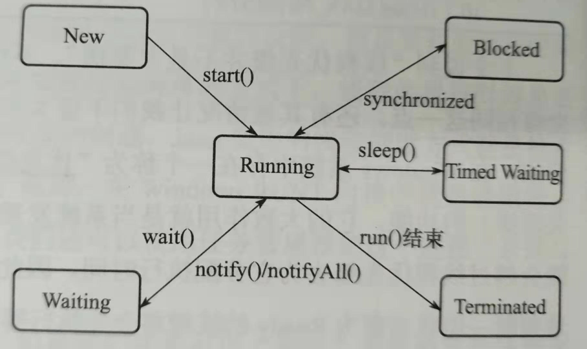

[TOC]


> 正确的编程方法：首先使代码正确运行，然后再提高代码的速度。


## JMM: Java Memory Model


根据JMM的设计，系统存在一个`主内存`(Main Memory)，Java中所有变量都储存在主存中，对于所有线程都是共享的。每条线程都有自己的`工作内存`(Working Memory)，工作内存中保存的是主存中某些变量的拷贝，线程对所有变量的操作都是在工作内存中进行，线程之间无法相互直接访问，变量传递均需要通过主存完成。


## 线程状态



### wait方法和sleep方法的区别


sleep:

+ Thread 的static native 方法
+ 让线程进入睡眠状态,一段时间后自动醒来。`不释放锁`，Thread.sleep(0) 触发操作系统重新进行新一轮 cpu竞争
+ sleep的过程中过程中有可能被其他对象调用它的interrupt(),产生InterruptedException异常
+ 可以在任何地方使用

wait:
+ Object 的 native方法，非静态；
+ 如果线程拥有某个或某些对象的同步锁，那么在调用了wait()后，这个线程就会释放它持有的所有同步资源，而不限于这个被调用了wait()方法的对象。
+ 在wait的过程中有可能被其他对象调用interrupt()方法而产生  InterruptedException
+ 必须要采用`notify()`和`notifyAll()`方法唤醒该进程；
+ wait，notify和notifyAll只能在`同步控制方法`或者`同步控制块`里面使用


---

+ `系统变态`需要消耗大量CPU,用户态到内核态，再回来用户态


### yield方法 和join方法

暂停当前正在执行的线程对象。  

yield()方法是停止当前线程，`让同等优先权的线程或更高优先级的线程有执行的机会`。如果没有的话，那么yield()方法将不会起作用，并且由可执行状态后马上又被执行。   

join方法是用于在某一个线程的执行过程中调用另一个线程执行，`等到被调用的线程执行结束`后，再继续执行当前线程。如：t.join();主要用于等待t线程运行结束，若无此句，main则会执行完毕，导致结果不可预测。

### 为什么使用wait()方法时，一般是需要while循环而不是if？

```java
while(!执行条件） {
    wait();
}
....


if(!执行条件） {
    wait();
}
....
```
用notify() 和notifyAll()可以唤醒线程，一般常用的是notifyAll()。notify()只会随机唤醒一个睡眠线程，并不一定是我们想要唤醒的线程。如果使用notifyAll()唤醒所有的线程，又怎么知道他想唤醒的是哪个正在等待的wait()线程呢，如果用while()方法，就会再次判断条件是不是成立，满足执行条件了，就会接着执行，而if会直接唤醒wait()方法，继续往下执行，根本不管这个notifyAll()是不是想唤醒的是自己还是别人，可能此时if的条件根本没成立。

参考：
+ [Java中wait和sleep方法的区别](https://www.cnblogs.com/loren-Yang/p/7538482.html)


## 常见创建线程的三种方式：

```java{.line-numbers}

    //1. Thread方式
    MyThread thread=new MyThread();
    thread.start();
/////////////////////////////////////////////////////

    //2. Runnable
    Runnable runnable=new Runnable() {
        @Override
        public void run() {

            for(int i=0;i<100;++i){
                System.out.println(Thread.currentThread().getName()+Thread.currentThread().getId()+"---"+i);

            }

        }
    };
    new Thread(runnable).start();
/////////////////////////////////////////////////
        //3. Callable
        Callable<Integer> callable=new Callable<Integer>() {
            @Override
            public Integer call() throws Exception {

                for(int i=0;i<100;++i){
                    System.out.println(Thread.currentThread().getName()+Thread.currentThread().getId()+"---"+i);
                }
                return 15;
            }
        };

        FutureTask<Integer> futureTask=new FutureTask(callable);
        new Thread(futureTask).start();
        try {
            Integer rt = futureTask.get();
            System.out.println(rt);

        } catch (InterruptedException e) {
            e.printStackTrace();
        } catch (ExecutionException e) {
            e.printStackTrace();
        }
```


### Thread,Runnable,Callable的区别

+ 性质：
    + `Runnable`和`Callable`是接口
    + `Thread` 是类，`Thread` 实现了 `Runnable`	
+ 调用：
    + `Callable` 调用call()， 有`返回值`
    + `Runnable` 调用run()，Runnable `无返回值`
+ 异常：
    + call 可以`抛出异常`到拥有者线程，也就是异常可知
    + Thread和Runnable的`异常无法在父线程catch`,需要设置handler
+ Callable 可以得到一个返回`一次性任务FutureTask`对象,表示一次性的异步计算

### 接口和类的区别
+ 接口可以多implement,Java类只能单继承
+ 接口的Class文件中superClass是空的，而类的superClass只要不是Object就一定非空
+ 接口是不涉及实现的，所以对象的attributes中没有Code属性，而Class有


## 线程安全

什么是线程安全？

> 当多个线程访问某个类时，这个类始终都能表现出正确的行为，那么就称这个类是线程安全的。
>-- Java 并发编程实战

这里的正确性包括：

+ 不变性条件
    + 用于判断状态是有效的还是无效的，也就是状态的`状态空间`	

```	
如：long a ,a in [Long.MIN_VALUE,LONG.MAX_VALUE],
那么当a>Long.MAX_VALUE时，就不满足不变性条件
```
+ 后验条件
    + 判断`状态迁移是否有效`
    
>	如：两个属性定义满足：a+b=5;
    那么{a=2,b=3}就是有效状态，某个时刻出现{a=3,b=3}就是无效状态

这里其实Java并发编程关注的就是`共享对象的状态转换`。


> 线程安全类封装了必要的同步机制，因此客户端无须进一步采取同步措施


> 编写线程安全的代码，其核心在于要对状态操作进行管理，特别是对`共享的`和`可变的`状态的访问。


+ final:无状态的对象一定是线程安全的。
+ 线程间共享对象，实际上是`对象所有权的传递`，所有权属于唯一线程，就是线程安全的


封装线程安全类的一些手段：

+ 尽量使得属性是`final`的，因为无状态的对象一定是线程安全的。
+ 尽量不对外发布状态，因为发布后所有权的转移是不可控的。

```java{.line-numbers}
//反例：
    private List<Integer> myList=new ArrayList<>();

    public List getList(){
        
        //对外发布对象，外部可以得到内部对象的引用
        //    之后对这个list的操作不受本类控制，myList的所有权不可控
        return this.myList;
    }
```
```java{.line-numbers}
//正例
    private List<Integer> myList=new ArrayList<>();
    public List getList(){

        //拷贝一份
        ArrayList<Integer> list = new ArrayList<>();
        for(Integer i:myList){

            list.add(new Integer(i));
        }
        //拒绝修改
        return Collections.unmodifiableList(myList);
    }
```

+ `线程封闭`。保证只有一个线程在访问当前变量。最具体的表现就是方法中不对外发布的局部变量


+ `加锁`。其实是为了保证对象所有权在一个时间点只有一个线程能得到。
    + 独立的状态，单独加锁就好了
    + 组合的状态，状态的转换必须满足后验条件，必须用`同一把锁`来锁住。


```java{.line-numbers}
/**
 * 不变性条件: blood,lostBlood in [0,100]
 * 后验条件：blood+lostBlood=100
 */
public class Person {
    
    private int blood=100;
    private int lostBlood=0;

    public void injured(int k){
        //必须是同一把锁
        synchronized(this){
            blood-=k;
            lostBlood+=k;

        }
    }
}
```
+ 记得把类和其方法的`线程安全性写入文档`


### Servlet 

Servlet在非分布式环境下默认是单例的，可以配置为多实例。所以要注意它的线程安全问题。

+ 创建的时机：

    1. 第一次访问Servlet的时候创建 
    2. web服务器启动时创建

配置：
```xml
 <load-on-startup>1</load-on-startup>
```

+ 创建：tomcat等服务器


----


## ThreadLocal

ThreadLocal：线程局部变量


+ 提供线程本地变量
+ 从另一角度解决并发访问，锁是以时间换空间，ThreadLocal是以`空间换时间`
+ 一般是private static 属性，以此来关联线程的状态


```java
//一般我们都这么写。那背后发生了什么？跟踪一下代码
    private static ThreadLocal<Integer> state=new ThreadLocal<>();

```


### Weak Reference

Weak Reference: 弱引用，如果弱引用指向的对象`只有弱引用这一条线路`，则`下一次YGC时会被回收`。由于YGC的不确定性，弱引用何时被回收也具有`不确定性`。主要用于指向`易消失`的对象。调用WeakReference.get()可能返回null;


### 源码分析


ThreadLocalMap 是一个订制的HashMap,只适用于维护`线程封闭的变量`。 这个类是 package private的，所以允许声明为Thread类的属性，他们都属于java.lang包。

为了解决长寿大对象的使用，hash entries使用的是`WeakReferences`。但是由于引用队列没有被用到。只有表空间不足时才会删除旧的entry。

```java
public class ThreadLocal<T> {

    public ThreadLocal() {
        // 1. 构造函数什么都不干
    }

    /**
     * 返回当前thread 存放的变量，如果没有值，调用初始化方法返回null
     */
    public T get() {
        Thread t = Thread.currentThread();
        ThreadLocalMap map = getMap(t); // 2. 一开始这里为null
        if (map != null) {
        // ThreadLocalMap 里是<ThreadLocal,ThreadLocal.Entry>
            ThreadLocalMap.Entry e = map.getEntry(this);
            if (e != null) {
                @SuppressWarnings("unchecked")
                T result = (T)e.value;
                return result;
            }
        }
        return setInitialValue();// 3. 执行初始化
    }

    ThreadLocalMap getMap(Thread t) {
        return t.threadLocals;  // 2.1 Thread里保存了一个threadLocalMap 的属性
    }

    private T setInitialValue() {
        T value = initialValue();       // 初始化value=null
        Thread t = Thread.currentThread();
        ThreadLocalMap map = getMap(t);
        if (map != null)
            map.set(this, value);
        else
            createMap(t, value);//4. 需要创建map
        return value;
    }
    protected T initialValue() {
        return null;    // 相当于没初始化哇
    }

    void createMap(Thread t, T firstValue) {
        // 5. 这里 传入一个threadLocal,null，构造一个ThreadLocalMap
        //      要注意这里把ThreadLocalMap 注入到Thread 对象里了
        t.threadLocals = new ThreadLocalMap(this, firstValue);
    }

    static class ThreadLocalMap {

        /**
         * 用于存放 Entry 弱引用，必要时可以resize 
         * table.length MUST always be a power of two.
         */
        private Entry[] table;

        /**
         * Construct a new map initially containing (firstKey, firstValue).
         * ThreadLocalMaps 是懒构造的，只有第一次put进来的才会创建。
         */
        ThreadLocalMap(ThreadLocal<?> firstKey, Object firstValue){
            table = new Entry[INITIAL_CAPACITY];
            int i = firstKey.threadLocalHashCode & (INITIAL_CAPACITY - 1); // hash 一下，落到table
            table[i] = new Entry(firstKey, firstValue); //6. 在table[i]位置放置 要缓存的值，用Entry 封装
            size = 1;
            setThreshold(INITIAL_CAPACITY);
        }
        /**
         * 
         * 在这个hashmap,Entry 继承于WeakReference，一般使用它的主属性作为key。
         *   注意 当  entry.get()== null， 意味着key不再被引用，所以这个实体可以被从table里抹去。这样的entry 叫做“stale entries” 过时的实体。        
         */
        static class Entry extends WeakReference<ThreadLocal<?>> {
            /** ThreadLocal关联的对象  */
            Object value;
            // 这里k 就是正真的key， 当k 失去引用被GC，v 也会被gc
            Entry(ThreadLocal<?> k, Object v) {
                super(k);
                value = v;
            }
        }
```


每个线程有一个threadLocalMaps,里面维护一个Entry数组table来存放本线程的数据。当我们private static ThreadLocal<Integer> threadLocal时，threadLocal指向内存堆的 threadLocal实际地址；
```java

public class Thread implements Runnable {

    /**
     *  Thread 维护一个ThreadLocalMap 对象
     */
    ThreadLocal.ThreadLocalMap threadLocals = null;

```


整个流程：
1. 第一次put元素进去或者get，会触发threadLocal 新建一个threadLocalMap对象，并注入到当前Thread里。 

2. 然后以put为例，key就是 threadLocal,这时候会创建一个Entry对象，Entry[k,v]。k是虚引用，指向堆内存的threadLocal，v就是我们存入的Object。这时候堆内存的 threadLocal区域，存在两个指针指向这里，所以不会被回收。

3. 如果我们显示把threadLocal=null, 这时候堆内存的这块区域只剩下一个虚引用这条路， 下次YGC 清理 对应entry。

4. 另一种情况，如果 put一个v=null的entry，这时候这个entry叫做过时的entry。

### ThreadLocal 的隐患


+ `脏数据`：ThreadLocal 一般是static的类属性，在线程结束时，并不会断开引用，如果此线程被加入线程池，在下一次复用的时候将访问到上次的数据
+ `内存泄露`：栈内存的threadLocal 一直有static field 的强引用，那么利用弱引用机制来回收Entry就无法实现。如果不调用remove（），对应的value是不会释放的。


解决方案：每次调用完ThreadLocal,必须及时remove();

```java

public class ThreadLocal<T> {
    public void remove() {
        ThreadLocalMap m = getMap(Thread.currentThread());
        if (m != null)
            m.remove(this);
    }
    static class ThreadLocalMap {
        /**
         * Remove the entry for key.
         */
        private void remove(ThreadLocal<?> key) {
            Entry[] tab = table;
            int len = tab.length;
            int i = key.threadLocalHashCode & (len-1);
            for (Entry e = tab[i];
                 e != null;
                 e = tab[i = nextIndex(i, len)]) {
                if (e.get() == key) {
                    e.clear();
                    expungeStaleEntry(i);
                    return;
                }
            }
        }
        ...
    }
    ...
}
```


