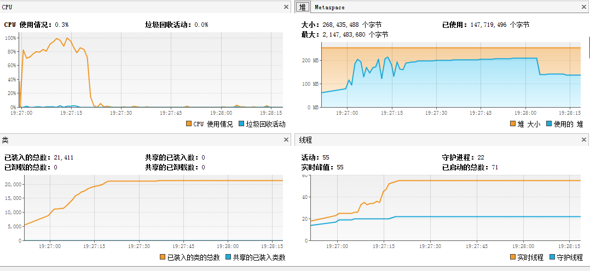
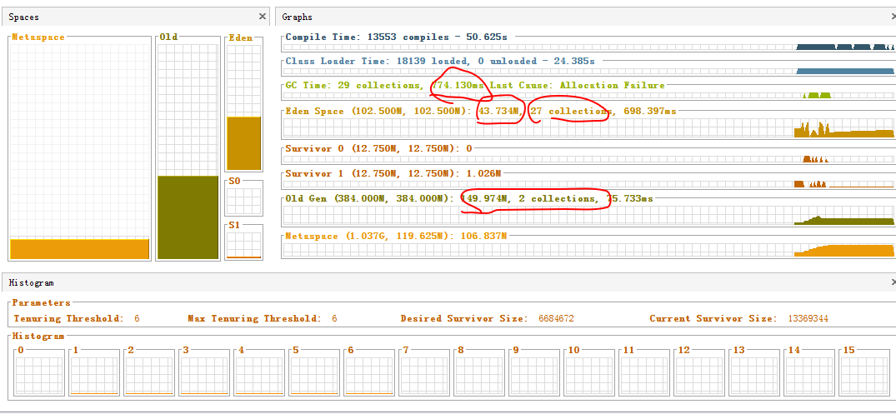
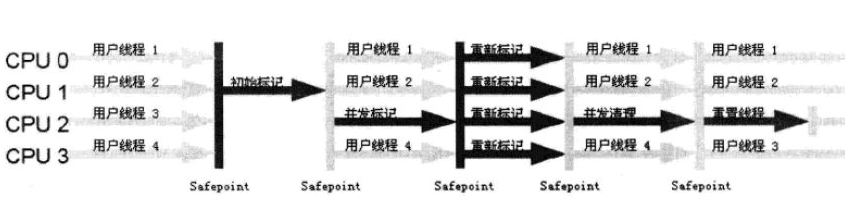

[TOC]


### 启动时间插件


为了检测启动时间，需要写一个插件来实现。
这边我写好了一个，基于jdk1.8 +eclipse Neon.3 Release (4.6.3)编写的插件下载：

下载完，将这个jar包拷贝到eclipse 的plugins 目录下。


如果读者不是1.8，或者eclipse版本不一致而不能使用，烦劳告知，然后可以参考：

[Eclipse简单插件开发-启动时间提示](https://www.cnblogs.com/mxm985/p/7203265.html)

[eclipse的插件开发-启动时间](http://www.bubuko.com/infodetail-2330186.html)

这两篇文章自己开发一个时间插件。


### 优化前

优化前：


这里就是39m ,无法忍受。

eclipse 安装目录下 eclipse.ini中启动参数配置如下：
```
-startup
plugins/org.eclipse.equinox.launcher_1.3.201.v20161025-1711.jar
--launcher.library
plugins/org.eclipse.equinox.launcher.win32.win32.x86_64_1.1.401.v20161122-1740
-product
org.eclipse.epp.package.jee.product
--launcher.defaultAction
openFile
-showsplash
org.eclipse.platform
--launcher.defaultAction
openFile
--launcher.appendVmargs
-vmargs
-Dosgi.requiredJavaVersion=1.8
-XX:+UseG1GC
-XX:+UseStringDeduplication
-Dosgi.requiredJavaVersion=1.8
-Xms256m
-Xmx1024m

```

```
-vm 
D:/surroundings/jdk1.8.0_131/bin/javaw.exe
-startup
...
```


- eclipse 启动时间:30144ms
再启动一遍，时间是30s左右了,多次启动，在28s 左右。



堆这一块暂时还好，没有扩展，那么就是Metaspace 这一块的问题了。


#### Metaspace 是什么呢？


JDK8以前，JVM 的数据区是这样的：


+ 红框框外面的方法区和Java堆是共享的
+ 方法区有个名字叫non-heap
>对于习惯在HotSpot 虚拟机上开发、部署程序的开发者来说，很多人都更愿意把方法区称为”永久代“，本质上两者不等价，仅仅是因为HotSpot虚拟机的设计团队选择把GC分代收集扩展至方法区，或者说使用永久代来实现方法区，这样HotSpot 的垃圾收集器可以像管理Java堆一样管理这部分内存，能够省去专门为方法区编写内存管理代码的工作。
...
>这样更容易遇到内存溢出问题（永久代有-XX:MaxPermSize 的上限，J9和JRockit 只要没有触碰到进程可用内存的上限，例如32位系统中的4GB，就不会出现问题）而且有极少数方法（例如String.intent（））会因为这个原因导致不同虚拟机下有不同的表现。
...
> <p align="right">深入理解Java虚拟机（第二版）</p>


#### 回顾一下方法区


- 各个线程共享
- 用于存储已被虚拟机加载的类信息、常量、静态变量、即时编译器编译后的代码等数据
- 这个区域的内存回收主要是针对常量池的回收和对类型的卸载。而字符串常量池在JDK1.7就被移出了。


从JDK8开始，永久代(PermGen)的概念被废弃掉了，取而代之的是一个称为Metaspace的存储空间。Metaspace使用的是本地内存，而不是堆内存，也就是说在默认情况下Metaspace的大小只与本地内存大小有关。可以通过以下的几个参数对Metaspace进行控制：

* -XX:MetaspaceSize，初始空间大小，达到该值就会触发垃圾收集进行类型卸载，同时GC会对该值进行调整：如果释放了大量的空间，就适当降低该值；如果释放了很少的空间，那么在不超过MaxMetaspaceSize时，适当提高该值。
* -XX:MaxMetaspaceSize，最大空间，默认是没有限制的。

除了上面两个指定大小的选项以外，还有两个与 GC 相关的属性：
* -XX:MinMetaspaceFreeRatio，在GC之后，最小的Metaspace剩余空间容量的百分比，减少为分配空间所导致的垃圾收集
* -XX:MaxMetaspaceFreeRatio，在GC之后，最大的Metaspace剩余空间容量的百分比，减少为释放空间所导致的垃圾收集


### 再来分析Metaspace 报告

然后回过头来分析我们的启动图，说明启动eclipse时加载大量的类，Metaspace初始内存太小，eclipse加载了多少类呢？至少所有插件都要吧，还有其他基本功能支持，这里也说明插件越多是会越卡的。


这边发现Metaspace 最后稳定在150M 下面，那干脆初始化给他这么多好了。


好像没啥卵用，那就限制一下最大值吧，毕竟没限制不是很好。
-XX:MaxMetaspaceSize=500m


### 取消字节码验证过程
Eclipse的编译代码一般来说是可靠的，所以就不需要在加载的时候在进行字节码验证了。
果然带来了巨大的性能提升。


### 看看GC


Minoc GC 也就0.9s，Full GC 还直接没有，那就无可挑剔了。

要不屏蔽一下System.gc()这个，万一eclipse调用了就无视他。

-XX:DisableExplicitGC

好像很久以前优化过，现在觉得survivour 给太多了，并且拒绝堆扩充

```
-Xms512m
-Xmx512m
-Xmn128m
```


```
-XX:+UseG1GC
```
这边默认我是配置了G1来做垃圾收集，换成ParNew+CMS看看：

```
-XX:+UserConcMarkSweepGC
-XX:+ParNewGC
```




#### 这边补充一下怎么看图


GC Time :29 collection,774.130ms Last Cause:Allocation Failure

+ 总GC时间：29次收集，774ms，最后一次收集原因：Allocation Failure。Eden区不够放，所以要触发一次Minor GC


+ Eden Space (102.500M, 102,500M):71.963M, 27 collections,698.397ms

Eden 区最大可分配102.500M，已分配102.500M，已用71.963M


+ 设置打印日志：

	* -XX:+PrintGCTimeStamps 打印GC停顿时间
	* -XX:+PrintGCDetails 打印GC详细信息
	* -verbose:gc			打印GC信息，被PrintGCDetails 包括了
	* -Xloggc:gc.log		指定文件


这边设置一下CMS在老年代被使用多少就触发一次垃圾收集：85%
- -XX:CMSInitiatingOccupancyFraction=85


#### 看GC日志去

打开GC日志：
```
-XX:+PrintGCTimeStamps
-XX:+PrintGCDetails
-Xloggc:gc.log

```


```

...

26.052: [GC (CMS Initial Mark) [1 CMS-initial-mark: 201921K(393216K)] 215802K(511232K), 0.0057104 secs] [Times: user=0.06 sys=0.00, real=0.01 secs] 
26.058: [CMS-concurrent-mark-start]
26.267: [CMS-concurrent-mark: 0.209/0.209 secs] [Times: user=0.73 sys=0.08, real=0.21 secs] 
26.267: [CMS-concurrent-preclean-start]
26.270: [CMS-concurrent-preclean: 0.003/0.003 secs] [Times: user=0.00 sys=0.00, real=0.00 secs] 
26.270: [CMS-concurrent-abortable-preclean-start]
27.552: [GC (Allocation Failure) 27.552: [ParNew: 118015K->13056K(118016K), 0.0507721 secs] 319937K->231818K(511232K), 0.0508436 secs] [Times: user=0.16 sys=0.00, real=0.05 secs] 
28.266: [CMS-concurrent-abortable-preclean: 1.573/1.995 secs] [Times: user=6.65 sys=0.72, real=1.99 secs] 
28.266: [GC (CMS Final Remark) [YG occupancy: 67278 K (118016 K)]28.266: [Rescan (parallel) , 0.0137578 secs]28.280: [weak refs processing, 0.0015506 secs]28.282: [class unloading, 0.0189432 secs]28.301: [scrub symbol table, 0.0233572 secs]28.324: [scrub string table, 0.0026839 secs][1 CMS-remark: 218762K(393216K)] 286040K(511232K), 0.0630204 secs] [Times: user=0.11 sys=0.00, real=0.06 secs] 
28.329: [CMS-concurrent-sweep-start]
28.372: [CMS-concurrent-sweep: 0.043/0.043 secs] [Times: user=0.08 sys=0.01, real=0.04 secs] 
28.372: [CMS-concurrent-reset-start]
28.373: [CMS-concurrent-reset: 0.000/0.000 secs] [Times: user=0.00 sys=0.00, real=0.00 secs] 
```


1. CMS Initial Mark ：初始标记，找到GC Roots，Stop the wrold,耗时0.0057104 s Times[]是详细时间。

```
26.052: [GC (CMS Initial Mark) [1 CMS-initial-mark: 201921K(393216K)] 215802K(511232K), 0.0057104 secs] [Times: user=0.06 sys=0.00, real=0.01 secs] 
```

2. CMS-concurrent-mark-start: 开始并发标记，并发标记就是根据GC Roots做可达性分析


```
26.058: [CMS-concurrent-mark-start]
26.267: [CMS-concurrent-mark: 0.209/0.209 secs] [Times: user=0.73 sys=0.08, real=0.21 secs] 
```
	CMS-concurrent-mark： 并发标记结束，耗0.209个cpu时间，0.209个墙钟时间
3. CMS-concurrent-preclean-start: 并发预清理，这边也就是重新标记,并发标记阶段，用户线程对引用的修改会记录在日志中，而在并发预清理阶段合并到GC Roots,也就是把并发标记阶段用户对引用的修改也考虑进来。

```
26.267: [CMS-concurrent-preclean-start]
26.270: [CMS-concurrent-preclean: 0.003/0.003 secs] [Times: user=0.00 sys=0.00, real=0.00 secs] 
```

4. CMS-concurrent-abortable-preclean-star：


据说：
>加入此阶段的目的是使cms gc更加可控一些，作用也是执行一些预清理，以减少Rescan阶段造成应用暂停的时间

不是很懂，求指教...

```
26.270: [CMS-concurrent-abortable-preclean-start]
...
28.266: [CMS-concurrent-abortable-preclean: 1.573/1.995 secs] [Times: user=6.65 sys=0.72, real=1.99 secs] 
```
中间插了一个Allocation Failure，PreNew 是新生代的事情，跳过


5. CMS-concurrent-sweep-start: 同步整理开始

```ini
28.329: [CMS-concurrent-sweep-start]
28.372: [CMS-concurrent-sweep: 0.043/0.043 secs] [Times: user=0.08 sys=0.01, real=0.04 secs] 
```


6. CMS-concurrent-reset-start 重置

	并发重置线程

```
28.372: [CMS-concurrent-reset-start]
28.373: [CMS-concurrent-reset: 0.000/0.000 secs] [Times: user=0.00 sys=0.00, real=0.00 secs] 
```
在本阶段，重新初始化CMS内部数据结构，以备下一轮 GC 使用。本阶段费时0.000秒


### 回顾一下CMS



- 以最短回收时间为目标。致力于响应速度,适合交互
- CMS：Concurrent Mark Sweep：并发标记清除，会产生碎片
- 老年代
- CPU 敏感
- 无法处理浮动垃圾，重新标记阶段会考虑并发标记阶段用户线程产生的垃圾，但是之后就无能为力。
	+ 用户线程并发导致：
		* 产生浮动垃圾
		* 需要内存空间，所以要设置		CMSInitiatingOccupancyFraction ，不能等老年代满了再触发回收
	+ 备用预案：Serial Old 


###总结

有没有觉得后面文笔都走理论了，好，回到调优eclipse，目前就调到：


比较弱，深入理解JVM的作者优化到了5s.也请大家支招。

+ 由于学识有限，纰漏难免，万望各位朋友指正。
+ 然后本文参考了很多大牛的文章，大家在看本文时，可以看一下这些文章。


###ref：

[了解 CMS 垃圾回收日志](http://ifeve.com/jvm-cms-log/)
[Java 1.8中的Metaspace总结](https://www.jianshu.com/p/8b308698a96c)
[jdk8 Metaspace 调优](https://blog.csdn.net/bolg_hero/article/details/78189621)
[Java8内存模型—永久代(PermGen)和元空间(Metaspace)](https://www.cnblogs.com/paddix/p/5309550.html)
[JDK8-废弃永久代（PermGen）迎来元空间（Metaspace）](https://www.cnblogs.com/yulei126/p/6777323.html)