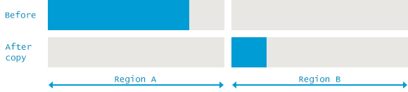
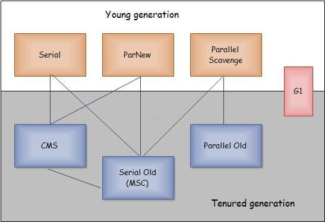
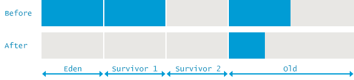
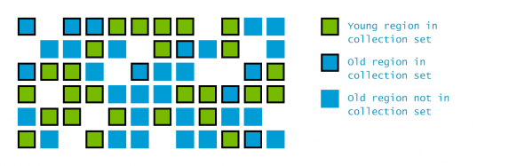

[TOC]


### 自动内存管理

+ 对象内存分配
+ 对象内存回收

### JVM GC策略

+ 对象优先在Eden区分配, 如果Eden区的闲置空间不足，将发起Minor GC
+ 大对象直接进入老年代
    + 朝生夕死的短命大对象是应该避免的
+ 长期存活的对象进入老年代
    + 对象年龄计数器：一次GC一岁
+ 动态年龄判断
    + Survivor区：同龄对象大小>Survivor 空间的一半，大于等于这个年龄的对象直接进入老年代
+ 空间分配担保：Minor GC前
    + 老年代最大可用连续空间> 新生代所有对象总空间：Minor 安全
    + 否则， HandlePromotionFailure 允许担保失败？
        + 允许：老年代最大可用连续空间>历次晋升到老年代的对象平均大小？
            + 有风险的尝试GC，失败后重新Full GC
        + 不允许：Full-GC
-XX:PretenureSizeThreshold: 大于这个值就在老年代分配，避免在新生代大量的内存复制
-XX:MaxTenuringThreshold: age>这个值就进入老年代

### GC 基本概念

#### 引用计数

如php，python等语言，容易造成环形引用，需要特殊的机制来处理。


#### Garbage Collection Roots：

+ 本地变量
+ 活动线程对应的变量
+ 静态属性
+ JNI references

#### JVM GC分为两步：

`Marking` is walking through all reachable objects, starting from GC roots and keeping a ledger in native memory about all such objects
`Sweeping` is making sure the memory addresses occupied by non-reachable objects can be reused by the next allocations.


#### Fragmenting and Compacting

+ 写操作需要花费更多的时间来寻找可用的块
+ 当碎片太多太小，将导致无法为大对象分配内存

为了避免内存碎片一发不可收拾，GC的同时JVM也做了内存碎片整理。可以理解为将可达对象全部移到紧挨在一起，减少碎片；


#### 分代管理

很多对象有以下特点：
+ 大多数的对象 创建完没多久就没用了
+ 大多数对象朝生夕灭

所以提出分代的概念：

+ 年轻代: Young Generation
+ 老年代:Old Generation(Tenured)

##### 分区的优点
+ 针对不同区`采用不同的回收策略` 
+ 新生代采用copy算法,老年代如CMS采用标记清除


##### 分代的缺点：

+ 不同代之间的对象会`互相引用`，GC时需要计入实际的GC root.
+ JVM由于对 朝生夕死和近乎不死的对象做了优化，对于`中等寿命的对象`表现得很差


#### Eden

Eden : 对象被创建就默认放Eden。一般多线程会同时创建多个对象，Eden被切分为更多的Thread Local Allocation Buffer (TLAB for short) 。这个buffer允许将大多数对象分配在线程对应的TLAB里，避免了昂贵的线程同步。

1. Eden的TLAB不够分配，在共享Eden里分配
2. 若不足，则触发young GC
3. youny GC 后还是不够，直接在老年代分配


#### Survivor Spaces


两个survivor 有一个是空的
from和to，eden+from-> to,copy完，from和to的身份要互换
```
XX:+MaxTenuringThreshold
XX:+MaxTenuringThreshold=0 不复制直接提升到老年代，默认阀值为15
```
当to装不下 eden和from所有alive Object的时候将过早触发提升。


#### Old Generation

由于老年代是预期所有对象`倾向于长寿`，只有较少的GC活动，使用移动算法会更划算。


步骤：

+ Mark reachable objects by setting the marked bit next to all objects accessible through GC roots
+ Delete all unreachable objects
+ Compact the content of old space by copying the live objects contiguously to the beginning of the Old space


#### PermGen

在Java 8 之前存在。

永久代，存放例如classes对象，还有一些内置的常量字符串等。这个区经常导致java.lang.OutOfMemoryError: Permgen space.如没有明确知道是内存泄露，解决之道只是简单把size调大。


java -XX:MaxPermSize=256m com.mycompany.MyApplication


需要注意的是，jsp 解析会映设为新的java类，这导致新的class对象产生。还有字节码生成cglib等，是有可能导致PremGen被挤爆的。


#### Metaspace


由于PermGen 的难以使用，Java8 将PermGen 移入Metaspace,并将PermGen 之前一些杂乱的数据移到堆上。Metaspace 在本地内存分配，所以不影响java堆的大小。只要进程还有本地内存可用就不会触发溢出。当Metaspace太大时，会存入虚拟磁盘，频繁的磁盘读写将导致性能大幅度下降,或者OutOfMemoryError。


By default, Metaspace size is only limited by the amount of native memory available to the Java process. 但是可以设置大小。

> java -XX:MaxMetaspaceSize=256m com.mycompany.MyApplication


#### Minor GC

Collecting garbage from the Young space is called Minor GC.


1. 当无法为新对象分配空间时将触发GC。例如Eden已经满了。这意味着，频繁的空间申请将导致频繁Minor-GC

2. 在整个Minor GC过程中，Tenured（老年代）的概念被忽略。从老年代到新生代的引用被理解为GC roots,从新生代到老年代的引用在整个标记过程中被忽略。

3. Minor GC会触发stop-the-world pauses. 当Eden区的对象大多数能被识别为垃圾并且从来不copy到Survivor/Old spaces时，这样的停顿是微不足道的。反之，大量新生对象不是合格的垃圾，Minor GC将耗费更多的时间。


tips:
强化作用域概念，让对象及时死亡。减少大对象，长寿对象的使用，短命大对象可以手动赋空指针来提前脱离GC roots；

> Minor GC cleans the Young Generation.


#### Major GC vs Full GC
可以望文生义地理解：

+ Major GC is cleaning the Old space.
+ Full GC is cleaning the entire Heap – both Young and Old spaces.

可这两者的概念其实是混杂的。首先，多数的Major GC 是由Ｍinor GC 触发的，所以分割两者在很多case下是不可能的。另外，现在很多垃圾收集器有不同的实现。Ｇ１收集器使用分块cleaning,严格意义上‘cleaning’这个词也只能是部分正确。这导致我们没有必要关注到底是MajorGC还是FullGC，我们只需要关注到底是停止了所有应用线程还是ＧＣ与应用线程同时运行。


jstat　打印日志，CMS　为垃圾回收器，对比ＧＣ日志会发现一次CMS　回收jstat显示两次FullGC,而实际上是一次CMS的MajorGC执行了两次stop-the-world


CMS　的过程可以理解为：

1. 初始化标记：stop-the-world + stopping all application threads
2. 标记和预清理：和应用线程并发运行
3. 最终标记：需要stop-the-world
4. 清理：　和应用线程并发运行


如果我们只是考虑延迟，那么jstat的结果足够我们分析，如果是考虑吞吐量，jstat将误导我们。所以ＧＣ日志也是需要看的。


### Marking Reachable Objects: 可达对象

垃圾回收步骤可大致分为：
+ 找出依然存活的对象
+ 抛弃其他对象，也就是死亡的和没有被使用的


Garbage Collection Roots：

+ Local variable and input parameters of the currently executing methods
+ Active threads
+ Static field of the loaded classes
+ JNI references


在标记时，有一些方面需要重点关注：
+ 标记的时候需要`stop-the-world`，当程序stop-the-world,以便于JVM做垃圾回收，叫做`save point`.
+ stop-the-world的停顿时间与堆的大小和整个堆对象数量无直接关系，只与堆存活对象数量相关.所以提高堆大小并不能直接影响标记时间


### Removing Unused Objects


移除无用的对象可以分为三类方法：sweep(清除)，compacting(压缩整理)，copy(复制)。


#### Mark and Sweep：标记清除

标记清除只是简单标记这个位置是闲置的，类似于机械硬盘，无用的对象并没有被擦除，只是被认为是可分配而已。这种方法实现简单。


缺点：

+ Mark and Sweep 需要维护空闲区间列表，以记录每个空闲区间的大小和位置，这增加了额外的空间需求。
+ 容易出现存在大量小空闲区间碎片，却无法找到合适的大空间来分配大对象，导致抛出OutOfMemoryError 


#### Mark and Compact： 标记整理


将所有存活对象移动到内存的一端


缺点：

+ copy对象到内存的开头，维护对象引用，将增加GC停顿

优点：
+ 相对于标记清除，标记整理在分配新对象时通过指针碰撞来分配空间，代价非常之低。
+ 不存在碎片问题，空闲区域大小是可见的。


#### Copy

标记复制，和Compact类似，都需要对所有对象维护引用

优点：标记和复制过程可以同时进行。
缺点：需要更多的空间来容纳存活对象





实际上只需要关注这四种组合，其他的要么未实现，要么不切实际。
+ Serial GC for both the Young and Old generations
+ Parallel GC for both the Young and Old generations
+ Parallel New for Young + Concurrent Mark and Sweep (CMS) for the Old Generation
+ G1, which encompasses collection of both Young and Old generations


|Young|Tenured|JVM options|
|:-:|:-:|:-:|
|Serial             |Serial	            |-XX:+UseSerialGC
|Parallel Scavenge	|Parallel Old	    |-XX:+UseParallelGC -XX:+UseParallelOldGC
Parallel New	    |CMS	            |-XX:+UseParNewGC -XX:+UseConcMarkSweepGC
|G1||-XX:+UseG1GC


### Serial GC


**所有的minor GC都是mark-copy**

SerialGC 老年代用mark-compact，标记整理

>java -XX:+UseSerialGC com.mypackages.MyExecutableClass


单线程，stop-the-world，限制了性能发挥，不适合作为服务器运行。





### Parallel GC

并行GC

老年代使用`mark-sweep-compact`


```
 -XX:ParallelGCThreads=NNN  设置并行线程数
java -XX:+UseParallelGC -XX:+UseParallelOldGC com.mypackages.MyExecutableClass
```


优点：高吞吐量：

+ during collection, all cores are cleaning the garbage in parallel, resulting in shorter pauses
+ between garbage collection cycles neither of the collectors is consuming any resources

弱势：还是会有延迟，如果是需要低延迟，这不是好的选择。


https://plumbr.io/handbook/garbage-collection-algorithms-implementations#serial-gc


为什么full gc会导致年轻代为空？


### Concurrent Mark and Sweep


和ParNew搭配

官方名称： `Mostly Concurrent Mark and Sweep Garbage Collector`

对`老年代`，它不会造成长时间的停顿：

1. 他没有使用标记复制，或整理，而是使用free list来管理空闲的区域，这节省了复制的时间。
2. 它所做的大多数工作都在标记清除阶段，和application并发运行，当然，这仍然需要和application竞争cpu资源

```
设置使用cms
java -XX:+UseConcMarkSweepGC com.mypackages.MyExecutableClass
```

低延时，可以让用户有更好的体验.因为大多数时间都存在一部分cpu资源在做gc，对于吞吐量优先的程序，他的表现不如Parallel GC.


#### Phase 1: Initial Mark

标记老年代所有和GC roots 或者年轻带存活对象直接相连的对象，后者至关重要，因为这是分代收集。


```
2015-05-26T16:23:07.321-0200: 64.42: [GC (CMS Initial Mark[1 CMS-initial-mark: 10812086K(11901376K)] 10887844K(12514816K), 0.0001997 secs] [Times: user=0.00 sys=0.00, real=0.00 secs]

注：
2015-05-26T16:23:07.321-0200: 64.42: – GC开始的时钟时间和相对JVM启动的时间
CMS Initial Mark – 步骤
10812086K – Currently used Old Generation.
(11901376K) – Total available memory in the Old Generation.
10887844K – Currently used heap
(12514816K) – Total available heap
0.0001997 secs] [Times: user=0.00 sys=0.00, real=0.00 secs] – Duration of the phase, measured also in user, system and real time.
```


#### Phase 2: Concurrent Mark

从步骤一标记的对象出发，遍历整个老年代并标记所有存活对象。
并发，`不需要STW`
需要注意的是，并非所有的存活对象都会被标记出来，因为标记的同时，应用的运行会导致引用关系的改变。


```
2015-05-26T16:23:07.321-0200: 64.425: [CMS-concurrent-mark-start]
2015-05-26T16:23:07.357-0200: 64.460: [CMS-concurrent-mark1: 035/0.035 secs2] [Times: user=0.07 sys=0.00, real=0.03 secs]3


CMS-concurrent-mark – 在这个阶段，遍历老年代并标记所有存活对象
035/0.035 secs – 停止时间，显示经过的时间和墙钟时间（现实世界时间）
[Times: user=0.07 sys=0.00, real=0.03 secs] – 对并发任务的计时是没意义的。

```


#### Phase 3: Concurrent Preclean.

+ 并发过程

在第二步进行的同时,一些引用关系会被改变。当改变发生时，JVM会将 导致改变的对象对应的堆区域（Card）标记为`“dirty”(脏)`。


在pre-cleaning  阶段，这些脏对象也被考虑在内，他们的可达对象也会被标记，标记结束后，card会被清除。


另外，一些为Final Remark 过程做的必要准备也将被执行


```
2015-05-26T16:23:07.357-0200: 64.460: [CMS-concurrent-preclean-start]
2015-05-26T16:23:07.373-0200: 64.476: [CMS-concurrent-preclean: 0.016/0.016 secs] [Times: user=0.02 sys=0.00, real=0.02 secs]

CMS-concurrent-preclean – Phase of the collection – “Concurrent Preclean” in this occasion – accounting for references being changed during previous marking phase.
0.016/0.016 secs –  elapsed time and wall clock time.
```


#### Phase 4: Concurrent Abortable Preclean

并发可停止的预清理。不需要stop-the-world


这个过程尽可能把 不需要stop-the-world (Final Remark) 的工作完成。精确测量此阶段时间是不可能的，因为它与很多因素有关，如迭代的次数，过去的墙钟时间，某些有用的任务被完成。

```
2015-05-26T16:23:07.373-0200: 64.476: [CMS-concurrent-abortable-preclean-start]
2015-05-26T16:23:08.446-0200: 65.550: [CMS-concurrent-abortable-preclean1: 0.167/1.074 secs2] [Times: user=0.20 sys=0.00, real=1.07 secs]3


0.167/1.074 secs – user time(CPU time)/clock time

需要注意的是，user time 比时钟时间少得多。

It is interesting to note that the user time reported is a lot smaller than clock time. 
经常我们看到真实时间(clock time)少于user time(cpu time)，意味着有些工作是并行的，因此消耗的时钟时间小于CPU时间(cpu time:每个cpu消耗时间的总和)。这里我们有一小部分的任务需要完成，然后GC线程做了很多的等待。
事实上，他们在尽可能地避开长时间的stop-the-world,默认情况下，这种停顿可能长达5s.


```

这过程将显著影响最后标记的stw，并且又很多复杂的配置优化和失败模式。


#### Phase 5: Final Remark

最后一次stop-the-world.目标是标记老年代所有存活对象。前面的Concurrent Preclean是并发的，并不能保证赶得上应用程序对引用的变更速度，所以一次必要的stop-the-world可以结束这种不确定状态。

经常的，CMS尽量在年轻代尽量为空的情况下进行，以避免两次stop-the-world接踵而至。（响应时间优先）


```
2015-05-26T16:23:08.447-0200: 65.550: [GC (CMS Final Remark) [YG occupancy: 387920 K (613440 K)]65.550: [Rescan (parallel) , 0.0085125 secs]465.559: [weak refs processing, 0.0000243 secs]65.5595: [class unloading, 0.0013120 secs]65.5606: [scrub string table, 0.0001759 secs7][1 CMS-remark: 10812086K(11901376K)8] 11200006K(12514816K) 9, 0.0110730 secs10] [[Times: user=0.06 sys=0.00, real=0.01 secs]11


CMS Final Remark – “Final Remark” in this occasion – 标记所有老年代的对象，包括在 前面同步标记过程中创建和修改的引用
YG occupancy: 387920 K (613440 K) – 当前年轻代 已用、总共的容量 
[Rescan (parallel) , 0.0085125 secs] – 重新扫描，在应用停止时并行扫描所有的存活对象，耗时 0.0085125 s。
weak refs processing, 0.0000243 secs]65.559 – 第一个子过程，弱引用处理。
class unloading, 0.0013120 secs]65.560 – 第二个子过程，卸载无用的classes
scrub string table, 0.0001759 secs – 第三个，最后一个子过程，分别清除 类级别元数据和内部字符串对应的符号和字符串

10812086K(11901376K) – 此过程结束后，老年代已用和总容量
11200006K(12514816K)  – 结束后，整个堆，已用，总容量。
0.0110730 secs – 过程耗时.
[Times: user=0.06 sys=0.00, real=0.01 secs] – Duration of the pause, measured in user, system and real time categories.

```
至此，所有无用对象都被标记出来了。

#### Phase 6: Concurrent Sweep

删除未使用的对象并回收，以备后面使用。


```
2015-05-26T16:23:08.458-0200: 65.56: [CMS-concurrent-sweep-start] 2015-05-26T16:23:08.485-0200: 65.588: [CMS-concurrent-sweep1: 0.027/0.027 secs] [[Times: user=0.03 sys=0.00, real=0.03 secs] 
```


#### Phase 7: Concurrent Reset

重置内部数据结构为下次GC做准备。


优点：CMS通过尽可能地将一些工作拆分到并发线程来减少stop-the-world的 停顿.
缺点：
+ 导致老年代内存碎片
+ 在某些情境下，无法预估GC时间，尤其是遇到大的堆空间。


### G1 – Garbage First


一个关键的设计目标：使得GC时间可预测和可配置。
G1是一个软实时的垃圾回收器，你可以设置在x时间内stop-the-world不超过y。它会尽量达标，但不是一定准确的。

G1 定义了一些新的概念：

1. 堆不再切分为老年代和新生代，而是分成很多的heap regions（默认2048）。每个区域可以是Eden，survivor,old region。所有Eden和Survivor的集合就是新生代，所有old region的集合就是老年代。


这避免了一次性收集整个堆。可以增量式的收集：每一次只收集区域集合的一个子集。每次暂停，收集所有的年轻代，并收集部分老年代。




2. 在整个并发过程，他估算每个region里的实时数据量，并据此导出收集子集：包含更多垃圾的region应该首先被收集。这也是他名字 garbage-first collection.

> java -XX:+UseG1GC com.mypackages.MyExecutableClass


#### Evacuation Pause: Fully Young

一开始，缺乏并发过程的相关信息，所以以完全年轻的状态运行。当年轻代被填补,应用线程停止，年轻代存活的数据被copy到survivor，部分空闲区域变成survivor。


copy的过程称为“Evacuation”(疏散)，类似于其他ygc的copy。

```
0.134: [GC pause (G1 Evacuation Pause) (young), 0.0144119 secs]
    [Parallel Time: 13.9 ms, GC Workers: 8]
        …
    [Code Root Fixup: 0.0 ms]
    [Code Root Purge: 0.0 ms]
    [Clear CT: 0.1 ms]
    [Other: 0.4 ms]
        …
    [Eden: 24.0M(24.0M)->0.0B(13.0M) Survivors: 0.0B->3072.0K Heap: 24.0M(256.0M)->21.9M(256.0M)]
     [Times: user=0.04 sys=0.04, real=0.02 secs] 


0.134: [GC pause (G1 Evacuation Pause) (young), 0.0144119 secs] – G1 停止，只清理年轻代，开始于 JVM 启动后134ms ，耗费的墙钟时间为0.0144s.
[Parallel Time: 13.9 ms, GC Workers: 8] – 耗时 13.9 ms (real time) ，并行使用 8 个线程
… – 略
[Code Root Fixup: 0.0 ms] – 释放掉那些用来管理并行活动的数据结构，需要经常接近于0.这是有序进行的
[Code Root Purge: 0.0 ms] – 清除更多的数据结构，应该很快，不一定几乎为零。有序。
[Other: 0.4 ms] – 繁杂的其他任务，很多也是并行的
… – 略
[Eden: 24.0M(24.0M)->0.0B(13.0M)  – 暂停前后Eden区的已使用（总容量）
Survivors: 0.0B->3072.0K  – Space used by Survivor regions before and after the pause
Heap: 24.0M(256.0M)->21.9M(256.0M)] – Total heap usage and capacity before and after the pause.
[Times: user=0.04 sys=0.04, real=0.02 secs]  – Duration of the GC event, measured in different categories:
user – 所有GC线程耗费CPU时间的总和
sys – 系统调用和系统等待所耗费的时间
real – 应用停止的墙钟时间。
```


 参考： [garbage-collection-algorithms-implementations](https://plumbr.io/handbook/garbage-collection-algorithms-implementations#concurrent-mark-and-sweep)
