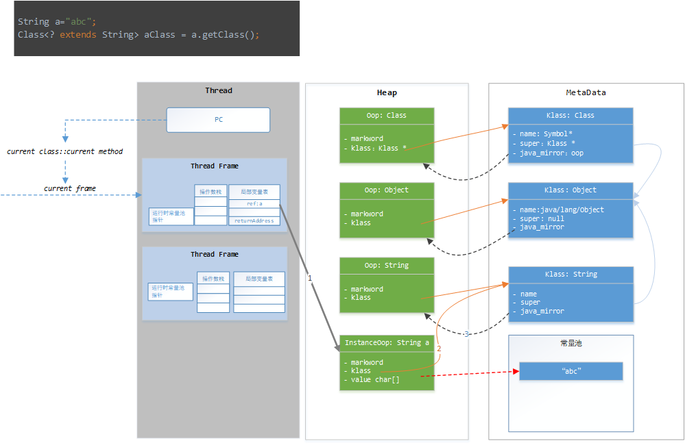

Hotspot 中的对象-类 模型
---


[TOC]


### OOP-klass 二分模型

+ OOP：ordinary object pointer , 或OOPS，即普通对象指针，用来描述对象实例信息；
+ Klass：Java类的C++对等体，用来描述Java类。一般称为类的元数据。


oop，Klass的定义在 openjdk\hotspot\src\share\vm\oops\


+ 父类，继承树维护，在klass中
+ 代码，方法，都在klass中


对于每个oop，包含标记位_markword和指向元数据的klass指针。

+ 元数据在Java是不能直接访问到的，可以理解为元数据klass对用户是透明的；


### Hotspot 的对象定义

```cpp
class oopDesc {
  friend class VMStructs;
 private:
  volatile markOop  _mark;      // 标记位
  union _metadata {             // 元数据
    Klass*      _klass;             //指向元数据
    narrowKlass _compressed_klass;  // 压缩的klass
  } _metadata;

  // Fast access to barrier set.  Must be initialized.
  static BarrierSet* _bs;
```


klass的定义
```cpp

class Klass : public Metadata {
  friend class VMStructs;
 protected:

  // 类名，实例类：java/lang/String， 数组类：[I, [Ljava/lang/String; 
  Symbol*     _name;

  // 这个类映射过去的 java/lang/Class 实例
  oop       _java_mirror;
  // 超类元数据
  Klass*      _super;
  // First subclass (NULL if none); _subklass->next_sibling() is next one
  // 指向直接子类的元数据，不存在子类则为空
  Klass*      _subklass;
  // Sibling link (or NULL); links all subklasses of a klass
  Klass*      _next_sibling;

  // All klasses loaded by a class loader are chained through these links
  Klass*      _next_link;

  // 类加载器信息，可以通过这个访问到类加载器
  ClassLoaderData* _class_loader_data;

  // 访问标记位
  AccessFlags _access_flags;    // Access flags. The class/interface distinction is stored here.


  //... 省略部分属性
```


### String.class 的背后

String.class，String 是元数据还是 Class String 的实例？

```java
    String a=new String();
    Class<String> stringClass =String.class;
    Class<? extends String> aClass = a.getClass();
```

+ a.getClass()，这里 a 是String类的实例，如果 String.class 是Class类的实例，应该和 a 有一样的表现(都是实例)
+ 所以String.class中，String是元数据，也就是klass

String.class 是由虚拟机实现的。在IDEA中，String.class,class的颜色都和关键字相同。

TODO:  这里没有经过验证，后面看找个时间反编译看一下。

### a.getClass()的背后

```java
    String a=new String();
    Class<? extends String> aClass = a.getClass();
```


getClass 方法是native方法，所以不归java管，需要去看openjdk源码
```java
public final native Class<?> getClass();
```

在 openjdk\jdk\src\share\native\java\lang\Object.c找到：

```cpp
JNIEXPORT jclass JNICALL
Java_java_lang_Object_getClass(JNIEnv *env, jobject this)
{
    if (this == NULL) {
        JNU_ThrowNullPointerException(env, NULL);
        return 0;
    } else {
        return (*env)->GetObjectClass(env, this);
    }
}
```


GetObjectClass 方法：
```cpp
struct JNIEnv_ {
    const struct JNINativeInterface_ *functions;
    // jobject 这里是别名，其实还是指针
    jclass GetObjectClass(jobject obj) {
        return functions->GetObjectClass(this,obj);
    }
    ...
};
```


最终调用的是：

openjdk\hotspot\src\share\vm\prims\jni.cpp

```cpp
JNI_ENTRY(jclass, jni_GetObjectClass(JNIEnv *env, jobject obj))
  JNIWrapper("GetObjectClass");
#ifndef USDT2
  DTRACE_PROBE2(hotspot_jni, GetObjectClass__entry, env, obj);
#else /* USDT2 */
  HOTSPOT_JNI_GETOBJECTCLASS_ENTRY(
                                   env, obj);
#endif /* USDT2 */
  // 根据传入的java对象找到对应的instance oop，oop->klass 
  Klass* k = JNIHandles::resolve_non_null(obj)->klass();
  // 找到klass 对应的类对应oop，也就是类对象
  jclass ret =
    (jclass) JNIHandles::make_local(env, k->java_mirror());
#ifndef USDT2
  DTRACE_PROBE1(hotspot_jni, GetObjectClass__return, ret);
#else /* USDT2 */
  HOTSPOT_JNI_GETOBJECTCLASS_RETURN(
                                    ret);
#endif /* USDT2 */
  return ret;
JNI_END
```


这里最核心的两部如上所注释。

1. 通过java实例对象obj找到对应的instance oop，然后得到元数据klass
2. 通过klass 得到类的类实例对象。





参考:

+ [openjdk 官方下载](https://download.java.net/openjdk/jdk8)

+ [blog: object.getClass()的过程](https://www.cnblogs.com/xy-nb/p/6769586.html)