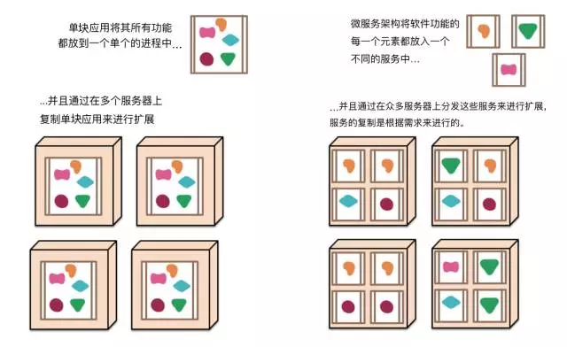

## Microservices： 微服务

传统的单系统应用:

+ 每次局部改动都需要部署整个系统
+ 一般是进程内通信，能够很好的测试和开发。
+ 系统的改动容易引起其他地方的改动，系统的臃肿导致难以正确开发
+ 分布式的部署已经无法满足业务要求，分布式锁的等问题成为瓶颈

这些不满导致了微服务架构风格的诞生：以构建一组小型服务的方式来构建应用系统。除了**这些服务能被独立地部署和扩展，每一个服务还能提供一个稳固的模块边界，甚至能允许使用不同的编程语言来编写不同的服务。这些服务也能被不同的团队来管理。**

## 微服务架构的九大特性

虽然不能说存在微服务架构风格的正式定义，但是可以尝试描述我们所见到的能够被贴上微服务标签的那些架构的共性。下面所描述的所有这些共性，并不是所有的微服务架构都完全具备，但是我们确实期望大多数微服务架构都具备这些共性中的大多数特性。尽管我们两位作者已经成为这个相当松散的社区的活跃成员，但我们的本意还是试图描述我们两人在自己和自己所了解的团队的工作中所看到的情况。特别要指出，我们不会制定大家需要遵循的微服务的定义。

1. “组件化”与“多服务”
2. 围绕“业务功能”组织团队
3. “做产品”而不是“做项目”
    + 谁构建，谁运维

4. “智能端点”与“傻瓜管道”
    + 使用微服务所构建的各个应用的目标，都是尽可能地实现“高内聚和低耦合”，接收一个请求，酌情对其应用业务逻辑，并产生一个响应。
    + 节点自治

5. “去中心化”地治理技术
    + 每个节点可以独立选择自己的技术栈，如开发语言的等
    + 消费者驱动的契约
    + 容错读取
6. “去中心化”地管理数据
    + 数据是按照服务划分，各自管理的，不允许 数据库部署在同一服务器
7. “基础设施”自动化
    + 自动化测试， 自动化部署
8. “容错”设计
    + 优雅地处理单点故障等问题
    + 自动触发问题，自愈型系统的构建
9. “演进式”设计
    系统是升级和变化的

原文：

+ 微服务 的最初定义：[Microservices](https://martinfowler.com/articles/microservices.html)
+ [微服务-中文翻译版](https://mp.weixin.qq.com/s?__biz=MjM5MjEwNTEzOQ==&mid=401500724&idx=1&sn=4e42fa2ffcd5732ae044fe6a387a1cc3#rd)

