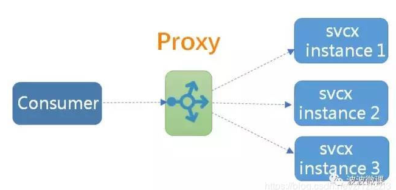
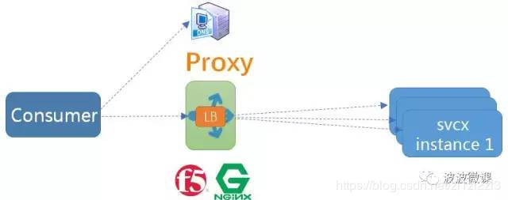
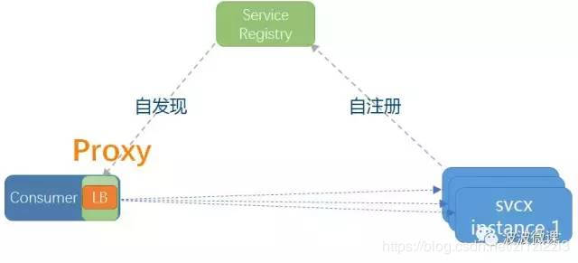
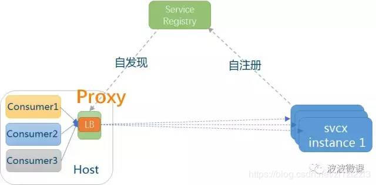
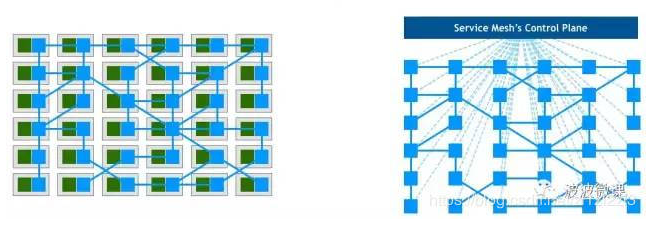
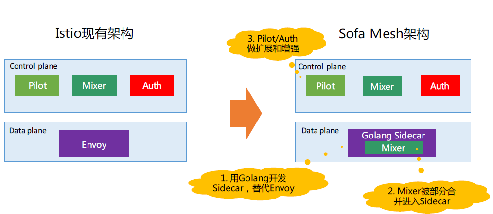
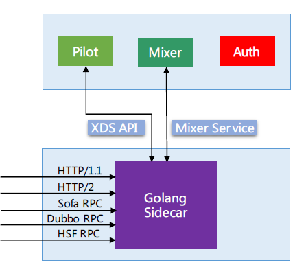

[TOC]

针对分布式领域著名的CAP理论（C——数据一致性，A——服务可用性，P——服务对网络分区故障的容错性

## RPC

**RPC（Remote Procedure Call）：远程过程调用**。

+ 以服务端-客户端形式，服务端对外暴露接口以供客户端调用
+ 客户端不需要了解服务的实现，通过网络调用远程服务；
+ RPC 框架 跨越 传输层到应用层，对开发者透明；
+ RPC 依赖序列化和反序列化，数据传输 等技术

优点：
+ 避免重复造轮子
+ 支持并行开发
+ 系统之间是封闭的，只暴露接口，便于维护

缺点：

+ `调用过程很慢`，而且该过程是不可靠的，容易发生不可预料的错误，比如网络错误等；
+ 每个系统的可靠性受到整个`调用链的制约`。如果每个节点的可靠性为99%，一条有5个节点的调用链的可靠性为：$0.99^5=0.95$
+ 大量请求堆积、故障恢复慢：即一个服务慢，卡住了，整个调用链路出现大量超时，要长时间等待慢的服务恢复到正常状态；
+ `服务雪崩`：即一个服务挂了，整个调用链路上的所有的服务都会受到影响；

解决方案：

+ 通过`熔断机制`，当一个服务挂了，被影响的服务能够及时断，使用 Fallback 数据保证流程在非关键服务不可用的情况下，仍然可以进行。
+ **通过线程池和消息队列机制实现异步化**，允许服务快速失败，当一个服务因为过慢而阻塞，被影响服务可以在超时后快速失败，不会影响整个调用链路。
+ 增加chaos Monkey 等演练，构建自愈式系统

RESTful和RPC的区别：

+ RESTful 可以用于内部服务调用，但其主要用途是对外提供服务。天然支持跨语言
+ RPC 是内部服务之间的互相调用, 服务提供方与调用方接口依赖方式太强，需要在私有仓库维护SDK，并且每次更新都必须同步到各方。

### 常见RPC框架：

+ RMI（JDK自带）： JDK自带的RPC
详细内容可以参考：[《从懵逼到恍然大悟之Java中RMI的使用》](https://blog.csdn.net/lmy86263/article/details/72594760)

+ Dubbo: Dubbo是 阿里巴巴公司开源的一个高性能优秀的服务框架，使得应用可通过高性能的 RPC 实现服务的输出和输入功能，可以和 Spring框架无缝集成。
详细内容可以参考： 
    + [《高性能优秀的服务框架-dubbo介绍》](https://blog.csdn.net/qq_34337272/article/details/79862899)
    + [《Dubbo是什么？能做什么？》](https://blog.csdn.net/houshaolin/article/details/76408399)

+ Hessian： Hessian是一个轻量级的remotingonhttp工具，使用简单的方法提供了RMI的功能。 相比WebService，Hessian更简单、快捷。采用的是二进制RPC协议，因为采用的是二进制协议，所以它很适合于发送二进制数据。
详细内容可以参考： [《Hessian的使用以及理解》](https://blog.csdn.net/sunwei_pyw/article/details/74002351)

+ Thrift： Apache Thrift是Facebook开源的跨语言的RPC通信框架，目前已经捐献给Apache基金会管理，由于其跨语言特性和出色的性能，在很多互联网公司得到应用，有能力的公司甚至会基于thrift研发一套分布式服务框架，增加诸如服务注册、服务发现等功能。

详细内容可以参考： [《【Java】分布式RPC通信框架Apache Thrift 使用总结》](https://www.cnblogs.com/zeze/p/8628585.html)

选择：

+ 是否允许代码侵入： 即需要依赖相应的代码生成器生成代码，比如Thrift。

+ 是否需要长连接获取高性能： 如果对于性能需求较高的haul，那么可以果断选择基于TCP的Thrift、Dubbo。

+ 是否需要跨越网段、跨越防火墙： 这种情况一般选择基于HTTP协议的Hessian和Thrift的HTTP Transport。

此外，Google推出的基于HTTP2.0的gRPC框架也开始得到应用，其序列化协议基于Protobuf，网络框架使用的是Netty4,但是其需要生成代码，可扩展性也比较差。

### 服务发现

业界其实已经探索和总结出一些常用的模式，这些模式的核心其实是代理(Proxy，如下图所以)，以及代理在架构中所处的位置，

#### 模式一：传统集中式代理

这是最简单和传统做法，在服务消费者和生产者之间，代理作为独立一层集中部署，由独立团队(一般是运维或框架)负责治理和运维。常用的集中式代理有硬件负载均衡器(如F5)，或者软件负载均衡器(如Nginx)，F5(4层负载)+Nginx(7层负载)这种软硬结合两层代理也是业内常见做法，兼顾配置的灵活性(Nginx比F5易于配置)。

这种方式通常在`DNS域名服务器`的配合下实现服务发现，服务注册(建立服务域名和IP地址之间的映射关系)一般由运维人员在代理上手工配置，服务消费方仅依赖服务域名，这个域名指向代理，由代理解析目标地址并做负载均衡和调用。

典型代表：

+ 国外知名电商网站eBay
+ 携程

#### 模式二：客户端嵌入式代理

这是很多互联网公司比较流行的一种做法，代理(包括服务发现和负载均衡逻辑)以客户库的形式嵌入在应用程序中。这种模式一般`需要独立的服务注册中心组件配合`，服务启动时自动注册到注册中心并定期报心跳，客户端代理则发现服务并做负载均衡。

典型代表：
+ Netflix开源的Eureka(注册中心)[附录1]和Ribbon(客户端代理)是这种模式的典型案例
+ 国内阿里开源的Dubbo也是采用这种模式。

#### 模式三：主机独立进程代理

这种做法是上面两种模式的一个折中，代理既不是独立集中部署，也不嵌入在客户应用程序中，而是作为独立进程部署在每一个主机上，一个主机上的多个消费者应用可以`共用这个代理`，实现服务发现和负载均衡，如下图所示。这个模式一般也需要独立的服务注册中心组件配合，作用同模式二。

典型代表：
+ Airbnb的SmartStack是这种模式早期实践产品
+ 国内公司唯品会对这种模式也有探索和实践

#### 三种服务发现模式的比较

集中式代理：

+ 优点：运维简单，集中治理，语言栈无关
+ 不足： 配置麻烦，单点问题，多一跳有性能开销
+ 适用：中小规模公司，需要一定的运营能力
+ 公司案例：亿贝，携程，拍拍贷

客户端嵌入式代理：

+ 优点：无单点，性能好
+ 不足：客户端复杂，多语言麻烦，治理松散
+ 适用：中大型规模公司，语言栈较统一
+ 公司案例：Twitter Finagle,阿里Dubbo，Netflix Karyon，新浪微博Motan

主机独立进程代理：

+ 优点：折中方案
+ 不足：运维部署复杂
+ 适用：中大型公司，运维能力强
+ 公司案例：Airbnb SmartStack， 唯品会，istio ServiceMesh ，阿里sofa 等

#### Service Mesh

从某种程度上说就是上文中 【模式三：主机独立进程代理】

模式三(ServiceMesh)也被形象称为边车(Sidecar)模式，如下图，早期有一些摩托车，除了主驾驶位，还带一个边车位，可以额外坐一个人。在模式三中，业务代码进程(相当于主驾驶)共享一个代理(相当于边车)，代理除了负责服务发现和负载均衡，还负责动态路由、容错限流、监控度量和安全日志等功能，这些功能是具体业务无关的，属于跨横切面关注点(Cross-Cutting Concerns)范畴。

ServiceMesh：[mɛʃ]
Sidecar:['saɪdkɑr]

服务网格就是把rpc，流量控制，负载均衡，安全访问，升级降级，灰度发布等都集成到一个平台（该平台可以部署若干台），对于业务系统来说，只要引入一个代理包，和配置下配置参数就可以了，对业务层代码零侵入

上图左下角，每个主机上同时居住了业务逻辑代码(绿色表示)和代理(蓝色表示)，服务之间通过代理发现和调用目标服务，形成服务之间的一种网络状依赖关系，控制面板则可以配置这种依赖调用关系，也可以调拨路由流量。如果我们把主机和业务逻辑剥离，就出现一种网格状架构(上图右下角)，服务网格由此得名。

#### 业内实现

+ Envoy：
    + C++ 编写，设计优秀，性能和稳定性表现良好
    + 安心做数据平面， 提供XDS API
+ Istio:google and ibm
    + 性能和稳定性不够，更新不及时
    + 控制平面：Istio是目前做的最好的
    + 没有提供和侵入式框架互通的解决方案

+ CES Mesher：华为
    + 基于Golang，部分对接Istio
    + 将开源
+ Motan Mesh：新浪
    + 基于Golang
+ Tencent Service Mesh:腾讯
    + 数据平面选择Envoy：成熟产品，符合腾讯语言体系，内部广泛使用
    + 控制平面据传“挣扎了一下”，最终还是选择Istio，进行定制和扩展，解耦k8s

#### 阿里Sofa Service Mesh:

+ 参照Envoy的设计,实现XDS API
+ 兼容Istio
+ 支持HTTP/1.1 和HTTP/2
+ 扩展Sofa/Dubbo/Hsf

### 负载均衡

### 服务降级

当服务器压力剧增的情况下，根据实际业务情况和流量，对一些服务和页面有策略的不处理或换种简单方式处理，从而释放服务器资源以保证核心业务正常运行或高效运行。

参考：
+ [后端必备——数据通信知识(RPC、消息队列)一站式总结](https://mp.weixin.qq.com/s?__biz=MzU4NDQ4MzU5OA==&mid=2247484133&idx=1&sn=27c03c4a0c15364e1b7bf42960bad76c)
+ 大规模微服务架构下的 Service Mesh 探索之路-敖小剑
+ [阿里Apache Dubbo布道师谈Service Mesh技术](https://blog.csdn.net/BtB5e6Nsu1g511Eg5XEg/article/details/82892161)

+ [微服务 | 我为啥不看好 ServiceMesh](https://blog.csdn.net/zl1zl2zl3/article/details/84440685)
+ [网易考拉海购：电商高并发架构设计的铁律
](https://blog.csdn.net/tanga842428/article/details/80395338)
+ [微服务架构的基础框架选择：Spring Cloud还是Dubbo？](http://blog.didispace.com/microservice-framework/)