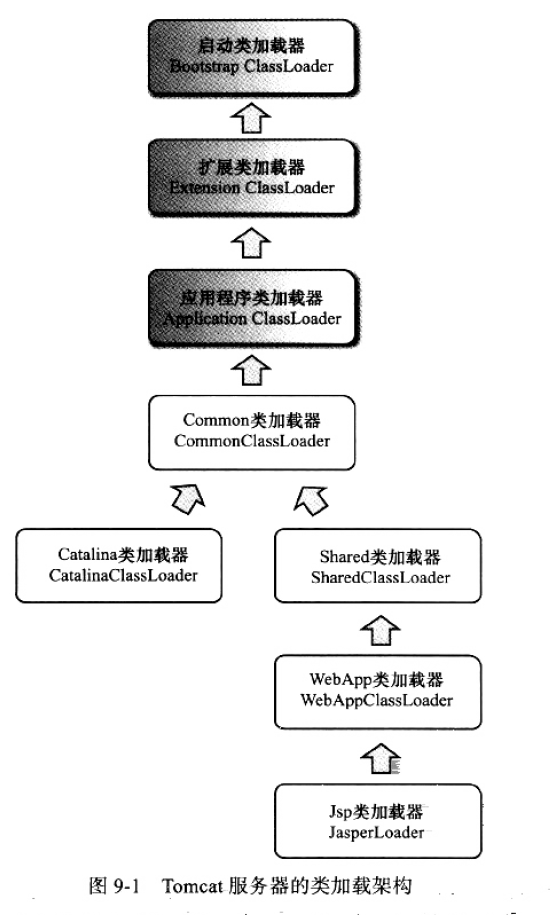

[TOC]

## Java异常继承体系：

+ Throwable
	+ Error:致命异常，程序无法处理，如OutOfMemoryError
	+ Exception
		+ checked:受检异常，
		+ unchecked:RuntimeException,不需要显式catch
			
Exception 分为：checked和unchecked


### try-catch


如果finally 是在执行完return之后，这时return 的值是被暂存了的；

```java {.line-numbers}

 public int finallyNotWork(){
        int temp=100;
        try{
            throw new Exception("a exp");
        }catch (Exception e){
            // 返回值被暂存
            return temp;
        }finally {
            // 这里影响不到返回值
            temp=1;
        }
    }
    //方法的返回值为100
```


### 千万不要在finally里return


```java

    static int a=1;
    static int b=10;
    static int c=100;
    @Test
    public void finallyReturnTest(){

        System.out.println(finallyReturn());
        System.out.println("a:"+a);
        System.out.println("b:"+b);
        System.out.println("c:"+c);
    }
    public static int finallyReturn(){
        try{
            //do something
            return ++a;
        }catch (Exception e){
            return ++b;
        }finally {
            return ++c;
        }
    }
```


如果没抛异常，a=2,b=10,c=101,路径a-c
如果a抛异常,a=1,b=11,c=101
这里根本的原因是开发者用finally 写了业务逻辑；


## 重载和重写


- 重载通过参数的`静态类型`判断，静态类型`编译期已知`
- Override:重写是`动态`的，在运行期才知道；是多态的基石。


```java

// 左边是静态类型，右边是动态类型
Human man=new Man();

```


## java 的基本数据类的底层存储


|基本类型|底层长度bit|默认值|数据范围|
|:-:|:-:|:-:|:-:|
|byte   |8    |0    |$-2^{7} \to 2^{7}-1$|
|short  |16   |0    |$-2^{15} \to 2^{15}-1 $ |
|int    |32   |0    |$-2^{31} \to 2^31-1 $|
|long   |64   |0L   |$-2^{61} \to 2^{61} -1$
|char   |16   |\u0000|\u0000 ~ \uffff|
|float  |32   |0.0f |
|double |64   |0.0  |
|boolean|8    |false|true or false


### JVM内存对齐:


**以 8 字节对齐**
+ 一个空对象占用8字节（空对象：占8字节 64位bit）
+ 一个对象只含有一个boolean 占16字节
+ 以8字节为单位对齐


在具体的情况下有会有所变化，比如 ：boolean会占用一比特或者占用一个字节的第八位，但是HotSpot虚拟机会为每个Boolean字段分配`一个字节`(byte)的空间


在 Java 虚拟机中没有任何供 boolean 值专用的字节码指令，在 Java 语言之中涉及到 boolean 类型值的运算，在编译之后都使用 Java 虚拟机中的 `int` 数据类型来代替`boolean`。


Java 虚拟机直接支持 `boolean 类型的数组`，虚拟机的 newarray 指令可以创建这种数组。boolean 的数组类型的访问与修改`共用 byte 类型数组的 baload 和 bastore 指令`。

综上所述, `单个boolean型`是占`4字节`(因为变异后会用int来代替), 而`boolean数组`中的则占`1字节`(因为用byte来代替的)


 
### 32和64位差距
32位64位操作系统基本数据类型字节大小,只要注意long：
+ 32位： long: 4个字节 
+ 64位： long: 8个字节


那64位和32位操作系统在读取上有什么区别呢：

+ 64bit CPU拥有`更大的寻址能力`，理论上最大支持到16TB内存，而32bit只支持4G内存
+ 64位 CPU`一次可提取64位数据`，32位的CPU一次只能提取32位数据， 所以64位比32位提高了一倍，理论上性能会提升1倍。但这是建立在64bit操作系统，64bit软件的基础上的


参考：[java基本数据类型,及JVM内存对齐](https://blog.csdn.net/u010235716/article/details/79074598)


## String ,StringBuffer，StringBulider

### String 能不能被继承

不能被继承，他是 public final class

### String 在内存的存储图示

String a = New string ("a");在jvm中如何存储？


### StringBuffer and StringBuilder


+ StringBuffer ：线程安全
+ StringBuilder: 线程不安全


### <?super> and <? extends>

+ \<extends T> 确定上边界
+ \<super T> 确定下边界
+ \<?extends T> 除了null什么也不能添加
+ \<?super T> 可以返回T泛型

tips:
+ getFirst: \<? extends T>
+ putFirst: \<? super T>

```java
        List<Animal> animals = new ArrayList<>();
        List<Cat> cats = new ArrayList<>();
        List<Garfield> garfields = new ArrayList<>();

        animals.add(new Animal());
        cats.add(new Cat());
        garfields.add(new Garfield());

        // 上边界是Cat
        // List<? extends Cat>extendsCatFromAnimal=animals;  // 编译失败
        // 下边界是Cat
        List<? super Cat> superCatFromAnimal = animals;

        List<? extends Cat> extendsCatFromCat = cats;
        List<? super Cat> superCatFromCat = cats;


        List<? extends Cat> extendsCatFromGarfields = garfields;
        // 下边界是 Cat
        // List<? super Cat> superCatFromGarfields = garfields;    //编译失败


        // 除了null。<?extends> 不能放入任何类型
        // 无法进行add 操作，Cat是上边界，没有下边界，如果允许add，将导致各种子类都可以放进去，起不到控制作用
        //extendsCatFromCat.add(new Cat());       // 编译失败
        //extendsCatFromCat.add(new Garfield());  // 编译失败
        //extendsCatFromCat.add(new Animal());    // 编译失败

        // cat 是下边界，所以 Cat 的子类都可以向上转型为Cat，所以可以放进去
        superCatFromCat.add(new Cat());
        superCatFromCat.add(new Garfield());
        // superCatFromCat.add(new Animal());  // 编译失败

        // 所有<?super> 只能返回Object
        Object object = superCatFromCat.get(0);

        // <?extends Cat> 可以返回Cat类型，但子类型被擦除
        Cat cat = extendsCatFromCat.get(0);
        Cat cat1 = extendsCatFromGarfields.get(0);
```


## Compare和comparetor


comparable 是接口，一般实现接口的compareTo方法。

Comparetor： 函数式接口，用来封装比较算法，作为参数注入，走的是策略模式，符合开闭原则。


## equals and hashCode

+ 如果两对象equals为true，hashCode也应该一致
+ 重写equals就必须重写hashCode


## 语言特性


### 接口中能否定义常量？

可以


+ interface的属性隐式默认 `public static final`
+ 如果子接口重写，会覆盖父接口的数据
+ interface 中的方法隐式默认为`public abstract`
+ 允许但不建议 写出隐式关键字

> Every field declaration in the body of an interface is implicitly public, static,and final.
>
>Every method declaration in the body of an interface is implicitly public. 
Every method declaration in the body of an interface is implicitly abstract, so its body is always represented by a semicolon, not a block.
It is permitted, but discouraged as a matter of style, to redundantly specify the public and/or abstract modifier for a method declared in an interface.
---JDK1.7 Stand 

### 类的静态变量和静态方法能否被子类继承？


+ 静态属性和方法，可以被子类访问，但不能被继承
+ 子类访问父类的静态属性或方法，走的是静态链接，因为这里不存在多态
+ 子类和父类拥有相同定义的静态属性和方法，各自互不干扰

+ 对于非静态的类，子类重写父类的属性后，本地就有两份属性；


### 子类中能否调用父类的静态变量和静态方法？
String a = New string ("a");在jvm中如何存储？


## JVM


### JVM 的内存模型


HotSpot虚拟机GC算法采用分代收集算法：


## ClassLoader

+ Bootstrap Loader  - 负责加载系统类 
	+ ExtClassLoader  - 负责加载扩展类 
	+ AppClassLoader  - 负责加载应用类 


当执行 java ***.class 的时:

&emsp;&emsp;java.exe 会帮助我们找到 JRE ，接着找到位于 JRE 内部的 jvm.dll ，这才是真正的 Java 虚拟机器 , 最后加载动态库，激活 Java 虚拟机器。虚拟机器激活以后，会先做一些初始化的动作，比如说读取系统参数等。一旦初始化动作完成之后，就会产生第一个类加载器―― Bootstrap Loader 

&emsp;&emsp;Bootstrap Loader 是由 C++ 所撰写而成，这个 Bootstrap Loader 所做的初始工作中，除了一些基本的初始化动作之外，最重要的就是加载 Launcher.java 之中的 ExtClassLoader ，并设定其 Parent 为 null ，代表其父加载器为 BootstrapLoader 。（Launcher.java在rt.jar）然后 Bootstrap Loader 再要求加载 Launcher.java 之中的 AppClassLoader ，并设定其 Parent 为之前产生的 ExtClassLoader 实体。这两个加载器都是以静态类的形式存在的。

&emsp;&emsp;这里要注意的是： Launcher$ExtClassLoader.class 与 Launcher$AppClassLoader.class 都是由 Bootstrap Loader 所加载，所以 Parent 和由哪个类加载器加载没有关系。 


根据指定的name名称装载class。默认的实现中，搜索顺序如下：

1. 调用 `findLoadedClass(String)`检查是否已加载
2. 调用 父类的`loadClass(String)` 方法，如果parent==null,则使用内置装载器Bootstrap classloader
3. 调用 findClass(Stirng)查找类

如果在上述步骤中，已经发现class，并且resolve标记为true，本方法将调用resolveClass(Class)，Class是传入的Class文件 

ClassLoader 的子类，鼓励覆盖@Override $findClass(String)$,而不是@Override loadClass(String)


在没有被重写的情况下，此方法 使用$getClassLoadingLock$ 保证整个类装载过程的同步


```java {.line-numbers}

    /**
     * @param  name 
     *         类名
     * @param  resolve
     *         true: resolve the class
     * @return  Class
     * @throws  ClassNotFoundException
     *          If the class could not be found
     */
    protected Class<?> loadClass(String name, boolean resolve)
        throws ClassNotFoundException
    {
		//同步锁，保证整个类装载过程的同步
        synchronized (getClassLoadingLock(name)) {
            // 1. 检查类是否被装载
            Class<?> c = findLoadedClass(name);
            if (c == null) {
                long t0 = System.nanoTime();
                try {
					//向父 loader委派
                    if (parent != null) {
                        c = parent.loadClass(name, false);
                    } else {
                        c = findBootstrapClassOrNull(name);
                    }
                } catch (ClassNotFoundException e) {
                    // ClassNotFoundException thrown if class not found
                    // from the non-null parent class loader
                }
                if (c == null) {
                    // If still not found, then invoke findClass in order
                    // to find the class.
                    long t1 = System.nanoTime();
                    c = findClass(name);

                    // this is the defining class loader; record the stats
                    sun.misc.PerfCounter.getParentDelegationTime().addTime(t1 - t0);
                    sun.misc.PerfCounter.getFindClassTime().addElapsedTimeFrom(t1);
                    sun.misc.PerfCounter.getFindClasses().increment();
                }
            }
            if (resolve) {
                resolveClass(c);
            }
            return c;
        }
    }

```


使用给定的类加载器， 返回与 name 关联的class或interface 的Class 对象.
给定类的完全限定名(getName 返回的格式)，此方法尝试查找、加载和链接类或接口。指定的类。使用指定的加载器加载类或接口。如果参数为 null, 通过 bootstrap 加载，只有当initialize==true&&类没有被初始化过，才会初始化类。


+ 如果name 传入一个基本类型或者void， 将尝试在 未命名的package的包里定位一个自定义类，因此这个方法不能用户获取任何基础类型和void的Class
+ 如果是一个数组


```java {.line-numbers}
    /**
     * Returns the {@code Class} object associated with the class or
     * interface with the given string name, using the given class loader.
     * Given the fully qualified name for a class or interface (in the same
     * format returned by {@code getName}) this method attempts to
     * locate, load, and link the class or interface.  The specified class
     * loader is used to load the class or interface.  If the parameter
     * {@code loader} is null, the class is loaded through the bootstrap
     * class loader.  The class is initialized only if the
     * {@code initialize} parameter is {@code true} and if it has
     * not been initialized earlier.
     *
     * <p> If {@code name} denotes a primitive type or void, an attempt
     * will be made to locate a user-defined class in the unnamed package whose
     * name is {@code name}. Therefore, this method cannot be used to
     * obtain any of the {@code Class} objects representing primitive
     * types or void.
     *
     * <p> If {@code name} denotes an array class, the component type of
     * the array class is loaded but not initialized.
     *
     * <p> For example, in an instance method the expression:
     *
     * <blockquote>
     *  {@code Class.forName("Foo")}
     * </blockquote>
     *
     * is equivalent to:
     *
     * <blockquote>
     *  {@code Class.forName("Foo", true, this.getClass().getClassLoader())}
     * </blockquote>
     *
     * Note that this method throws errors related to loading, linking or
     * initializing as specified in Sections 12.2, 12.3 and 12.4 of <em>The
     * Java Language Specification</em>.
     * Note that this method does not check whether the requested class
     * is accessible to its caller.
     *
     * <p> If the {@code loader} is {@code null}, and a security
     * manager is present, and the caller's class loader is not null, then this
     * method calls the security manager's {@code checkPermission} method
     * with a {@code RuntimePermission("getClassLoader")} permission to
     * ensure it's ok to access the bootstrap class loader.
     *
     * @param name       fully qualified name of the desired class
     * @param initialize if {@code true} the class will be initialized.
     *                   See Section 12.4 of <em>The Java Language Specification</em>.
     * @param loader     class loader from which the class must be loaded
     * @return           class object representing the desired class
     *
     * @exception LinkageError if the linkage fails
     * @exception ExceptionInInitializerError if the initialization provoked
     *            by this method fails
     * @exception ClassNotFoundException if the class cannot be located by
     *            the specified class loader
     *
     * @see       java.lang.Class#forName(String)
     * @see       java.lang.ClassLoader
     * @since     1.2
     */
    @CallerSensitive
    public static Class<?> forName(String name, boolean initialize,
                                   ClassLoader loader)
        throws ClassNotFoundException
    {
        Class<?> caller = null;
        SecurityManager sm = System.getSecurityManager();
        if (sm != null) {
            // Reflective call to get caller class is only needed if a security manager
            // is present.  Avoid the overhead of making this call otherwise.
            
			//
			caller = Reflection.getCallerClass();
            if (sun.misc.VM.isSystemDomainLoader(loader)) {
                ClassLoader ccl = ClassLoader.getClassLoader(caller);
                if (!sun.misc.VM.isSystemDomainLoader(ccl)) {
                    sm.checkPermission(
                        SecurityConstants.GET_CLASSLOADER_PERMISSION);
                }
            }
        }
        return forName0(name, initialize, loader, caller);
    }

```

### Tomcat中的类加载器

在Tomcat目录结构中，有三组目录（“/common/*”,“/server/*”和“shared/*”）可以存放公用Java类库，

此外还有第四组Web应用程序自身的目录“/WEB-INF/*”，把java类库放置在这些目录中的含义分别是：
+ common：类库可被Tomcat和所有的Web应用程序共同使用。
+ server：类库可被Tomcat使用，但对所有的Web应用程序都不可见。
+ shared：类库可被所有的Web应用程序共同使用，但对Tomcat自己不可见。
+ /WebApp/WEB-INF：类库仅仅可以被此Web应用程序使用，对Tomcat和其他Web应用程序都不可见。




JVM区域总体分两类，heap区和非heap区。heap区又分：Eden Space（伊甸园）、Survivor Space(幸存者区)、Tenured Gen（老年代-养老区）。 非heap区又分：Code Cache(代码缓存区)、Perm Gen（永久代）、Jvm Stack(java虚拟机栈)、Local Method Statck(本地方法栈)。

