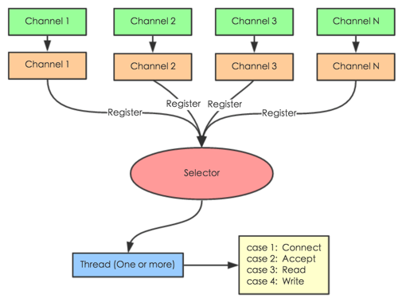
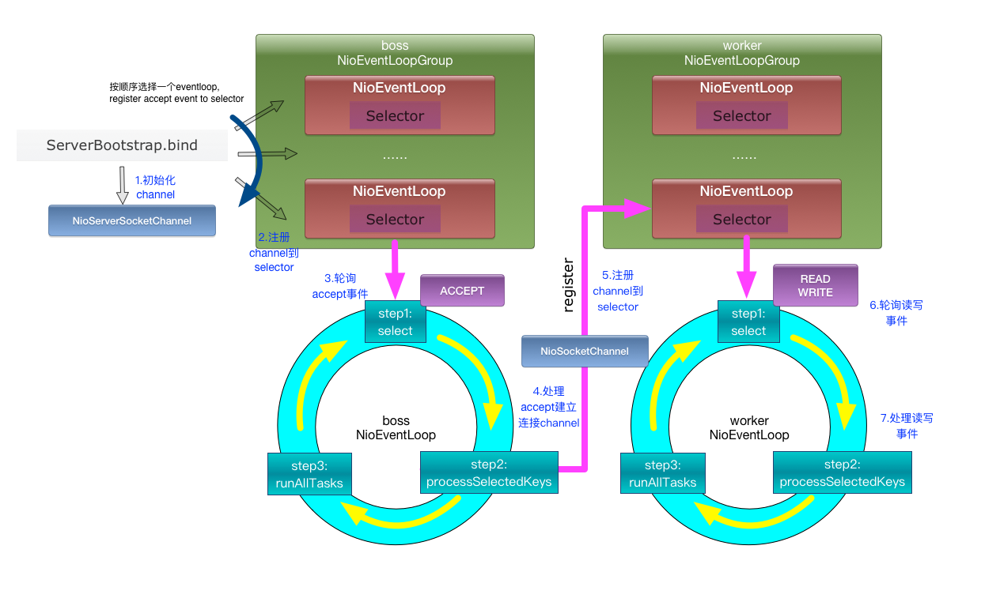

[TOC]

### socket

socket是用来进行网络通信的，套接字。
java里面已经有封装好这个类了，分为客户端和服务器，通过ip：port来进行访问。

### IO，NIO，AIO，netty

什么是IO，什么是NIO，什么是AIO，什么是netty框架？


IO 逃不掉的两个步骤：

1. 等待 数据缓冲区 可读
2. 将数据从 缓冲区拷贝到内存


#### BIO and NIO and AIO

+ BIO: 等待阻塞，数据拷贝阻塞
	+ 传统的 java.io 包
	+ IO 的效率和扩展性很低,不适合大量并发
+ NIO： 等待不阻塞，数据拷贝阻塞
	+ JDK1.4, java.nio 包，Non-blocking I/O
	+ 提供了 Channel、Selector、Buffer 等新的抽象，可以构建多路复用的、同步非阻塞 IO 程序
+ AIO：不阻塞，拷贝完通知
	+ JDK1.7引入,Asynchronous IO
	+ 回调机制+系统级别异步

以socket.read()为例子：
+ 传统的BIO里面socket.read()，如果TCP RecvBuffer里没有数据，函数会一直阻塞，直到收到数据，返回读到的数据。
+ 对于NIO，如果TCP RecvBuffer有数据，就把数据从网卡读到内存，并且返回给用户；反之则直接返回0，永远不会阻塞。
+ 最新的AIO(Async I/O)里面会更进一步：不但等待就绪是非阻塞的，就连数据从网卡到内存的过程也是异步的。

关注点：
+ BIO，最关心“我要读”
+ NIO，最关心"我可以读了"，
+ AIO，更需要关注的是“读完了”。


#### NIO： Non-Blocking IO



+ NIO的主要事件：读就绪、写就绪、有新连接到来。
+ socket主要的读、写、注册和接收函数，在等待就绪阶段非阻塞，真正的I/O操作是同步阻塞的，消耗CPU但性能非常高
+ 可以把工作细分，在不同的线程中执行。
```java
	//选择就绪的事件和对应的连接,select 是阻塞的
	while(channel=Selector.select()){
		if(channel.event==accept){
			//如果是新连接，则注册一个新的读写处理器
			registerNewChannelHandler(channel);
		}
		if(channel.event==write){
			//如果可以写，则执行写事件
			getChannelHandler(channel).channelWritable(channel);
		}
		if(channel.event==read){
			//如果可以读，则执行读事件
			getChannelHandler(channel).channelReadable(channel);
		}
	}
```
Java的Selector对于Linux系统来说，有一个致命限制：同一个channel的select不能被并发的调用。因此，如果有多个I/O线程，必须保证：一个socket只能属于一个IoThread，而一个IoThread可以管理多个socket。


##### NIO应用：


###### 每连接顺序请求的redis：

由于redis服务端是串行的，能够保证同一连接的所有请求与返回顺序一致。这样可以使用单线程＋队列，把请求数据缓冲。然后pipeline发送，返回future，然后channel可读时，直接在队列中把future取回来，done()就可以了。

###### 多连接短连接的HttpClient：

做爬虫时，需要建立很多socket同时爬取多个站点，以socket为key，直接遍历可用事件；


###### 常见的RPC框架，如Thrift，Dubbo：
这种框架内部一般维护了请求的协议和请求号，可以维护一个以请求号为key，结果的result为future的map，结合NIO+长连接，获取非常不错的性能。


#### Reactor and Proactor

+ Reactor:NIO,
	1. 等待可用状态
	2. 分发事件给处理函数进行读写。
+ Proactor:AIO，系统级别异步。
	1. 告诉系统 对应的缓冲区 和内存，数据长度，回调函数
	2. 事件分发器调用操作系统API发起新的异步读写（新线程），由操作系统完成读写。读写完成通知分发器。
	3. 分发器呼唤处理器，处理器异步处理后通知分发器


tips:
+ Reactor 回调handler时，表示可以read/write
+ Proactor 回调handler时，表示已完成read/write


NIO（，在Java领域，也称为New I/O），


NIO存在的问题

使用NIO != 高性能，当连接数<1000，并发程度不高或者局域网环境下NIO并没有显著的性能优势。NIO并没有完全屏蔽平台差异，它仍然是基于各个操作系统的I/O系统实现的，差异仍然存在。使用NIO做网络编程构建事件驱动模型并不容易，陷阱重重。

NIO的优点：
+ 事件驱动模型
+ 避免多线程
+ 单线程处理多任务
+ 非阻塞I/O，I/O读写不再阻塞，而是返回0
+ 基于block的传输，通常比基于流的传输更高效
+ 更高级的IO函数，zero-copy
+ IO多路复用大大提高了Java网络应用的可伸缩性和实用性


参考：[Java NIO浅析-美团技术团队](https://www.zhihu.com/search?q=AIO%20NIO&type=content)


netty是用来实现非阻塞IO的一个框架，这个作为拓展点，感兴趣可以去了解一下。我在面试阿里的时候被问到过，其他公司还没问过。


#### Netty

> Netty is an asynchronous event-driven network application framework for rapid development of maintainable high performance protocol servers & clients.

Netty 是一个用于快速开发可维护的高性能服务器或客户端的异步事件驱动网络应用框架。


JDK 原生也有一套网络应用程序 API，但是存在一系列问题，主要如下：

+ NIO 的类库和 API 繁杂，使用麻烦。你需要熟练掌握 Selector、ServerSocketChannel、SocketChannel、ByteBuffer 等。
+ 需要具备其他的额外技能做铺垫。例如熟悉 Java 多线程编程，因为 NIO 编程涉及到 Reactor 模式，你必须对多线程和网路编程非常熟悉，才能编写出高质量的 NIO 程序。
+ 可靠性能力补齐，开发工作量和难度都非常大。例如客户端面临断连重连、网络闪断、半包读写、失败缓存、网络拥塞和异常码流的处理等等。 NIO 编程的特点是功能开发相对容易，但是可靠性能力补齐工作量和难度都非常大。
+ JDK NIO 的 Bug。例如臭名昭著的 Epoll Bug，它会导致 Selector 空轮询，最终导致 CPU 100%。 官方声称在 JDK 1.6 版本的 update 18 修复了该问题，但是直到 JDK 1.7 版本该问题仍旧存在，只不过该 Bug 发生概率降低了一些而已，它并没有被根本解决。

Netty 的特点:

Netty 对 JDK 自带的 NIO 的 API 进行封装，解决上述问题，主要特点有：

+ 设计优雅，适用于各种传输类型的统一 API 阻塞和非阻塞 Socket；基于灵活且可扩展的事件模型，可以清晰地分离关注点；高度可定制的线程模型 - 单线程，一个或多个线程池；真正的无连接数据报套接字支持（自 3.1 起）。
+ 使用方便，详细记录的 Javadoc，用户指南和示例；没有其他依赖项，JDK 5（Netty 3.x）或 6（Netty 4.x）就足够了。
+ 高性能，吞吐量更高，延迟更低；减少资源消耗；最小化不必要的内存复制。
安全，完整的 SSL/TLS 和 StartTLS 支持。
+ 社区活跃，不断更新，社区活跃，版本迭代周期短，发现的 Bug 可以被及时修复，同时，更多的新功能会被加入。

Netty 常见使用场景

+ 互联网行业。在分布式系统中，各个节点之间需要远程服务调用，高性能的 RPC 框架必不可少，Netty 作为`异步高性能`的通信框架，往往作为基础通信组件被这些 RPC 框架使用。 典型的应用有：阿里分布式服务框架 Dubbo 的 RPC 框架使用 Dubbo 协议进行节点间通信，Dubbo 协议默认使用 Netty 作为基础通信组件，用于实现各进程节点之间的内部通信。
+ 游戏行业。无论是手游服务端还是大型的网络游戏，Java 语言得到了越来越广泛的应用。Netty 作为高性能的基础通信组件，它本身提供了 TCP/UDP 和 HTTP 协议栈。 非常方便定制和开发私有协议栈，账号登录服务器，地图服务器之间可以方便的通过 Netty 进行高性能的通信。
+ 大数据领域。经典的 Hadoop 的高性能通信和序列化组件 Avro 的 RPC 框架，默认采用 Netty 进行跨界点通信，它的 Netty Service 基于 Netty 框架二次封装实现。





0. ServerBootstrap.bind 绑定端口，如20880
1. 初始化Channel
2. 注册Channel 到 boss Selector
3. boss Selector 监听 accept 事件
4. 当boss Selector 监听到时，建立与客户端的Channel
5. 把Channel 注册到 worker Selector
6. worker Selector 监听 read/write 事件
7. worker Selector处理读写事件，读写任务进入任务队列


参考:[通俗地讲，Netty 能做什么？](https://www.zhihu.com/question/24322387/answer/78947405)