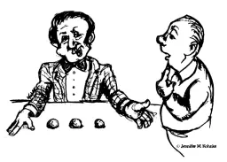
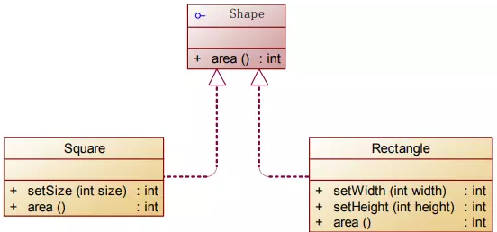

@import ".assets/common.js" 

[TOC]


## Design Smells


糟糕设计的症状【Symptoms of Poor Design】

1. Rigidity – The design is hard to change
	+ 僵化性：难于修改
	+ 一个改动导致系统其他地方被迫做出修改

2. Fragility – The design is easy to break
	+ 脆弱性：易于遭到破坏
	+ 对系统的改动会导致系统中与被改动部分`无概念关联`的地方出问题
3. Immobility – The design is hard to reuse
	+ 固定性：`难以重用`
	+ 很难将系统分成为若干个组件，以便在其他系统中重用
4. Viscosity – It is hard to do the right thing
	+ 粘滞性：难以做正确的事情
	+ `容易出错，不容易正确`
5. Needless Complexity – Overdesign
	+ 不必要的复杂：`过度设计`，设计中包含不具有直接益处的基础结构
	+ 设计要基于业务，不是所有的系统都要细分层次
6. Needless Repetition – Mouse abuse
	+ 不必要的`重复`：滥用复制粘贴
	+ 同样的代码出现两次就值得注意，出现三次就必须抽离
7. Opacity – Disorganized expression
	+ 晦涩性：混乱的表达
	+ 难于阅读和理解，没有将本来的意图表达清楚
	+ 代码即文档，代码混乱导致系统难以维护，高级的语言特性可能导致`理解困难`

---

## 单一职责原则（Single Responsibility Principle）


> A class should have only one reason to change

就一个类而言，应该仅有一个引起它(状态)变化的原因


+ Responsibility = `Reason to change`
+ Separate coupled responsibilities into separate classes
	+ 一个类只负责一项职责
+ 面向对象的关注点：`类的职责`


> Every object should have a `single responsibility`, and that responsibility should be entirely encapsulated by the class
一个对象应该只包含`单一的职责`，并且该职责被完整地`封装`在一个类中


### 分析：
+ 一个类（或者大到模块，小到方法）承担的职责越多，被复用的可能性越小
+ 在一个类中耦合过多的职责,一个职责改变可能影响其他职责

+ 类的职责：
	+ `数据职责`：属性
	+ `行为职责`：方法
+ 单一职责原则是实现`高内聚、低耦合`的指导方针

### 遵循单一职责原则的好处：

+ 可以降低`类的复杂度`
+ 提高类的可读性
+ 提高类的重用性
+ 提高系统的可维护性
+ 变更引起的风险降低

***

## 开闭原则（Open-Closed Principle）


> Software entities (classes, modules, functions, etc.,) should be open for extension, but closed for modification
一个软件实体（如类、模块和函数...）应该对`扩展开放，对修改封闭`


**也就是说在设计一个模块的时候，应当使这个模块可以`在不被修改的前提下被扩展`**


### 分析

+ 软件实体可以指一个软件模块、一个由多个类组成的局部结构或一个独立的类
+ `Abstraction is the Key`
+ 对可变性封装原则(Principle of `Encapsulation of Variation`, EVP)
	+ 要求找到系统的可变因素并将其封装起来
+ In many ways, the OCP is at the heart of object-oriented design 

+ $OCP=abstraction+polymorphism+inheritance$ [^1]


[^1]: OCP原则背后的机制是`抽象(abstraction)`和`多态(polymorphism)`，通过`继承(inheritance)`方式实现

+ 遵循OCP原则可获得面向对象技术的最大好处

---

## Liskov替换原则（Liskov Substitution Principle）



> Functions that use pointers or references to base classes must be able to `use objects of derived classes without knowing it`


### Barbara Liskov 's word

**What is wanted here is something like the following substitution property: If for each object o1 of type S there is an object o2 of type T such that for all programs P defined in terms of T, the behavior of P is unchanged when o1 is substituted for o2 then S is a subtype of T**


```java {.line-numbers}
class T{
	public void run(){
		...
	}
}

class S extends T{
	@Override
	public void run(){
		...
	}
}

public class P{
	public static void main(String args[]){
		S o1=new S();
		T o2=new T();

		//原来使用父类对象的地方，换成子类对象，应用的表现不应该发生改变
		// o1.run();

		//替换为o2,P::main 的功能不发生变化
		o2.run();
	}
}

```

**Subtypes must be substitutable for their base types**
可以用子类型替换基类型,并且不会改变系统的功能


### 分析
+ 在软件中如果能够使用基类对象，那么一定能够使用其子类对象，`把基类都替换成它的子类，程序将不会产生任何错误和异常`
+ 反过来则不成立，如果一个软件实体使用的是一个子类的话，那么它不一定能够使用基类

+ 里氏代换原则是实现开闭原则的重要方式之一，由于使用基类对象的地方都可以使用子类对象，因此在程序中 `尽量使用基类类型来对对象进行定义`，而在运行时再确定其子类类型，用子类对象来替换父类对象


### 实例：

```java{.line-numbers}

/**
 * 正方形
 * 设置的width or height 会保持一致
 */
public class Square extends Rectangle {
	public void setWidth(int width) {
		super.setWidth(width);
		super.setHeight(width);
	}
	public void setHeight(int height) {
		super.setWidth(height);
		super.setHeight(height);
	}
} // 破坏了Rectangle的width-height独立性

/**
 * 客户端代码
 */
public class TestLSP {
	public static void main(String[] args) {
		
		// Rectangle rec = new Rectangle();
		//这里用子类替换基类，并不是透明的，会导致系统功能改变
		Rectangle rec = new Square();
		clientOfRectangle(rec); // rec是子类Square的对象
	}
	private static void clientOfRectangle(Rectangle rec) {
		rec.setWidth(4);
		rec.setHeight(5);
		System.out.println(rec.area());
		}
	}
}

/* 解决方案：
 * 		让Rectangle 和 Square 都实现Shape接口
 *		在客户端，如果是Shape,则是通用接口
 *				如果是Rectangle，也不会导致出错
 * 
```




当使用继承时，要遵循Liskov替换原则

+ 继承关系中，除添加新的方法完成新增功能外，`尽量不要重载或重写父类的方法`
+ 父类中已经实现好的方法，实际上是在设定一系列的`规范和契约(contract)`，虽然它不强制要求所有的子类必须遵从这些契约，但是如果子类对这些非抽象方法任意修改，就会对整个继承体系造成破坏

+ 继承在给程序设计带来巨大便利的同时，也带来了弊端
	+ `父类和子类紧耦合`
	+ 应该优先考虑`聚合/组合`


### 违反LSP原则的一些线索
	
1. 派生类中把基类的某些功能去掉了，即派生类能做的事情比基类还少，说明有违反LSP原则的可能
2. 如果派生类的方法中增加了异常的抛出，也可能会导致派生类对象变得不可替换，从而违反LSP原则


---

## 接口隔离原则（Interface Segregation Principle）

> Clients should not be forced to depend upon interfaces that they do not use.
客户程序不应该被强制依赖它不使用的接口

+ **When we bundle functions for different clients into one interface/class, we create `unnecessary coupling` among the clients.**
将不同客户所使用的函数捆绑在同一个接口/类中，相当于在这些客户间增加了`不必要的耦合`
+ **When one client causes the interface to change, all other clients are forced to recompile.**
当一个客户端需要修改接口时，所有其他客户端被迫修改接口


**Once an interface has gotten `too 'fat'` it needs to be `split into smaller and more specific interfaces` so that any clients of the interface will `only know about the methods that pertain to them`.**
一旦一个`接口太复杂`，则需要将它分割成一些更细小的接口，使用该接口的客户程序仅需知道与之相关的方法即可

---

### 分析

+ 接口隔离原则是指`使用多个专门的接口`，而不使用单一的总接口
	+ 每一个接口承担一种相对独立的角色,角色隔离
	+ 接口仅仅提供客户程序需要的行为，即所需的方法
		+ 客户程序不需要的行为则隐藏起来，
		+ 应当为客户程序`提供尽可能小的单独的接口`，而不要提供大的总接口
+ 使用接口隔离原则拆分接口时，首先必须满足单一职责原则，`将一组相关的操作定义在一个接口中`，且在满足`高内聚`的前提下，`接口中的方法越少越好`

+ 可以在进行系统设计时采用定制服务的方式，即为不同的客户程序`提供宽窄不同的接口`，只提供用户需要的行为，而隐藏用户不需要的行为


### ISP的策略：
+ 建立`职责单一的接口`，不要建立庞大臃肿的接口，接口中的方法尽量少
+ 接口的`大小要适度`，设计得过大或过小都不好

### 遵循ISP的好处

+ 通过分散定义多个接口，可以`预防外来变更的扩散`，提高系统的灵活性和可维护性

---

##依赖倒置原则（Dependency Inversion Principle）


三种表述方式：

> High-level modules should not depend on low-level modules. Both should `depend on abstractions`.
高层模块不应该依赖于低层模块，二者都应该 **依赖于抽象**


> Abstractions should not depend upon details. `Details should depend upon abstractions`.
抽象不应该依赖细节； **细节应该依赖抽象**

> Program to an interface, not an implementation
**针对接口编程，不针对实现编程**


### 分层

> “…all well-structured object-oriented architectures have clearly defined layers, with each layer providing some coherent[^2] set of services through a well-defined and controlled interface…”

[^2]: coherent:adj. 一致的，条理清晰的

面向对象结构定义了层的概念， 每个层通过定义良好和可控的`接口对外提供服务`


+ __Dependency Inversion__: Lower-level layers is dependent upon upper-level layers.
依赖的倒置：低层依赖上层

+ __Ownership Inversion__: The client (upper-level layer) owns the interface, not the lower-level layers
	+ 所有权的倒置：上层拥有接口,而不是低层
	+ 上层拥有关于下层的接口，也就是下层的服务描述
	+ ssm开发中，service 层接口其实属于controller层，serviceImpl 的实现依赖于高层的实现，也就是serviceImpl 依赖于service接口

### 遵循DIP原则的启发式（heuristic）做法：

+ Depend on abstractions
	+ 依赖抽象
	+ **Do not depend on a concrete class – that all relationships in a program should terminate on an abstract class or an interface**
		+ No variable should hold a pointer or reference to a concrete class
		任何变量都不应该直接引用具体的类
		+ No class should derive from a concrete class.
		没有任何类派生自一个具体类
		+ No method should override an implemented method of any of its base classes.
		不应该重写在基类中已实现的方法

### 分析

+ `依赖于抽象`，而不依赖于具体的类；`针对接口或抽象类编程`，而不是针对具体类编程

+ 依赖倒置原则的常用实现方式之一是在代码中使用抽象类，而将具体类的连接放在配置文件中

+ 依赖倒置原则要求客户类依赖于`抽象耦合`，以抽象方式耦合是依赖倒置原则的关键
	+ 类之间的耦合有：
		+ 零耦合关系
		+ 具体耦合关系
		+ 抽象耦合关系


### 面向过程vs面向对象

> Traditional structural programming creates adependency structure in which policies[^3] depend on details.
传统的面向结构编程，策略依赖于细节
		
[^3]: policies: n. 策略

+ Policies become vulnerable[^4] to changes in the details
	直接修改细节，策略将变得非常脆弱

[^4]: vulnerable: adj. 脆弱


**Object-orientation enables to invert the dependency:**

+ Policy and details depend on abstractions.
+ Service interfaces are owned by their clients.
+ Inversion of dependency is the hallmark of good object-oriented design.

### DIP原则背后的原理：


> Good software designs are structured into modules
__好的软件设计是模块化的__

	
+ **High-level modules contain `the important policy decisions and business models` of an application – The identity of the application.**
	+ 高层模块包含应用的重要策略决策和业务模型 — 该应用的定义
+ **Low-level modules contain `detailed implementations` of individual mechanisms needed to realize the policy.**
	+ 低层模块包含为实现这些策略所需要的个体机制的具体实现


---

## 合成复用原则（Composite Reuse Principle）

> `Favor composition` of objects over inheritance as a reuse mechanism

__优先使用组合__，而不是继承，以达到复用的目的

+ 在一个新的对象里通过关联关系（包括组合关系和聚合关系）来使用一些已有的对象，使之成为新对象的一部分
+ 新对象通过`委派调用`已有对象的方法达到复用其已有功能的目的

也称为：组合/聚合复用原则:__Composition / Aggregate Reuse Principle, CARP__


### 面向对象设计-复用

+ 继承
	+ 实现简单，易于扩展。
	+ 破坏系统的封装性，父类对子类是可见的
	+ 从基类继承而来的实现是静态的，不可能在运行时发生改变
	+ 没有足够的灵活性；只能在有限的环境中使用。（白箱复用[^5] ）
+ 组合/聚合
	+ 耦合度相对较低，选择性地调用成员对象的操作；可以在运行时动态进行。（黑箱复用 ）
	+ 组合/聚合可以使系统更加灵活，类之间低耦合度
	

#### 选择:

+ `优先选择组合/聚合，慎重考虑继承`
+ 在使用继承时，需要严格遵循`Liskov替换原则`，有效使用继承会有助于对问题的理解，降低复杂度

[^5]: 白箱复用：B extends A，B可以看到A中的细节,一般是public 继承<br> 
黑箱复用：B 通过组合或聚合复用A功能<br>
两者的区别在于复用是否了解被复用者的内部细节

---

## Demeter法则（Law of Demeter）


> Don't talk to strangers
__不要和“陌生人”说话__

> Talk only to your immediate friends
__只与你的直接朋友通信__

> Each unit should have only limited knowledge about other units: only units "closely" related to the current unit
__每一个软件单元对其他的单元都只有最少的知识，而且局限于那些与本单元密切相关的软件单元__

also called: __最少知识原则(Least Knowledge Principle)__

> tips：Demeter法则来自于1987年秋美国东北大学(Northeastern University)一个名为“Demeter” 的研究项目

一个软件实体应当`尽可能少的与其他实体发生相互作用`。
这样，当一个模块修改时，就会尽量少地影响其他的模块，扩展会相对容易，这是对软件实体之间通信的限制，它要求 **限制软件实体之间通信的宽度和深度**


### 在Demeter法则中，朋友包括：

+ 对象本身(this)
+ 以参数形式传入到当前对象方法中的对象
+ 当前对象的成员对象
+ 如果当前对象的成员对象是一个集合，那么集合中的元素也都朋友
+ 当前对象所创建的对象


### Demeter法则可分为 狭义法则和广义法则

> 狭义的Demeter法则：如果两个类之间不必彼此直接通信，那么这两个类就不应当发生直接的相互作用，如果其中的一个类需要调用另一个类的某一个方法的话，可以通过第三者转发这个调用

+ 可以降低类之间的耦合
+ 使一个系统的局部设计简化，每一个局部都不会和远距离的对象有直接的关联
+ 但是会在系统中增加大量的小方法并散落在系统的各个角落
+ 造成系统的不同模块之间的通信效率降低，使得系统的不同模块之间不容易协调 

> 广义的Demeter法则：指对对象之间的信息流量、流向以及信息的影响的控制，主要是`对信息隐藏的控制`

+ 信息的隐藏可以使各个子系统之间脱耦，从而允许它们独立地被开发、优化、使用和修改，同时可以促进软件的复用，
+ 由于每一个模块都不依赖于其他模块而存在，因此每一个模块都可以独立地在其他的地方使用。__信息不会流出本模块__
+ 一个系统的规模越大，信息的隐藏就越重要，而信息隐藏的重要性也就越明显


### Demeter法则的主要用途在于控制信息的过载


+ 类的划分：`尽量创建松耦合的类`
	+ 类之间的耦合度越低，就越有利于复用，一个处在松耦合中的类一旦被修改，不会对关联的类造成太大波及
+ 类的结构设计：`尽量降低其成员变量和成员函数的访问权限`
+ 类的设计：`尽量设计成不变类`,则信息不会导致状态的改变
+ 类的引用：`尽量减少对其他对象的引用`

---

## 总结

对于面向对象的软件系统设计来说，在支持`可维护性`的同时，需要提高系统的`可复用性`

__软件的复用可提高软件开发效率，提高软件质量，节约开发成本，恰当的复用还可改善系统的可维护性__


+ `单一职责原则`:__一个类只负责一个功能领域中的相应职责__
+ `开闭原则`：__对扩展开放，对修改关闭__
+ `Liskov替换原则`：__如果能够使用基类对象，那么一定能够使用其子类对象__
+ `接口隔离原则`：__接口按照职能细分，客户端只使用最小接口，客户端不需要的功能对客户端隔离__
+ `依赖倒置原则`：__依赖于抽象；针对接口编程__
+ `合成复用原则`：__复用时尽量使用组合，慎用继承__
+ `Demeter法则`：__一个软件实体应当尽可能少的与其他实体发生相互作用，尽量不对外公布自己的信息__


> 参考：《敏捷软件开发：原则、模式与实践》

