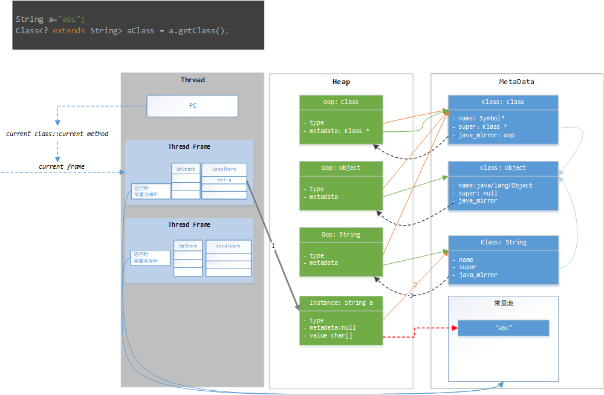

## Reflection: 反射

[TOC]


反射 (Reflection) 是 Java 的特征之一，它允许`运行中`的 Java 程序获取自身的信息，并且可以操作类或对象的内部属性。

> Reflection enables Java code to `discover information about the fields, methods and constructors` of loaded classes, and to use reflected fields, methods, and constructors to operate on their underlying counterparts, within security restrictions.
The API accommodates applications that need access to either the public members of a target object (based on its runtime class) or the members declared by a given class. It also allows programs to suppress default reflective access control.


### 反射的作用

+ 在`运行时`判断任意一个对象所属的类；
+ 在`运行时`构造任意一个类的对象；
+ 在`运行时`判断任意一个类所具有的成员变量和方法（包括private）；

### 反射的常见用途

+ 在IDEA中编码，输入对象后按. IDEA会给提示属性和方法列表。
+ 在Spring，我们在配置文件中配置类的全路径，Spring 就会自动帮我们生成bean


### 反射的底层原理


参考 Hotspot 和JVMS，对象模型图大致如下：



▲ 上图所述，每个String.class 其实就是一个oop，也就是对象。对应第三个绿色的块。他是一个Class类构造出来的实例，所以他的type指向元数据区的Class。他是String类型对应的oop，他的元数据也就是String类的元数据，所以oop-String的metaData指向 klass-String。

按照途中的箭头，a.getClass()方法，首先从局部变量表得到对应引用，这是一个instancOop。 然后根据instanceOop 得到Type-klass，再根据type-klass 得到 java_mirror,也就是oop对象。


这里强调一下我对字段的定义：


+ type： 这个 对象属于什么类型，就指向这个类型的元数据，比如Class类型，全都是由class-Klass创建的。
+ metadata: 如果这个对象的type是class-Klass,那么这个对象是一个已装载的类 的java_mirror, 指向对应的元数据。

oop： 默认的，如果一个对象的type是Class，认为是一个oop, String.class就是一个oop，常见的 方法传入一个Class参数，也是一个oop。他的metaData不为空，表示他是一个元数据 的对象映射。


instanceOop: 对于type不是Class-Klass的类对象，统一叫做instanceOop。 他的metadata为空

Klass结构： 存储类的元数据，包括所有的方法信息，属性信息等。java中 程序是无法访问到这个的，此结构由JVM维护。

+ java_mirror: 每个Klass 还需要生成对应的oop实例，也就是Object.class ，他是Class类的实例，但是他的metadata指向了 元数据Klass数组。
+ super： 类的父类，直接指向父类的klass结构

上图中value数组的红线，只是简写。实际上 value也是一个对象，类型是[char。在常量池中存的也应该是 string对象，而不是具体的数组。


看不懂的话，直接看图吧，这里有点绕。


### getDeclaredMethod 探究


```java
    String a="abc";
    Method method = String.class.getDeclaredMethod("equals",Object.class);
    System.out.println(method.invoke(a, "abc"));
```

```java
public final class Class<T> implements java.io.Serializable,
                              GenericDeclaration,
                              Type,
                              AnnotatedElement {

    private volatile transient SoftReference<ReflectionData<T>> reflectionData;
    /**
     * 返回对应方法，name为名称，papameterTypes为参数
     * Java 中名称和参数列表区分函数，JVM则包含返回值
     */
    @CallerSensitive
    public Method getDeclaredMethod(String name, Class<?>... parameterTypes)
        throws NoSuchMethodException, SecurityException {
        checkMemberAccess(Member.DECLARED, Reflection.getCallerClass(), true);
        //得到所有的方法，在其中搜索，返回        
        Method method = searchMethods(privateGetDeclaredMethods(false), name, parameterTypes);
        if (method == null) {
            throw new NoSuchMethodException(getName() + "." + name + argumentTypesToString(parameterTypes));
        }
        return method;
    }

    /**
     * 返回一个根方法数据对象
     */
    private Method[] privateGetDeclaredMethods(boolean publicOnly){
        checkInitted();
        Method[] res;
        // 获取缓存数据
        ReflectionData<T> rd = reflectionData();
        if (rd != null) {
            res = publicOnly ? rd.declaredPublicMethods : rd.declaredMethods;
            if (res != null) return res;
        }
        // 没有缓存数据可用；getDeclaredMethods0 到JVM中请求数据
        res = Reflection.filterMethods(this, getDeclaredMethods0(publicOnly));
        if (rd != null) {
            if (publicOnly) {
                rd.declaredPublicMethods = res;
            } else {
                rd.declaredMethods = res;
            }
        }
        return res;
    }

    // 懒创建和 缓存 ReflectionData 
    private ReflectionData<T> reflectionData() {
        // 这里是一个软引用,get()可能为空
        SoftReference<ReflectionData<T>> reflectionData = this.reflectionData;
        int classRedefinedCount = this.classRedefinedCount;
        ReflectionData<T> rd;
        if (useCaches &&
            reflectionData != null &&
            (rd = reflectionData.get()) != null &&
            rd.redefinedCount == classRedefinedCount) {
            return rd;
        }
        // else no SoftReference or cleared SoftReference or stale ReflectionData
        // -> create and replace new instance
        return newReflectionData(reflectionData, classRedefinedCount);
    }

    // 反射数据存储结构
    private static class ReflectionData<T> {
        volatile Field[] declaredFields;
        volatile Field[] publicFields;
        volatile Method[] declaredMethods;
        volatile Method[] publicMethods;
        volatile Constructor<T>[] declaredConstructors;
        volatile Constructor<T>[] publicConstructors;
        // Intermediate results for getFields and getMethods
        volatile Field[] declaredPublicFields;
        volatile Method[] declaredPublicMethods;
        volatile Class<?>[] interfaces;

        // Value of classRedefinedCount when we created this ReflectionData instance
        final int redefinedCount;

        ReflectionData(int redefinedCount) {
            this.redefinedCount = redefinedCount;
        }
    }
```

这里使用ReflectionData 来缓存从JVM拿到的反射信息，比较有意思。reflectionData 是软引用，有可能为空。reflectionData 方法先从缓存拿数据，拿不到就请求JVM，创建一个。

> 假设一个对象仅仅具有软引用，则内存空间足够，垃圾回收器就不会回收它；假设内存空间不足了，就会回收这些对象的内存。仅仅要垃圾回收器没有回收它，该对象就能够被程序使用。软引用可用来实现内存敏感的快速缓存。


### 基本类型类 和包装类

+ 每个基本类型对应一个类
+ void 和基本类型的类名就是 void，int...，就是说存在void这个类。
+ 基本类型没有超类，没有实现任何接口

最简的证明就是：

```java
    System.out.println(void.class.getName());// void
```


每个基本类型都有对应的包装类，包装类和基本类不同。int类和Integer类不一样。


```java
public final class Integer extends Number implements Comparable<Integer> {

    @SuppressWarnings("unchecked")
    public static final Class<Integer>  TYPE = (Class<Integer>) Class.getPrimitiveClass("int");

    private final int value;    
```

```java
    public static void main(String[] args) {
        // 基本类型类 和 包装类
        System.out.println(int.class == Integer.class); // false
    }
```


#### 自动装箱：

Java的自动装箱是编译时做的，对于int，编译器 注入一些代码，调用 Integer.valueOf(int) 返回一个包装对象。

```java
/**
 * 自动装箱测试
 */
public class BoxTest {
    public static void main(String[] args) {
        List<Integer> list = new ArrayList<>();
        list.add(1);
        list.add(2);
        System.out.println(list.toString());

    }
}
```

等价于：
```java
public class BoxTest {
    public static void main(String[] args) {
        List<Integer> list = new ArrayList<>();
        list.add(Integer.valueOf(1));
        list.add(Integer.valueOf(2));
        System.out.println(list.toString());
    }
}
```

从指令找证据
```java
  public static void main(java.lang.String[]);
    descriptor: ([Ljava/lang/String;)V
    flags: ACC_PUBLIC, ACC_STATIC
    Code:
      stack=2, locals=2, args_size=1
         0: new           #2                  // opStack:new ArrayList()
         3: dup                                  opStack:list,list           
         4: invokespecial #3                  // ArrayList."<init>"， opStack:list;
         7: astore_1                          // list=list, opStack:;
         8: aload_1                           // opStack:list;
         9: iconst_1                          // opStack:list,1;
        10: invokestatic  #4                  // 自动装箱 Integer.valueOf(1)，opStack:list,Int(1)
        13: invokeinterface #5,  2            // InterfaceMethod java/util/List.add:(Ljava/lang/Object;)Z
        18: pop
        19: aload_1
        20: iconst_2
        21: invokestatic  #4                  // Method java/lang/Integer.valueOf:(I)Ljava/lang/Integer;
        24: invokeinterface #5,  2            // InterfaceMethod java/util/List.add:(Ljava/lang/Object;)Z
        29: pop
        30: getstatic     #6                  // Field java/lang/System.out:Ljava/io/PrintStream;
        33: aload_1
        34: invokevirtual #7                  // Method java/lang/Object.toString:()Ljava/lang/String;
        37: invokevirtual #8                  // Method java/io/PrintStream.println:(Ljava/lang/String;)V
        40: return
```

所以，自动装箱就是编译时，编译器做了手脚，帮我们插入了装箱代码。

#### 泛型擦除

Java的泛型就是个笑话，是“假泛型”。 其实class文件中并不会记录 泛型信息， 泛型的互转是在编译阶段插入类型转换代码来实现的。例如，对于一个ArrayList<Integer>， 等价于 ArrayList<Object>， 每次取出元素后都做一次类型转换。


```java
    public static void typeErasure() {
        List<Integer> list = new ArrayList<Integer>();
        list.add(1);
        System.out.println(list.get(0) + 999);
    }
```

等价于
```java
    public static void typeErasure() {
        List<Object> list = new ArrayList<Object>();
        list.add((Object)Integer.valueOf(1));
        System.out.println(((Integer)list.get(0)).intValue()+999);
    }
```

证据在反编译的指令里：

```
  public static void typeErasure();
    descriptor: ()V
    flags: ACC_PUBLIC, ACC_STATIC
    Code:
      stack=3, locals=1, args_size=0
         0: new           #3                  // class java/util/ArrayList
         3: dup
         4: invokespecial #4                  // Method java/util/ArrayList."<init>":()V
         7: astore_0
         8: aload_0
         9: iconst_1
        10: invokestatic  #5                  // Method java/lang/Integer.valueOf:(I)Ljava/lang/Integer;
        13: invokeinterface #6,  2            // InterfaceMethod java/util/List.add:(Ljava/lang/Object;)Z
        18: pop
        19: getstatic     #7                  // Field java/lang/System.out:Ljava/io/PrintStream;
        22: aload_0
        23: iconst_0
        24: invokeinterface #16,  2           // InterfaceMethod java/util/List.get:(I)Ljava/lang/Object;
        29: checkcast     #13                 // class java/lang/Integer
        32: invokevirtual #14                 // Method java/lang/Integer.intValue:()I
        35: sipush        999
        38: iadd
        39: invokevirtual #15                 // Method java/io/PrintStream.println:(I)V
        42: return
```


10 这里调用 了Integer.valueOf ，也就是自动装箱的逻辑。
13 这里调用 add(Object) 方法，注意，参数是Object类型。
29 checkcast 做类型转换判断，成功，即继续，不成功，抛出异常
32 调用 实例的intValue方法，拆箱

整个过程，泛型信息和泛型转换的合法性，都是编译阶段保证的，泛型信息在编译阶段就被擦去了，运行时，JVM根本不知道一个List\<T\> 的真实类型，它看到的都是List<Object>。


### 反射的运用


#### 获得 Class 对象

1. 使用Class类的forName()静态方法：
```java
Class.forName("com.mysql.jdbc.Driver");
```

2. 调用某个Class的class属性来获取该类对应的Class对象。

```java
Class<?> oop=Person.class;
Class<?> classInt = Integer.TYPE;
```
3. 调用某个对象的 getClass() 方法，比如:
```java
StringBuilder str = new StringBuilder("123");
Class<?> klass = str.getClass();
```


#### 判断是否为某个类的实例

`instanceof` 或者Object::inInstance()都可以


```java
public native boolean isInstance(Object obj);
```
那区别呢：

记得instanceof 在Jvm是有对应的指令的，而isInstance()方法显然调用本地方法，可以理解为是调用了外部的方法；


#### 创建实例

通过反射来生成对象主要有两种方式。

使用Class对象的newInstance()方法来创建Class对象对应类的实例。

```java
Class<?> oclass = String.class;
Object str = oclass.newInstance();
```
```java
//获取String所对应的Class对象
Class<?> oclass = String.class;
//获取String类带一个String参数的构造器
Constructor constructor = oclass.getConstructor(String.class);
//根据构造器创建实例
Object obj = constructor.newInstance("23333");
System.out.println(obj);
```


#### 获取方法


```java
/**
 * 返回类或接口声明的所有方法
 * public、protected、default and private，但不包括继承的方法。
 * 对 私有方法操作，需要设置method.setAccessible(true)
 */
public Method[] getDeclaredMethods() throws SecurityException;

/**
 *  返回所有public 方法，包括继承的
 *  
 */
public Method[] getMethods() throws SecurityException;

/**
 * 返回特定的方法，
 * @param name the name of the method
 * @param parameterTypes the list of parameters
 * @return the {@code Method} object that matches the specified
 *    {@code name} and {@code parameterTypes}
 */
public Method getMethod(String name, Class<?>... parameterTypes);

```


实例：
```java
        Class<? extends Children> oclass = (Class<? extends Children>) Class.forName("Children");
        Children children = oclass.newInstance();
        Method method = oclass.getDeclaredMethod("print");
        // 不开将会抛异常
        method.setAccessible(true);
        method.invoke(children);
```


#### 获取类的成员变量（字段）信息


getFiled：访问公有的成员变量
getDeclaredField：所有已声明的成员变量，但不能得到其父类的成员变量
getFileds 和 getDeclaredFields 方法用法同上（参照 Method）。


```java

/**
 * 返回public属性数组
 * @return the array of {@code Field} objects representing the public fields
 */
public Field[] getFields() throws SecurityException ;


/**
 * 所有已声明的成员变量，但不能得到其父类的成员变量
 * 这里如果访问私有属性的方法，需要调用field.field.setAccessible(true);
 */
public Field[] getDeclaredFields() throws SecurityException;

```


#### 调用方法

```java
public Object invoke(Object obj, Object... args)
        throws IllegalAccessException, IllegalArgumentException,
           InvocationTargetException
```


### 实战：Jdk Proxy[^1] 动态代理

[^1]: [ˈprɒksi]

```java {.line-numbers}
@FunctionalInterface
public interface Talkable {
    void say();
}
///////////////////////////////////////////////////////
public class Cat implements Talkable{
    @Override
    public void say() {
        System.out.println("I am a Cat");
    }
}
///////////////////////////////////////////////////////

public class CatProxy implements InvocationHandler {
    //保存被代理的对象
    private Object target;
    public CatProxy(Object target){
        this.target=target;
    }
    public static void main(String[] args) {
        Talkable proxyInstance = (Talkable)Proxy.newProxyInstance(Cat.class.getClassLoader(),
                Cat.class.getInterfaces(), new CatProxy(new Cat()));
        proxyInstance.say();
    }
    @Override
    public Object invoke(Object proxy, Method method, Object[] args) throws Throwable {
        //proxy:生成的代理对象
        if("say".equals(method.getName())){
            System.out.println("before say");
            Object result = method.invoke(target, args);
            System.out.println("after say");
            return result;
        }
        return null;
    }
}
```

参考：
+ [Java Reflection - Private Fields and Methods](http://tutorials.jenkov.com/java-reflection/private-fields-and-methods.html)
+ [【译】7. Java反射——私有字段和私有方法](https://www.cnblogs.com/penghongwei/p/3300084.html)

