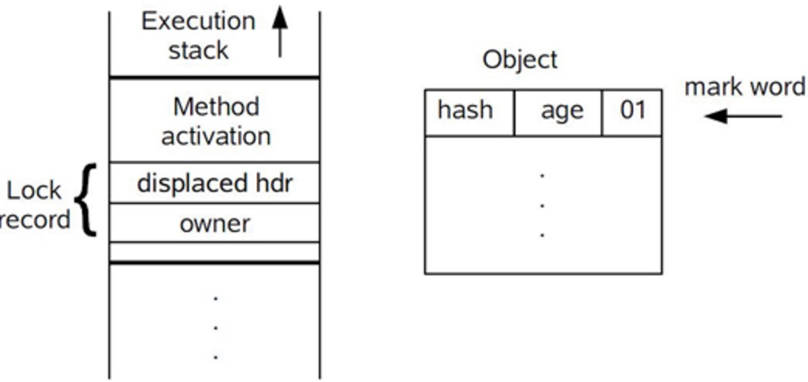
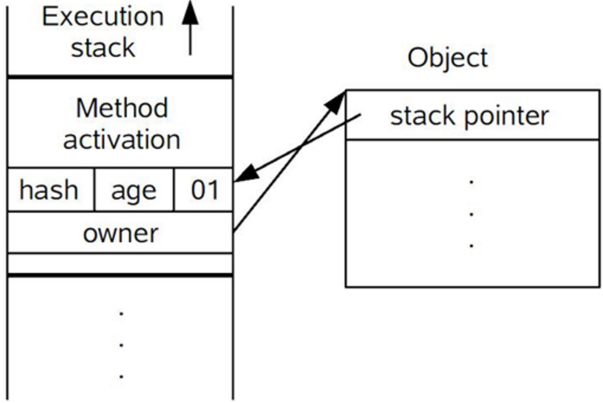
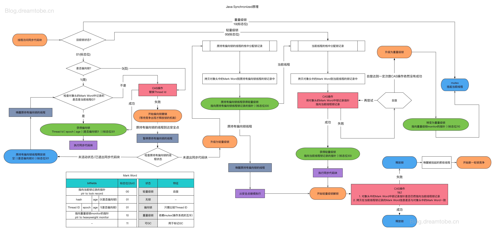

浅谈Java里的锁
-----
:star::star::star::star::star:

[TOC]


## 锁的本质

+ `互斥性`：  只有一个持有者
+ `不可见性`： 只有持有者才知道对变量做了那些修改

锁的原则：

+ `粒度尽量小`：能锁对象就不要锁类，能锁代码块就不要锁方法。
+ `时间要短`：尽量不要占用锁做耗时的操作。

## CAS操作

+ 具有volatile 的读写语义：一致性

```c {}
/** 伪代码
 * CAS 由JVM保证是原子的，不可切分，不存在中间状态
 * 
 * - memoryVar 内存中的值
 * - predictVar 预计内存中应该是什么值
 * - newVar 要设置到内存的值
 */
void CAS(void *memoryVar,int predictVar,int newVar){
    // 如果内存中的值 和上次看到的一致，说明这期间没被修改，写入
    if(*memoryVar==predictVar){
        *memoryVar=newVar;
    }
}
```
## volatile 
* 可见性
	- 当一个线程修改变量后，新值对其他变量是可立即得知的
		- 每次使用都必须重新从主内存装载
		- 每次修改都必须立即写入主内存
* 禁止指令重排序


### volatile实战：线程安全的单例


```java
public class Singleton {

    private volatile static Singleton instance;

    private Singleton() { }

    public static Singleton getInstance(){
        if(instance==null){
            synchronized (Singleton.class){
                if(instance==null){
                    instance=new Singleton();
                }
            }
        }
        return  instance;
    }

    public static void main(String[] args) {
        Singleton.getInstance();
    }
}
```


## 乐观锁和悲观锁

### 悲观锁

总是`假设最坏`的情况，每次去拿数据的时候都认为别人会修改，所以每次在拿数据的时候都会上锁，这样别人想拿这个数据就会阻塞直到它拿到锁（共享资源每次只给一个线程使用，其它线程阻塞，用完后再把资源转让给其它线程）。传统的关系型数据库里边就用到了很多这种锁机制，比如`行锁`，`表锁`等，`读锁`，`写锁`等，都是在做操作之前先上锁。Java中`synchronized`和`ReentrantLock`等独占锁就是悲观锁思想的实现。


### 乐观锁
总是假设最好的情况，每次去拿数据的时候都认为别人不会修改，所以不会上锁，但是在更新的时候会判断一下在此期间别人有没有去更新这个数据，可以使用`版本号机制`和`CAS算法`实现。乐观锁适用于`多读`的应用类型，这样可以提高吞吐量，像数据库提供的类似于write_condition机制，其实都是提供的乐观锁。在Java中`java.util.concurrent.atomic`包下面的原子变量类就是使用了乐观锁的一种实现方式CAS实现的。


+ `乐观锁`适用于`写比较少`的情况下（多读场景）
+ 一般`多写`的场景下用`悲观锁`就比较合适。


乐观锁常见的两种实现方式：

+ 版本号机制
+ CAS


#### 版本号机制
一般是在数据表中加上一个数据版本号version字段，表示数据被修改的次数，当数据被修改时，version值会加一。当线程A要更新数据值时，在读取数据的同时也会读取version值，在提交更新时，若刚才读取到的version值为当前数据库中的version值相等时才更新，否则重试更新操作，直到更新成功。


#### 乐观锁的缺点:
+ ABA问题
+ 循环时间长开销大,自旋CAS（也就是不成功就一直循环执行直到成功）如果长时间不成功，会给CPU带来非常大的执行开销。
+ 只能保证一个共享变量的原子操作


> 如果一个变量V初次读取的时候是A值，并且在准备赋值的时候检查到它仍然是A值，那我们就能说明它的值没有被其他线程修改过了吗？很明显是不能的，因为在这段时间它的值可能被改为其他值，然后又改回A，那CAS操作就会误认为它从来没有被修改过。这个问题被称为CAS操作的 “ABA”问题

> 从 JDK 1.5开始，提供了AtomicReference类来保证引用对象之间的原子性，可以把多个变量放在一个对象里来进行 CAS 操作.所以我们可以使用锁或者利用AtomicReference类把多个共享变量合并成一个共享变量来操作。


> 简单的来说CAS适用于写比较少的情况下（多读场景，冲突一般较少），synchronized适用于写比较多的情况下（多写场景，冲突一般较多）

#### CAS与synchronized的使用情景

对于资源竞争较少（线程冲突较轻）的情况，使用synchronized同步锁进行线程阻塞和唤醒切换以及用户态内核态间的切换操作额外浪费消耗cpu资源；而CAS基于硬件实现，不需要进入内核，不需要切换线程，操作自旋几率较少，因此可以获得更高的性能。

对于资源竞争严重（线程冲突严重）的情况，CAS自旋的概率会比较大，从而浪费更多的CPU资源，效率低于synchronized。

补充： Java并发编程这个领域中synchronized关键字一直都是元老级的角色，很久之前很多人都会称它为 “重量级锁” 。但是，在JavaSE 1.6之后进行了主要包括为了减少获得锁和释放锁带来的性能消耗而引入的 偏向锁 和 轻量级锁 以及其它各种优化之后变得在某些情况下并不是那么重了。synchronized的底层实现主要依靠 Lock-Free 的队列，基本思路是 自旋后阻塞，竞争切换后继续竞争锁，稍微牺牲了公平性，但获得了高吞吐量。在线程冲突较少的情况下，可以获得和CAS类似的性能；而线程冲突严重的情况下，性能远高于CAS。

[面试必备之乐观锁与悲观锁](https://blog.csdn.net/qq_34337272/article/details/81072874)

## AQS:AbstractQueuedSynchronizer


+ 一个Java提高的底层同步工具类，用一个int类型的变量state表示同步状态，并提供了一系列的`CAS`操作来管理这个同步状态。


AQS的主要作用是为Java中的并发同步组件提供统一的底层支持，例如`ReentrantLock`，`CountdowLatch`就是基于`AQS`实现的，用法是通过继承AQS实现其模版方法，然后将子类作为同步组件的内部类。


> Provides a framework for implementing blocking locks and related synchronizers (semaphores, events, etc) that rely on first-in-first-out (FIFO) wait queues.  This class is designed to be a useful basis for most kinds of synchronizers that rely on a single atomic {@code int} value to represent state. Subclasses must define the protected methods that change this state, and which define what that state means in terms of this object being acquired or released.  Given these, the other methods in this class carry out all queuing and blocking mechanics. Subclasses can maintain other state fields, but only the atomically updated {@code int} value manipulated using methods {@link #getState}, {@link #setState} and {@link #compareAndSetState} is tracked with respect to synchronization.

+ 基于`FIFO`等待队列，提供一个框架来实现阻塞锁和相关的同步器(信号量semaphores，events）。
+ 此类基于一个 `volatile` 的`state`，被设计成多数同步类的一个`基础组件`
+ 子类必须重写 改变state 的protected 方法，并且定义 获取和释放这个对象的`意义`。（AQS 并没有强制规定含义）

基于这些，该类的其他方法主要执行阻塞和排队的逻辑。


子类可以维护其他的状态属性，但是只有 使用`getState` 和 `compareAndSetState` 原子地更新，才被视为同步。


>  Subclasses should be defined as non-public internal helper classes that are used to implement the synchronization properties of their enclosing class.  Class {@code AbstractQueuedSynchronizer} does not implement any synchronization interface.  Instead it defines methods such as {@link #acquireInterruptibly} that can be invoked as appropriate by concrete locks and related synchronizers to implement their public methods.

子类应该定义 不对外的内部子类，用它实现 封闭类的同步属性。AQS 没有实现任何同步接口。


```java

public abstract class AbstractQueuedSynchronizer
    extends AbstractOwnableSynchronizer
    implements java.io.Serializable {
    /**
     * The synchronization state.
     */
    private volatile int state;

    /**
     * 如果内存中的值和期待的一致，更新。
     * CAS 的内存语义：read and write
     */
    protected final boolean compareAndSetState(int expect, int update) {
        // See below for intrinsics setup to support this
        return unsafe.compareAndSwapInt(this, stateOffset, expect, update);
    }

    /**
     *  这里是volatile 的，可见性哦
     */
    protected final int getState() {
        return state;
    }
}
```


## synchronized


+ `互斥同步`，对同一线程`可重入`
+ 涉及到阻塞和唤醒线程的系统调用，`系统变态`需要耗费CPU,属于`重量级操作`
+ 由`JVM负责实现`，JVM 底层通过监视锁来实现synchronized,对应的字节码指令：monitorenter，monitorexit


监视锁： 对象的隐藏字段，线程进入同步方法或同步代码块时，线程会获取该方法或代码块所属对象的monitor,进行加锁判断。成功，则本线程称为 此monitor的唯一持有者，monitor在释放前不能被其他线程获取。


$monitor==0$：线程可以持有monitor
$monitor>0$ ：并且持有者是本线程，monitor++
$monitor>0$ ：并且持有者不是本线程，等待锁。

```java
monitorenter(threadId){
    while(monitor!=0&&object.threadId!=threadId){
        //锁不是自己的
        waitForMonitor();
    }
    if(monitor==0){
        monitor=1;
        object.threadId=threadId;
    }else if(monitor!=0&&object.threadId==threadId){
        //锁是自己的
        monitor++;
    }
}

```


JDK1.6 以后，synchronized 提供三种锁的实现：偏向锁，轻量级锁，重量级锁


### 偏向锁


偏向锁：JVM 利用CAS 在对象头上设置ThreadID,表示这个对象偏向于当前线程。偏向锁可以降低无竞争开销，它不是互斥锁，不存在线程竞争，省去再次判断的步骤，提高了性能。


```java

// 偏向锁伪代码
if(obejct.threadID==null){
    // 第一次访问，偏向这个线程,object.threadID=currentThreadID
    CAS(object.threadID,currentThreadID);
}else if(object.threadID==currentThreadID){
    // 本线程已经拥有轻量级锁，不需要重新获取锁
}else{
    // 锁竞争，升级为轻量级锁
}
```


### 轻量级锁


依据：**绝大多的锁，在整个同步周期内都是不存在竞争的。**

轻量级锁使用`CAS`避免了使用互斥量的开销。


object header的组成: 
+ Mark Word: 对象运行时数据
+ 指向方法区对应类的指针
+ 数组长度（只有是数组类型才有）


Mark Word 有2bit 存储锁的状态：
+ 01 未锁定,可偏向
+ 00 轻量级锁
+ 10 膨胀，重量级锁
+ 11 GC标记

过程：

1. JVM在当前线程的栈帧建立一个锁记录（Lock Record）用于存储Mark Word 的拷贝，记为 `Display Mark Word`




2. `CAS 操作`尝试 把对象头的`Mark Word` 指向到`DisPlay Word`, 如果成功，锁标记改为00,加锁成功
    + 如果失败，但Mark Word 指向了`Display Mark Word`, 表示已拥有锁，继续
    + 失败，`Mark Word` 不指向`DMW`,意味着锁被其他线程抢占，膨胀为重量级锁


###重量级锁

+ 传统的锁，使用互斥量


### 锁膨胀流程图
锁膨胀示意图，建议下载原图去看：



参考：
+ 《深入理解Java虚拟机 第二版》

## ReentrantLock: 可重入锁


ReentrantLock 实现Lock接口，组合了Sync，Sync继承自AQS, AQS中定义了volatile 类型的state。AQS.state在不同子类中具体用法不同。在ReetrantLock中，规则如下：
```java
// 算法伪代码
lock(){
    if(state==0){
        getLock();
        state=1;
    }else if(isMyLock()){
        //本来就获取了锁，可重入，所以增加,释放的时候也是一层层减少
        state++;
    }else{
        // 自己没有获得锁，并且锁已经被抢占了，要等待
        waitForLok();
    }
}
```


### 实例：ReentrantLock 公平锁

```java {.line-numbers}
    // 公平锁
    final Lock lock = new ReentrantLock(true);
    final Condition notFull = lock.newCondition();
    final Condition notEmpty = lock.newCondition();
```


## synchronized和ReentrantLock 比较

+ 对象：
    + synchronized: 单锁，一次锁一个，嵌套锁来实现复合锁容易导致死锁
    + ReentrantLock: 可重入锁， 支持同时锁住多个对象
+ 公平：
    + synchronized: 不公平
    + ReentrantLock 
        + 支持公平锁，默认不公平
        + 按照加锁的时间
+ 级别
    + synchronized 是关键字，底层JVM 在字节指令上负责保证
    + ReentrantLock 是类级别，提供了诸如{查询请求锁的次数}等操作，更加灵活
+ 效率
    + synchronized JDK1.7 之前比ReentrantLock 差，1.7或之后效率明显提高
    + 大多数情况下，应当优先考虑synchronized


