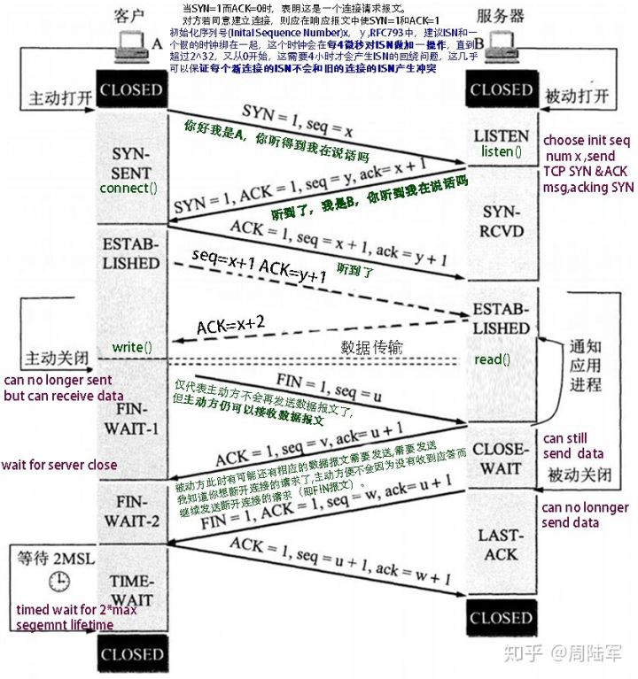
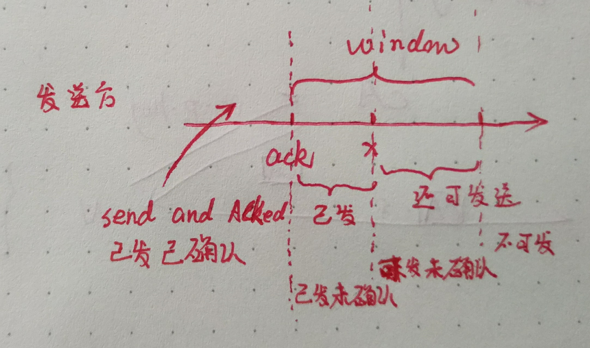
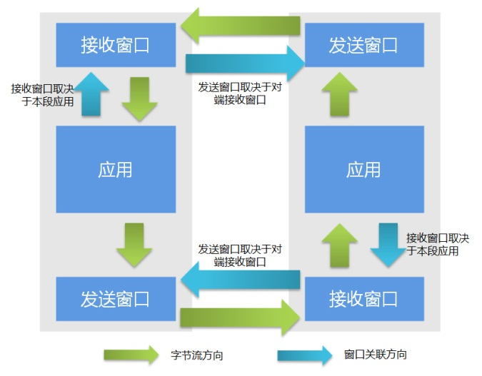

[TOC]


### 计算机网络分层模型

ISO模型：七层。
TCP／IP协议簇模型, 分为四层:

+ 应用层：HTTP,FTP,Telnet,SMTP
+ 传输层：TCP,UDP
+ 网络层：ARP,ICMP,IP
+ 数据链路层:MAC


|协议|端口|数据链路层使用的协议|
|:--|:--:|:--:|
|FTP	|21		|TCP
|Telnet	|23		|TCP
|Http	|80		|TCP
|POP	|110	|TCP
|SMTP	|25		|UDP
|DNS	|53		|UDP
|TFtp	|69		|UDP
|SSH	|22		|   |


### 什么是socket？

socket是用来进行网络通信的，套接字。
java里面已经有封装好这个类了，分为客户端和服务器，通过ip：port来进行访问。


### IO，NIO，AIO，netty

什么是IO，什么是NIO，什么是AIO，什么是netty框架？


IO 逃不掉的两个步骤：

1. 等待 数据缓冲区 可读
2. 将数据从 缓冲区拷贝到内存


#### BIO and NIO and AIO

+ BIO: 等待阻塞，数据拷贝阻塞
	+ 传统的 java.io 包
	+ IO 的效率和扩展性很低,不适合大量并发
+ NIO： 等待不阻塞，数据拷贝阻塞
	+ JDK1.4, java.nio 包，Non-blocking I/O
	+ 提供了 Channel、Selector、Buffer 等新的抽象，可以构建多路复用的、同步非阻塞 IO 程序
+ AIO：不阻塞，拷贝完通知
	+ JDK1.7引入,Asynchronous IO
	+ 回调机制+系统级别异步

以socket.read()为例子：
+ 传统的BIO里面socket.read()，如果TCP RecvBuffer里没有数据，函数会一直阻塞，直到收到数据，返回读到的数据。
+ 对于NIO，如果TCP RecvBuffer有数据，就把数据从网卡读到内存，并且返回给用户；反之则直接返回0，永远不会阻塞。
+ 最新的AIO(Async I/O)里面会更进一步：不但等待就绪是非阻塞的，就连数据从网卡到内存的过程也是异步的。

关注点：
+ BIO，最关心“我要读”
+ NIO，最关心"我可以读了"，
+ AIO，更需要关注的是“读完了”。


#### NIO

+ NIO的主要事件：读就绪、写就绪、有新连接到来。
+ socket主要的读、写、注册和接收函数，在等待就绪阶段非阻塞，真正的I/O操作是同步阻塞的，消耗CPU但性能非常高
+ 可以把工作细分，在不同的线程中执行。
```java
	//选择就绪的事件和对应的连接,select 是阻塞的
	while(channel=Selector.select()){
		if(channel.event==accept){
			//如果是新连接，则注册一个新的读写处理器
			registerNewChannelHandler(channel);
		}
		if(channel.event==write){
			//如果可以写，则执行写事件
			getChannelHandler(channel).channelWritable(channel);
		}
		if(channel.event==read){
			//如果可以读，则执行读事件
			getChannelHandler(channel).channelReadable(channel);
		}
	}
```
Java的Selector对于Linux系统来说，有一个致命限制：同一个channel的select不能被并发的调用。因此，如果有多个I/O线程，必须保证：一个socket只能属于一个IoThread，而一个IoThread可以管理多个socket。


##### NIO应用：


###### 每连接顺序请求的redis：

由于redis服务端是串行的，能够保证同一连接的所有请求与返回顺序一致。这样可以使用单线程＋队列，把请求数据缓冲。然后pipeline发送，返回future，然后channel可读时，直接在队列中把future取回来，done()就可以了。

###### 多连接短连接的HttpClient：

做爬虫时，需要建立很多socket同时爬取多个站点，以socket为key，直接遍历可用事件；


###### 常见的RPC框架，如Thrift，Dubbo：
这种框架内部一般维护了请求的协议和请求号，可以维护一个以请求号为key，结果的result为future的map，结合NIO+长连接，获取非常不错的性能。


### Reactor and Proactor

+ Reactor:NIO,
	1. 等待可用状态
	2. 分发事件给处理函数进行读写。
+ Proactor:AIO，系统级别异步。
	1. 告诉系统 对应的缓冲区 和内存，数据长度，回调函数
	2. 事件分发器调用操作系统API发起新的异步读写（新线程），由操作系统完成读写。读写完成通知分发器。
	3. 分发器呼唤处理器，处理器异步处理后通知分发器


tips:
+ Reactor 回调handler时，表示可以read/write
+ Proactor 回调handler时，表示已完成read/write


NIO（，在Java领域，也称为New I/O），


NIO存在的问题

使用NIO != 高性能，当连接数<1000，并发程度不高或者局域网环境下NIO并没有显著的性能优势。NIO并没有完全屏蔽平台差异，它仍然是基于各个操作系统的I/O系统实现的，差异仍然存在。使用NIO做网络编程构建事件驱动模型并不容易，陷阱重重。

NIO的优点：
+ 事件驱动模型
+ 避免多线程
+ 单线程处理多任务
+ 非阻塞I/O，I/O读写不再阻塞，而是返回0
+ 基于block的传输，通常比基于流的传输更高效
+ 更高级的IO函数，zero-copy
+ IO多路复用大大提高了Java网络应用的可伸缩性和实用性


参考：[Java NIO浅析-美团技术团队](https://www.zhihu.com/search?q=AIO%20NIO&type=content)


netty是用来实现非阻塞IO的一个框架，这个作为拓展点，感兴趣可以去了解一下。我在面试阿里的时候被问到过，其他公司还没问过。


#### Netty

+ 本质：JBoss做的一个Jar包
+ 目的：快速开发高性能、高可靠性的网络服务器和客户端程序
+ 优点：提供异步的、事件驱动的网络应用程序框架和工具

通俗的说：一个好使的处理Socket的东东

参考:[通俗地讲，Netty 能做什么？](https://www.zhihu.com/question/24322387/answer/78947405)

### TCP 和UDP的应用场景
+ TCP:可靠，面向连接
	+ 三次握手，重新确认等机制保证可靠，
	+ 过程略显复杂，有时延
	+ 头部数据多，传输数据百分比略低，但不丢包
	+ 只支持一对一
+ UDP：无连接，面向数据报
	+ 实时性强，安全性略差
	+ 头部数据简单，传输数据百分比高，但可能丢包
	+ 支持一对一，一对多，多对一，多对多通信

可靠性>时效：TCP，文件传输；
时效>可靠性：UDP，视频直播，语音电话等；

### 三次握手
+ ACK,FIN,SYN 是布尔值，分别表示：确认，结束，同步
+ ACK位为`True`时，ack才有效，建立连接后ACK全程为`True`
+ SYN 表示发起一次同步请求，只有双方都发起一次同步请求并且都收到其回复才算建立连接。换而言之，对于一方，只要是发起SYN并且受到对应的ACK，就认为建立连接
+ seq表示本包序列号，ack表示下一个期待接受的序列号

#### 为什么不能两次握手？

TCP事实上是两次`SYN-ACK`对。首先是发送方发送SYN，接收方收到后发送确认，顺便发送同步请求SYN，但是如果只用两次握手，那么接收方就无法收到“发送方对接收方发送的同步请求SYN的确认”。也就是少了第二个SYN的ACK，那么就不知道发送方是否同意了接收方发起的同步请求。


1. 如果sender不同意receiver的SYN，那么receiver却以为同意了，receiver所有发送的报文都不会被sender接收。
2. 如果第二个报文，也就是receiver发送SYN+ACK 没有到达sender，那么sender不会认为链路建立成功，这种情况还属正常

3. 实例：假设两次握手成立。sender发送SYN01,由于网络原因，这个请求没有及时到达receiver,超时后sender发送了第二个SYN02，这次成功建立连接，本次连接结束后，sender的SYN01在网络中终于到达receiver，这时候reveiver就会向sender再发一次ACK，又再一次建立了连接，但这次连接双方都是无用的。


#### 三次握手的隐患

##### SYN- Flood 攻击

+ 出现时间：1996，并经久不衰
+ 手段： 

	1. 攻击者伪造地址对 服务器发起SYN请求
	2. 服务器回应(SYN+ACK)包，而真实的IP会认为，我没有发送请求，不作回应。
	3. 服务 器没有收到回应，这样的话，服务器不知道(SYN+ACK)是否发送成功，默认情况下会重试5次（tcp_syn_retries）。
	4. 服务器半开连接队列被占满，服务带宽被消耗，内存高负载，拒绝其他合法用户访问； 

+ 根本原因：TCP协议的设计缺陷导致的DDos攻击

攻击者如果处于公网，可以伪造IP的话，对于服务器就很难根据IP来判断攻击者，给防护带来很大的困难。很多操作系统，甚至防火墙、路由器都无法有效地防御这种攻击，而且由于它可以方便地伪造源地址，追查起来非常困难。它的数据包特征通常 是，源发送了大量的SYN包，并且缺少三次握手的最后一步握手ACK回复。

##### SYN Flood 防护措施


###### 无效连接监视释放
不停监视系统中半开连接和不活动连接，当达到一定阈值时拆除这些连接，释放系统资源。这种绝对公平的方法往往也会将正常的连接的请求也会被释放掉，”伤敌一千，自损八百“

###### 延缓TCB分配方法

1. Syn Cache技术
	
这种技术在收到SYN时不急着去分配TCB，而是先回应一个ACK报文，并在一个专用的HASH表中（Cache）中保存这种半开连接，直到收到正确的ACK报文再去分配TCB

2. Syn Cookie技术

Syn Cookie技术则完全不使用任何存储资源，它使用一种特殊的算法生成Sequence Number，这种算法考虑到了对方的IP、端口、己方IP、端口的固定信息，以及对方无法知道而己方比较固定的一些信息，如MSS、时间等，在收到对方 的ACK报文后，重新计算一遍，看其是否与对方回应报文中的（Sequence Number-1）相同，从而决定是否分配TCB资源

3． 使用SYN Proxy防火墙

原理：对试图穿越的SYN请求进行验证之后才放行

#### 四次挥手


1. sender->receiver:FIN: sender已经停发数据，可以收数据
2. sender<-receiver:ACK: 收到，但receiver还需要发送数据
3. sender<-receiver:FIN+ACK: receiver: 不再发送数据
4. sender->receiver:ACK：断开连接




#### 四次挥手后为什么等待2MSL

四次挥手中为什么TIME_WAIT状态还需要等2MSL后才能返回到CLOSED状态 

（2点：1可靠的实现TCP全双工链接的终止：大概就是说最后一次发的ACK不一定会被对方接收到，这段等待时间对方可能重发FIN。2允许老的重复的分节在网络中消逝：简单说就是俩个IP的端口建立连接后释放，又马上建立连接，这样后面建立的连接就成了前面连接的化身，等待2MSL是为了防止这种情况出现）

### 窗口滑动协议，快速重传，拥塞避免，慢启动


#### 窗口滑动协议

+ 滑动窗口分为接收窗口和发送窗口

滑动窗口协议是`传输层`进行`流控`的一种措施，接收方通过通告发送方自己的窗口大小，从而控制发送方的发送速度，达到防止发送方发送速度过快而导致自己被淹没的目的。


ACK[ack,window],ACK一般被理解为对接受数据的确认，ACK报文包含两个非常重要的信息：

1. 期望收到的下一字节序号ack，代表接收方已经收到0~ack-1的数据。如果ack=n,此时如果接收方收到的数据编号seq>n,接收方依旧发送ack=n;

2. 窗口大小 window,接收方接收到ACK[ack,window],就能计算出可以发送多少字节给对方。假设发送方发送到x字节， 可以发送的字节数=window-(x-ack),


发送端窗口的第一个字节序号一定是ACK中期望收到的下一个字节序号


上图52 53 54 55 字节都是可以新发送的字节序

接受端窗口的第一个字节序之前一定是已经完全接收的，后面窗口里面的数据都是希望接受的，窗口后面的数据都是不希望接受的。





TCP的滑动窗口主要有两个作用，

1. 提供TCP的可靠性
2. 提供TCP的流控特性。

同时滑动窗口机制还体现了TCP面向字节流的设计思路。TCP 段中窗口的相关字段
TCP的Window是一个16bit位字段，它代表的是窗口的字节容量，也就是TCP的标准窗口最大为$2^{16}-1=65535$个字节。另外在TCP的选项字段中还包含了一个TCP窗口扩大因子，option-kind为3，option-length为3个字节，option-data取值范围0-14。窗口扩大因子用来扩大TCP窗口，可把原来16bit的窗口，扩大为31bit。


当收到接收方新的ACK时，窗口滑动


+ 接收方的窗口大小取决于应用、系统、硬件的限制（TCP传输速率不能大于应用的数据处理速率）

+ 接收方每次收到数据包，发送新的ACK后向右移动窗口。


##### 发送窗口与接收窗口关系

+ TCP是双工协议，所以通信的两方都有各自的发送窗口和接收窗口
+ 应用程序通过改变接收窗口，间接改变发送窗口。



参考：[TCP协议的滑动窗口具体是怎样控制流量的？](https://www.zhihu.com/question/32255109/answer/68558623)


#### 快速重传


图中确认$M_1$,也就是期待M1的下一个序列

发送方只要一连收到三个重复确认就应当立即重传对方尚未收到的报文段M3，而不必 继续等待M3设置的重传计时器到期。由于发送方尽早重传未被确认的报文段，因此采用快重传后可以使整个网络吞吐量提高约20%。

#### 快恢复算法

+ 当sender连续收到三个重复确认，就把ssthresh减半，预防拥塞，但不是执行慢开始
+ 由于发送方现在认为网络很可能没有发生拥塞，因此与慢开始不同之处是现在不执行慢开始算法（即拥塞窗口cwnd现在不设置为1），cwnd=ssthresh,然后执行拥塞避免算法，线性增大拥塞窗口


#### 慢启动，拥塞避免

+ 在TCP建立连接和网络超时的情况下才采用慢启动


发送方控制拥塞窗口的原则是：只要网络没有出现拥塞，拥塞窗口就再增大一些，以便把更多的分组发送出去。但只要网络出现拥塞，拥塞窗口就减小一些，以减少注入到网络中的分组数。

cwnd: 拥塞窗口大小
ssthresh： 慢启动阀值

```c
// 全部发送成功
if(send(cwnd)==true){	
	if(cwnd*2<=ssthresh){ 
		// 慢启动
		cwnd*=2;
	}else{
		// 拥塞避免			
		cwnd++;
	}
}else{		
	// 出现拥塞
	ssthresh=cwnd/2;// 阀值减半
	cwnd=1;	// 重新开始慢启动
}
```

+ cwnd<=ssthresh,慢启动，每次成倍增加cwnd
+ cwnd>ssthresh,拥塞避免，每次稳定加一
+ 出现拥塞，阀值ssthresh减半，cwnd窗口置为1，以便网络中滞留的包能有时间被处理


“拥塞避免”并非指完全能够避免了拥塞。利用以上的措施要完全避免网络拥塞还是不可能的。“拥塞避免”是说在拥塞避免阶段将拥塞窗口控制为按线性规律增长，使网络比较不容易出现拥塞。

[TCP的拥塞控制](https://www.cnblogs.com/losbyday/p/5847041.html)


### 访问网站的背后


当你输入域名访问一个网站的时候，背后的过程是什么？

1. 域名解析，host-dns-ip
2. 建立TCP连接：三次握手
3. 加载资源
	+ CDN
	+ 前后端分离，反向代理，负载均衡


### XSS 和CSRF


#### XSS

XSS:Cross-Site Scripting,跨站脚本攻击

通过技术手段向正常用户请求的HTML页面插入恶意脚本，从而执行；

+ 根源：用户提交的数据没有过滤

+ 造成：前端和后端都可能，如后端的模板文件。
+ 解决方案：
	+ 后端对用户输入的数据做过滤和转义，Spring的HtmlUtils
	+ 前端展示时 以文本格式处理，而不是html，如 innerText而非innerHTML


#### CSRF

CSRF:Cross-Site Request Forgery，跨站请求伪造


+ 根源：HTTP接口没有防范不受信任的调用
+ 造成： 用户在正常登录态，引导用户请求同个域的某个链接以完成用户不知的功能，例如，引导用户自动发起转账请求，自动转账，整个过程用户不可见

+ 防范：
	+ CSRF Token验证，利用浏览器的同源限制，在HTTP接口执行前验证页面或Cookie中设置的Token
	+ 人机交互，如调用网银转账接口时校验短信验证码


案例参考：[CSRF 是什么？](https://www.zhihu.com/search?q=CSRF&type=content)


### 打开百度的首页大概需要多长时间，期间会经过哪些步骤和节点
### CDN是怎么实现的，为什么可以访问到离请求最近的节点

### 如果你有一个简历展示的服务器部署在北京，在湖南访问该服务器（可以直达，不考虑转发），会经过几次往返


### 访问一个服务器的页面有的时候快有的时候慢，影响速度的因素有哪些，怎么求速度

### ARP协议


#### arp，arp攻击

arp 刷新的时机：
	
+ 自己没发送arp广播，却收到响应。
+ 自己发送，收到响应
+ 收到别人的arp广播

arp 攻击可以分为：

+ 伪装为目的主机
	+ 接受到请求目的主机的报文时，伪装成目的主机发送响应报文
	+ 这时候局域网有两台主机发送响应报文，后到达的报文覆盖前一个
	+ 这样会让被伪装的机子直接饥饿，一直收不到包

+ 伪装为网关
	+ 主动发送ARP请求
	+ 接受ARP请求的主机，不管目的IP是否是自己，都会将源IP和源MAC的映射记录到ARP缓存中


### icmp

+ 网络层协议
+ Internet Control Message Protocol：Internet控制报文协议
+ 只负责发现错误，纠正错误由发送方负责
+ ping
	+ `ICMP ECHO`和`ICMP ECHO REPLY`包来探测主机是否存在

+ tracert
	+ IP 生存时间 (TTL) 字段和 ICMP 错误消息
	+ 未到达目的地：[ICMP time exceeded]
	+ 已到目的地[ICMP port unreachable]


