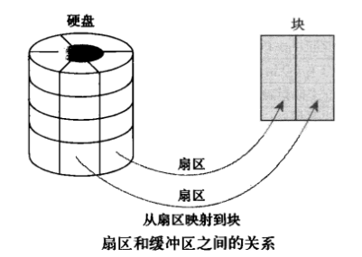

[TOC]


## lsof

可以列出被进程所打开的文件的信息。被打开的文件可以是

1.普通的文件
2.目录抽象为特殊文件
3.网络文件系统的文件，抽象为文件
4.字符设备文件在linux抽象为文件
5.(函数)共享库  
6.管道，命名管道 
7.符号链接
8.底层的socket字流，网络socket，unix域名socket
9.在linux里面，很多东西都抽象为文件，提供了统一的访问接口


```bash
# 文件查看
lsof 文件名
# 文件夹查看
lsof +D 目录名

# 查看mysql程序打开的文件
lsof -c mysql

# 列出所有网络连接
lsof -i
lsof -i tcp

# 列出占用tcp:80端口的c程序
lsof -i tcp:80

```


## 磁盘相关

### df :磁盘占用情况
linux中df命令的功能是用来检查linux服务器的文件系统的`磁盘空间占用情况`。

```bash
$: df
Filesystem     1K-blocks     Used Available Use% Mounted on
/dev/vda1       20510332 10349984   9111824  54% /
udev               10240        0     10240   0% /dev
tmpfs             204888    24864    180024  13% /run
tmpfs             512212        0    512212   0% /dev/shm
tmpfs               5120        0      5120   0% /run/lock
tmpfs             512212        0    512212   0% /sys/fs/cgroup
```


df -h 和df -i的区别是什么？同样是显示磁盘使用情况，为什么显示占用百分比相差甚远？

+ df -h   是去删除比较大无用的文件-----------大文件占用大量的磁盘容量。
+ df -i    则去删除数量过多的小文件-----------过多的文件占用了大量的inode号。


### du：指定文件或目录占用磁盘空间大小

Linux du命令也是查看使用空间的，但是与df命令不同的是Linux du命令是`查看当前指定文件或目录(会递归显示子目录)占用磁盘空间大小`，还是和df命令有一些区别的。


-a或-all  显示目录中个别文件的大小。   

```bash
$: du
404     ./.rpmdb
4       ./.subversion/auth/svn.ssl.server
4       ./.subversion/auth/svn.ssl.client-passphrase
8       ./.subversion/auth/svn.simple
4       ./.subversion/auth/svn.username
24      ./.subversion/auth
56      ./.subversion
16      ./redis-3.0.6/tests/assets
```


## tail

将指定的文件的`最后部分`输出到标准设备，通常是终端，通俗讲来，就是把某个档案文件的最后几行显示到终端上，假设该档案有更新，tail会`自动刷新`，确保你看到最新的档案内容。

显示filename最后20行。
tail -n 20 filename 

监视filename文件的尾部内容（默认10行，相当于增加参数 -n 10），刷新显示在屏幕上。退出，按下CTRL+C

tail -f 

```bash
$: tail -f song.siriuscloud.cc.access.log
117.136.32.84 - - [10/Mar/2019:20:47:19 +0800] "GET /js/jquery.ext.js HTTP/1.1" 200 2478 "http://song.siriuscloud.cc/" "Mozilla/5.0 (Windows NT 10.0; Win64; x64) AppleWebKit/537.36 (KHTML, like Gecko) Chrome/72.0.3626.121 Safari/537.36" "-"
117.136.32.84 - - [10/Mar/2019:20:47:22 +0800] "GET /favicon.ico HTTP/1.1" 200 9662 "http://song.siriuscloud.cc/" "Mozilla/5.0 (Windows NT 10.0; Win64; x64) AppleWebKit/537.36 (KHTML, like Gecko) Chrome/72.0.3626.121 Safari/537.36" "-"
117.136.32.84 - - [10/Mar/2019:20:55:02 +0800] "GET / HTTP/1.1" 304 0 "-" "Mozilla/5.0 (Windows NT 10.0; Win64; x64) AppleWebKit/537.36 (KHTML, like Gecko) Chrome/72.0.3626.121 Safari/537.36" "-"

...
```

## 内存

### free： 显示内存占用情况

free 命令显示系统内存的使用情况，包括物理内存、交换内存(swap)和内核缓冲区内存。

有时我们需要持续的观察内存的状况，此时可以使用 -s 选项并指定间隔的秒数：free -h -s 3


```bash
$: free
             total       used       free     shared    buffers     cached
Mem:       1024428     950188      74240      32620     126992     135432
-/+ buffers/cache:     687764     336664

```

**buffer** 在操作系统中指 buffer cache， 中文一般翻译为 "缓冲区"。要理解缓冲区，必须明确另外两个概念："扇区" 和 "块"。扇区是设备的最小寻址单元，也叫 "硬扇区" 或 "设备块"。`块`是操作系统中文件系统的最小寻址单元，也叫 "文件块" 或 "I/O 块"。每个块包含一个或多个`扇区`，但大小不能超过一个页面，所以一个页可以容纳一个或多个内存中的`块`。当一个`块`被调入内存时，它要存储在一个`缓冲区`中。每个缓冲区与一个块对应，它相当于是磁盘块在内存中的表示(下图来自互联网)：


+ 扇区是物理最小寻址单元
+ 块是操作系统（逻辑）最小寻址单元
+ 每个`块`包含一个或多个`扇区`
+ 一个`页`可以容纳多个`块`


## ls：列出文件列表

```bash
>ls -al
total 124

#属性：文件数：用户名：组别：size：创建时间：文件名
drwx------ 12 root root  4096 Apr 15 14:46 .
drwxr-xr-x 25 root root  4096 Apr 15 15:08 ..
-rw-r--r--  1 root root 32598 Apr 15 15:08 .bash_history
-rw-r--r--  1 root root   653 Jan  1 22:54 .bashrc
```


属性第一个字符：

+ “d”目录direction
+ “l”符号链接link
+ “c”字符专门设备文件
+ “b”块专门设备文件 block
+ “p”先进先出
+ “s”套接字socket

rwx=0x111,二进制表示
* r: read
* w: write
* x: excute
9位权限，每三位分别是：user：group：other


## ps： 打印进程信息

列出所有进程

```
> ps -ef
UID        PID  PPID  C STIME TTY          TIME CMD
root         1     0  0 Jan01 ?        00:01:41 /sbin/init
root         2     0  0 Jan01 ?        00:00:00 [kthreadd]
root         3     2  0 Jan01 ?        00:07:38 [ksoftirqd/0]
root         5     2  0 Jan01 ?        00:00:00 [kworker/0:0H]
root         6     2  0 Jan01 ?        00:00:00 [kworker/u2:0]
```


-ef f:father

ps –el ,
e:every :显示所有进程信息，等价于A
a:all	:显示除了当前终端进程外的其他进程
l: long 长格式显示进程信息。


linux 线程状态：


1. 运行(正在运行或在运行队列中等待) 
2. 中断(休眠中, 受阻, 在等待某个条件的形成或接受到信号) 
3. 不可中断(收到信号不唤醒和不可运行, 进程必须等待直到有中断发生) 
4. 僵死(进程已终止, 但进程描述符存在, 直到父进程调用wait4()系统调用后释放) 
5. 停止(进程收到SIGSTOP, SIGSTP, SIGTIN, SIGTOU信号后停止运行运行) 


ps工具标识进程的5种状态码: 
+ D 不可中断 uninterruptible sleep (usually IO) 
+ R 运行 runnable (on run queue) 
+ S 中断 sleeping 
+ T 停止 traced or stopped 
+ Z 僵死 a defunct (”zombie”) process


```
To see every process on the system using standard syntax:
          ps -e
          ps -ef
          ps -eF
          ps -ely

       To see every process on the system using BSD syntax:
          ps ax
          ps axu

       To print a process tree:
          ps -ejH
          ps axjf
```


```
chmod user:group filename
chmod u+x
```

chmod 对象 +/- 模式
对象：u(user),g(group),o(other),a(all)
模式：r,w,x


## tar：压缩和解压缩 

+ c: create 创建归档文件
+ z: gzip 使用gzip方式对文件压缩或解压缩
+ v: verbose显示命令执行过程
+ f: filename
+ x: extract 提取
+ C: change 跳转到目录 


```bash
# 压缩
tar -zcf test.tar.gz test

# 解压
tar -zxf test.tar.gz  -C /tmp
```


## ln：链接

#### 硬链接和软链接
```bash
# 为test 创建软链接
ln -s test sln
# 为test创建硬链接
ln test hln
ln: ‘test’: hard link not allowed for directory
ln test/test.c  hln

```

+ 软链接指向的是文件名，而硬链接文件的inode(索引号)
```bash
> ls -il
total 8
230628 ----r--r-- 2 root root 19 Apr 15 14:46 hln
230630 lrwxrwxrwx 1 root root  6 Apr 15 15:47 sln -> test.c
230628 ----r--r-- 2 root root 19 Apr 15 14:46 test.c
```

+ inode存放文件和目录的基本信息，包含时间、档名、使用者及群组等


```bash
# 查看文件的inode信息
> stat test.c
  File: ‘test.c’
  Size: 19        	Blocks: 8          IO Block: 4096   regular file
Device: fe01h/65025d	Inode: 230628      Links: 2
Access: (0044/----r--r--)  Uid: (    0/    root)   Gid: (    0/    root)
Access: 2018-04-15 14:46:47.471020064 +0800
Modify: 2018-04-15 14:46:47.471020064 +0800
Change: 2018-04-15 15:48:46.269923224 +0800
 Birth: -
```

+ 硬盘最小存储单位：扇区： $512B=0.5KB$
+ 文件存取的最小单位：块：$8*512B=4KB$

+ 硬盘空间=数据区+$inode$区(inode table)，文件数据存放在数据区，文件元数据存放在inode中

```bash
#已经使用的inode情况
> df -i
Filesystem      Inodes IUsed   IFree IUse% Mounted on
/dev/vda1      1310720 89315 1221405    7% /
udev            125949   273  125676    1% /dev
...
```


+ inode 号是文件的唯一标识

```bash
# 查看文件的inode号
> ls -i test.c 
230628 test.c

```

+ 目录=目录项$[n]$,目录项 : $dirent=inode+filename$
```bash
# 目录即文件，目录文件记录 文件名和inode
> ls -i ../test
230628 hln  230630 sln	230628 test.c
```

+ 权限x 其实是对inode 信息的限制，没有x权限，也就无法读取inode索引信息
> 由于目录文件内只有文件名和$inode$号码，所以如果只有读权限，只能获取文件名，无法获取其他信息，因为其他信息都储存在$inode$节点中，而读取$inode$节点内的信息需要目录文件的执行权限$(x)$。


+ 目录中".",".." 这两个硬链接在创建目录时被创建。

>目录文件的"链接数"。创建目录时，默认会生成两个目录项："."和".."。前者的inode号码就是当前目录的inode号码，等同于当前目录的"硬链接"；后者的inode号码就是当前目录的父目录的inode号码，等同于父目录的"硬链接"。所以，任何一个目录的"硬链接"总数，总是等于2加上它的子目录总数（含隐藏目录）。


+ inode存放硬链接数，当硬链接数为0，即没有inode，则文件系统将文件删除，回收文件数据所在的Block

```bash
>ls -il
# 第三列为硬链接数，软链接不会计数
total 12
230628 ----r--r-- 3 root root 19 Apr 15 14:46 hln
230628 ----r--r-- 3 root root 19 Apr 15 14:46 hln2
230630 lrwxrwxrwx 1 root root  6 Apr 15 16:21 sln -> test.c
230628 ----r--r-- 3 root root 19 Apr 15 14:46 test.c
```


由于inode号码与文件名分离，这种机制导致了一些Unix/Linux系统特有的现象。

>1. 有时，文件名包含特殊字符，无法正常删除。这时，直接删除inode节点，就能起到删除文件的作用。
```bash
#find . -inum INODE_NUM -delete
>find . -inum 230628 -delete
```

>2. 移动文件或重命名文件，只是改变文件名，不影响inode号码。
>3. 打开一个文件以后，系统就以inode号码来识别这个文件，不再考虑文件名。因此，通常来说，系统无法从inode号码得知文件名。

软件比关闭更新：写入同名不同inode的文件，下次启动由于老的inode已经丢失，操作系统回收原来的Block。

>第3点使得软件更新变得简单，可以在不关闭软件的情况下进行更新，不需要重启。因为系统通过inode号码，识别运行中的文件，不通过文件名。更新的时候，新版文件以同样的文件名，生成一个新的inode，不会影响到运行中的文件。等到下一次运行这个软件的时候，文件名就自动指向新版文件，旧版文件的inode则被回收。


#### 软链接和硬链接的区别

综上，总结一下软链接和硬链接的区别：
+ 软链接可以施加在`文件和文件夹`上，而硬链接只能在`文件`上创建
+  软链接指向的是文件名，而硬链接文件的inode(索引号)
+ 硬链接不能跨分区，软链接可以（inode是分区相关的）
+ 可以通过硬链接删除文件，不能通过软链接删除文件。（硬链接数为0则被回收）


参考：[阮一峰的网络日志:理解inode](http://www.ruanyifeng.com/blog/2011/12/inode.html)


### 杂七杂八的命令

$Ctrl+z$ 暂停进程执行

uname -m 显示机器的处理器架构(2) 
uname -r 显示正在使用的内核版本

jobs: 查看后台任务
fg +jobNum： 将后台任务调到前台


未完，不定期更新中...
