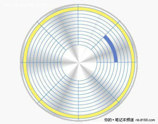

# 物理磁盘

## 扇区

扇区：物理概念

磁盘上的每个磁道被等分为若干个弧段，这些弧段便是磁盘的扇区。硬盘的读写以扇区为基本单位。

磁盘的每一面被分为很多条磁道，即表面上的一些同心圆，越接近中心，圆就越小。而每一个磁道又按512个字节为单位划分为等分，叫做扇区，在一些硬盘的参数列表上你可以看到描述每个磁道的扇区数的参数，它通常用一个范围标识，例如373～746，这表示，最外圈的磁道有746个扇区，而最里面的磁道有373个扇区，因此可以算出来，磁道的容量分别是从186.5KB到373KB(190976B--381952B)

磁盘驱动器在向磁盘读取和写入数据时，要以扇区为单位。在磁盘上，DOS操作系统是以“`簇`”为单位为文件分配磁盘空间的。硬盘的簇通常为多个扇区，与磁盘的种类、DOS 版本及硬盘分区的大小有关。每个簇只能由一个文件占用，即使这个文件中有几个字节，决不允许两个以上的文件共用一个簇，否则会造成数据的混乱。这种以簇为最小分配单位的机制，使硬盘对数据的管理变得相对容易，但也造成了磁盘空间的浪费，尤其是小文件数目较多的情况下，一个上千兆的大硬盘，其浪费的磁盘空间可达上百兆字节。

### 低级格式化

低级格式化就是将磁盘内容重新清空，恢复出厂时的状态:重新划分出柱面和磁道，再将磁道划分为若干个扇区，每个扇区又划分出标识部分ID、间隔区GAP和数据区DATA等。

+ 低级格式化是一种损耗性操作，其对硬盘寿命有一定的负面影响。
+ 数据完全丢失

低格工具：Hard Disk Management Program

## 簇
簇：操作系统层面

微软操作系统（DOS、WINDOWS等）中磁盘文件存储管理的最小单位叫做“簇”

+ 数据存储在硬盘的时候都是以簇为单位
+ 无论文件大小是多少，除非正好是簇大小的倍数，否则文件所占用的最后一个簇或多或少都会产生一些剩余的空间，且这些空间又不能给其它文件使用

+ 不允许两个文件或两个以上的文件共用一个簇，不然会造成数据混乱。

`一个文件通常存放在一个或多个簇里，但至少要单独占据一个“簇”`。 也就是说两个文件不能存放在同一个簇中。

+ 簇（CLUST）的本意就是“一群”、“一组”，即一组扇区(一个磁道可以分割成若干个大小相等的圆弧，叫扇区)的意思。

+ 簇的大小通常是可以变化的，是由操作系统在所谓“`（高级）格式化`”时规定的，因此管理也更加灵活。

### 高级格式化

高级格式化，又称逻辑格式化，它是指根据用户选定的文件系统（如FAT12、FAT16、FAT32、NTFS、EXT2、EXT3等），在磁盘的特定区域写入特定数据，以达到初始化磁盘或磁盘分区、清除原磁盘或磁盘分区中所有文件的一个操作。

高级格式化包括对主引导记录中分区表相应区域的重写、根据用户选定的文件系统，在分区中划出一片用于存放文件分配表、目录表等用于文件管理的磁盘空间，以便用户使用该分区管理文件。

4K对齐是一种高级硬盘使用技术，用特殊方法将文件系统格式与硬盘物理层上进行契合，为提高硬盘寿命与高效率使用硬盘空间提供解决方案。因该技术将**物理扇区与文件系统的每簇4096字节对齐**而得名。

# 内存

## 段：

+ 段的概念
	+ 段表示`访问方式和存储数据等属性相同` 的一段地址空间
	+ 对应一个连续的内存“块”
	+ 若干个段组成进程逻辑地址空间
+ 段访问：逻辑地址由二元组（s, addr）表示
	+ s：段号
	+ addr：段内偏移
    

## 页：

分页系统的核心在于：将虚拟内存空间和物理内存空间皆划分为大小相同的页面，如4KB、8KB或16KB等，并以页面作为内存空间的最小分配单位，一个程序的一个页面可以存放在任意一个物理页面里。

一个程序发出的虚拟地址由两部分组成：页面号和页内偏移值