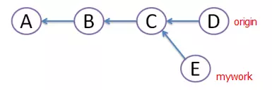
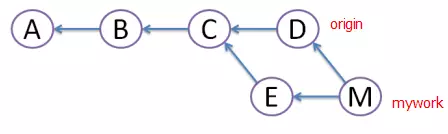
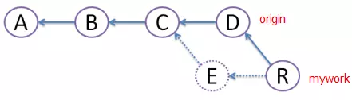

快速合并：当两个分支有直系关系时，使用`快速合并`，git默认都不产生新的commit结点，只是把head进行更新，如dev指向C4。


三方合并稍显复杂点，它会产生一个新的commit结点，并把head指向它。它会先去找这两个要合并分支的最近公有结点，如图中，`C3` 和 `C5`的最近公有父结点为`C1`。然后，git对 `C1`、`C3`和`C5`三个结点进行三方合并产生新结点`C6`。这里的三方合并，具体来说，就是把 `C5`相较于`C1`的 diff 应用到 `C3`上，最后产生`C6` 这个commit结点。


### git 命令


拉取更新
```bash
git pull 
```

查看所有分支
```bash

# 白色是本地，红色是远程
git branch -a
# 删除分支
git branch -D dev
# 删除远程分支
git branch -dr origin/dev-coupon
# 切换到其他分支
git checkout dev-newapp

#  直接将远程分支checkout
git checkout -t origin/2.0.0
```


git remote rm other

```bash
#
查看当前状态
git status

git checkout -b 新分支名称
# 等价于
git branch 新分支名称  	# 建立新分支
git checkout 新分支名称 # 切换到新分支： 
git checkout -b xiaoY origin/
```


```bash
# 删除无用文件，从索引区删除，本地不会删除
git rm -r --cache  .assets
# 删除文件夹， 本地会删除
git rm -r 我的文件夹/
```

### 关联远程仓库

```bash
git remote add origin https://github.com/siriuscc/aaa.git

git push -u origin master
```

如果远程仓库创建后顺便生成了readme.md，会出现：

```
To https://github.com/siriuscc/JavaProject.git
 ! [rejected]        master -> master (non-fast-forward)
error: failed to push some refs to 'https://github.com/siriuscc/JavaProject.git'
hint: Updates were rejected because the tip of your current branch is behind
hint: its remote counterpart. Integrate the remote changes (e.g.
hint: 'git pull ...') before pushing again.
hint: See the 'Note about fast-forwards' in 'git push --help' for details.

```
需要pull一下：

```
git pull --rebase origin master
```


### 合并分支：

```bash
git checkout master	# 切换到主分支
git merge hotfix	# 将 hotfix分支合并到主分支上
```


```bash

git status 
rebase in progress; onto 012ad4d1

# 正在rebase，需要解决冲突然后


git add .

git rebase --continue

# 查看提交树
gitk 


# 切换到master分支
# 拉取一下master分支代码，

git checkout master
git pull     

# 检出为img-multi, 然后合并

git status

git checkout img-multi


gitk

git merge img-multi

# 遇到冲突，解决冲突然后
git add .

git status
gitk

git push
```


merge 和rebase 的区别

1. 假如有三次提交A,B,C，然后在C checkout 一个mywork


2. 在远程分支origin的基础上创建一个名为"mywork"的分支并提交了，同时有其他人在"origin"上做了一些修改并提交了。




checkout mywork
merge origin


用git pull命令把"origin"分支上的修改pull下来与本地提交合并（merge）成版本M，但这样会形成图中的菱形，让人很困惑。


git pull --rebase 

创建一个新的提交R，R的文件内容和上面M的一样，但我们将E提交废除，当它不存在（图中用虚线表示）。由于这种删除，小李不应该push其他的repository.rebase的好处是避免了菱形的产生，保持提交曲线为直线，让大家易于理解




在rebase的过程中，有时也会有conflict，这时Git会停止rebase并让用户去解决冲突，解决完冲突后，用git add命令去更新这些内容，然后不用执行git-commit,直接执行git rebase --continue,这样git会继续apply余下的补丁。在任何时候，都可以用git rebase --abort参数来终止rebase的行动，并且mywork分支会回到rebase开始前的状态。


#### down下线上代码版本,抛弃本地的修改

不建议这样做,但是如果你本地修改不大,或者自己有一份备份留存,可以直接用线上最新版本覆盖到本地

git fetch --all

git reset --hard origin/master

git fetch


#### 服务器上有修改，本地有修改，pull 失败

```bash
# 存储本地，然后再去拉
git stash 
git pull
git stash pop 
```


#### win10加速git :

```bash
git config --global core.preloadindex true
git config --global core.fscache true
git config --global gc.auto 256
```

> core.preloadindex并行执行文件系统操作以隐藏延迟(更新：默认情况下在git 2.1中启用)
> core.fscache修复UAC问题，所以你不需要运行git作为管理(更新：默认情况下在Git为Windows 2.8启用)
> gc.auto最小化.git中的文件数/


### git 配置密匙


设置git：
设置git的user name和email：
```bash
git config --global user.name "xxx"
git config --global user.email "xxx@163.com"
```


生成密钥：
```bash
ssh-keygen -t rsa -C "xxx@163.com"
```
按3个回车，密码为空这里一般不使用密钥。
最后得到了两个文件：id_rsa和id_rsa.pub


添加公钥
复制本地~/.ssh/id_rsa.pub 中的公钥，添加进代码托管的仓库SSH Key配置中去,然后本地就可以正常使用了
注：以上涉及xxx的是你项目代码托管仓库(如github、gitlab)的用户名、邮箱


解决：unable to access 'https://github.com/yuanlunchuan/spring4Angular.git/': OpenSSL SSL_connect: SSL_ERROR_SYSCALL in connection to github.com:443

```bash
git config --global http.sslVerify false"
```

### git 迁移

目标，现在有两个库，要整个成一个：xiaoY note


方案，新建一个库


关联本地代码库到云端
```git
git init
git add
git commit -m
git remote add orign https://github.com/siriuscc/xiaoY-Note.git
git push
```


git remote add other ../xiaoY/


git push -u origin master 上面命令将本地的master分支推送到origin主机


查看git上个人代码量
git log --author="username" --pretty=tformat: --numstat | awk '{ add += $1; subs += $2; loc += $1 - $2 } END { printf "added lines: %s, removed lines: %s, total lines: %s\n", add, subs, loc }' -

统计每个人的增删行数
git log --format='%aN' | sort -u | while read name; do echo -en "$name\t"; git log --author="$name" --pretty=tformat: --numstat | awk '{ add += $1; subs += $2; loc += $1 - $2 } END { printf "added lines: %s, removed lines: %s, total lines: %s\n", add, subs, loc }' -; done

查看仓库提交者排名前 5
git log --pretty='%aN' | sort | uniq -c | sort -k1 -n -r | head -n 5

贡献者统计：
git log --pretty='%aN' | sort -u | wc -l

提交数统计：
git log --oneline | wc -l

