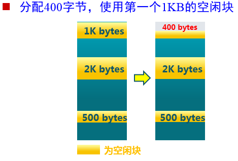
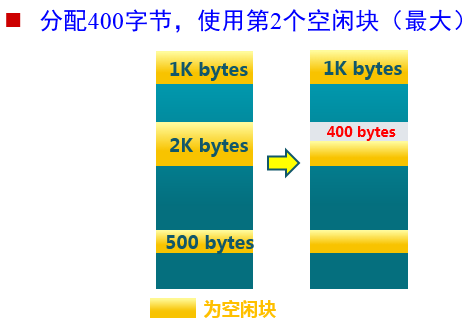

[TOC]

### 连续内存分配

#### 最先匹配：First Fit Allocation

+ 原理与实现：
	* 空闲分区列表按地址顺序排序
	* 分配过程时，搜索一个合适的分区
	* 释放分区时，检查是否可与临近的空闲分区合并
+ 优点：
	* 简单
	* 在高地址空间有大块的空闲分区

+ 缺点：
	* 外部碎片
	* 分配大块时较慢

#### 最佳匹配：Best Fit Allocation

思路：分配n字节分区时， 查找并使用不小于n的最小空闲分区

+ 原理与实现
	* 空闲分区列表按照大小排序
	* 分配时，查找一个合适的分区
	* 释放时，查找并且合并临近的空闲分区（如果找到）
+ 优点
	* 大部分分配的尺寸较小时，效果很好
	* 可避免大的空闲分区被拆分
	* 可减小外部碎片的大小
	* 相对简单
+ 缺点
	* 外部碎片
	* 释放分区较慢,合并相邻分区的工作并不容易处理
	* 容易产生很多无用的小碎片

#### 最差匹配: Worst Fit Allocation

思路：分配n字节，使用尺寸不小于n的最大空闲分区

+ 原理与实现
	* 空闲分区列表按由大到小排序
	* 分配时，选最大的分区
	* 释放时，检查是否可与临近的空闲分区合并，进行可能的合并，并调整空闲分区列表顺序

+ 优点
	* 中等大小的分配较多时，效果最好
	* 避免出现太多的小碎片
+ 缺点
	* 释放分区较慢
	* 外部碎片
	* 容易破坏大的空闲分区，因此后续难以分配大的分区

####连续内存分配的缺点：

- 分配给程序的物理内存必须连续
- 存在外部碎片和内部碎片
- 内存分配的动态修改困难
- 内存利用率较低

###　非连续内存

####段地址空间
 
更细粒度和灵活的分离与共享

进程的段地址空间由多个段组成：

* 主代码段
* 子模块代码段
* 公用库代码段
* 堆栈段(stack)
* 堆数据(heap)
* 初始化数据段
* 符号表等

------------
+ 段的概念
	+ 段表示`访问方式和存储数据等属性相同` 的一段地址空间
	+ 对应一个连续的内存“块”
	+ 若干个段组成进程逻辑地址空间
+ 段访问：逻辑地址由二元组（s, addr）表示
	+ s：段号
	+ addr：段内偏移

#### 页式存储管理	

+ 页帧（帧、物理页面, Frame, Page Frame）
	* 把物理地址空间划分为大小相同的基本分配单位 ,$2^n$，如512, 4096, 8192
+ 页面（页、逻辑页面, Page）
	* 把逻辑地址空间也划分为相同大小的基本分配单位
+ 页面到页帧
	* 逻辑地址到物理地址的转换
	* 页表
	* MMU/TLB

##### 帧 (Frame):
物理内存被划分成大小相等的帧	

内存物理地址的表示：二元组 (f, o)
+ f ：帧号 (F 位, 共有$2^F$ 个帧)
+ o：帧内偏移 (S 位, 每帧有$2^S$ 字节)
+ 物理地址：$f * 2^S + o$

#####页(Page)

进程逻辑地址空间被划分为大小相等的页

页内偏移 = 帧内偏移
通常：页号大小 ≠ 帧号大小

进程逻辑地址的表示：二元组 (p, o)
+ p：页号 (P 位, $2^P$ 个页)
+ o：页内偏移 (S 位, 每页有$2^S$ 字节)
+ 虚拟地址 $= p * 2^S + o $

##### 页式存储中的地址映射
页到帧的映射：逻辑地址中的页号是连续的,映射到物理地址中的物理帧号就变成是不连续的

##### 页表
+ 页表保存了逻辑地址到物理地址之间的映射关系
+ 每个进程拥有一个页表，随着进程的变化而变化

#####页式存储管理机制的性能问题

+ 访问一个内存单元需要2次内存访问
	+ 第一次访问：获取页表项
	+ 第二次访问：访问数据
+ 页表大小问题：
	+ 页表可能非常大
	+ 64位机器如果每页1024字节，那么一个页表的大小会是多少？
+ 如何处理?
	+ 缓存（Caching）
	+ 间接（Indirection）访问

#####段页式存储管理

在段式存储管理基础上，给每个段加一级页表

###页置换
场景：内存里所有帧都被分配了，无法将虚拟内存中的页映射到新的帧上

使用修改位，只有修改过的才被回写到硬盘

页置换的基本方法
1. 查找所需页在磁盘上的位置（假设页已经被写到磁盘）
2. 查找一空闲帧
	+ 如果有空闲帧，那么就使用它
	+ 如果没有空闲帧，那么就使用页置换算法以选择一个“牺牲”帧（victim frame）。
	+ 将“牺牲”帧的内容写到磁盘上（如果是脏页）；改变页表和帧表。
3. 将所需页读入（新）空闲帧；改变页表和帧表
4. 重启用户进程。

####页面置换算法

+ 局部页面置换算法--------->当前进程占用的物理页面内
	+ 最优算法、先进先出算法、最近最久未使用算法
	+ 时钟算法、最不常用算法

+ 全局页面置换算法-------->所有可换出的物理页面
	+ 工作集算法、缺页率算法

#####最优页面置换算法(OPT, Optimal)

+ 基本思路: 置换在未来最长时间不访问的页面
+ 算法实现:
	1. 缺页时，计算内存中每个逻辑页面的下一次访问时间（无法计算）
	2. 选择未来最长时间不访问的页面

+ 算法特征
	+ 缺页最少，是理想情况
	+ 实际系统中无法实现， 无法预知每个页面在下次访问前的等待时间
	+ 作为置换算法的性能评价依据

##### 先进先出算法（FIFO）

+ 思路： 选择在内存驻留时间最长的页面进行置换

+ 实现:  优先队列。堆排序，链表实现
	1. 维护一个记录所有位于内存中的逻辑页面链表：
	2. 链表元素按驻留内存的时间排序，链首最长，链尾最短
	3. 出现缺页时，选择链首页面进行置换，新页面加到链尾
+ 特征
	+ 实现简单
	+ 性能较差，调出的页面可能是经常访问的
	+ 进程分配物理页面数增加时，缺页并不一定减少Belady[^1]现象
	+ 很少单独使用

[^1]:Belady: 对有的页置换算法，页错误率可能会随着所分配的
帧数的增加而增加

#####最近最久未使用算法（LRU）
LRU: Least Recently Used

+ 思路
	+ 选择最长时间没有被引用的页面进行置换
	+ 如某些页面长时间未被访问，则它们在将来还可能会长时间不会访问。

+ 实现
	+ 缺页时，计算内存中每个逻辑页面的上一次访问时间
	+ 选择上一次使用到当前时间最长的页面
+ 特征
	+ 最优置换算法的一种近似，最优置换是基于未来可知的。
	+ 这里认为未来是过去的一种延续，是基于过去的。

+ 每次使用完就把这个页放到堆顶，把其他的页往后挪。这里应该是链表实现。
+ 缺页就置换最后那个页。
+ 开销比较大，很少计算机系统支持真正的LRU算法

#####时钟置换算法（Clock）

+ 思路
	+ 仅对页面的访问情况进行大致统计
+ 数据结构
	+ 在页表项中增加访问位(reference bit)，描述页面在过去一段时间的内访问情况
	+ 各页面组织成环形链表（循环队列）
	+ 指针指向最先调入的页面
+ 算法
	+ 访问页面时，在页表项记录页面访问情况
	+ 缺页时，从指针处开始顺序查找未被访问的页面进行置换
+ 特征
	+ 时钟算法是LRU和FIFO的折中

+ 时钟置换算法的实现
	1. 页面装入内存时，访问位初始化为0
	2. 访问页面（读 写 时，访问位 置1
	3. 缺页时，从指针当前位置顺序检查环形链表
		+ 访问位为0 ，则置换该页
		+ 访问位为 1，则访问位 置1 （相当于给该页第二次机会），并指针移动到下一个页面，直到找到可置换的页面
	4. 所以也叫二次机会算法（Second chance Algorithm）

##### 最不常用算法（LFU）

LFU： Least Frequently Used

+ 思路
	+ 缺页时，置换访问次数最少的页面
+ 实现
	+ 每个页面设置一个访问计数
	+ 访问页面时，访问计数加
	+ 缺页时，置换计数最小的页面
+ 特征
	+ 算法开销大
	+ 开始时频繁使用，但以后不使用的页面很难置换
+ 解决方法：计数定期右移（即计数减半）
	+ LRU和LFU的区别
	+ LRU关注多久未访问，LFU关注访问次数

##### LRU、FIFO的比较

+ LRU依据页面的最近访问时间排序
+ LRU需要动态地调整顺序

+ FIFO依据页面进入内存的时间排序
+ FIFO的页面进入时间是固定不变的
+ LRU可退化成FIFO

#####LRU、FIFO和Clock的比较
+ LRU算法性能较好，但系统开销较大。(需要维护优先队列)
+ FIFO算法系统开销较小，会发生Belady现象
+ Clock算法是它们的折衷
	+ 对于未被访问的页面，Clock和LRU算法的表现一样好
	+ 对于被访问过的页面，Clock算法不能记录准确访问顺序，而LRU算法可以

#### 什么是缓存？有哪些缓存的更新算法？
这个太基础了。。。肯定得会的，缓存的更新算法用的最多的应该就是LRU。

