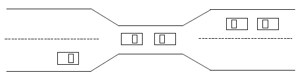
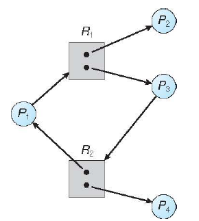
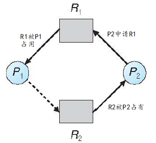
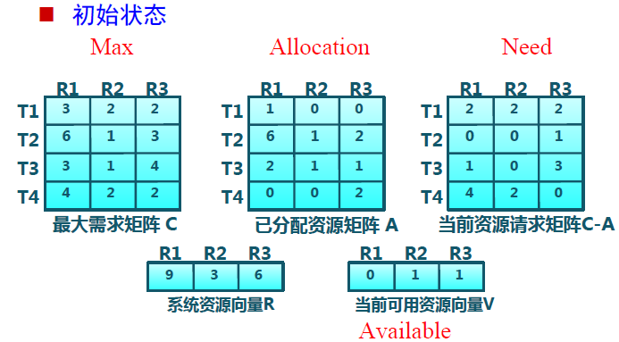
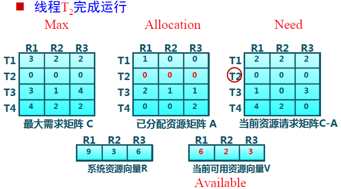
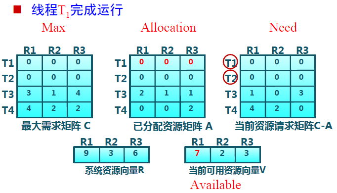
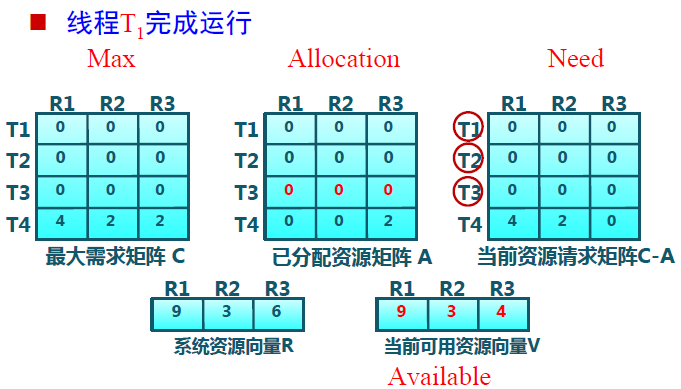
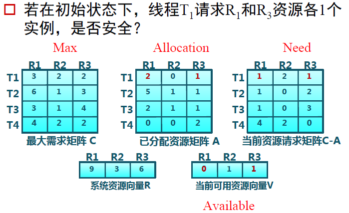

死锁问题
---
[TOC]


## 死锁情形

一组阻塞的进程，每个进程均占有一个资源，并且都在等待获得另外一个资源，而它们所等待的资源已经被这组进程中的其中一个进程所占有，这个情形便是死锁


例子1：哲学家进餐问题
> 当每个哲学家同时拿起他左边的叉子时

例子2：磁盘驱动器
> 系统有两个磁盘驱动器，P1、P2进程各占有一个并在请求另外一个

例子3：信号量
```
P1:
wait(A);
wait(B);

P2:
wait(B);
wait(A);
```


例子4：过桥（单行道）
桥的每一段可以看成是一个资源
死锁发生时，可以让若干汽车后退


抢占（preempt）资源和回退（rollback）


## 进程访问资源的流程

+ 系统拥有一定数量的资源：CPU周期、内存空间、I/O设备、文件
    + 可重用资源(Reusable Resource)：
        + 硬件：处理器、I / O通道、主和副存储器、设备等
        + 软件：文件、数据库和信号量等数据结构
    + 消耗资源(Consumable resource):
        + 在I/O缓冲区的中断、信号、消息等


+ 进程访问资源的流程：
    + 申请（request）：申请空闲资源
    + 使用（use）：进程占用资源
    + 释放（release）：资源状态由占用变成空闲

+ 如果图`没有环`，那么系统就`没有`进程死锁
+ 如果图`有环`，那么`可能`存在死锁：
    + 如果每个资源类型`只有一个实例`，那么`出现`死锁
    + 如果每个资源类型`有几个实例`，那么`可能出现`死锁


    

## 死锁的必要条件：


如果在一个系统中下面4个条件同时满足，那么会引起死锁：
+ `互斥`（Mutual exclusion）：同一时刻只能有一个进程使用一个资源实例
+ `持有并等待`（Hold and wait）：一个进程必须占有至少一个资源，并等待另一资源，而该资源为其他进程所占用
+ `非抢占`（No preemption），资源不能被抢占
+ `循环等待`（Circular wait）：一组进程{P0, P1, …, Pn}，P0等待的资源为P1所占有，P1等待的资源为P2所占有，……，Pn等待的资源为P0所占有

## 死锁处理方法

+ 死锁预防(Deadlock Prevention): 确保系统永远不会进入死锁状态
+ 死锁避免(Deadlock Avoidance)：在使用前进行判断，只允许不会出现死锁的进程请求资源
死锁检测和恢复(Deadlock Detection & Recovery)：在检测到运行系统进入死锁状态后，进行恢复
由应用进程处理死锁：通常操作系统忽略死锁，大多数操作系统（包括UNIX）的做法


### 死锁预防

破坏四个必要条件：


+ 互斥：
    + 对于`共享资源`，不要求互斥访问，`不会`涉及死锁
    + 对于非共享资源，必须要有互斥条件
+ 持有并等待
    + 仅允许进程在开始执行时，`一次请求`所有需要的资源，资源利用率低
+ 非抢占
    + 如进程请求`不能`立即分配的资源，则`释放已占有资源`
    + 只在能够同时获得所有需要资源时，才执行分配操作
+ 循环等待
    + 对资源排序，要求进程按顺序请求资源


### 死锁避免

利用额外的先验信息，在分配资源时判断是否会出现死锁，只在不会死锁时分配资源
+ 要求进程声明需要资源的最大数目
+ 限定提供与分配的资源数量，确保满足进程的最大需求
+ 动态检查的资源分配状态，确保不会出现环形等待


#### 安全状态


某个时刻，系统按 $\{P_1, P_2, …, P_n \}$ 顺序为每个进程分配资源，记 $P_i$ 本次申请资源为 $x$
+ 系统总资源为M


+ $P_1,P_2 \cdots P_{i-1}$ 的所占资源总和为 $S_{i-1}$
+ 系统当前可用资源 $A =M-S_{i-1}$

对于每个$P_i$：


+ $P_i$ 申请的资源 $x<A+ S_{i-1}$ ，则系统处于`安全状态`：$x<M$
+ $m_i>A$ ：$P_i$ 所需要的资源不能立即可用，$P_i$ `等待资源`
+ 当 $P_i$ 完成时，释放其所分配的资源并终止，可用资源A`增加`


### 不进入不安全状态 
+ 如果系统在安全状态=> 则不会死锁
+ 如果系统在不安全状态=> 则可能会死锁
+ 死锁避免=> 确保系统永不会进入不安全状态

```
系统中有12台磁带驱动器和3个进程

   MAXNeeds current
p0    10    5
p1     4    2
p2     9    2

此刻，顺序<P1, P0, P2>满足安全条件
若P2 current=3，则系统会进入不安全状态
```


### 资源分配图算法（Resource-Allocation Graph）
适用于每种资源类型只有一个实例的情形




### 银行家算法（Banker’s Algorithm）
适用于每种资源类型有多个实例的情形


银行家算法是一个避免死锁产生的算法。以银行借贷分配策略为基础，判断并保证系统处于安全状态
+ 客户在第一次申请贷款时，声明所需最大资金量，在满足所有贷款要求并完成项目时，及时归还
+ 在客户贷款数量不超过银行拥有的最大值时，银行家尽量满足客户需要
+ 该算法由Dijkstra于1968年提出


对系统的描述：

+ 每个进程必须事先声明其需要的每个资源的最大数量
+ 当一个进程申请一个资源时，可能需要等待
+ 当一个进程得到了它所需要的所有资源后，必须在有限时间内归还





判断当前剩余的资源能否满足某线程运行的最大需求，可以的话释放这个线程所有资源（相当于执行并结束）。循环这个过程。如果能释放所有的线程，则系统是安全的。






