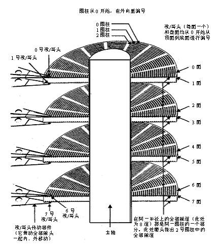

## 固态和机械
Hard Disk Drive：主要由：盘片，磁头，盘片转轴及控制电机，磁头控制器，数据转换器，接口，缓存等几个部分组成。读写需要移动磁头，物理运动。

Solid State Drives：固态电子存储芯片阵列而制成的的硬盘

+ 历史：
	+ 机械硬盘：1956年
	+ 固态硬盘: 1970年
+ 速度：
	+ 机械硬盘：
		+ 5400转：50-90MB/s
		+ 7200转：90-190MB/s
	+ 固态硬盘: 
		+ r:400M/s   
		+ w:130M/s
+ 抗震：
	+ 机械硬盘：需要磁头寻道，震动敏感
	+ 固态硬盘：电子电路，较不敏感
+ 功耗和噪音
	+ 机械：磁头物理运动，功耗大，有噪音
	+ 固态：功耗小，无噪音

+ 数据恢复：
	+ 机械：成功率还是比较高的
	+ 固态：很难恢复，需要足够幸运，特别是遇到动态GC技术，不可恢复


## 机械硬盘




一个磁盘由大小相同且同轴的圆形盘片组成，磁盘可以转动（各个磁盘必须同步转动）。

图中左边有磁头支架固定一组磁头，每个磁头负责存取一个磁盘的内容。磁头不能转动，但是可以沿磁盘半径方向运动（实际是斜切向运动），每个磁头同一时刻也必须是同轴的，即从正上方向下看，所有磁头任何时候都是重叠的（不过目前已经有多磁头独立技术，可不受此限制）。


磁盘是被划分为多个磁道（同心圆）,每个磁道划分为多个大小相等的扇区。很多示意图画的不准确，其实外面的磁道的扇区数量是比内部的多的。


机械硬盘的读取：

1. 系统会将数据逻辑地址传给磁盘，磁盘的控制电路按照寻址逻辑将逻辑地址翻译成物理地址，得到坐标（磁道，扇区）
2. 寻道：磁头作斜切运动，找到对应磁道
3. 旋转：主轴旋转，使得磁头正对指定的扇区
4. 旋转读取

### 局部性原理与磁盘预读

由于存储介质的特性，磁盘本身存取就比主存慢很多，再加上机械运动耗费，磁盘的存取速度往往是主存的几百分之一，因此为了提高效率，要尽量减少磁盘I/O。为了达到这个目的，磁盘往往不是严格按需读取，而是每次都会`预读`，即使只需要一个字节，磁盘也会从这个位置开始，顺序向后读取一定长度的数据放入内存。这样做的理论依据是计算机科学中著名的局部性原理：

**当一个数据被用到时，其附近的数据也通常会马上被使用。**

程序运行期间所需要的数据通常比较集中。

由于磁盘顺序读取的效率很高（不需要寻道时间，只需很少的旋转时间），因此对于具有局部性的程序来说，预读可以提高I/O效率。

预读的长度一般为页（page）的整倍数。页是计算机管理存储器的逻辑块，硬件及操作系统往往将主存和磁盘存储区分割为连续的大小相等的块，每个存储块称为一页（在许多操作系统中，页得大小通常为4k），主存和磁盘以页为单位交换数据。当程序要读取的数据不在主存中时，会触发一个缺页异常，此时系统会向磁盘发出读盘信号，磁盘会找到数据的起始位置并向后连续读取一页或几页载入内存中，然后异常返回，程序继续运行。


## 固态硬盘选择

###主控：

+ 基本是基于ARM架构的处理核心。
+ 固态硬盘的功能、规格、工作方式等正是由这颗小小的芯片控制的

+ 主控芯片在SSD中的作用 类似CPU对于电脑：

	+ 主要面向调度、协调和控制整个SSD系统
	+ 负责合理调配数据在各个闪存芯片上的负荷
	+ 承担整个数据中转，连接闪存芯片和外部SATA接口
	+ ECC纠错、耗损平衡、坏块映射、读写缓存、垃圾回收以及加密等一系列的功能。

###NAND闪存：

+ 产品的用料
+ 颗粒的传统分类：
	+ SLC:Single-Level Cell
		+ 1bit/存储单元
		+ 只有0/1 状态， 速度最快
	+ MLC:Multi-Level Cell
		+ 2bit/存储单元
		+ 分类：
			+ Enterprise Synch MLC（企业级同步MLC） 可靠性和寿命针
			+ Synch/Toggle MLC（同步颗粒），其中Toggle MLC多为东芝出品，
			+ Asynch MLC（异步颗粒），价格便宜量又足，不过性能比同步颗粒差。
		+ MLC的P/E次数至少还有3000-5000次	

	+ TLC:Trinary-Level
		+ 3bit/存储单元
		+ TLC会花更多时间来读取数据
		+ 提升了容量
		+ 实现复杂，需要精确的电压控制
		+ TLC公认的P/E指标是1000次

+ 3D NAND闪存
	+ 传统平面NAND闪存现在还谈不上末路，主流工艺是15/16nm
	+ 工艺越先进，NAND的氧化层越薄，可靠性也越差
	+ 堆叠更多的层数


### 固件算法：
+ SSD的固件是确保SSD性能的最重要组件，用于驱动控制器。
+ 主控将使用SSD中固件算法中的控制程序，去执行自动信号处理，耗损平衡，错误校正码（ECC），坏块管理、垃圾回收算法、与主机设备（如电脑）通信，以及执行数据加密等任务。
+ 由于固件冗余存储至NAND闪存中，因此当SSD制造商发布一个更新时，需要手动更新固件来改进和扩大SSD的功能。
+ 一块SSD中颗粒对性能的影响大约占60%，而固件与主控的影响会在20%左右
+ Intel、闪迪、英睿达、浦科特、OCZ、三星


+ 看主控
	Marvell：浦科特、闪迪

+ 看看闪存
	+ 大小推荐256
	+ P/E 不是问题，但是没必要买TLC
	+ 首先是那些可以自己生产闪存的厂家：Intel、美光、三星、海力士、东芝、闪迪。
+ 看固件
	+ Intel、英睿达、浦科特、OCZ、三星
	+ 市面上绝大部分SSD使用时间长了，速度都会变慢，这是SSD的写入方式导致的

+ 看缓存
	+ 市面上绝大部分SSD使用时间长了，速度都会变慢，这是SSD的写入方式导致的
	
> 为了真实的反映TLC SSD的性能，最简单的方法就是将测试数据区块扩大，测试数据大小大于缓存，才能让TLC真实读取性能现出原形。如三星850 EVO当遇到大量写入，持续大数据写入量的话，后劲会明显不足，用完缓存很快溢出，此时三星850 EVO就该露馅了，从400MB/S降到70MB/S甚至更小。<br>　　一般来说，缓存越大越好。


+ 看性能
	+ 读写速度不是最大的关注点，大数据量的读写场景并不常见
	+ SSD的4K IOPS性能（即每秒输入输出值）
	+ IOPS是指存储每秒可接受多少次主机发出的访问

+ 考虑参数：
	+ 有无断电保护
		+ SSD有意外断掉导致不认盘的可能性，可能导致资料无法找回。
	+ 功耗
		+ 笔记本通常都不能发挥SSD最大的实力，所以没必要花这么多钱去购买旗舰级产品
	+ 售后
		+ 如三星、闪迪的支持十年质保，闪迪支持全球联保，可以大胆海淘。
		+ 浦科特售后顺丰快递寄回去即可。等等。


tip:

+ 三星唯一一家拥有主控、闪存、缓存、PCB板、固件算法一体式开发、制造实力的厂商
+ 三星、闪迪、东芝、美光都拥有其他SSD厂商可望不渴求的上游芯片资源。
+ 至于英特尔，暂时无心留恋消费级ssd市场，深耕企业ssd市场。消费级产品较少，性能中庸，但是稳定性奇好。


### 固态硬盘使用注意事项


#### 系统支持：
	>=win7
	安装时只接SSD 可以得到优化，避免古怪问题
	
#### SATA3，开启AHCI模式
+ SATA3 支持600MB/s 
+ AHCI（Serial ATA Advanced Host Controller Interface)
+ CrystalDiskInfo软件可检查。

#### 分区4K对齐

+ 极大的降低数据写入和读取速度

如果4K不对齐，不但会极大的降低数据写入和读取速度，还会增加固态硬盘不必要的写入次数，影响寿命。非常重要！略。AS SSD Benchmark、DiskGenius、分区助手可检查或纠正。</p>

#### 分区方法：小分区、少分区

SSD有一种技术叫做“垃圾回收机制”，Trim是系统用来告诉SSD主控哪些数据所占据的地址是“无效”的，而“垃圾回收机制”就是SSD内部对这些“无效”数据进行清理的过程。

	
+ SSD中的擦除：将无效数据所在的整个区域摧毁
+ 机械硬盘：点对点精确定位打击
+ 整理-清除 算法


#####小分区: 
> 不要把SSD的容量都分满，保留一部分容量作为“空闲位置”，
+ 用于SSD内部的优化操作，如磨损平衡、垃圾回收和坏块映射。
+ 一般情况下这一步骤厂商已经帮我们设定好了，例如NAND容量128G的SSD，厂家会标称120G，剩下的部分就被设置成了预留空间。
+ 可以在此基础上继续增加预留空间，如：128G的固态硬盘在分区的时候只分120G或者更少。

####少分区: 

> 关系到4k对齐对SSD的影响。
+ 现在主流SSD容量都不是很大，分区越多意味着浪费的空间越多（每个分区总有那么些空间是用不到的），
+ 分区太多容易导致分区错位，在分区边界的磁盘区域SSD性能可能受到影响。
+ 如：128G的固态硬盘分2个分区，256G的分2-4个分区为宜。


### 保留足够的剩余空间

固态硬盘存储越多性能越慢。而如果某个分区长期处于使用量超过90%的状态，固态硬盘崩溃的可能性将大大增加。所以及时清理无用的文件，设置合适的虚拟内存大小，将电影音乐等大文件存放到机械硬盘非常重要，必须让固态硬盘分区保留足够的剩余空间。</p>


### 平时保养：


1. SSD不需要碎片整理,也就是不需要手动垃圾回收，或者说最好不要

2. 刷新固件

3. 恢复指令：对付SSD降速的终极手段

4. PCIe 3.0 SSD享受CPU直连待遇。这是史无前例的待遇！

### SSD 寿命：
+ SSD一生能够写入的总数据量是有限的，当写入数据量达到那个值时SSD就会死去
+ 通常我们用闪存的P/E次数来计算，闪存完全擦写一次叫做1次P/E。


这个总数据量的值是通过实际容量x闪存能够承受的P/E次数来计算的，
比如一个30G的SSD，用的是5000P/E的闪存，一生能写入的总数据量是15000G.算出了SSD能够承受的总数据写入量，接下来就是分析我们一年会有多少写入，然后总数据写入量除以每年的写入量，就可以得到直观SSD的寿命：xx年。


### 簇

> 一个簇只能容纳一个文件，但是一个簇可以包含多个扇区，

+ 小簇 节省空间
+ 簇和扇区不是属于一个范畴。
	+ 簇是系统在硬盘上读写文件时的单位，是一个数据块。
	+ 而扇区是硬盘划分的最小单位值，就是簇（数据块）占用的地方。

+ 簇的大小总是扇区大小的整数倍
+ 不同文件系统对于不同大小的卷（分区）会有不同的默认簇大小，
	+ 比如FAT32对于8GB以下的分区，默认簇大小为4KB，对于8GB～16GB的分区，默认簇大小为16个扇区（8KB），
	+ NTFS对于大于2GB的分区，默认簇大小为8个扇区（4KB）。


块可以包含若干页，页可以包含若干簇，簇可以包含若干扇区
这里“若干”一般是二的方次。例如：一簇等于128扇区，一页等于64簇，一块等于4页，那么一块就等于4x64x128扇区。


绝大多数的机械硬盘默认是512字节的扇区，采用的是DRAM作为存储介质; 
而机械硬盘，无论是SLC颗粒还是MLC颗粒，都属于NAND闪存存储单元。 这种硬盘的扇区是4K，这就是4K的由来! 


+ NTFS，虽然这种格式性能更高更安全，但是兼容性差


###4k对齐

+ 对齐： 簇和扇区对齐
+ 

随着时代发展，硬盘容量不断扩展，使得之前定义的每个扇区512字节不再是那么的合理，于是将每个扇区512字节改为每个扇区4096 个字节，也就是现在常说的“4K扇区”。


####NTFS

随着NTFS成为了标准的硬盘文件系统，其文件系统的默认分配单元大小（簇）也是4096字节，为了使簇与扇区相对应，即使物理硬盘分区与计算机使用的逻辑分区对齐，保证硬盘读写效率，所以就有了“4K对齐”的概念。


+ 最过分的是这样子排列下去，恰好每到一个扇区的4K位置，就会造成一个数据存2个扇区的情况
+ 4k 对齐就是把图中黑线位置右移到4k 分割点


### SATA硬盘接口

使用SATA（Serial ATA）口的硬盘又叫串口硬盘：

+ SATA硬盘接口很小
+ 连接线小巧
+ 结构简单、支持热插拔 (所以硬盘损坏时可以开机再插进去尝试恢复)
+ 现在是主流的接口类型


####为什么串行的SATA比并行ATA快？

因为现实中，在高速信号领域，要求并行信号的信号线必须同步，可能第一根信号线和第二根信号线传输到接收端会错开一个bit，这个影响就太大了，导致数据失真。
而串行的，线路上没有时钟信号


### windown 下查看硬件参数

多内存条，频率要一致比较好

1. 查看磁盘信息：

```
	wmic LOGICALDISK get name,Description,filesystem,size,freespace
```


2. CPU信息
```
	wmic cpu
	wmic cpu get name
```
上面显示的有位宽，最大始终频率， 生产厂商，二级缓存等信息

3.内存信息
```
    wmic memorychip
```
可以显示出来三条内存，两条256，一条1G的，速度400MHz

4.BIOS信息
```
    wmic bios
```