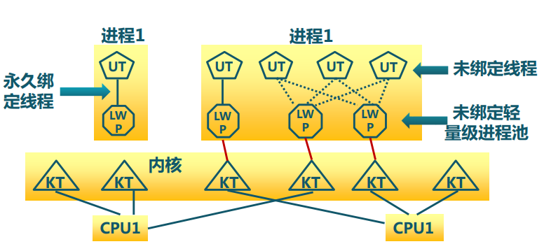

### 进程

#### 组成
+ 程序代码（文本段text )
+ 当前活动（PC和CPU寄存器）
+ 堆栈段（stack）（包含临时数据，如函数参数、返回地址和局部变量）
+ 数据段（data）（包含全局变量）
+ 堆（heap）（包含运行期间内存的动态分配）

#### 特点：

+ 动态性
	可动态地创建、结束进程
+ 并发性
	进程可以被独立调度并占用处理机运行
+ 独立性
	不同进程的工作不相互影响
+ 制约性
	因访问共享数据/资源或进程间同步而产生制约

进程 = 执行中的程序 = 程序 + 执行状态
进程 = 			CPU + 内存

+ 挂起(Suspend)：把一个进程从内存转到外存

### 线程：
优点：
+ 实体之间可以并发执行
+ 各个线程之间可以共享地址空间和文件等资源
缺点：
+ 一个线程崩溃，会导致其所属进程的所有线程崩溃

---

+ 进程： 资源分配单位
		地址空间（代码段、数据段）、打开的文件等各种资源
+ 线程：处理机调度角色：指令流执行状态

+ 进程是资源分配单位，线程是CPU调度单位
+ 进程拥有一个完整的资源平台，而线程`只`独享指令流执行的必要资源，如寄存器和栈
+ 线程具有`就绪`、`等待`和`运行`三种基本状态和状态间的转换关系
+ 线程能减少并发执行的时间和空间开销

#### 线程的三种实现方式

+ 用户线程：在用户空间实现
+ 内核线程：在内核中实现
+ 轻量级进程：在内核中实现，支持用户线程

##### 用户线程

+ 对操作系统内核透明
+ 不需要变态，速度快
+ 实现灵活，每个线程都可以有自己的线程调度策略

* 实现复杂，容易一崩全崩，不支持抢占
* 按CPU分配给进程的时间再做分配，时间少

##### 内核线程

+ 由内核维护PCB [^2]和TCB[^3]
+ 线程执行系统调用而被阻塞不影响其他线程
+ 占用内核资源，无法支持大量内核线程
+ 能做到按照CPU分配

[^2]: PCB: process Controller Block
[^3]: TCB: Thread Controller Block

##### 轻量级进程

&emsp;&emsp;内核支持的用户线程。一个进程可有一个或多个轻量级进程，每个轻量级进程由一个单独的内核线程来支持。

+ 能够做到由操作系统内核通过轻量级线程来调度线程，防止一个线程阻塞导致进程瘫痪。
+ 用户线程通过LWP访问内核，内核通过LWP控制用户线程。节省资源
+ 支持大规模的UT（对于服务器这个至关重要）

### 进程和线程的区别是什么？

进程是CPU分配资源的最小单元，线程是CPU调度的基本单元、一个进程可以包含多个线程、巴拉巴拉。因为进程启动的时候cpu需要给他分配资源，对系统压力比进程大，你可以把线程看成是轻量级的进程。

### 协程是什么？

协作式过程调用。是一种主动让出CPU的操作，在python，js中用的比较多。Java好像我没怎么接触。

