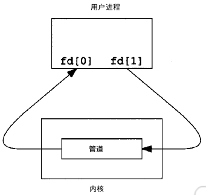

### 1. 管道
管道，通常指无名管道，是 UNIX 系统IPC最古老的形式。

1、特点：

+ 半双工的（即数据只能在一个方向上流动），具有固定的读端和写端。
+ 只能用于具有亲缘关系的进程之间的通信（也是父子进程或者兄弟进程之间）。
+ 可以看成是一种特殊的文件，对于它的读写也可以使用普通的read、write 等函数。但是它不是普通的文件，并不属于其他任何文件系统，并且只存在于内存中。

### 2. FIFO
FIFO，也称为`命名管道`，它是一种文件类型。

1、特点
FIFO可以在无关的进程之间交换数据，与无名管道不同。

FIFO有路径名与之相关联，它以一种特殊设备文件形式存在于文件系统中。

### 3. 消息队列

消息队列，是消息的链接表，存放在内核中。一个消息队列由一个标识符（即队列ID）来标识。

1、特点
+ 消息队列是面向记录的，其中的消息具有特定的格式以及特定的优先级。
+ 消息队列独立于发送与接收进程。进程终止时，消息队列及其内容并不会被删除。

+ 消息队列可以实现消息的随机查询,消息不一定要以先进先出的次序读取,也可以按消息的类型读取。

### 4. 信号量

信号量（semaphore）与已经介绍过的 IPC 结构不同，它是一个计数器。信号量用于实现进程间的互斥与同步，而不是用于存储进程间通信数据。

1、特点

+ 信号量用于进程间同步，若要在进程间传递数据需要结合共享内存。
+ 信号量基于操作系统的 PV 操作，程序对信号量的操作都是原子操作。
+ 每次对信号量的 PV 操作不仅限于对信号量值加 1 或减 1，而且可以加减任意正整数。

+ 支持信号量组。

### 5. 共享内存

共享内存（Shared Memory），指两个或多个进程共享一个给定的存储区。

1、特点
+ 共享内存是最快的一种 IPC，因为进程是直接对内存进行存取。
+ 因为多个进程可以同时操作，所以需要进行同步。
+ 信号量+共享内存通常结合在一起使用，信号量用来同步对共享内存的访问。

### 6. socket

套接字

### 五种通讯方式总结
 

1. 管道：速度慢，容量有限，只有父子进程能通讯    
2. FIFO：任何进程间都能通讯，但速度慢    
3. 消息队列：容量受到系统限制，且要注意第一次读的时候，要考虑上一次没有读完数据的问题    
4. 信号量：不能传递复杂消息，只能用来同步    
5. 共享内存区：能够很容易控制容量，速度快，但要保持同步，比如一个进程在写的时候，另一个进程要注意读写的问题，相当于线程中的线程安全，当然，共享内存区同样可以用作线程间通讯，不过没这个必要，线程间本来就已经共享了同一进程内的一块内存

