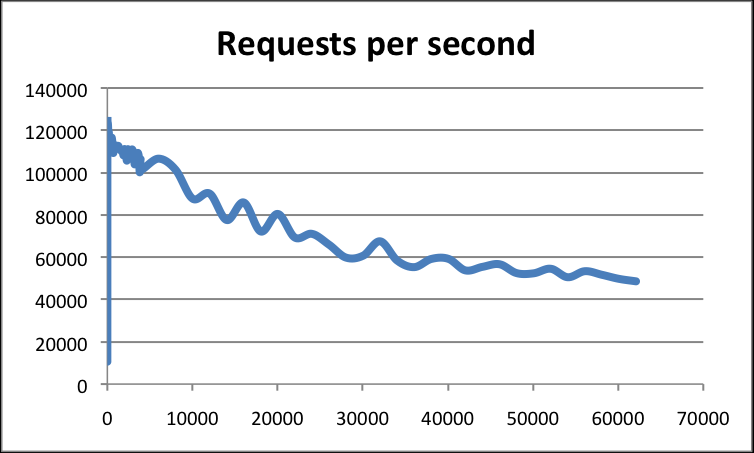

[TOC]


## 缓存的使用场景


+ 什么时候用缓存
	+ 不需要实时更新但是又极其消耗数据库的数据
	+ 需要实时更新，但是更新频率不高的数据
	+ 在某个时刻访问量极大而且更新也很频繁的数据

+ 什么时候不用缓存
	+ 涉及到钱、密钥、业务关键性核心数据等
	+ 大部分数据都是可以缓存的80%,二八原则

+ 缓存的问题：
	+ 多线程并发控制
	+ 缓存数据和真实数据的同步问题
	+ 缓存的老化
	+ redis没有事务的概念，没有ACID


## 缓存穿透

缓存穿透指的是查询一个`一定不存在的`数据。

原因：由于数据在缓存没有命中，直接到数据库查询。在业务高峰期业可能导致DB挂掉。

+ 恶意攻击手段：高并发查询不存在的key


### 方案：基于布隆过滤器：
将所有可能存在的数据哈希到一个足够大的bitmap中，一个一定不存在的数据会被 这个bitmap拦截掉。

### 方案：基于空缓存

如果一个查询返回的数据为空（不管是数据不存在，还是系统故障），我们仍然把这个空结果进行缓存，但它的过期时间会很短，最长不超过五分钟。


## 缓存雪崩


缓存雪崩是指在我们设置缓存时采用了相同的过期时间，导致缓存在某一时刻同时失效，请求全部转发到DB，DB瞬时压力过重雪崩。


### 解决方案 


+ 简单方式：缓存时间错开，增加1-5分钟的随机值
+ 保险方式：通过加锁或者队列的方式，控制缓存写操作的进程和线程数


## 缓存击穿

热点数据：一段时间内被频繁访问的数据；

热点数据的某个key在一瞬间失效，所有请求都无法命中缓存，所有业务线程都到DB去查询key。其实这里只需要一次查询就够了。


### 缓存击穿 is not 缓存雪崩
+ 缓存雪崩：大多数key（包括非热点数据）同时失效
+ 缓存击穿：热点数据的某一个key 在一瞬间失效


### 基于mutex。

在缓存失效的时候（判断拿出来的值为空），采用某种机制保证只有一条线程去load db.


利用Redis的SETNX或者Memcache的ADD，去set一个mutex key。
当操作返回成功时，再进行load db的操作并回设缓存；否则，就重试整个get缓存的方法。

SETNX，是「SET if Not eXists」的缩写，也就是只有不存在的时候才设置，可以利用它来实现锁的效果。在redis2.6.1之前版本未实现setnx的过期时间，需要手动设置。

```java

public String get(key) {  
      String value = redis.get(key);  
      if (value == null) { //代表缓存值过期  
          //设置3min的超时，防止del操作失败的时候，下次缓存过期一直不能load db  
          if (redis.setnx(key_mutex, 1, 3 * 60) == 1) {  //代表设置成功  
               value = db.get(key);  
                      redis.set(key, value, expire_secs);  
                      redis.del(key_mutex);  
              } else {  //这个时候代表同时候的其他线程已经load db并回设到缓存了，这时候重试获取缓存值即可  
                      sleep(50);  
                      get(key);  //重试  
              }  
          } else {  
              return value;        
          }  
 }
```


### "提前"使用互斥锁(mutex key)


在value内部再设置一个timeout1,timeout1略小于timeout，当timeout1到期后加互斥，去db获取数据刷新到内存，然后更新timeout1;

```java
v = memcache.get(key);    
if (v == null) {    
    if (memcache.add(key_mutex, 3 * 60 * 1000) == true) {    
        value = db.get(key);    
        memcache.set(key, value);    
        memcache.delete(key_mutex);    
    } else {    
        sleep(50);    
        retry();    
    }    
} else {    
    if (v.timeout <= now()) {    
        if (memcache.add(key_mutex, 3 * 60 * 1000) == true) {    
            // extend the timeout for other threads    
            v.timeout += 3 * 60 * 1000;    
            memcache.set(key, v, KEY_TIMEOUT * 2);    
            // load the latest value from db    
            v = db.get(key);    
            v.timeout = KEY_TIMEOUT;    
            memcache.set(key, value, KEY_TIMEOUT * 2);    
            memcache.delete(key_mutex);    
        } else {    
            sleep(50);    
            retry();    
        }    
    }    
}

```

### 缓存永不过期，worker 线程补偿


+ 从redis上看，确实没有设置过期时间，这就保证了，不会出现热点key过期问题，也就是“物理”不过期。
+ 从功能上看，如果不过期，那不就成静态的了吗？所以我们把过期时间存在key对应的value里，如果发现要过期了，通过一个后台的异步线程进行缓存的构建，也就是“逻辑”过期


热点数据的刷新：
+ 基于worker，周期性刷新热点数据；
+ 基于消息中间件推送更新，缓存更新到队列，攒到一定数量自动触发数据更新；


参考：
+ [常见的缓存穿透，缓存击穿，缓存雪崩解决方案分析](https://zhuanlan.zhihu.com/p/37645456)


## Redis


redis放弃传统的sql语句和ACID保证
+ Redis 将数据储存在内存里面，读写数据的时候都不受硬盘 I/O 速度的限制
+ 即使做了持久化设置，持久化开启子线程
	+ 比如默认开启dump，写磁盘是合并的
	+ 在没有开启AOF的情况下，每一次都写，性能上不是很好，不过其实redis说到底是用来做缓存的，个人认为没必要保证缓存数据的可用性，通过热备来做缓存，会引起设计上的混乱。分布式缓存和优秀的缓存路由算法可以解决这个问题
	+ 一致性hash算法

+ [多路复用](https://www.zhihu.com/question/28594409)
	+ 复用：复用同一线程
	+ 多路：多个socket


多路I/O复用模型是利用 select、poll、epoll 可以同时监察多个流的 I/O 事件的能力，在空闲的时候，会把当前线程阻塞掉，当有一个或多个流有 I/O 事件时，就从阻塞态中唤醒，于是程序就会轮询一遍所有的流（epoll 是只轮询那些真正发出了事件的流），并且只依次顺序的处理就绪的流，这种做法就避免了大量的无用操作。


### redis采用单线程


这里的单线程指的是处理数据是单线程，dump操作等其他操作是在子线程完成的。

官方的解释是，单线程已经足够快，并且这种情况下瓶颈主要在于memory or network.官方的建议是开始多个实例做配置
听说在4.0 后有改进。


优点：
+ 线程的切换也是需要一定代价的
+ 不需要考虑线程安全问题，没有同步锁的消耗

缺点：

+ 无法充分利用多核的算力

tips：

+ 单线程，所以尽量不要进行耗时操作，比如union操作
+ 单线程，所以Redis更钟情于大Cache高速CPU

### redis 为什么那么快？



+ 绝大多数的请求都是内存操作，数据基于内存存储
+ 数据在内存中，类似于hash，查找时间复杂度为O(1)
+ 数据结构简单，操作也简单，摒弃了传统sql的表连接等操作
+ 单线程避免了上下文切换,锁竞争,不需要考虑并发关注的锁，共享等问题
+ 使用多路IO复用m模型，非阻塞IO
+ 减少了切换内核态的操作，Redis底层自己做了优化，具体不是很了解


使用底层模型不同，它们之间底层实现方式以及与客户端之间通信的应用协议不一样，Redis直接自己构建了VM 机制 ，因为一般的系统调用系统函数的话，会浪费一定的时间去移动和请求；

+ 单进程单线程模型的 KV 数据库，
+ C语言编写
+ 每秒内查询：
	+ 最高: $10^5QPS$,
	+ 高连接:$4*10^4 QPS$

参考：
+ [How fast is Redis?](https://redis.io/topics/benchmarks)


### 常见线程进程模型


1. 单进程多线程模型：MySQL、Memcached、Oracle（Windows版本）
2. 多进程模型：Oracle（Linux版本）；
3. Nginx有两类进程，一类称为Master进程(相当于管理进程)，另一类称为Worker进程（实际工作进程）。启动方式有两种：

	+ 单进程启动：此时系统中仅有一个进程，该进程既充当Master进程的角色，也充当Worker进程的角色。
	+ 多进程启动：此时系统有且仅有一个Master进程，至少有一个Worker进程工作。
	+ Master进程主要进行一些全局性的初始化工作和管理Worker的工作；事件处理是在Worker中进行的。

参考：
+ [redis为什么是单线程](https://blog.csdn.net/chenyao1994/article/details/79491337)


### Redis持久化


RDB持久化是指在指定的时间间隔内将内存中的数据集快照写入磁盘，实际操作过程是fork一个子进程，先将数据集写入临时文件，写入成功后，再替换之前的文件，用二进制压缩存储。


#### RDB

+ fork一个进程，遍历hash table，利用copy on write，把整个db dump保存下来。
+ save, shutdown, slave 命令会触发这个操作。
+ 粒度比较大，如果save, shutdown, slave 之前crash了，则中间的操作没办法恢复。
+ RDB 采用二进制保存，能最紧凑地存储数据


#### AOF
+ 把写操作指令，持续的写到一个类似日志文件里。（类似于从postgresql等数据库导出sql一样，只记录写操作）
+ 粒度较小，crash之后，只有crash之前没有来得及做日志的操作没办法恢复。
+ 可以在后台对 AOF 文件进行重写（rewrite），使得 AOF 文件的体积不会超出保存数据集状态所需的实际大


AOF每一次的写会进入系统的缓冲区，必须调用fsync强制刷新到磁盘；fsync是系统调用，代价较大。

##### fsync的策略
+ 每次有新命令追加到 AOF 文件时就执行一次 fsync ：非常慢，也非常安全。
+ 每秒 fsync 一次：足够快（和使用 RDB 持久化差不多），并且在故障时只会丢失 1 秒钟的数据。
+ 从不 fsync ：将数据交给操作系统来处理。更快，也更不安全的选择。


#### RDB 和 AOF 区别
+ AOF 是每次就把写操作记录到日志，RDB是需要触发才整个dump
+ AOF主要保证数据地可靠性，RDB则关注于业务性能最佳，数据可靠性不保证


+ [redis的 rdb 和 aof 持久化的区别](https://www.cnblogs.com/shizhengwen/p/9283973.html)


### redis订阅与发布：


```bash

# A 端
SUBSCRIBE msg


# B 端
PUBLISH msg "hello world"
```

```c
struct redisServer
{

    /* Pubsub */
    // 字典，键为频道，值为链表
    // 链表中保存了所有订阅某个频道的客户端
    // 新客户端总是被添加到链表的表尾
    dict *pubsub_channels; /* Map channels to list of subscribed clients */

    // 这个链表记录了客户端订阅的所有模式的名字
    list *pubsub_patterns; /* A list of pubsub_patterns */
    ...

}


/* Publish a message 
 *
 * 将 message 发送到所有订阅频道 channel 的客户端，
 * 以及所有订阅了和 channel 频道匹配的模式的客户端。
 */
int pubsubPublishMessage(robj *channel, robj *message) {
    ...
    /* Send to clients listening for that channel */
    // 取出包含所有订阅频道 channel 的客户端的链表
    // 并将消息发送给它们
    de = dictFind(server.pubsub_channels,channel);
    if (de) {
        list *list = dictGetVal(de);
        listNode *ln;
        listIter li;

        // 遍历客户端链表，将 message 发送给它们
        listRewind(list,&li);
        while ((ln = listNext(&li)) != NULL) {
            redisClient *c = ln->value;

            // 回复客户端。
            // 示例：
            // 1) "message"
            // 2) "xxx"
            // 3) "hello"
            addReply(c,shared.mbulkhdr[3]);
            // "message" 字符串
            addReply(c,shared.messagebulk);
            // 消息的来源频道
            addReplyBulk(c,channel);
            // 消息内容
            addReplyBulk(c,message);

            // 接收客户端计数
            receivers++;
        }
    }

    /* Send to clients listening to matching channels */
    ...
    // 返回计数
    return receivers;
}

```