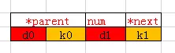
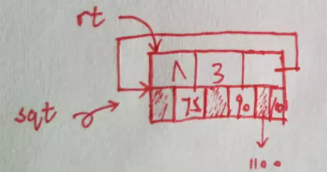
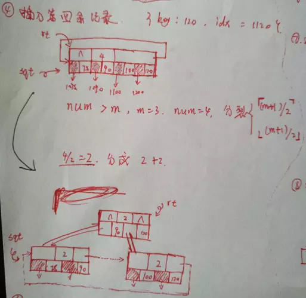
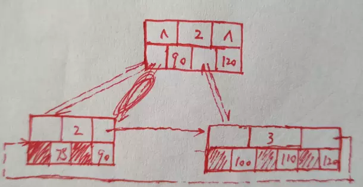
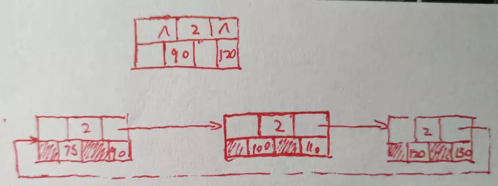
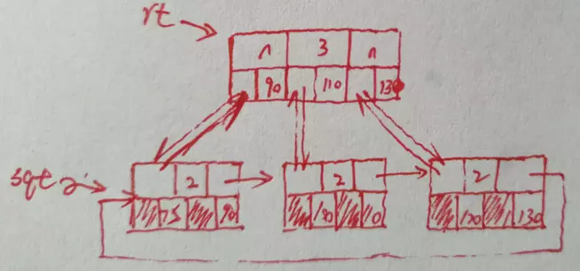
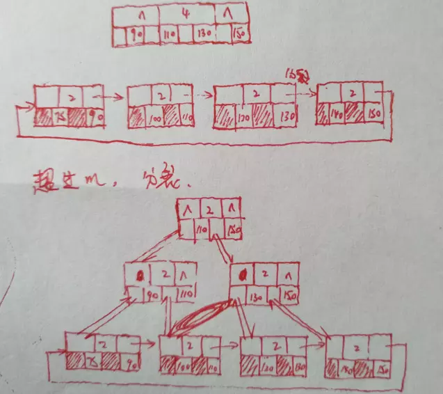

[TOC]


----


## B+ 树的强大之处
&emsp;&emsp;B+树被广泛用于外排序索引。很多数据库的索引技术都是用B+。熟悉mysql的朋友应该知道Innodb支持B+树索引，全文索引，哈希索引。
&emsp;&emsp;B+树索引可谓是数据库的关键技术，大公司面试不问是不太可能的。
&emsp;&emsp;这里简单实现了关键字不重复的B+树，当然，在mysql里，叶子节点还会串成双向链表，还有很多优化细节。而mysql的索引...

> `聚集索引`就是按照每张表的主键构造一棵B+树，同时叶子节点中存放的即为整张表的行记录数据，也将聚集索引的叶子节点称为数据页。

>`辅助索引`也称为非聚集索引，也叶子节点并不包含记录的全部数据。叶子节点除了包含键值以外，每个叶子节点中的索引行中还包含了一个书签（bookmark）.该书签用来告诉InnoDb存储引擎哪里可以找到与索引相对应的行数据。
查询的时候，下先在辅助索引树种查询到对应的行的主键，然后用这个主键去聚集索引找到对应数据页。
-----参考：Mysql技术内幕InnoDb存储引擎第2版(姜承尧)


## 定义

### 书本定义
>对于一棵m阶的B+树，满足：
>1. 每个分支节点至多有m棵子树
>2. 根节点没有子树，或至少有两棵子树
出根节点外，其它每个分支节点至少有⌈m+1⌉/2棵子树，至多不超过m
>3. 有n棵子树，对应有n个关键字
>4. 所有分支节点中仅包含它的各个子节点中的最大关键字和指向子节点的指针。
>//参考数据结构教程(李春葆,第四版,275页)

这个定义不是一定的，比如，4中，有些人实现起来喜欢用最小索引，所以不必争议细节上的苛刻定义。

### 代码定义

这里为了方便自己写代码，就按自己的理解对细节做了处理，错误之处还望各位指正。

直接上个图大家就差不多明白了




这里对于非叶节点，d0是指向下一级节点的指针。d0指向节点的最大索引=k0;


事实上d0指向的是整个子节点，也就是说最上面的{70,100}那个节点的d0指向了{50,70}这个节点。{70,100}的k0=70就是{50,70}的最大索引。

所以在C中，对树的定义如下：


```cpp

#define MAXM 10

typedef int KeyType;
typedef int IndexType;

typedef struct node
{
    struct node * parent;			//point to parent
    int num;						//the count of key,also as *sons
    KeyType keys[MAXM];				//the keys for data 
    union{
        struct node * sons[MAXM];	//sons index
        int idxs[MAXM];				//data index
    }data;
    struct node * next;				//!=NULL:leaf node,NULL:this isn't a leaf node
}BNode;

typedef struct {
    BNode * rt;	//point to root
    BNode * sqt;//point to leaf
    int m;
}BTree;

```

按照如上定义，一棵完整的B+树如下：


注意：整个涂红表示存放的是数据索引，不是子节点指针。也就是在定义代码中，是联合体中的idxs不是sons。对于子节点，如果是mysql数据库中的索引，一般这个涂红的数据索引会指向key对应的数据页，是页不是行哦。

约定：
1. 所有叶子节点串成一个单向循环列表
2. 对于叶子节点 next!=NULL, 对于非叶子节点，next==NULL
3. 根节点上,rt->parent==NULL
4. 节点上关键字数num属于$[⌈m/2⌉,m ]$,对于根节点，如果根节点同时还是叶子节点，num属于$[1,m]$
5. num 即是keys.length 也是data.length


## B+树的插入
1. 初始状态下，整棵树是空的，rt=NULL.
插入第一条记录，根就是叶，插入{key=75,idx=1075}


2. 插入第二条记录{key:90,idx:1090}


3. 插入第三条记录{key:100,idx:1100}



4. 插入第四条记录{key:120,idx:1120}




插入第四条记录后，会导致根节点有四个关键字，不满足定义中的范围[1,m]，所以要把节点分裂出来。分裂为[0,（m+1）/2), [（m+1)/2，num)

分裂后还要记得维护好next指针，以及把rt切换为新的根，修改num等，细节比较多，看图。

5. 插入第五条记录 {key:110,idx:1110}



6. 插入第六行记录，{key:130,idx:1130}


右侧节点太大，要分裂




分裂后要，要维护好链表关系。然后是维护和父节点的关系。



7. 插入第7个节点{key:140,idx:1140}


然后因为插入的节点是这个节点的最大值，所以需要向上更新最大值，{90,110,140}

8. 插入{key:150,idx:1150}



每一次分裂，叶子节点都在同一层添加，层级调整都在上层，所以保证了叶子节点在同一层。


##B+树删除一个关键字
删除一个关键字，可以使递归删除哦，实现的时候考虑递归比较容易做。

1. 删除{key:150}，当隔壁节点未满


如果删除后，本节点个数太少，隔壁节点不满，那就把数据投靠到隔壁去，把自己的节点释放掉。
处理完本层，会发现，可能上一层也出问题了，所以要向上递归处理，一层层向上合并节点。

合并完可能还是会有问题，根节点没有隔壁，所以应该直接释放掉。释放完，注意记得维护rt,sqt


2. 如果删除后身下一个，当隔壁满了


3. 删除总结一下：
  对于删除，如果在节点中移除key和对应的data后，导致num不满足要求。有如下情况：
（1）隔壁满了，去借一个key过来
（2）隔壁不满，投靠过去，把自己的节点释放掉。
（3）没有隔壁，也就是根，直接释放掉
注意：这里的隔壁，是兄弟节点，因为兄弟节点的修改对整棵树的修改最小。

```
突然想到的例子，比如，现在规定每个家庭人数不能超过三人，不能小于1。

当一个家庭只剩下一个人，那他就要去隔壁家借个孩子过来。
或者入赘到隔壁家，入赘前还要把自家房子烧光光。
如果没有邻居，那就上吊自杀，一了百了。

同样的道理理解插入，如果你超生了，那就分家，分成两个家庭，这样就不违反规定。
分完后你发现，族谱里也有限制，那就对父亲这一支也分成两个支，一直向上追溯。

```
## B+树查询
查询{key:120}


补充一句，Mysql的B+树一般是高扇出的，也就是m会比较大一些，然后层级不会太多，一般是三四层。所以根据主键去数据库查找，三四次折半查找就能找到，效率是很好的。


## show me the code


1. BplusTree.h
``` c++

#ifndef BPLUS
    #define BPLUS
    #define MAXM 10

typedef int KeyType;
typedef int IndexType;

typedef struct node
{

    struct node * parent;			//point to parent
    int num;						//the count of key,also as *sons
    KeyType keys[MAXM];				//the keys for data 
    union{
        struct node * sons[MAXM];	//sons index
        int idxs[MAXM];				//data index
    }data;
    struct node * next;				//!=NULL:leaf node,NULL:this isn't a leaf node
}BNode;


typedef struct {

    BNode * rt;	//point to root
    BNode * sqt;//point to leaf
    int m;
}BTree;

//创建根节点
void createBTree(BTree *& bt,int m);
//递归插入
void insertR(BTree *&bt,BNode * p,KeyType key,BNode * son,IndexType idx);
//递归分裂
void divideR(BTree *&bt,BNode *p);
//强行插入
void insertToNode(BNode *&p,KeyType key,BNode *son,IndexType idx);
//折半查询
int halfSearch(BNode *&p,KeyType key);


//得到本节点最大key
KeyType getMaxKey(BNode *p);
//替换key
int replayKey(BNode *p,KeyType oldkey,KeyType key);
//更新key
void updateKeyR(BNode *p);
//得到兄弟节点
BNode * getBrother(BTree *bt,BNode *p);

//强制删除
int deleteInNode(BNode *p,KeyType key);
//递归合并
void mergeR(BTree *bt,BNode *p);
//递归移除一个key
void removeR(BTree *bt,BNode *p,KeyType key);

//输出本节点的信息
void printNode(BNode *& p,int c);
//递归打印
void printR(BNode *p,int c);
//打印树基本信息
void printTree(BTree *bt);

#endif
#endif
```

2. BplusTree.cpp
```cpp
/************************
 * author:	sirius
 * email:	siriusing.cc@qq.com
 * theme: 	B+ tree demo
 ************************/
#include <stdio.h>
#include<stdlib.h>
#include "BplusTree.h"

//创建根节点
void createBTree(BTree *& bt,int m){
    if(bt==NULL){
        // 申请空间
        //	这里很多字段默认就是0，所以初始化一步搞定
        bt=(BTree *)calloc(1,sizeof(BTree));
    }
    bt->m=m;
}

void removeR(BTree *bt,BNode *p,KeyType key){
    IndexType index;
    if(bt==NULL||p==NULL){
        return;
    }
    //非叶子节点
    if(p->next==NULL){
        index=halfSearch(p,key);
        removeR(bt,p->data.sons[index],key);
    }else{
        //强制删除
        deleteInNode(p,key);
        
        if(p->num==0&&p->parent==NULL){
        //根上不满,空根,直接移除根节点
            bt->rt=NULL;
            bt->sqt=NULL;
            free(p);
        }else{
        //普通
            //删除后，可能导致索引不一致,更新索引
            updateKeyR(p);

            if(p->num<(bt->m+1)/2){
            //不满足定义,递归合并
                mergeR(bt,p);
            }
        }
    }
}


void mergeR(BTree *bt,BNode *p){

    IndexType idx;
    BNode * son=NULL;
    int index=-1;
    KeyType key;

    if(p==NULL||p->num>=2){
        //		根节点		符合定义
        return;
    }
    //是根，且不是叶
    if(p->parent==NULL){
        
        if(p->next==NULL&&p->num==1){
            //直接释放，换根
            bt->rt=p->data.sons[0];
            bt->rt->parent=NULL;
            free(p);
        }
        return;		
    }

    //p->num<2
    BNode *t=getBrother(bt,p);

    if(t->num==bt->m){//兄弟满了
        if(t->keys[0]<p->keys[0]){
            //左边，把左边最大的记录拿过来

            KeyType key=t->keys[t->num];
            
            //叶子节点
            if(t->next!=NULL){
                idx=t->data.idxs[t->num-1];
            }else{
                son=t->data.sons[t->num-1];
            }	
            t->num--;
            //将{key,idx,son}强制插入
            insertToNode(p,key,son,idx);
            index=halfSearch(t->parent,key);
            t->parent->keys[index]=t->keys[t->num];
        }else{
            //把右边最小的记录拿过来
            key=t->keys[0];
            idx=t->data.idxs[0];
            son=t->data.sons[0];

            //移动数据
            for(int i=0;i<t->num;++i){
                t->keys[i]=t->keys[i+1];
                //非叶子
                if(t->next==NULL){
                    t->data.sons[i]=t->data.sons[i+1];
                }else{
                    t->data.idxs[i]=t->data.idxs[i+1];
                }
            }
            t->num--;
            p->num++;
            p->keys[p->num-1]=key;

            if(t->next!=NULL){
                p->data.idxs[p->num-1]=idx;
            }else{
                p->data.sons[p->num-1]=son;
            }
            //更新父级索引
            index=halfSearch(p->parent,key)-1;
            p->parent->keys[index]=key;

        }

    }else{//未满，投靠到兄弟节点
        key=p->keys[0];
        idx=p->data.idxs[0];
        son=p->data.sons[0];
        printf("[DEBUG] key=%d,idx=%d,son=%p\n",key,idx,son);
        insertToNode(t,key,son,idx);
        
        // 释放原来的节点
        deleteInNode(p->parent,key);
        //next指针维护
        t->next=p->next;
        free(p);
        mergeR(bt,t->parent);
    }
}


//删除节点中的某个关键字，也就是一条记录
int deleteInNode(BNode *p,KeyType key){

    if(p==NULL){
        return -1;
    }
    // printf("[DEBUG] key=%d\n",key);

    int index=halfSearch(p,key);
    
    //没找到
    if(index<0||key!=p->keys[index]){
        printf("[DEBUG](deleteInNode) on on find a accessful index,index=%d\n",index);
        return -1;
    }

    //移动数据
    for(int i=index+1;i<p->num;++i){
        p->keys[i-1]=p->keys[i];
        //叶子节点
        if(p->next!=NULL){
            p->data.idxs[i-1]=p->data.idxs[i];

        }else{
            
            p->data.sons[i-1]=p->data.sons[i];
        }
    }
    p->num--;

    return 1;
}


//递归插入
void insertR(BTree *&bt,BNode * p,KeyType key,BNode * son,IndexType idx){

    //空树
    if(p==NULL){
        p=(BNode*)calloc(1,sizeof(BNode));
        p->parent=NULL;
        p->num=1;
        p->next=p;
        p->data.idxs[0]=idx;
        p->keys[0]=key;

        bt->rt=p;
        bt->sqt=p;

        // printf("[DEBUG] NULL tree \n");

        return;
    }


    int index=halfSearch(p,key);
    // printf("[DEBUG] index=%d\n",index);

    if(p->next==NULL){
        //非叶子节点，进入下一层
        if(index==p->num){
            index--;
        }

        insertR(bt,p->data.sons[index],key,son,idx);
        return;
    }else{
        //叶子节点

        if(index<0){
            return;
        }

        // printf("[DEBUG] p\n");
        // printNode(p,3);

        if(p->keys[index]==key){
            //同名索引
            printf("err:[insertR] exist same key,do nothing,return\n");
            return;
        }

        //记录一下
        KeyType oldkey=getMaxKey(p);


        //直接插入
        insertToNode(p,key,son,idx);

        // DEBUG
        // if(p->num==3&&p->keys[0]==50){
        // 	printNode(p,0);
        // }

        //递归分裂
        if(p->num>bt->m){
            divideR(bt,p);
        }else if(getMaxKey(p)==key&&p->parent!=NULL){
            replayKey(p->parent,oldkey,key);
        }
        // printf("[DEBUG](sqt)\n");
        // printf("[DEBUG](replayKey),oldkey=%d,key=%d\n",oldkey,key);
        //sqt 矫正
        while(bt->sqt->next==NULL){
            bt->sqt=bt->sqt->data.sons[0];
        }

        updateKeyR(p);
    }

}

// ========================== tool function ======================

//递归分裂
void divideR(BTree *&bt,BNode *p){

    if(p->num<=bt->m){
        //满足B+树定义，无可挑剔，返回
        return;
    }

    int split=(bt->m+1)/2;

    //分裂节点

    BNode *t=(BNode *)calloc(1,sizeof(BNode));
    t->num=p->num-split;
    t->parent=p->parent;

    KeyType oldkey=getMaxKey(p);

    //数据迁移
    for(int i=split;i<p->num;++i){

        t->keys[i-split]=p->keys[i];
        //非叶子
        if(p->next==NULL){

            t->data.sons[i-split]=p->data.sons[i];
            
            //空指针?
            //printf("sons[i]=%p\n",t->data.sons[i-split] );
            t->data.sons[i-split]->parent=t;
            //TODO
            //printNode(t->data.sons[i-split],3);

        }else{
            t->data.idxs[i-split]=p->data.idxs[i];

        }
    }
    p->num=split;

    //叶子节点
    if(p->next!=NULL){
        //维护叶子节点之间的循环链表
        t->next=p->next;
        p->next=t;

    }

    if(p->parent!=NULL){
        //父节点强行插入,-1无意义
        
        KeyType key=getMaxKey(p);
        printf("[DEBUG](divideR)p=%p ,oldkey=%d,key=%d\n",p,oldkey,key);
        replayKey(p->parent,oldkey,key);
        
        insertToNode(p->parent,t->keys[t->num-1],t,-1);
        
        //因为节点分裂，要更新最大值		
        //向上递归
        divideR(bt,p->parent);

    }else{
        //已经没有父节点了,新建父节点
        p->parent=(BNode *)calloc(1,sizeof(BNode));
        p->parent->num=2;

        p->parent->keys[0]=getMaxKey(p);
        p->parent->data.sons[0]=p;
        p->parent->keys[1]=getMaxKey(t);
        p->parent->data.sons[1]=t;
        t->parent=p->parent;

        bt->rt=p->parent;
        bt->sqt=p;
    }
}

/*
 * 强行插入
 */
void insertToNode(BNode *&p,KeyType key,BNode *son,IndexType idx){

    int index=halfSearch(p,key);
    if(index<0){
        return;
    }
    for(int i=p->num-1;i>=index;--i){
        
        if(p->next==NULL){

            p->data.sons[i+1]=p->data.sons[i];			
        }else{
            p->data.idxs[i+1]=p->data.idxs[i];
        }
        p->keys[i+1]=p->keys[i];

    }
    p->num++;
    p->keys[index]=key;

    if(p->next==NULL){
        p->data.sons[index]=son;
    }else{
        p->data.idxs[index]=idx;
    }

}


/*
 * 折半查找，
 * 返回索引值。如果存在key相等，则返回相等的key对应的索引，否则返回略大的索引
 */
int halfSearch(BNode *&p,KeyType key){
    int start=0;
    int end=p->num-1;
    int mid=start;

    while(start<end){
        mid=(end+start)/2;

        if(key<p->keys[mid]){
            end=mid-1;
        }else if(key>p->keys[mid]){
            start=mid+1;
        }else{
            return mid;
        }
    }

    if(p->num>=0&&p->keys[start]<key){
        return start+1;
    }

    return start;
}


//递归打印
void printR(BNode *p,int c){
    if(p->next!=NULL){
        printNode(p,c);
    }else{
        printNode(p,c);
        for(int i=0;i<p->num;++i){
            printR(p->data.sons[i],c+1);
        }
    }
}


void printTree(BTree *bt){

    printf("--------------------------------\n");
    printf("rt=%p\n",bt->rt);
    printf("sqt=%p\n",bt->sqt);
    printf("m=%d\n",bt->m );
    printf("--------------------------------\n");

}

KeyType getMaxKey(BNode *p){

    // printf("[DEBUG] p->num=%d\n",p->num );
    if(p->num>0){
        return p->keys[p->num-1];
    }
    return -1;
}


/* 替换key
 * 
 */
int replayKey(BNode *p,KeyType oldkey,KeyType key){

    if(p==NULL){
        printf("[ERROR] (replayKey)p==NULL\n");
        return -1;
    }

    // printf("[DEBUG]:(replayKey)oldkey=%d,key=%d,p->num=%d\n",oldkey,key,p->num );
    for(int i=0;i<p->num;++i){
        if(p->keys[i]==oldkey){
            p->keys[i]=key;
            
            return 1;
        }


    }

    return 0;
}


//输出本节点的信息
void printNode(BNode *& p,int c){


    char tags[MAXM]={0};
    for(int i=0;i<c;++i){
        tags[i]='\t';
    }

    printf("%s===============\t %p\t================\n",tags,p);
    printf("%s*parent=%p\n",tags,p->parent );
    printf("%snum=%d\n",tags,p->num);
    printf("%skeys=[",tags);

    for(int i=0;i<p->num;++i){
        printf("%d,",p->keys[i]);
    }
    printf("]\n");

    printf("%sdata=[",tags);
    if(p->next!=NULL){
        for(int i=0;i<p->num;++i){
            printf("%d,",p->data.idxs[i]);
        }
    }else{
        for(int i=0;i<p->num;++i){
            printf("%p,",p->data.sons[i]);
        }
    }
    printf("]\n");
    printf("%s*next=%p,%s\n",tags,p->next,(p->next!=NULL)?"leaf":"noleaf");
    printf("%s================================================\n",tags);
}


//递归更新索引
void updateKeyR(BNode *p){

    //空或叶子节点或空树点
    if(p==NULL||p->num<1){
        return;
    }

    if(p->next!=NULL){
        updateKeyR(p->parent);
        return;
    }

    KeyType oldkey=getMaxKey(p);
    KeyType key;
    for(int i=0;i<p->num;++i){

        key=getMaxKey(p->data.sons[i]);
        if(key!=p->keys[i]){
            p->keys[i]=key;
        }
    }

    updateKeyR(p->parent);
}

//获得最邻近的兄弟节点，尽量是不满的那个兄弟
BNode * getBrother(BTree *bt,BNode *p){

    if(p==NULL or p->parent==NULL){
        return NULL;
    }

    int index=halfSearch(p->parent,getMaxKey(p));


    BNode *t1=NULL;
    BNode *t2=NULL;

    if(index>0){
        t1=p->parent->data.sons[index-1];
    }
    if(index<bt->m){
        t2=p->parent->data.sons[index+1];
    }

    if(t1!=NULL&&t1->num<bt->m){
        return t1;
    }else if(t2!=NULL && t2->num<bt->m){
        return t2;
    }else if(t1!=NULL){
        return t1;
    }else{
        return t2;
    }

}

```

3. main.cpp
```c
#include <stdio.h>
#include <stdlib.h>
#include "BplusTree.h"


int main(void){

    BTree * bt=NULL;
    int m=3;
    createBTree(bt,m);

    BNode *p=NULL;
    BNode *son=NULL;

    KeyType key=70;
    IndexType idx=1070;
    insertR(bt,bt->rt,key,son,idx);

    key=80;
    idx=1080;
    insertR(bt,bt->rt,key,son,idx);

    key=90;
    idx=1090;
    insertR(bt,bt->rt,key,son,idx);

    key=50;
    idx=1050;
    insertR(bt,bt->rt,key,son,idx);

    key=110;
    idx=1100;
    insertR(bt,bt->rt,key,son,idx);

    key=100;
    idx=1000;
    insertR(bt,bt->rt,key,son,idx);
    
    key=60;
    idx=1060;
    insertR(bt,bt->rt,key,son,idx);

    key=130;
    idx=1300;
    insertR(bt,bt->rt,key,son,idx);

    key=140;
    idx=1400;
    insertR(bt,bt->rt,key,son,idx);

    key=150;
    idx=1500;
    insertR(bt,bt->rt,key,son,idx);

    key=120;
    idx=1200;
    insertR(bt,bt->rt,key,son,idx);

    key=75;
    idx=1750;
    insertR(bt,bt->rt,key,son,idx);
    
    printTree(bt);
    printR(bt->rt,0);

    printf("\n**********************\t remove ****************************************\n");
    
    // // void removeR(BTree *bt,BNode *p,KeyType key);
    removeR(bt,bt->rt,50);
    // removeR(bt,bt->rt,80);
    // removeR(bt,bt->rt,70);

    // printTree(bt);
    printR(bt->rt,0);


    return 0;
}
```
4. 送一个window 上gcc编译小脚本

```bat
@echo off

cls

del main.exe
g++ -c BplusTree.cpp
g++ -c main.cpp
g++ -o main.exe BplusTree.o main.o
del BplusTree.o main.o
@echo on
main.exe
::pause

```


