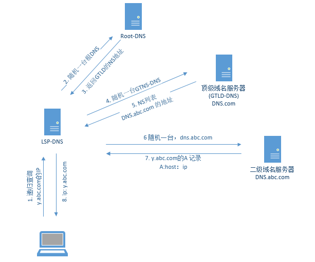
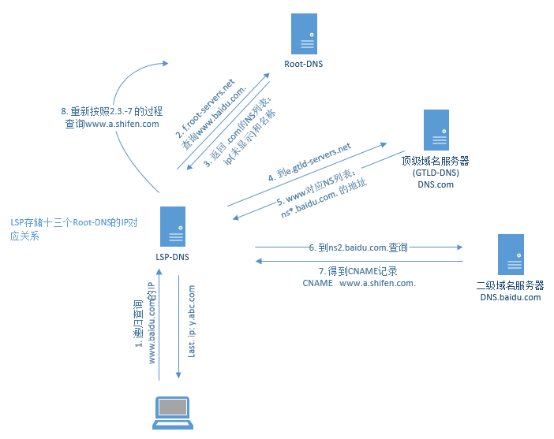
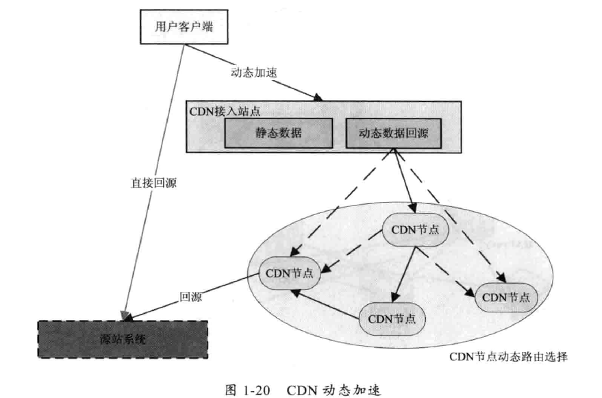
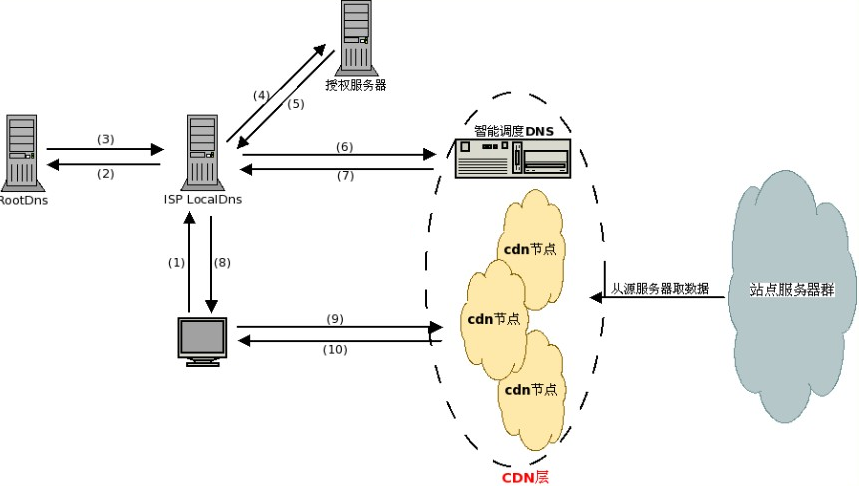

[TOC]


# DNS 解析

+ DNS基于UDP

## DNS报文的类型：

+ A记录: Address to ip，指定地址到ip的映射。
+ CNAME记录：别名记录，如果返回的是CNAME，需要再对CNAME做查询，NAME记录是必须有如：WWW(别名)前缀的域名
+ NA：每一次查询，如果找不到，通过NS记录来告诉你应该去哪里继续查询

本地域名服务器：LSP-DNS，在网络连接里配置的那个。不配置默认就是网络服务提供商给的。也就是上游的默认配置。


## DNS解析过程

1. 先查询本机hosts文件映射；
2. 查询本地DNS缓存；
3. 委托LSP-DNS查询（这个步骤也称递归查询）；
4. LSP-DNS 做迭代查询；
5. LSP-DNS将查询结果返回到本机；


### Hosts文件

本地手动设置ip和域名的映射，写入hosts文件中。

+ windons 下的文件路径为: C:\Windows\System32\drivers\etc\hosts
+ linux 以debian为例：/etc/hosts


### 本地缓存

每个DNS服务器都有本地高速缓存。本地就是一台服务器。

### 递归查询

主机向本地域名服务器的查询一般都是采用 `递归查询` ： 如果主机所询问的本地域名服务器不知道被查询的IP地址，那么本地域名服务器就以DNS客户的身份，向其他根域名服务器继续发出查询请求报文（替该主机继续查询），而不是让该主机自己进行下一步的查询。因此，递归查询返回的查询结果或者是所要查询的IP，或者是报错，表示无法查询到所需的IP。
### 迭代查询
本地域名服务器向根域名服务器的查询通常采用 `迭代查询` ：当根服务器收到本地发出的迭代查询请求报文时，要么给出所要查询的IP地址，要么告诉本地域名服务器下一步应当向哪个域名服务器查询。
然后本地域名服务器进行后续查询。根域名服务器通常把自己知道的顶级域名服务器告诉本地域名服务器，本地域名服务器再去顶级域名服务器查询...




### 实例跟踪解析过程

查询 siriuscloud.cc 的ip，只需要
```
root@siriuscloud:~# nslookup siriuscloud.cc 119.29.29.29
Server:         119.29.29.29	// 上联的DNS服务器，也就是负责递归的
Address:        119.29.29.29#53 // 上联DNS服务器对应的IP

Non-authoritative answer:   //非权威答案，即从上连DNS服务器的本地缓存中读取出的值，而非实际去查询到的值
Name:   siriuscloud.cc			
Address: 119.29.236.53
```
+ 上联DNS服务器LSP-DNS：本地设置的DNS地址，windows在网络连接中设置，Linux debian在 /etc/resolv.conf设置。


查询www.baidu.com的ip，发现返回了
```
root@siriuscloud:~# nslookup www.baidu.com
Server:         119.29.29.29    // 我自己设置的腾讯云DNS
Address:        119.29.29.29#53

Non-authoritative answer:
www.baidu.com   canonical name = www.a.shifen.com.
Name:   www.a.shifen.com
Address: 14.215.177.39
Name:   www.a.shifen.com
Address: 14.215.177.38
```

这里canonical name 就是cname，所以www.baidu.com 有一个 cname 为www.a.shifen.com.

详细的过程用dig来跟踪：


```
// Dig工具会在本地计算机做迭代，然后记录查询的过程。
root@siriuscloud:~# dig +trace www.baidu.com

第一步，请求 . 的ip。向ISPDNS获取到根域服务区的13个NS的IP和名称[a-m].root-servers.net。
; <<>> DiG 9.9.5-9+deb8u11-Debian <<>> +trace www.baidu.com
;; global options: +cmd
.                       254950  IN      NS      h.root-servers.net.
.                       254950  IN      NS      i.root-servers.net.
.                       254950  IN      NS      a.root-servers.net.
.                       254950  IN      NS      j.root-servers.net.
.                       254950  IN      NS      k.root-servers.net.
.                       254950  IN      NS      l.root-servers.net.
.                       254950  IN      NS      m.root-servers.net.
.                       254950  IN      NS      b.root-servers.net.
.                       254950  IN      NS      c.root-servers.net.
.                       254950  IN      NS      d.root-servers.net.
.                       254950  IN      NS      e.root-servers.net.
.                       254950  IN      NS      f.root-servers.net.
.                       254950  IN      NS      g.root-servers.net.
;; Received 239 bytes from 119.29.29.29#53(119.29.29.29) in 144 ms


//2. 向某一台ROOT-DNS（f.root-servers.net）请求发送www.baidu.com的请求，返回 .com一级的NS： ip(未显示)和名称
com.                    172800  IN      NS      a.gtld-servers.net.
com.                    172800  IN      NS      b.gtld-servers.net.
com.                    172800  IN      NS      c.gtld-servers.net.
com.                    172800  IN      NS      d.gtld-servers.net.
com.                    172800  IN      NS      e.gtld-servers.net.
com.                    172800  IN      NS      f.gtld-servers.net.
com.                    172800  IN      NS      g.gtld-servers.net.
com.                    172800  IN      NS      h.gtld-servers.net.
com.                    172800  IN      NS      i.gtld-servers.net.
com.                    172800  IN      NS      j.gtld-servers.net.
com.                    172800  IN      NS      k.gtld-servers.net.
com.                    172800  IN      NS      l.gtld-servers.net.
com.                    172800  IN      NS      m.gtld-servers.net.
com.                    86400   IN      DS      30909 8 2 E2D3C916F6DEEAC73294E8268FB5885044A833FC5459588F4A9184CF C41A5766
com.                    86400   IN      RRSIG   DS 8 1 86400 20190411170000 20190329160000 16749 . IipUD26WPDVeCwI619ciIJ5rmoCu3G2ICbw3O11f8OoXQTk6hnE1NwEg 3T/w/EIbpGhkwG9DST+KTLYS95UmmEHWnF/ydrrsIzauloJ3EO1YxnC4 /vWWEtWf53uC1yDDv3Zi4SjkW5ti0Us4tr4tQDKshTzIQXdgRsHiZRGT fFo8afe9WAqW+iMuNAwR8TJxTZxDc/E3DlaSYTKrOw7cEg8mOWvfno0r XfwLg5pogiaYErIcdHAZIYDSZhBpXO06exnmra692TTKp6osRfnRM1g+ kwwlrjkgePWprza9u3Yw/yonFnMqiM1aHWP740tKVDSEudHVtl6bM3yh xLNKTg==
;; Received 1176 bytes from 192.5.5.241#53(f.root-servers.net) in 169 ms

//3. 向其中一台（e.gtld-servers.net）发送www.baidu.com的名称。返回baidu.com.的NS（ip和名称）。这里baidu域有五台域名服务器。

baidu.com.              172800  IN      NS      ns2.baidu.com.
baidu.com.              172800  IN      NS      ns3.baidu.com.
baidu.com.              172800  IN      NS      ns4.baidu.com.
baidu.com.              172800  IN      NS      ns1.baidu.com.
baidu.com.              172800  IN      NS      ns7.baidu.com.
CK0POJMG874LJREF7EFN8430QVIT8BSM.com. 86400 IN NSEC3 1 1 0 - CK0Q1GIN43N1ARRC9OSM6QPQR81H5M9A NS SOA RRSIG DNSKEY NSEC3PARAM
CK0POJMG874LJREF7EFN8430QVIT8BSM.com. 86400 IN RRSIG NSEC3 8 2 86400 20190405044524 20190329033524 16883 com. HA/ggUYURrdcmMM3U2g6O1fxF+8lrJI6rl7b6ze4MgiOCYSLSyXR+/C0 vy/x0UsemheeDRogAkUpewEUEHgBx4Wo5DFFM2CBWGl6FwgaGf+E4lFx pL8WakSo+YWf6YGcS5XiD1X9LhZnmZwg63u4JQ6g+N+zzphebLcPLDsa Dp0=
HPVV2B5N85O7HJJRB7690IB5UVF9O9UA.com. 86400 IN NSEC3 1 1 0 - HPVVN3Q5E5GOQP2QFE2LEM4SVB9C0SJ6 NS DS RRSIG
HPVV2B5N85O7HJJRB7690IB5UVF9O9UA.com. 86400 IN RRSIG NSEC3 8 2 86400 20190403104059 20190327093059 16883 com. F18D6axUuFeRC4DjmhYD7JTzKrgCEBO/tZ/GmlImP3MlUQGqq6xM73xo sc15P9LRUHZlT6uy/Z9/iEVG+Ksiy0qOwIY823jlRSblRrYEwBnqzQuW SbhWMZj6FfPbg3oSKgfPwNecOqa3cEIbhw7ZP409RF1T43e0TYzD7/EL 5Bg=
;; Received 697 bytes from 192.12.94.30#53(e.gtld-servers.net) in 225 ms

//4. 向其中一台百度域名服务器(ns7.baidu.com)发送www.baidu.com，发现存在别名，返回 a.shifen.com. 和C-NAME www.a.shifen.com的ip(这里左边写的就是 ip对于的名称)
www.baidu.com.          1200    IN      CNAME   www.a.shifen.com.
a.shifen.com.           1200    IN      NS      ns3.a.shifen.com.
a.shifen.com.           1200    IN      NS      ns2.a.shifen.com.
a.shifen.com.           1200    IN      NS      ns1.a.shifen.com.
a.shifen.com.           1200    IN      NS      ns4.a.shifen.com.
a.shifen.com.           1200    IN      NS      ns5.a.shifen.com.
;; Received 239 bytes from 180.76.76.92#53(ns7.baidu.com) in 6 ms

```

按照一般的逻辑，当dns请求到别名的时候，查询会终止，也就是只有一行：
```
www.baidu.com.          1200    IN      CNAME   www.a.shifen.com.
```
事实上，返回CNAME的同一个包，也返回了www.a.shifen.com的NS列表。而之后的流程dig工具没有跟踪到。手动跟踪一下：

```
root@siriuscloud:~# dig +trace shifen.com

; <<>> DiG 9.9.5-9+deb8u11-Debian <<>> +trace shifen.com
// 1. 向LSP-DNS 获取.域的 名称-IP列表
;; global options: +cmd
.                       252664  IN      NS      d.root-servers.net.
.                       252664  IN      NS      f.root-servers.net.
.                       252664  IN      NS      m.root-servers.net.
.                       252664  IN      NS      g.root-servers.net.
.                       252664  IN      NS      b.root-servers.net.
.                       252664  IN      NS      l.root-servers.net.
.                       252664  IN      NS      a.root-servers.net.
.                       252664  IN      NS      h.root-servers.net.
.                       252664  IN      NS      c.root-servers.net.
.                       252664  IN      NS      j.root-servers.net.
.                       252664  IN      NS      e.root-servers.net.
.                       252664  IN      NS      k.root-servers.net.
.                       252664  IN      NS      i.root-servers.net.
;; Received 239 bytes from 119.29.29.29#53(119.29.29.29) in 133 ms

//2. 在 从root-service获取 com. 的 名称和DNS列表
com.                    172800  IN      NS      a.gtld-servers.net.
com.                    172800  IN      NS      b.gtld-servers.net.
com.                    172800  IN      NS      c.gtld-servers.net.
com.                    172800  IN      NS      d.gtld-servers.net.
com.                    172800  IN      NS      e.gtld-servers.net.
com.                    172800  IN      NS      f.gtld-servers.net.
com.                    172800  IN      NS      g.gtld-servers.net.
com.                    172800  IN      NS      h.gtld-servers.net.
com.                    172800  IN      NS      i.gtld-servers.net.
com.                    172800  IN      NS      j.gtld-servers.net.
com.                    172800  IN      NS      k.gtld-servers.net.
com.                    172800  IN      NS      l.gtld-servers.net.
com.                    172800  IN      NS      m.gtld-servers.net.
com.                    86400   IN      DS      30909 8 2 E2D3C916F6DEEAC73294E8268FB5885044A833FC5459588F4A9184CF C41A5766
com.                    86400   IN      RRSIG   DS 8 1 86400 20190411170000 20190329160000 16749 . IipUD26WPDVeCwI619ciIJ5rmoCu3G2ICbw3O11f8OoXQTk6hnE1NwEg 3T/w/EIbpGhkwG9DST+KTLYS95UmmEHWnF/ydrrsIzauloJ3EO1YxnC4 /vWWEtWf53uC1yDDv3Zi4SjkW5ti0Us4tr4tQDKshTzIQXdgRsHiZRGT fFo8afe9WAqW+iMuNAwR8TJxTZxDc/E3DlaSYTKrOw7cEg8mOWvfno0r XfwLg5pogiaYErIcdHAZIYDSZhBpXO06exnmra692TTKp6osRfnRM1g+ kwwlrjkgePWprza9u3Yw/yonFnMqiM1aHWP740tKVDSEudHVtl6bM3yh xLNKTg==
;; Received 1170 bytes from 192.203.230.10#53(e.root-servers.net) in 254 ms
// 3. 从gtld-services中获取 shifen.com的 解析DNS服务器名称和列表，这里都是NS记录，所以到 NS记录对应的域名服务器继续查找
shifen.com.             172800  IN      NS      dns.baidu.com.
shifen.com.             172800  IN      NS      ns2.baidu.com.
shifen.com.             172800  IN      NS      ns3.baidu.com.
shifen.com.             172800  IN      NS      ns4.baidu.com.
CK0POJMG874LJREF7EFN8430QVIT8BSM.com. 86400 IN NSEC3 1 1 0 - CK0Q1GIN43N1ARRC9OSM6QPQR81H5M9A NS SOA RRSIG DNSKEY NSEC3PARAM
CK0POJMG874LJREF7EFN8430QVIT8BSM.com. 86400 IN RRSIG NSEC3 8 2 86400 20190405044524 20190329033524 16883 com. HA/ggUYURrdcmMM3U2g6O1fxF+8lrJI6rl7b6ze4MgiOCYSLSyXR+/C0 vy/x0UsemheeDRogAkUpewEUEHgBx4Wo5DFFM2CBWGl6FwgaGf+E4lFx pL8WakSo+YWf6YGcS5XiD1X9LhZnmZwg63u4JQ6g+N+zzphebLcPLDsa Dp0=
KVGU4OD0D4T5880A9HHUKEND52426KFR.com. 86400 IN NSEC3 1 1 0 - KVGUFVJVEGQ5A215E52483IQ8QATJBT8 NS DS RRSIG
KVGU4OD0D4T5880A9HHUKEND52426KFR.com. 86400 IN RRSIG NSEC3 8 2 86400 20190403042042 20190327031042 16883 com. KYcdWmgk4Q6HbzKOCYEzGA8E6p7TG2qmrUQKjStEB6g43CmaAnlVKdvd SnGmZ12sHLIHI0OWC0ByIIFP6Mk/WpLr4pn+bO3gOxuU2Z3EInjhYmNA tJq0ZuPcOC1wi7NUPy/r+tS1tn3uI7vceIl06fOJrKnPcGZvD/vg8jwX UvM=
;; Received 666 bytes from 192.26.92.30#53(c.gtld-servers.net) in 272 ms
// 4. 找到一条A记录
shifen.com.             7200    IN      A       202.108.250.218
shifen.com.             86400   IN      NS      ns3.baidu.com.
shifen.com.             86400   IN      NS      ns2.baidu.com.
shifen.com.             86400   IN      NS      ns4.baidu.com.
shifen.com.             86400   IN      NS      ns1.baidu.com.
;; Received 197 bytes from 220.181.37.10#53(ns2.baidu.com) in 42 ms

```


完整DNS解析流程：



1. 本机向`ISP-DNS`（上联域名服务器）请求查询www.baidu.com
2. `ISP-DNS`向根域`ROOT-DNS`请求查询www.baidu.com，根域返回com. 域的服务器`GTLS-DNS`（顶级域）
3. 向com.域 `GTLS-DNS` 请求查询，com. 域返回baidu.com域的服务器IP名称列表（通过NS的方式）
4. 向DNS-Baidu查询，返回 A:a.shifen.com，和C-NAME：www.a.shifen.com
5. 向`ROOT-DNS`请求www.a.shifen.com
6. 向com. `GTLS_DNS` 域请求www.a.shife.com
7. 向shifen.com域DNS查询
8. 向a.shifen.com域查询
9. 拿到www.a.shifen.com的A记录
10. LSP-DNS 返回本机 www.baidu.com cname www.a.shifen.com 以及 www.a.shifen.com 的IP


注意的点：

+ 每一次查询都是通过NS记录来告诉你应该去哪里继续查询
+ 查询到A记录就是已经找到对应IP
+ 查询到CNAME记录需要重新对CNAME做查询


# CDN 原理


+ CDN的全称是Content Delivery Network，即内容分发网络。
+ CND加速主要是加速`静态资源`，如网站上面上传的图片、媒体，以及引入的一些js、css等文件。

+ CND加速需要依靠各个网络节点，例如100台CDN服务器分布在全国范围，从上海访问，会从`最近的CDN节点`返回资源，这是核心。



百度首页加载的一个css文件：https://ss0.bdstatic.com/5aV1bjqh_Q23odCf/static/superui/css/ubase_83c8f0ba.css


那么，ss0.bdstatic.com 的解析过程如下：

```
root@siriuscloud:~# dig +trace ss0.bdstatic.com

; <<>> DiG 9.9.5-9+deb8u11-Debian <<>> +trace ss0.bdstatic.com
;; global options: +cmd
.                       246554  IN      NS      h.root-servers.net.
.                       246554  IN      NS      i.root-servers.net.
.                       246554  IN      NS      a.root-servers.net.
.                       246554  IN      NS      j.root-servers.net.
.                       246554  IN      NS      k.root-servers.net.
.                       246554  IN      NS      l.root-servers.net.
.                       246554  IN      NS      m.root-servers.net.
.                       246554  IN      NS      b.root-servers.net.
.                       246554  IN      NS      c.root-servers.net.
.                       246554  IN      NS      d.root-servers.net.
.                       246554  IN      NS      e.root-servers.net.
.                       246554  IN      NS      f.root-servers.net.
.                       246554  IN      NS      g.root-servers.net.
;; Received 239 bytes from 119.29.29.29#53(119.29.29.29) in 126 ms

com.                    172800  IN      NS      a.gtld-servers.net.
com.                    172800  IN      NS      b.gtld-servers.net.
com.                    172800  IN      NS      c.gtld-servers.net.
com.                    172800  IN      NS      d.gtld-servers.net.
com.                    172800  IN      NS      e.gtld-servers.net.
com.                    172800  IN      NS      f.gtld-servers.net.
com.                    172800  IN      NS      g.gtld-servers.net.
com.                    172800  IN      NS      h.gtld-servers.net.
com.                    172800  IN      NS      i.gtld-servers.net.
com.                    172800  IN      NS      j.gtld-servers.net.
com.                    172800  IN      NS      k.gtld-servers.net.
com.                    172800  IN      NS      l.gtld-servers.net.
com.                    172800  IN      NS      m.gtld-servers.net.
com.                    86400   IN      DS      30909 8 2 E2D3C916F6DEEAC73294E8268FB5885044A833FC5459588F4A9184CF C41A5766
com.                    86400   IN      RRSIG   DS 8 1 86400 20190411170000 20190329160000 16749 . IipUD26WPDVeCwI619ciIJ5rmoCu3G2ICbw3O11f8OoXQTk6hnE1NwEg 3T/w/EIbpGhkwG9DST+KTLYS95UmmEHWnF/ydrrsIzauloJ3EO1YxnC4 /vWWEtWf53uC1yDDv3Zi4SjkW5ti0Us4tr4tQDKshTzIQXdgRsHiZRGT fFo8afe9WAqW+iMuNAwR8TJxTZxDc/E3DlaSYTKrOw7cEg8mOWvfno0r XfwLg5pogiaYErIcdHAZIYDSZhBpXO06exnmra692TTKp6osRfnRM1g+ kwwlrjkgePWprza9u3Yw/yonFnMqiM1aHWP740tKVDSEudHVtl6bM3yh xLNKTg==
;; Received 1176 bytes from 192.58.128.30#53(j.root-servers.net) in 337 ms

bdstatic.com.           172800  IN      NS      ns2.baidu.com.
bdstatic.com.           172800  IN      NS      ns3.baidu.com.
CK0POJMG874LJREF7EFN8430QVIT8BSM.com. 86400 IN NSEC3 1 1 0 - CK0Q1GIN43N1ARRC9OSM6QPQR81H5M9A NS SOA RRSIG DNSKEY NSEC3PARAM
CK0POJMG874LJREF7EFN8430QVIT8BSM.com. 86400 IN RRSIG NSEC3 8 2 86400 20190405044524 20190329033524 16883 com. HA/ggUYURrdcmMM3U2g6O1fxF+8lrJI6rl7b6ze4MgiOCYSLSyXR+/C0 vy/x0UsemheeDRogAkUpewEUEHgBx4Wo5DFFM2CBWGl6FwgaGf+E4lFx pL8WakSo+YWf6YGcS5XiD1X9LhZnmZwg63u4JQ6g+N+zzphebLcPLDsa Dp0=
EVRKGAP21KT6O4BDJCNALFHRI2ON78KE.com. 86400 IN NSEC3 1 1 0 - EVRN7CBO3CFUBRUBI81OAPUC1NV8Q4MB NS DS RRSIG
EVRKGAP21KT6O4BDJCNALFHRI2ON78KE.com. 86400 IN RRSIG NSEC3 8 2 86400 20190402053304 20190326042304 16883 com. n9vJr7xbkpgkE8+ZeU9+jxlyic3n1lSPWz+MBINEpL7jxwrM7KLRctDj T5ENuyB8PNRKj5dBweCtHjqgjCasQD9cKhfNl10G38iG4edpaoBZUI9X ZE4/PQGxOgFxaefJPzdyOLnV3Ic+UkaarDJ6IZ6OHoWFoxhJB2y0MqZA lXc=
;; Received 604 bytes from 192.26.92.30#53(c.gtld-servers.net) in 177 ms

ss0.bdstatic.com.       720     IN      CNAME   sslbdstatic.jomodns.com.
;; Received 79 bytes from 220.181.37.10#53(ns2.baidu.com) in 42 ms

```

进过一系列的查询后得到CNAME，查询jomodns.com 的备案信息，可以发现是 北京百度网讯科技有限公司 的域名。这里应该是DNS设备商。

一般，需要缓存服务时，就把域名cname到CDN的智能调度系统。再由CND提供商完成数据缓存和数据响应。


继续查询CNAME：
```
root@siriuscloud:~# dig +trace sslbdstatic.jomodns.com

; <<>> DiG 9.9.5-9+deb8u11-Debian <<>> +trace sslbdstatic.jomodns.com
;; global options: +cmd
.                       246457  IN      NS      h.root-servers.net.
.                       246457  IN      NS      i.root-servers.net.
.                       246457  IN      NS      a.root-servers.net.
.                       246457  IN      NS      j.root-servers.net.
.                       246457  IN      NS      k.root-servers.net.
.                       246457  IN      NS      l.root-servers.net.
.                       246457  IN      NS      m.root-servers.net.
.                       246457  IN      NS      b.root-servers.net.
.                       246457  IN      NS      c.root-servers.net.
.                       246457  IN      NS      d.root-servers.net.
.                       246457  IN      NS      e.root-servers.net.
.                       246457  IN      NS      f.root-servers.net.
.                       246457  IN      NS      g.root-servers.net.
;; Received 239 bytes from 119.29.29.29#53(119.29.29.29) in 131 ms

com.                    172800  IN      NS      a.gtld-servers.net.
com.                    172800  IN      NS      b.gtld-servers.net.
com.                    172800  IN      NS      c.gtld-servers.net.
com.                    172800  IN      NS      d.gtld-servers.net.
com.                    172800  IN      NS      e.gtld-servers.net.
com.                    172800  IN      NS      f.gtld-servers.net.
com.                    172800  IN      NS      g.gtld-servers.net.
com.                    172800  IN      NS      h.gtld-servers.net.
com.                    172800  IN      NS      i.gtld-servers.net.
com.                    172800  IN      NS      j.gtld-servers.net.
com.                    172800  IN      NS      k.gtld-servers.net.
com.                    172800  IN      NS      l.gtld-servers.net.
com.                    172800  IN      NS      m.gtld-servers.net.
com.                    86400   IN      DS      30909 8 2 E2D3C916F6DEEAC73294E8268FB5885044A833FC5459588F4A9184CF C41A5766
com.                    86400   IN      RRSIG   DS 8 1 86400 20190411170000 20190329160000 16749 . IipUD26WPDVeCwI619ciIJ5rmoCu3G2ICbw3O11f8OoXQTk6hnE1NwEg 3T/w/EIbpGhkwG9DST+KTLYS95UmmEHWnF/ydrrsIzauloJ3EO1YxnC4 /vWWEtWf53uC1yDDv3Zi4SjkW5ti0Us4tr4tQDKshTzIQXdgRsHiZRGT fFo8afe9WAqW+iMuNAwR8TJxTZxDc/E3DlaSYTKrOw7cEg8mOWvfno0r XfwLg5pogiaYErIcdHAZIYDSZhBpXO06exnmra692TTKp6osRfnRM1g+ kwwlrjkgePWprza9u3Yw/yonFnMqiM1aHWP740tKVDSEudHVtl6bM3yh xLNKTg==
;; Received 1183 bytes from 192.203.230.10#53(e.root-servers.net) in 260 ms

jomodns.com.            172800  IN      NS      ns1.jomodns.com.
jomodns.com.            172800  IN      NS      ns2.jomodns.com.
jomodns.com.            172800  IN      NS      ns3.jomodns.com.
jomodns.com.            172800  IN      NS      ns4.jomodns.com.
jomodns.com.            172800  IN      NS      ns5.jomodns.com.
CK0POJMG874LJREF7EFN8430QVIT8BSM.com. 86400 IN NSEC3 1 1 0 - CK0Q1GIN43N1ARRC9OSM6QPQR81H5M9A NS SOA RRSIG DNSKEY NSEC3PARAM
CK0POJMG874LJREF7EFN8430QVIT8BSM.com. 86400 IN RRSIG NSEC3 8 2 86400 20190405044524 20190329033524 16883 com. HA/ggUYURrdcmMM3U2g6O1fxF+8lrJI6rl7b6ze4MgiOCYSLSyXR+/C0 vy/x0UsemheeDRogAkUpewEUEHgBx4Wo5DFFM2CBWGl6FwgaGf+E4lFx pL8WakSo+YWf6YGcS5XiD1X9LhZnmZwg63u4JQ6g+N+zzphebLcPLDsa Dp0=
V8LOKUCV78K6EB73VP51J5LFMOG0R2I8.com. 86400 IN NSEC3 1 1 0 - V8LQJND59QV2J4U0JO16FM4TILHKVC0K NS DS RRSIG
V8LOKUCV78K6EB73VP51J5LFMOG0R2I8.com. 86400 IN RRSIG NSEC3 8 2 86400 20190405051152 20190329040152 16883 com. LuscjHsdIlVB5a7qIT58XtJGwe75pBOCPiE2GoxlsfPg2a+w2LMuWoGZ CfFLCiERyAdQRWUUGo05yYwrwI+oIne0PC8K8dvwdWjkA4h1LRRY8wwv T0aD1xpBy85Gxj6sDaNaQhWaIjSdeDVdOymy3cHguuDaAxyzAjWjV9FJ Oac=
;; Received 707 bytes from 192.35.51.30#53(f.gtld-servers.net) in 450 ms

sslbdstatic.jomodns.com. 60     IN      A       14.152.86.32
jomodns.com.            172800  IN      NS      ns6.jomodns.com.
jomodns.com.            172800  IN      NS      ns7.jomodns.com.
jomodns.com.            172800  IN      NS      ns1.jomodns.com.
jomodns.com.            172800  IN      NS      ns2.jomodns.com.
jomodns.com.            172800  IN      NS      ns3.jomodns.com.
jomodns.com.            172800  IN      NS      ns4.jomodns.com.
jomodns.com.            172800  IN      NS      ns5.jomodns.com.
;; Received 295 bytes from 119.75.222.16#53(ns2.jomodns.com) in 54 ms
```
这里其实就是一个从ROOT-DNS到ns1.jomodns.com.，由ns*.jomodns.com 给出最优的ip。




这里省略一些细节，大概的步骤：

1. 本机向 `LSP-DNS` 请求查询 ss0.bdstatic.com
2. `LSP-DNS` 向 `Root-DNS` 查询
3. Root-DNS 返回NS服务器列表。 
4. 向NS服务器查询，这里是授权服务器
5. 授权服务器返回 `CNAME`（相当于前面提到的 得到CNAME: sslbdstatic.jomodns.com）
6. 请求 `CNAME` 解析，这里还是从 `ROOT-DNS` 走起，会进入`CDN提供商的智能调度DNS`
7. 智能DNS调度系统通过算法得出最近的IP
8. `LSP-DNS` 将7得到的IP返回给用户
9. 用户直接到CDN节点获取数据
10. `CDN` 节点返回数据
* 这里 `CDN` 节点和数据服务器会有数据获取的过程。


在某次上线中，可能我们只更新了一台静态资源的js，这时候需要在本地通过配置host的方式，使得测试中静态资源走的是我们刚刚发布的测试机。


参考：

+ 谢希仁.计算机网络，第七版
+ [DNS解析过程详解](https://blog.csdn.net/crazw/article/details/8986504)

+ [web网站加速之CDN技术原理](https://blog.csdn.net/5hongbing/article/details/78025349)


