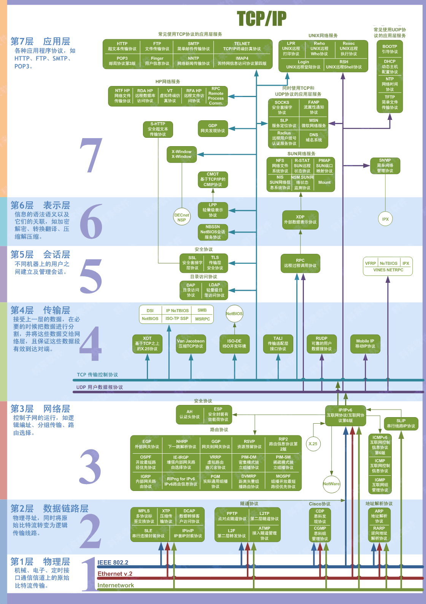
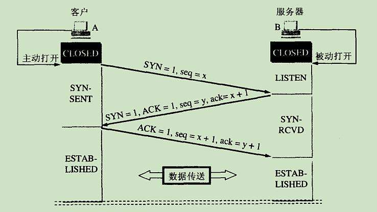
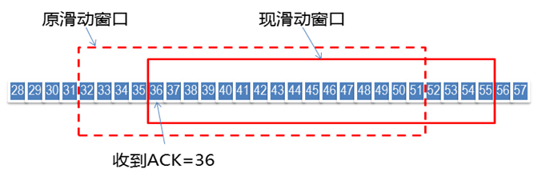
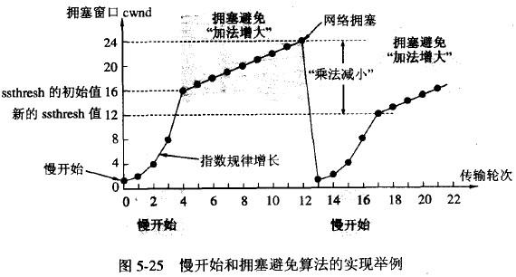

[TOC]


### 计算机网络分层模型

ISO模型：七层。




TCP／IP协议簇模型, 分为四层:

+ 应用层：HTTP,FTP,Telnet,SMTP
+ 传输层：TCP,UDP
+ 网络层：ARP,ICMP,IP
+ 数据链路层:MAC


|协议|端口|数据链路层使用的协议|
|:--|:--:|:--:|
|FTP	|21		|TCP
|Telnet	|23		|TCP
|Http	|80		|TCP
|POP	|110	|TCP
|SMTP	|25		|UDP
|DNS	|53		|UDP
|TFtp	|69		|UDP
|SSH	|22		|   |


### TCP 和UDP

+ TCP:可靠，面向连接
	+ 三次握手，重新确认等机制保证可靠，
	+ 过程略显复杂，有时延
	+ `头部数据多，最小长度20个字节`，传输数据百分比略低，但不丢包
	+ 只支持一对一
+ UDP：无连接，面向数据报
	+ 实时性强，安全性略差
	+ 头部数据简单，8个UDP首部+数据部分。传输数据百分比高，但可能丢包
	+ 支持一对一，一对多，多对一，多对多通信

可靠性>时效：TCP，文件传输；
时效>可靠性：UDP，视频直播，语音电话等；

### 三次握手
+ ACK,SYN 是布尔值，分别表示：确认，同步
+ ACK位为`True`时，ack才有效，建立连接后ACK全程为`True`
+ SYN 表示发起一次同步请求，只有双方都发起一次同步请求并且都收到其回复才算建立连接。换而言之，对于一方，只要是发起SYN并且受到对应的ACK，就认为建立连接
+ seq表示本包序列号，ack表示下一个期待接受的序列号





最初A,B都是CLOSED状态

一开始，B的TCP服务器进程先创建`传输控制模块TCB`，准备接受客户进程的连接请求。然后服务器进程就处于`LISTEN`状态，等待客户的连接请求。如有，即做出响应。

A也是先创建`传输控制模块TCB`，然后，在打算建立TCP连接时，向B发出连接请求报文段，这时首部中的同部位SYN=1，同时选择一个初始序列号seq=x。**TCP规定，SYN报文段（SYN=1的报文段）不能携带数据** ，但要消耗一个序号。这时，TCP客户端进程进入`SYN-SEND`状态。


B收到请求报文段后，如统一建立连接，则向A发送确认。在确认报文段中应把`SYN`和`ACK`都置1，确认号是`ack=x+1`，同时也为自己选择一个初始号seq=y;这里因为`SYN=1`，这个报文也不携带数据，消耗一个序列号。这时候TCP服务端进程进入`SYN-RCVD`。


TCP客户端进程收到B的确认后，还要向B给出确认。确认报文段`ACK=1`，`ack=y+1`，而自己的序列号`seq=x+1`。TCP标准规定，ACK报文段可以携带数据。但如果不携带数据则不消耗序列号，在这种情况下，下一个数据报文段的序号仍是`seq=x+1`。这时，TCP连接已经建立，A进入`ESTABLISHED`状态。


B收到确认后，也进入`ESTABLISHED`状态


#### 为什么不能两次握手？

三次握手本质是两次`SYN-ACK`问答。首先是发送方发送SYN，接收方收到后发送确认，顺便发送同步请求SYN，但是如果只用两次握手，那么接收方就无法收到“sender对receiver发送的同步请求SYN的确认”。也就是少了第二个SYN的ACK，那么就不知道发送方是否同意了接收方发起的同步请求。


1. 如果sender不同意receiver的SYN，那么receiver却以为同意了，receiver所有发送的报文都不会被sender接收。
2. 如果第二个报文，也就是receiver发送SYN+ACK 没有到达sender，那么sender不会认为链路建立成功，这种情况还属正常

3. 实例：假设两次握手成立。sender发送SYN01,由于网络原因，这个请求没有及时到达receiver,超时后sender发送了第二个SYN02，这次成功建立连接，本次连接结束后，sender的SYN01在网络中终于到达receiver，这时候reveiver就会向sender再发一次ACK，又再一次建立了连接，但这次连接双方都是无用的。


#### 为什么SYN报文不能携带数据

TCP标准规定，SYN报文不能携带数据，如果跳开限制，第一个SYN可以携带数据，先把数据缓存下来，握手成功再交给应用，这样会放大SYN FLOOD攻击。

如果攻击者伪造了成千上万的握手报文，携带了1K+ 字节的数据，而接收方会开辟大量的缓存来容纳这些巨大数据，内存会很容易耗尽，从而拒绝服务。

第三次报文（ACK）可以携带数据


#### 能够发出第三次握手报文的主机，肯定接收到第二次(服务器)握手报文，对吗？

因为伪造IP的主机是不会接收到第二次报文的。
所以，能够发出第三次握手报文的，应该是合法的用户。


#### SYN-Flood 攻击

+ 出现时间：1996，并经久不衰
+ 手段： 

	1. 攻击者伪造地址对 服务器发起SYN请求
	2. 服务器回应(SYN+ACK)包，而`真实的IP会认为，我没有发送请求，不作回应`。
	3. 服务器没有收到回应，这样的话，服务器不知道(SYN+ACK)是否发送成功，默认情况下会重试`5次`（tcp_syn_retries）。
	4. 服务器半开连接队列被占满，服务带宽被消耗，内存高负载，拒绝其他合法用户访问； 

+ 根本原因：TCP协议的设计缺陷导致的DDos攻击

攻击者如果处于公网，可以伪造IP的话，对于服务器就很难根据IP来判断攻击者，给防护带来很大的困难。很多操作系统，甚至防火墙、路由器都无法有效地防御这种攻击，而且由于它可以方便地伪造源地址，追查起来非常困难。它的数据包特征通常 是，源发送了大量的SYN包，并且缺少三次握手的最后一步握手ACK回复。

#### SYN-Flood 防护措施


##### 无效连接监视释放
不停监视系统中`半开连接`和`不活动连接`，当`达到一定阈值时拆除这些连接`，释放系统资源。这种绝对公平的方法往往也会将正常的连接的请求也会被释放掉，”伤敌一千，自损八百“

##### 延缓TCB分配方法

1. Syn Cache技术：延后TCB的创建
	
这种技术在收到SYN时不急着去分配TCB，而是先回应一个ACK报文，并在一个专用的HASH表中（Cache）中保存这种半开连接，直到收到正确的ACK报文再去分配TCB

2. Syn Cookie技术

Syn Cookie技术则完全不使用任何存储资源，它使用一种特殊的算法生成Sequence Number，这种算法考虑到了对方的IP、端口、己方IP、端口的固定信息，以及对方无法知道而己方比较固定的一些信息，如MSS、时间等，在收到对方 的ACK报文后，重新计算一遍，看其是否与对方回应报文中的（Sequence Number-1）相同，从而决定是否分配TCB资源

3． 使用SYN Proxy防火墙

原理：对试图穿越的SYN请求进行验证之后才放行


### 四次挥手


1. sender->receiver:FIN: sender已经停发数据，可以收数据
2. sender<-receiver:ACK: 收到，但receiver还需要发送数据
3. sender<-receiver:FIN+ACK: receiver: 不再发送数据
4. sender->receiver:ACK：断开连接


#### 四次挥手后为什么等待2MSL

四次挥手中为什么`TIME_WAIT`状态还需要等`2MSL`后才能返回到`CLOSED`状态 

+ 可靠的实现TCP全双工链接的终止：`最后一次发的ACK`可能丢失，`LAST-ACK`状态下的服务器收不到ACK会超时重发`FIN-ACK`。触发客户端重新发送`ACK`并且重启`TIME-WAIT`倒计时；
+ 允许老的重复的报文在网络中消逝：客户端在发送最后一个`ACK`之后，再经过经过`2MSL`，就可以`使本链接持续时间内所产生的所有报文段都从网络中消失`。从保证在关闭连接后不会有还在网络中滞留的报文段去骚扰服务器。


### 窗口滑动协议，快速重传，拥塞避免，慢启动


#### 窗口滑动协议

+ 滑动窗口分为接收窗口和发送窗口

滑动窗口协议是`传输层`进行`流控`的一种措施，接收方通过通告发送方自己的窗口大小，从而控制发送方的发送速度，达到防止发送方发送速度过快而导致自己被淹没的目的。


ACK[ack,window],ACK一般被理解为对接受数据的确认，ACK报文包含两个非常重要的信息：

1. 期望收到的下一字节序号ack，代表接收方已经收到0~ack-1的数据。如果ack=n，此时如果接收方收到的数据编号seq>n，接收方依旧发送ack=n;

2. 窗口大小 window，发送方接收到ACK[ack,window]，就能计算出可以发送多少字节给对方。假设发送方发送到x字节， 可以发送的字节数=window-(x-ack),

发送端窗口的第一个字节序号一定是`ACK`中期望收到的下一个字节序号



上图52 53 54 55 字节都是可以新发送的字节序

接受端窗口的第一个字节序之前一定是已经完全接收的，后面窗口里面的数据都是希望接受的，窗口后面的数据都是不希望接受的。


TCP的滑动窗口主要有两个作用，

1. 提供TCP的可靠性
2. 提供TCP的流控特性。

同时滑动窗口机制还体现了TCP面向字节流的设计思路。TCP 段中窗口的相关字段
TCP的Window是一个16bit位字段，它代表的是窗口的字节容量，也就是TCP的标准窗口最大为$2^{16}-1=65535$个字节。另外在TCP的选项字段中还包含了一个TCP窗口扩大因子，option-kind为3，option-length为3个字节，option-data取值范围0-14。窗口扩大因子用来扩大TCP窗口，可把原来16bit的窗口，扩大为31bit。


**当收到接收方新的ACK时，窗口滑动**


+ 接收方的窗口大小取决于应用、系统、硬件的限制（TCP传输速率不能大于应用的数据处理速率）

+ 接收方每次收到数据包，发送新的ACK后向右移动窗口。


##### 发送窗口与接收窗口关系

+ TCP是双工协议，所以通信的两方都有各自的发送窗口和接收窗口
+ 应用程序通过改变接收窗口，间接改变发送窗口。


参考：[TCP协议的滑动窗口具体是怎样控制流量的？](https://www.zhihu.com/question/32255109/answer/68558623)


#### 快速重传


图中确认$M_1$,也就是期待$M_1$,的下一个序列

发送方只要一连收到三个重复确认就应当立即重传对方尚未收到的报文段M3，而不必 继续等待M3设置的重传计时器到期。由于发送方尽早重传未被确认的报文段，因此采用快重传后可以使整个网络吞吐量提高约20%。


#### 慢启动，拥塞避免

+ 在TCP建立连接和网络超时的情况下才采用慢启动

cwnd: 拥塞窗口大小
ssthresh： 慢启动阀值

发送方控制拥塞窗口的原则是：只要网络没有出现拥塞，拥塞窗口就再增大一些，以便把更多的分组发送出去。但只要网络出现拥塞，拥塞窗口就减小一些，以减少注入到网络中的分组数。


```c
// 全部发送成功
if(send(cwnd)==true){	
	if(cwnd*2<=ssthresh){ 
		// 慢启动
		cwnd*=2;
	}else{
		// 拥塞避免			
		cwnd++;
	}
}else{		
	// 出现拥塞
	ssthresh=cwnd/2;// 阀值减半
	cwnd=1;	// 重新开始慢启动
}
```

+ cwnd<=ssthresh,慢启动，每次成倍增加cwnd
+ cwnd>ssthresh,拥塞避免，每次稳定加一
+ 出现拥塞，阀值ssthresh减半，cwnd窗口置为1，以便网络中滞留的包能有时间被处理



“拥塞避免”并非指完全能够避免了拥塞。利用以上的措施要完全避免网络拥塞还是不可能的。“拥塞避免”是说在拥塞避免阶段将拥塞窗口控制为按线性规律增长，使网络比较不容易出现拥塞。

[TCP的拥塞控制](https://www.cnblogs.com/losbyday/p/5847041.html)

#### 快恢复算法


+ 当sender连续收到三个重复确认，就把ssthresh减半，预防拥塞，但不是执行慢开始
+ 由于发送方现在认为网络很可能没有发生拥塞，因此与慢开始不同之处是现在不执行慢开始算法（即拥塞窗口cwnd现在不设置为1），cwnd=ssthresh,然后执行拥塞避免算法，线性增大拥塞窗口


### ARP协议


#### arp，arp攻击

arp 刷新的时机：
	
+ 自己没发送arp广播，却收到响应。
+ 自己发送，收到响应
+ 收到别人的arp广播

arp 攻击可以分为：

+ 伪装为目的主机
	+ 接受到请求目的主机的报文时，伪装成目的主机发送响应报文
	+ 这时候局域网有两台主机发送响应报文，后到达的报文覆盖前一个
	+ 这样会让被伪装的机子直接饥饿，一直收不到包

+ 伪装为网关
	+ 主动发送ARP请求
	+ 接受ARP请求的主机，不管目的IP是否是自己，都会将源IP和源MAC的映射记录到ARP缓存中


### icmp

+ 网络层协议
+ Internet Control Message Protocol：Internet控制报文协议
+ 只负责发现错误，纠正错误由发送方负责
+ ping
	+ `ICMP ECHO`和`ICMP ECHO REPLY`包来探测主机是否存在

+ tracert
	+ IP 生存时间 (TTL) 字段和 ICMP 错误消息
	+ 未到达目的地：[ICMP time exceeded]
	+ 已到目的地[ICMP port unreachable]

