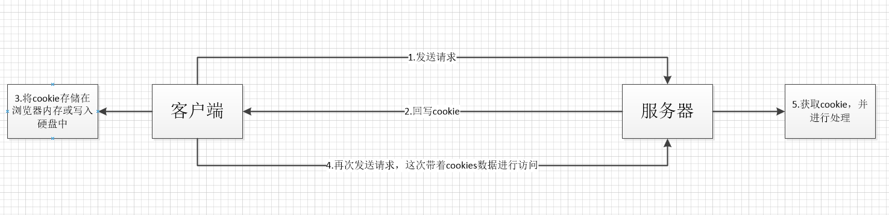

[TOC]

# 浏览器缓存


浏览器的缓存机制提供了可以将用户数据存储在客户端上的方式，可以利用cookie,session等跟服务端进行数据交互


## Cookie

+ HTTP Cookie是`服务器发送`到用户浏览器并保存在本地的一小块数据
+ 它会在浏览器下次向同一服务器再发起请求时被携带并发送到服务器上。
+ 通常，它用于告知服务端两个请求是否来自同一浏览器，如保持用户的登录状态。
+ **Cookie使基于无状态的HTTP协议记录稳定的状态信息成为了可能。**


Cookie主要用于以下三个方面：

+ 会话状态管理（如用户登录状态、购物车、游戏分数或其它需要记录的信息）
+ 个性化设置（如用户自定义设置、主题等）
+ 浏览器行为跟踪（如跟踪分析用户行为等）


### 创建Cookie

当服务器收到HTTP请求时，服务器可以在响应头里面添加一个`Set-Cookie`选项。浏览器收到响应后通常会保存下Cookie，之后对该服务器每一次请求中都通过Cookie请求头部将Cookie信息发送给服务器。另外，Cookie的过期时间、域、路径、有效期、适用站点都可以根据需要来指定。


服务器使用Set-Cookie响应头部向用户代理（一般是浏览器）发送Cookie信息。

简单的Set-Cookies示例：
```
HTTP/1.0 200 OK
Content-type: text/html
Set-Cookie: yummy_cookie=choco
Set-Cookie: tasty_cookie=strawberry
```

+ 会话期Cookie：`本次会话有效`，浏览器关闭自动删除。不需要指定过期时间（Expires）或者有效期（Max-Age）。
+ 持久性Cookie：指定一个特定的过期时间（Expires）或有效期（Max-Age）。

```
Set-Cookie: id=a3fWa; Expires=Wed, 21 Oct 2015 07:28:00 GMT;
```

### Cookie的作用域


`Domain` 和 `Path` 标识定义了Cookie的作用域：即Cookie应该发送给哪些URL。

Domain 标识指定了哪些主机可以接受Cookie。如果不指定，默认为当前文档的主机（不包含子域名）。如果指定了Domain，则一般包含子域名。
例如，如果设置 Domain=mozilla.org，则Cookie也包含在子域名中（如developer.mozilla.org）。

Path 标识指定了主机下的哪些路径可以接受Cookie（该URL路径必须存在于请求URL中）。以字符 %x2F ("/") 作为路径分隔符，子路径也会被匹配。

例如，设置 Path=/docs，则以下地址都会匹配：

/docs
/docs/Web/
/docs/Web/HTTP

参考:

+ MDN: [HTTP cookies
](https://developer.mozilla.org/zh-CN/docs/Web/HTTP/Cookies)


## cookie和session

cookie和session都是用来跟踪浏览器用户身份的会话方式。


+ 难以安全使用
+ 浪费资源：服务器可以为浏览器设置大量Cookies，这些Cookies在每次传输都携带，给带宽带来了巨大压力。
+ 隐私问题：每次携带信息更容易被拦截

难于安全使用：
+ Cookie 对 JavaScript 默认是可用的，这使得一次 XSS 可以获取持久凭证。
+ 默认情况下，Cookie 会被发送到非安全的源，这会导致凭据被盗。

+ Cookie 经常在请求发送者毫不知情的情况下被发送。SameSite 属性可以减少 CSRF 风险，但是目前只有大概 0.06% 的人使用 Set-Cookie 进行了设置。


参考[Cookie 机制问题多，Chrome 工程师提出改造方案](https://www.oschina.net/news/99542/tightening-http-state-management?from=20180902)


### 保持状态

+ cookie保存在`浏览器端`，内存或硬盘
+ session保存在`服务器端`，占用服务器内存

### 使用方式


cookie机制：
+ 如果不在浏览器中设置过期时间，cookie被`保存在内存中`，生命周期随浏览器的关闭而结束，这种cookie简称`会话cookie`。
+ 如果在浏览器中设置了cookie的`过期时间`，cookie被`保存在硬盘中`，关闭浏览器后，cookie数据仍然存在，直到过期时间结束才消失。
+ Cookie是服务器发给客户端的特殊信息，cookie是以文本的方式保存在客户端，`每次请求都携带`

session机制：

当服务器收到请求需要创建session对象时，首先会检查客户端请求中是否包含`sessionID`。如果有`sessionID`，服务器将根据该id返回对应`session对象`。如果客户端请求中没有`sessionID`，服务器会创建新的`session`对象，并把`sessionId`在本次响应中返回给客户端。通常使用`cookie`方式存储`sessionID`到客户端，在交互中浏览器按照规则将sessionid发送给服务器。

如果用户禁用cookie，则要使用URL重写，可以通过response.encodeURL(url) 进行实现；API对encodeURL的结束为，当浏览器支持Cookie时，url不做任何处理；当浏览器不支持Cookie的时候，将会重写URL将SessionID拼接到访问地址后。


### 存储内容

+ cookie： 只能保存字符串类型，以文本的方式；
+ session：通过类似Hashtable的数据结构来保存，能`支持任何类型的对象`(session中可含有多个对象),

### 存储的大小
+ cookie：单个cookie保存的数据不能超过`4kb`；
+ session：大小没有限制,但会对服务器造成压力;

### 安全性

+ 针对cookie所存在的攻击：Cookie欺骗，Cookie截获；
+ session的安全性大于cookie:

    1. sessionID存储在cookie中，若要攻破session`首先要攻破cookie`；
    2. sessionID是`要有人登录`，或者启动session_start才会有，所以攻破   cookie也不一定能得到sessionID；
    3. 第二次启动session_start后，前一次的sessionID就失效了，`session过期   `后，sessionID也随之失效。
    4. sessionID是`加密的`

综上所述，攻击者必须在短时间内攻破加密的sessionID，这很难。

### 应用场景：

cookie：
1. 判断用户是否登陆过网站，以便下次登录时能够实现自动登录（或者记住密码）。如果我们删除cookie，则每次登录必须从新填写登录的相关信息。
2. 保存上次登录的时间等信息。
3. 保存上次查看的页面
4. 浏览计数





session：Session用于保存每个用户的专用信息，变量的值保存在服务器端，通过SessionID来区分不同的客户。

1. 网上商城中的购物车
2. 保存用户登录信息
3. 将某些数据放入session中，供同一用户的不同页面使用
4. 防止用户非法登录


### 缺点：

cookie：
1. 大小受限：`4KB`
2. 用户可以操作（禁用）cookie，使功能受限
3. 安全性较低
4. 有些状态不可能保存在客户端。
5. 每次访问都要传送cookie给服务器，浪费带宽。
6. cookie数据有路径（path）的概念，可以限制cookie只属于某个路径下。

session：

1. Session保存的东西越多，就越占用服务器内存，对于用户在线人数较多的网站，服务器的内存压力会比较大。
2. 依赖于cookie（sessionID保存在cookie），如果禁用cookie，则要使用URL重写，不安全
3. 创建Session变量有很大的随意性，可随时调用，不需要开发者做精确地处理，所以，过度使用session变量将会导致代码不可读而且不好维护。


# Web Storage : HTML5的本地存储

使用它可以在客户端`本地`建立一个`数据库`，原本必须保存在服务器端数据库中的内容现在可以直接保存在客户端本地了，减轻服务器端的负担，同时也加快了访问数据的速度。

+ Web Storage存储机制是对HTML4中cookie存储机制的一个改善
+ 当数据需要被严格控制在客户端时，不需要持续的将数据发回服务器

## 为什么有Web Storage

+ 克服`cookies 大小只有4KB`，`Web Storage 默认5MB`，上限12MB
+ Cookies随着HTTP事务发送， 需要一种`控制数据不随事务发送`的机制
+ Cookies操作复杂， 需要一组简便的操作api
+ session `存储在服务器端的内存中`，对访问量很大的服务器压力较大

## sessionStorage and localStorage

Web Storage又分为两种：

1. sessionStorage：保存会话信息。将数据保存在session对象中， 保存在本地内存中。
2. localStorage：将数据持久化到客户端本地的硬件设备;


> 所谓session，是指用户在浏览某个网站时，从进入网站到浏览器关闭所经过的这段时间，也就是用户浏览这个网站所花费的时间。session对象可以用来保存在这段时间内所要求保存的任何数据。

这两者的区别在于，sessionStorage为`临时保存`，而localStorage为`永久保存`。
到目前为止，Firefox3.6以上、Chrome6以上、Safari 5以上、Pera10.50以上、IE8以上版本的浏览器支持sessionStorage与localStorage的使用。


### 生命周期

localStorage:localStorage的生命周期是永久的，除非主动删除数据，否则数据永远不会消失。
sessionStorage：生命周期是在仅在`当前会话下有效`。

> sessionStorage引入了一个“浏览器窗口”的概念，sessionStorage是在同源的窗口中始终存在的数据。只要这个浏览器窗口没有关闭，即使刷新页面或者进入同源另一个页面，数据依然存在。但是sessionStorage在关闭了浏览器窗口后就会被销毁。同时独立的打开同一个窗口同一个页面，sessionStorage也是不一样的。


### 存储位置

localStorage和sessionStorage`都保存在客户端`，`不与服务器进行交互通信`。这个和Cookies一致。

### 存储内容类型

localStorage和sessionStorage`只能存储字符串类型`，对于复杂的对象可以使用ECMAScript提供的JSON对象的stringify和parse来处理

### 获取方式：
```js
window.localStorage;
window.sessionStorage;
```
### 应用场景：

+ localStoragese：常用于长期登录（+判断用户是否已登录），适合长期保存在本地的数据。
+ sessionStorage：敏感账号一次性登录；

## WebStorage的优点：

1. `存储空间更大`：cookie为4KB，而WebStorage是5MB；
2. `节省网络流量`：WebStorage不会传送到服务器，存储在本地的数据可以直接获取，也不会像cookie一样美词请求都会传送到服务器，所以减少了客户端和服务器端的交互，节省了网络流量；
3. 对于那种只需要在用户浏览一组页面期间保存而关闭浏览器后就可以丢弃的数据，sessionStorage会非常方便；
4. `快速显示`：有的数据存储在WebStorage上，再加上浏览器本身的缓存。从本地获取数据会比从服务器端获取快得多；
5. `安全性较高`：WebStorage`不会随着HTTP header发送到服务器端`，所以安全性相对于cookie来说比较高一些，不会担心截获，但是仍然存在伪造问题；
6. WebStorage提供了一些方法，`数据操作比cookie方便`；
```js
　　setItem (key, value) // 保存数据，以键值对的方式储存信息。
    getItem (key)// 获取数据，将键值传入，即可获取到对应的value值。
    removeItem (key) // 删除单个数据，根据键值移除对应的信息。
    clear () //  删除所有的数据
    key (index)// 获取某个索引的key
```

参考：
[cookies、sessionStorage和localStorage解释及区别](https://www.cnblogs.com/pengc/p/8714475.html)