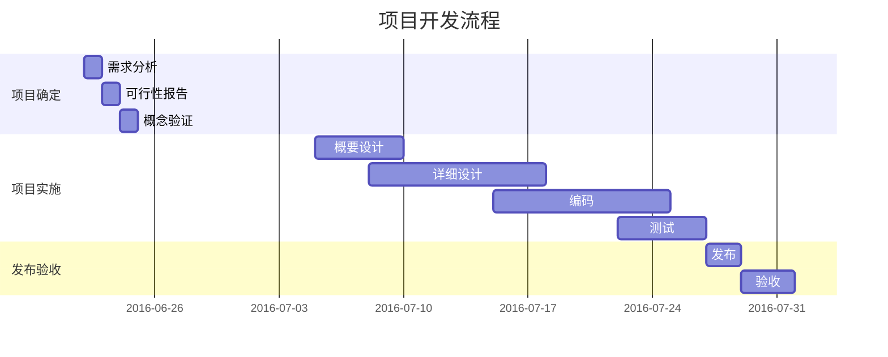
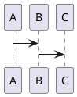
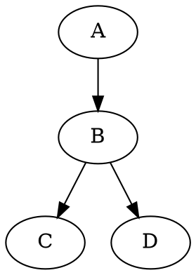

## 5. 流程图

### 5.1 简单流程图

```flow
st=>start: Start:>https://www.zybuluo.com
io=>inputoutput: verification
op=>operation: Your Operation
cond=>condition: Yes or No?
sub=>subroutine: Your Subroutine
e=>end

st->io->op->cond
cond(yes)->e
cond(no)->sub->io
```

更多语法参考：
[流程图语法参考](http://adrai.github.io/flowchart.js/)

###  5.2 序列图

```sequence(theme="hand")
Title: Here is a title
A->B: Normal line
B-->C: Dashed line
C->>D: Open arrow
D-->>A: Dashed open arrow
```

#### 更多语法参考：[序列图语法参考](http://bramp.github.io/js-sequence-diagrams/)

### 5.3 mermaid 甘特图


甘特图内在思想简单。基本是一条线条图，横轴表示时间，纵轴表示活动（项目），线条表示在整个期间上计划和实际的活动完成情况。它直观地表明任务计划在什么时候进行，及实际进展与计划要求的对比。


#### 更多语法参考：[mermaid参考](https://mermaidjs.github.io/)


### 5.4 puml 序列图

```puml

A -> B
```



### 5.5 dot





viz 或者 dot 代码块中的内容将会被 Viz.js 渲染。
你可以通过 {engine="..."} 来选择不同的渲染引擎。 引擎 circo，dot，neato，osage，或者 twopi 是被支持的。默认下，使用 dot 引擎。


#### Ditaa
Markdown Preview Enhanced 支持 ditaa。

(Java 是需要先被安装好的)

ditaa 整合于 code chunk, for example:


```ditaa {cmd=true args=["-E"]}
  +--------+   +-------+    +-------+
  |        | --+ ditaa +--> |       |
  |  Text  |   +-------+    |diagram|
  |Document|   |!magic!|    |       |
  |     {d}|   |       |    |       |
  +---+----+   +-------+    +-------+
      :                         ^
      |       Lots of work      |
      +-------------------------+
```

```ditaa {cmd=true args=["-S"]}

+---------+
| cBLU    |
|         |
|    +----+
|    |cPNK|
|    |    |
+----+----+
```

```ditaa {cmd=true args=["-S"]}

/--+
|  |
+--/
```


```ditaa {cmd=true args=["-S"]}
+-----+
|{d}  |
|     |
|     |
+-----+

+-----+
|{s}  |
|     |
|     |
+-----+


----+  /----\  +----+
    :  |    |  :    |
    |  |    |  |{s} |
    v  \-=--+  +----+
```


#### Sequence Diagrams

这一特性基于 js-sequence-diagrams。

sequence 代码快中的内容将会被 js-sequence-diagrams 渲染。
支持两个主题 simple（默认主题）和 hand。
```sequence{theme="hand"}

Andrew->China:Say Hello
Note right of China: China thinks\nabout it
Chind-->Andrew:How are you?
Andrew ->>China:I am good thanks!
```


```vega-lite
{
  "data": {
    "values": [
      {"a": "C", "b": 2}, {"a": "C", "b": 7}, {"a": "C", "b": 4},
      {"a": "D", "b": 1}, {"a": "D", "b": 2}, {"a": "D", "b": 6},
      {"a": "E", "b": 8}, {"a": "E", "b": 4}, {"a": "E", "b": 7}
    ]
  },
  "mark": "bar",
  "encoding": {
    "x": {"field": "a", "type": "nominal"},
    "y": {"aggregate": "average", "field": "b", "type": "quantitative"}
  }
}
```
