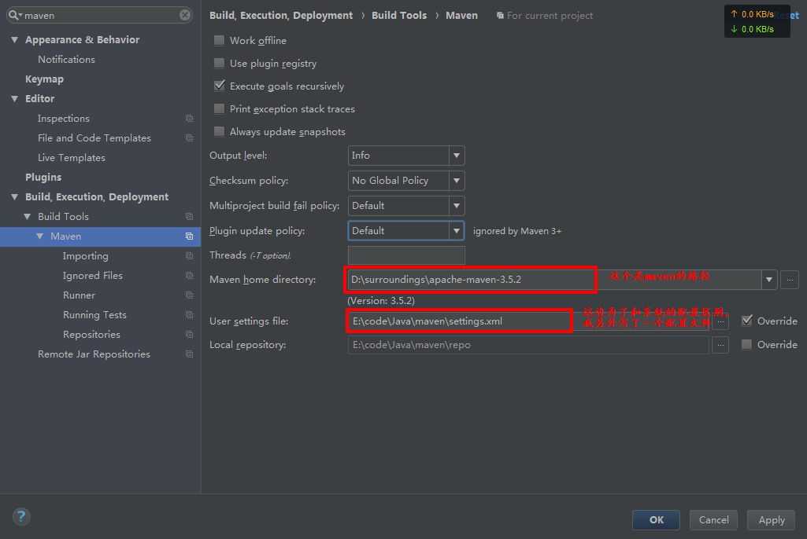
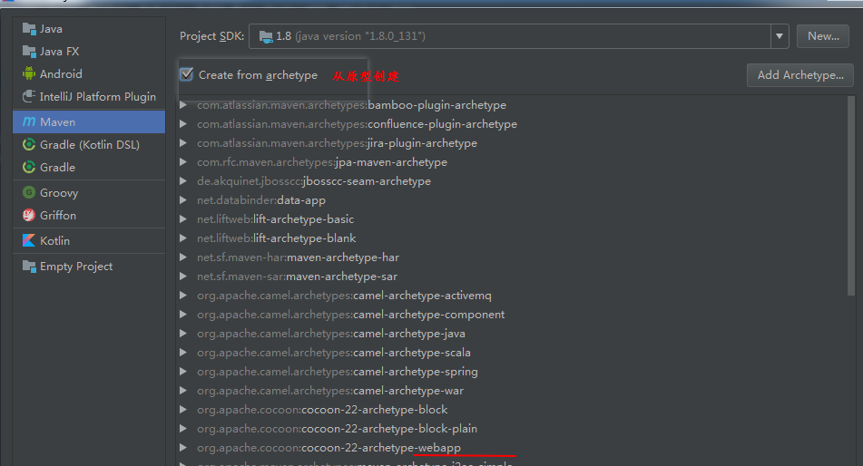
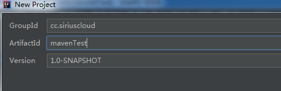

maven解压在surrounding文件夹中

+ 添加环境变量MAVEN_HOME,不要加“;”


+ 设置到PATH: %MAVEN_HOME%\bin


```shell
>mvn -v
Apache Maven 3.5.2 (138edd61fd100ec658bfa2d307c43b76940a5d7d; 2017-10-18T15:58:1
3+08:00)
Maven home: D:\surroundings\apache-maven-3.5.2\bin\..
Java version: 1.8.0_131, vendor: Oracle Corporation
Java home: D:\surroundings\jdk1.8.0_131\jre
Default locale: zh_CN, platform encoding: GBK
OS name: "windows 7", version: "6.1", arch: "amd64", family: "windows"

```


+ 配置本地仓库地址

```xml
   <localRepository>E:/code/Java/maven/repo</localRepository>
```


命令行
```bash
>mvn help:system
[INFO] Scanning for projects...
Downloading from central: https://repo.maven.apache.org/maven2/org/apache/maven/
plugins/maven-deploy-plugin/2.7/maven-deploy-plugin-2.7.pom
[WARNING] Failed to retrieve plugin descriptor for org.apache.maven.plugins:mave

...

```


+ 配置IDEA的maven



+ 创建webapp



groupId 一般就是公司域名倒着写
ArtifactId 就是项目名




